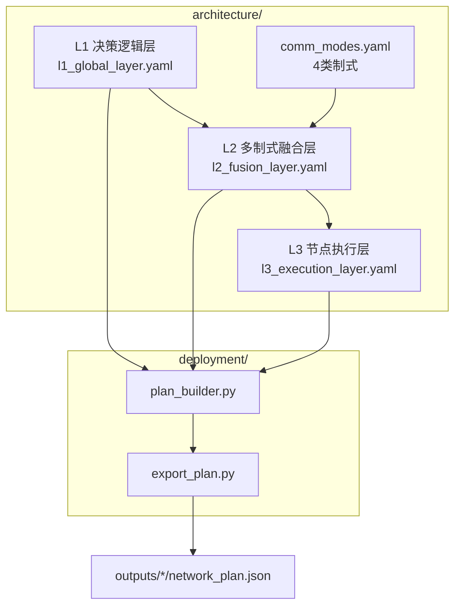

# 3. 应急广播网组网架构设计方案验证

## 3.0 验证总述

### 表3.1 指标完成情况


| 指标任务                                            | 指标分解                  | 完成情况           |
| ----------------------------------------------- | --------------------- | -------------- |
| 完成应急广播网组网架构设计方案，支持 2 种极端灾害场景，具备支持残余网络/无残余网络组网能力 | 1. 完成应急广播网组网架构设计方案    | **已实现**        |
|                                                 | 2. 支持 2 种极端灾害场景       | **已支持**（暴雨、台风） |
|                                                 | 3. 具备支持残余网络/无残余网络组网能力 | **已具备**        |


### 代码与交付物根目录

```
Networking plan/
├── architecture/          # 指标一：三层架构定义
├── scenarios/             # 指标二：两种灾害场景参数
├── network_modes/         # 指标三：双模式组网规则
├── deployment/            # 方案生成引擎
├── validation/            # 验证脚本
├── outputs/               # 4 套场景×模式交付目录（JSON + 01–04 表）
└── proofs/                # 自动归档的 print 输出
```

### 一键复现

```bash
cd metric2_network_architecture
python -m deployment.export_plan --all
python validation/run_all_validation.py
```

**总体验证结果**（`proofs/verification_summary.txt`）：

```
architecture: PASS
rainstorm: PASS
typhoon: PASS
dual_mode: PASS
总体: ALL PASS (4/4)
```

---

## 3.1 指标一：完成应急广播网组网架构设计方案

### 3.1.1 指标要求

完成系统性的应急广播网组网架构设计，明确组网逻辑、资源调度与业务承载机制，具备完整的技术实现路径。

### 3.1.2 设计依据


| 设计文档章节       | 内容                      | 本项落地位置                          |
| ------------ | ----------------------- | ------------------------------- |
| 8.1 组网部署总体框架 | L1/L2/L3 三层职责划分         | `architecture/overview.md`      |
| 8.2 算法输出解析   | L1 配额矩阵、L2 链路、L3 72 维动作 | `deployment/plan_builder.py`    |
| 8.3.1 组网方案生成  | 5 步递进（表 8.2）           | `deployment/phased_deploy.yaml` |


### 3.1.3 架构设计说明

三层架构及数据流如下：




**（1）L1 决策逻辑层 — 全局资源与优先级**

配置文件：`architecture/l1_global_layer.yaml`

```yaml
layer: L1
layer_name: 决策逻辑层
output:
  type: quota_matrix
  shape: [5, 5]   # 5区域 × 5设备类型
device_inventory:
  emergency_bs: 10
  portable_gateway: 8
  ...
hard_constraints:
  - column_sum_le_inventory
  - high_priority_region_min_quota_ratio: 0.25
```

对应指标一 HMARL 中 L1 全局统筹智能体的输入输出定义（`HMARL/models/l1_global/`），本指标侧以**可配置 yaml** 固化全局配额与硬约束规则。

**（2）L2 多制式融合层 — 链路选择与带宽协调**

配置文件：`architecture/l2_fusion_layer.yaml`

- 主接入：5G_700MHz；备份：WiFi6
- 有残余回传：5G_residual_link；无残余回传：Satellite_Ka
- 广播路径：multi_hop_tree（指挥中枢 → 多跳叶子节点）

**（3）L3 节点执行层 — 设备部署与广播激活**

配置文件：`architecture/l3_execution_layer.yaml`

- 观测维度：51；动作维度：72
- 动作结构：部署矩阵 (5×12) + 工作参数 (5×2) + 全局参数 (2)
- 业务任务：public_broadcast / rescue_comm / mass_alert / field_backhaul

**（4）四类通信制式能力表**

配置文件：`architecture/comm_modes.yaml`


| 制式 ID        | 用途            |
| ------------ | ------------- |
| 5G_700MHz    | 低频广域接入、残余复用   |
| Satellite_Ka | 卫星应急回传、无残余主链路 |
| WiFi6        | 本地 Mesh 热点接入  |
| Shortwave_HF | 短波保底通信        |


**（5）组网方案生成流程（5 步 · 8.3.1 表 8.2）**

配置文件：`deployment/phased_deploy.yaml`


| 阶段 | 核心步骤 | 输出结果 | 核心规则 | 代码对应 |
| ---- | -------- | -------- | -------- | -------- |
| 阶段 1 | 全局设备清单生成 | L2 级设备配额、全局统计 | 按退服率缩放、优先级分配 | `_build_nodes()` |
| 阶段 2 | 区域资源调度 | L3 子区域配额、任务 / 制式 | L2→L3 拆解、业务匹配 | `split_tasks()` |
| 阶段 3 | 设备点位生成 | 网格 + 坐标点位数据 | 12 网格分配、双模式差异化 | `assign_grid_placements()` |
| 阶段 4 | 三级拓扑构建 | 区域内 / 间 / 骨干拓扑 | Hub 选举、星型 / 网状混合 | `build_topology()` |
| 阶段 5 | 交付物导出 | JSON 蓝图 + 01–04 标准化表格 | 标准化格式、字段固化 | `export_plan.py` |

整体流程遵循从宏观到微观、从资源到落地、从静态配置到完整组网的递进逻辑，5 大步骤环环相扣、层层拆解，所有步骤均可追溯、可复现、可人工复核。


### 3.1.4 方案生成代码

组网方案由 `deployment/plan_builder.py` 读取三层架构配置后组装，核心逻辑：

```python
def build_network_plan(scenario_id: str, network_mode: str) -> Dict[str, Any]:
    scenario = load_scenario(scenario_id)
    arch = load_architecture()          # L1/L2/L3 + comm_modes
    mode_data = load_network_mode(network_mode)
    phased = load_phased_deploy()       # 5 步生成流程（8.3.1）
    rl_info = parse_rl_output(scenario_id)  # 可选读取 HMARL checkpoint
    nodes, residual_count, emergency_count = _build_nodes(...)
    assign_grid_placements(plan, ...)   # 网格点位
    build_topology(plan, ...)            # 区域内/区域间/L1 拓扑
    return plan  # 写入 network_plan.json + 01–04 表
```

导出入口：`deployment/export_plan.py`

```bash
python -m deployment.export_plan --scenario extreme_rainstorm --mode with_residual
```

运行 print 示例：

```
[export_plan] scenario=extreme_rainstorm mode=with_residual
  comm_modes: 5G_700MHz, Satellite_Ka, WiFi6, Shortwave_HF
  phases: 5 steps
  rl_source: hmari_checkpoint_enhanced
```

### 3.1.5 验证方法与输出证据

**验证命令：**

```bash
python validation/validate_architecture.py
```

**验证输出**（归档：`proofs/architecture_check.txt`）：

```
[三层架构配置加载]
  L1 (决策逻辑层): OK    文件: architecture/l1_global_layer.yaml
  L2 (多制式融合层): OK    文件: architecture/l2_fusion_layer.yaml
  L3 (节点执行层): OK    文件: architecture/l3_execution_layer.yaml

[通信制式] 共 4 类 (要求 >= 4)
  - 5G_700MHz / Satellite_Ka / WiFi6 / Shortwave_HF

[组网方案生成流程] 共 5 步 (要求 = 5)

[PASS] 组网架构设计方案完整可执行
  制式数量: 4/4  生成步骤: 5/5  配置文件: OK
```

**交付物 JSON 头部字段**（以 `outputs/rainstorm_with_residual/network_plan.json` 为例）：

```json
{
  "architecture": {
    "L1": "决策逻辑层",
    "L2": "多制式融合层",
    "L3": "节点执行层"
  },
  "comm_modes_used": ["5G_700MHz", "Satellite_Ka", "WiFi6", "Shortwave_HF"],
  "phases": [ /* 5 步，step 1~5 · 8.3.1 */ ],
  "topology": {
    "intra_region": [ /* 子区域内链路 */ ],
    "inter_region": [ /* 区域间链路 */ ],
    "backbone": [ /* L1 骨干 */ ]
  }
}
```

**配套部署表**（`deployment/export_deployment_docs.py` 自动生成）：

- `01_全局设备分配清单.txt`
- `02_区域资源调度表.txt`
- `03_子区域设备部署明细表.txt`（含 grid + 坐标 + topology_role）
- `04_设备点位与拓扑连接表.txt`（点位 + 区域内/区域间拓扑）

### 3.1.6 验证结论

已实现 L1/L2/L3 三层组网架构设计方案，包含四类通信制式融合与 **5 步组网方案生成流程（8.3.1）**；`validate_architecture.py` 输出 **PASS**，`export_plan.py` 可导出结构化 `network_plan.json` 交付物。**指标一达成。**

---

## 3.2 指标二：支持 2 种极端灾害场景

### 3.2.1 指标要求

支持暴雨、台风 2 种典型极端灾害场景的组网能力适配，可针对不同灾害损毁特征提供针对性的广播通信组网方案。

### 3.2.2 设计依据


| 场景   | 设计文档         | 核心损毁特征               |
| ---- | ------------ | -------------------- |
| 极端暴雨 | 3.1.2 / 表3-1 | 点式残余、链路断裂、退服 30%–80% |
| 超强台风 | 3.1.3 / 表3-2 | 片状残余、局部全阻、倒杆 10%–30% |


场景化适配策略见设计文档 **8.4**。

### 3.2.3 场景参数配置

**（1）极端暴雨 — `scenarios/extreme_rainstorm.yaml`**

```yaml
scenario_id: extreme_rainstorm
scenario_name: 极端暴雨
residual_pattern: point_scattered      # 点式残余
base_station_outage_min: 0.30
base_station_outage_max: 0.80
link_breakage_rate: 0.35
road_pass_rate: 0.50
core_feature: 以基站断电和光缆冲毁为主，残余网络呈点式分布
```

**（2）超强台风 — `scenarios/super_typhoon.yaml`**

```yaml
scenario_id: super_typhoon
scenario_name: 超强台风风暴潮
residual_pattern: patch_blocked        # 片状/局部全阻
base_station_outage_min: 0.20
base_station_outage_max: 0.60
pole_damage_rate_min: 0.10
pole_damage_rate_max: 0.30
local_blackout_zones: 4
road_pass_rate: 0.70
core_feature: 以基站倒杆和天线损坏为主，残余网络呈片状分布、局部全阻
```

### 3.2.4 场景参数对照表


| 参数     | 设计文档要求            | 暴雨 yaml                 | 台风 yaml                               |
| ------ | ----------------- | ----------------------- | ------------------------------------- |
| 残余形态   | 点式 / 片状           | point_scattered         | patch_blocked                         |
| 基站退服率  | 30%–80% / 20%–60% | 0.30–0.80               | 0.20–0.60                             |
| 道路通行率  | 50% / 70%         | 0.50                    | 0.70                                  |
| 场景特有指标 | 光缆损毁 / 倒杆         | link_breakage_rate=0.35 | pole_damage 0.1–0.3, blackout_zones=4 |


### 3.2.5 场景差异化在代码中的体现

`deployment/topology_builder.py` 在点位确定后生成分层拓扑，并按灾害类型追加场景补丁链路：

```python
intra_links = _build_intra_region_links(...)
inter_links = _build_inter_region_links(...)
backbone_links = _build_backbone_links(...)
overlays = _scenario_overlays(scenario)  # rainstorm: patch_fiber / typhoon: local_blackout_bridge
```

节点规模随场景退服率动态缩放：

```python
def _scenario_scale(scenario):
    outage = (base_station_outage_min + base_station_outage_max) / 2
    return 0.8 + outage
```

### 3.2.6 与指标一（HMARL）的交叉验证

两场景均在 HMARL 中完成强化学习训练，场景定义一致：


| 场景  | HMARL 配置                                         | 训练日志                                           | 训练曲线                                     |
| --- | ------------------------------------------------ | ---------------------------------------------- | ---------------------------------------- |
| 暴雨  | `HMARL/configs/scenarios/extreme_rainstorm.yaml` | `checkpoints/extreme_rainstorm/train_log.json` | `checkpoints/extreme_rainstorm/figures/` |
| 台风  | `HMARL/configs/scenarios/super_typhoon.yaml`     | `checkpoints/super_typhoon/train_log.json`     | `checkpoints/super_typhoon/figures/`     |


方案生成时读取 checkpoint 元数据（`deployment/parse_rl_output.py`），输出中可见：

```json
"rl_enhancement": {
  "checkpoint_available": true,
  "source": "hmari_checkpoint_enhanced",
  "train_log_entries": 6607
}
```

### 3.2.7 验证方法与输出证据

**验证命令：**

```bash
python validation/validate_rainstorm.py
python validation/validate_typhoon.py
```

**暴雨场景输出**（`proofs/scenario_rainstorm.txt`）：

```
[场景标识] extreme_rainstorm (极端暴雨)
[残余形态] point_scattered
[基站退服率] 0.3-0.8
[链路断裂率] 0.35
[HMARL 训练日志] 存在
[生成组网方案]
  outputs/rainstorm_with_residual/network_plan.json
  outputs/rainstorm_no_residual/network_plan.json
[PASS] 极端暴雨场景 + 双模式组网方案验证通过
```

**台风场景输出**（`proofs/scenario_typhoon.txt`）：

```
[场景标识] super_typhoon (超强台风风暴潮)
[残余形态] patch_blocked
[倒杆率] 0.1-0.3
[局部全阻区] 4
[PASS] 超强台风场景 + 双模式组网方案验证通过
```

**JSON 中场景参数字段对比**：


| 字段                   | rainstorm_with_residual | typhoon_with_residual |
| -------------------- | ----------------------- | --------------------- |
| disaster_type        | rainstorm               | typhoon               |
| residual_pattern     | point_scattered         | patch_blocked         |
| base_station_outage  | [0.3, 0.8]              | [0.2, 0.6]            |
| link_breakage_rate   | 0.35                    | —                     |
| local_blackout_zones | —                       | 4                     |


### 3.2.8 验证结论

已配置并实现暴雨、台风 2 种极端灾害场景的差异化组网参数；两场景验证脚本均输出 **PASS**，各生成 2 份组网方案，共 4 份 `network_plan.json`；且与 HMARL 训练场景及 checkpoint 一致。**指标二达成。**

---

## 3.3 指标三：具备支持残余网络/无残余网络组网能力

### 3.3.1 指标要求

具备残余网络复用、无残余网络独立建网两种模式的组网能力，可根据灾害现场网络损毁情况灵活切换组网策略。

### 3.3.2 设计依据

设计文档 **8.4 双模式组网差异化部署策略**：


| 模式    | 策略要点                                  |
| ----- | ------------------------------------- |
| 有残余网络 | 复用可用基站/链路 → 负载迁移 → 补丁路由 → 盲区补应急设备     |
| 无残余网络 | 卫星回传枢纽 → UAV/Mesh 广覆盖 → 便携广播网关 → 短波保底 |


### 3.3.3 双模式配置与架构

**有残余网络** — `network_modes/with_residual/`

`mode_config.yaml` 关键字段：

```yaml
network_mode: with_residual
enable_residual_reuse: true
primary_backhaul: 5G_residual_link
deploy_priority:
  - activate_residual_bs
  - patch_emergency_devices
  - cross_region_relay
  - broadcast_activation
```

`topology_template.json`：拓扑模式 `residual_plus_patch`，节点类型含 `residual_bs`。

**无残余网络** — `network_modes/no_residual/`

`mode_config.yaml` 关键字段：

```yaml
network_mode: no_residual
enable_residual_reuse: false
primary_backhaul: Satellite_Ka
deploy_priority:
  - satellite_backhaul
  - uav_mesh_coverage
  - portable_gateway_broadcast
  - shortwave_fallback
```

`topology_template.json`：拓扑模式 `mobile_star_mesh`，节点类型含 `satellite_terminal`、`comm_uav`。

### 3.3.4 双模式在代码中的分支逻辑

`deployment/plan_builder.py` — `_build_nodes()`：

```python
if network_mode == "with_residual":
    # 生成 source="residual_bs" 的残余基站节点
    for i in range(residual_base):
        nodes.append({"type": "residual_bs", "source": "residual_bs", ...})

if network_mode == "no_residual":
    residual_base = 0                    # 强制不复用残余
    emergency_base = max(emergency_base, n_regions * 4)
    # 优先生成 satellite_terminal / comm_uav 等纯应急节点
```

### 3.3.5 4 组合方案与关键字段对比

生成命令：

```bash
python -m deployment.export_plan --all
```


| 输出目录                               | 场景  | 模式  |
| ---------------------------------- | --- | --- |
| `outputs/rainstorm_with_residual/` | 暴雨  | 有残余 |
| `outputs/rainstorm_no_residual/`   | 暴雨  | 无残余 |
| `outputs/typhoon_with_residual/`   | 台风  | 有残余 |
| `outputs/typhoon_no_residual/`     | 台风  | 无残余 |


**实测关键字段对比**（`proofs/dual_mode_matrix.txt`）：


| 场景  | 模式            | residual_nodes_reused | emergency_nodes_deployed | primary_backhaul | deploy_priority[0]   | 状态   |
| --- | ------------- | --------------------- | ------------------------ | ---------------- | -------------------- | ---- |
| 暴雨  | with_residual | **32**                | 16                       | 5G_residual_link | activate_residual_bs | PASS |
| 暴雨  | no_residual   | **0**                 | 59                       | Satellite_Ka     | satellite_backhaul | PASS |
| 台风  | with_residual | **57**                | 28                       | 5G_residual_link | activate_residual_bs | PASS |
| 台风  | no_residual   | **0**                 | 105                      | Satellite_Ka     | satellite_backhaul | PASS |


**节点 source 字段差异**（JSON 中 `nodes[]`）：

- `with_residual`：含 `"source": "residual_bs"` 与 `"source": "emergency_*"`
- `no_residual`：全部为 `"source": "emergency_*"`，无残余节点

### 3.3.6 验证方法与输出证据

**验证命令：**

```bash
python validation/run_all_validation.py
```

**双模式验证 print 输出**（`proofs/dual_mode_matrix.txt`）：

```
场景                  模式              残余复用  应急部署  主回传              状态
extreme_rainstorm     with_residual           32        16  5G_residual_link  PASS
extreme_rainstorm     no_residual              0        59  Satellite_Ka      PASS
super_typhoon         with_residual           57        28  5G_residual_link  PASS
super_typhoon         no_residual              0       105  Satellite_Ka      PASS

[PASS] 双模式组网 4/4 组合验证
```

**验收规则**（`validation/run_all_validation.py` 内逻辑）：

- `with_residual`：`residual_nodes_reused > 0`
- `no_residual`：`residual_nodes_reused == 0` 且 `emergency_nodes_deployed > 0`

### 3.3.7 验证结论

已实现有残余网络复用与无残余网络独立建网两种模式；4 组方案 JSON 在残余复用数、主回传链路、部署优先级、节点来源等字段上呈系统性差异；验证脚本 4/4 **PASS**。**指标三达成。**

---

## 附录

### 附录 A：支撑材料清单


| 材料类型         | 路径                                                                |
| ------------ | ----------------------------------------------------------------- |
| 架构配置         | `architecture/*.yaml`、`architecture/overview.md`                  |
| 场景配置         | `scenarios/extreme_rainstorm.yaml`、`scenarios/super_typhoon.yaml` |
| 双模式配置        | `network_modes/with_residual/`、`network_modes/no_residual/`       |
| 方案生成代码       | `deployment/plan_builder.py`、`deployment/export_plan.py`          |
| 验证脚本         | `validation/validate_*.py`、`validation/run_all_validation.py`     |
| 组网方案交付物      | `outputs/*/`：`network_plan.json` + `01–04` 部署表（4 套）              |
| print 证明归档   | `proofs/*.txt`                                                    |
| HMARL 训练交叉证据 | `HMARL/checkpoints/{scenario}/train_log.json`、`figures/`          |
| 2×2 对照表      | `docs/scenario_mode_matrix.md`                                    |
| 验收勾选表        | `validation/checklist.md`                                         |


### 附录 B：运行命令汇总

```bash
cd metric2_network_architecture

# 导出 4 份方案
python -m deployment.export_plan --all

# 分指标验证
python validation/validate_architecture.py    # 指标一
python validation/validate_rainstorm.py         # 指标二（暴雨）
python validation/validate_typhoon.py           # 指标二（台风）

# 一键全量验证（含指标三双模式矩阵）
python validation/run_all_validation.py

# 可选：HMARL 三层联调演示
cd ../HMARL
python models/hierarchical_demo.py --scenario rainstorm
python models/hierarchical_demo.py --scenario typhoon
```

### 附录 C：与指标一的边界


|      | 指标一（HMARL）         | 本指标（metric2）             |
| ---- | ------------------ | ------------------------ |
| 证明内容 | RL 算法训练、参数量 ≥100 万 | 组网架构设计方案可配置、可执行、可验证      |
| 核心产物 | checkpoint、训练曲线    | network_plan.json、proofs |
| 关系   | 提供可选策略增强           | 读取 checkpoint 元数据，独立可复现  |


