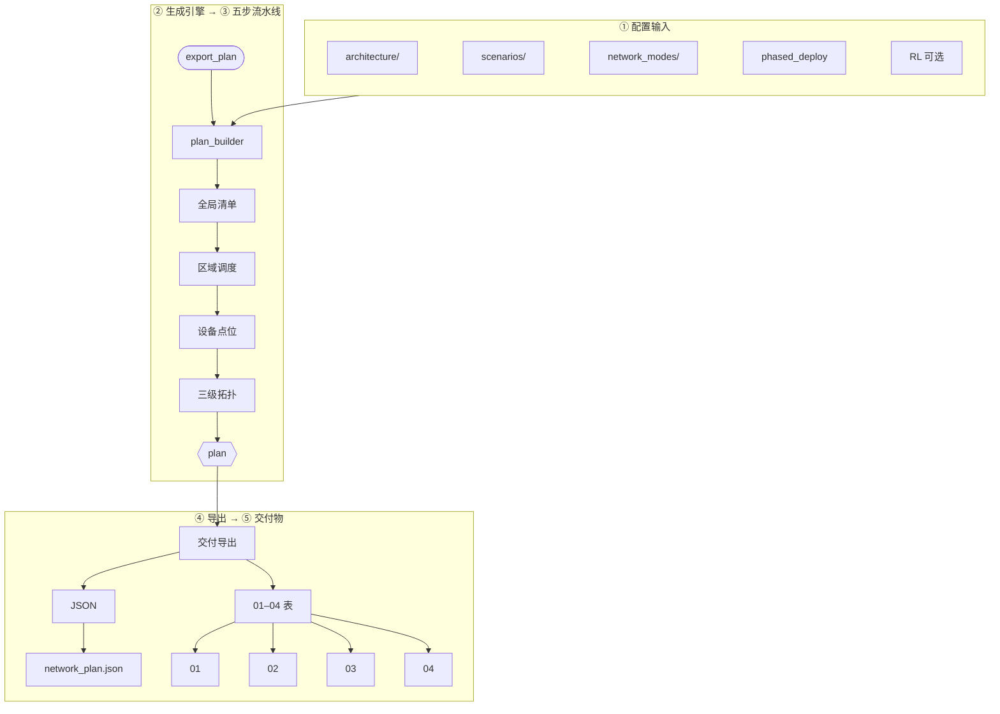
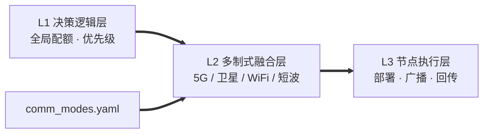

# 组网方案生成数据流（当前实现）

> 可视化版本：在浏览器打开 [network_plan_dataflow.html](./network_plan_dataflow.html) 可截图插入 Word。  
> 旧版验证报告中的数据流图**已过时**，请勿继续使用。

## 旧图问题

| 旧图表述 | 实际情况 |
|----------|----------|
| plan_builder 仅接收 L1 + L3 | 读取 **L1/L2/L3 + comm_modes** 全部 architecture |
| 无 scenarios / network_modes | **必须**读取 `scenarios/*.yaml` 与 `network_modes/{mode}/` |
| plan_builder 后直接 export | 中间还有 **grid_placement → topology_builder** |
| 输出仅 `network_plan.json` | 还有 **01–04 四张部署表** |

## 新数据流（Mermaid）

## 架构分层（概念图，可与实现图并存）

L1→L2→L3 描述**职责分层**，与代码加载路径不同：

此概念图可保留在报告「架构设计」章节；**方案生成数据流**请用上一节的完整流程图。

## 代码锚点

| 步骤 | 文件 |
|------|------|
| 入口 | `deployment/export_plan.py` |
| 组装 | `deployment/plan_builder.py` → `build_network_plan()` |
| 点位 | `deployment/grid_placement.py` → `assign_grid_placements()` |
| 拓扑 | `deployment/topology_builder.py` → `build_topology()` |
| 表导出 | `deployment/export_deployment_docs.py` → `export_deployment_documents()` |
