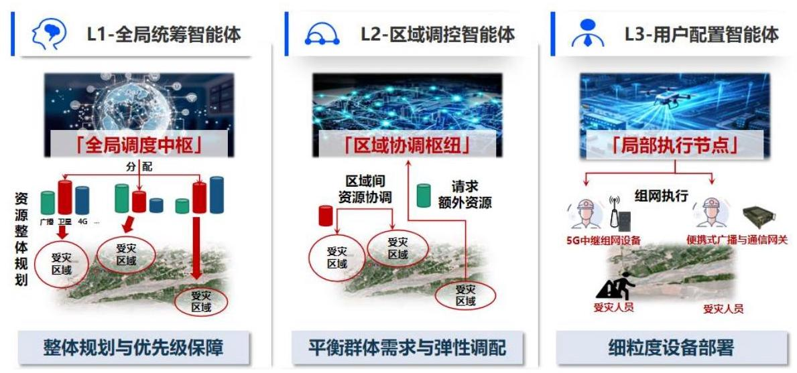
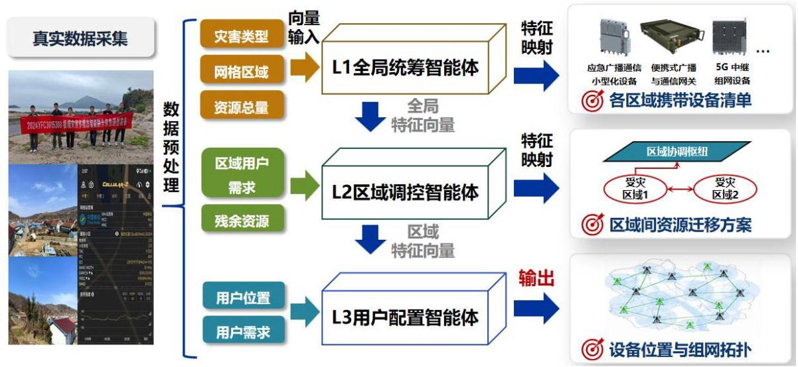
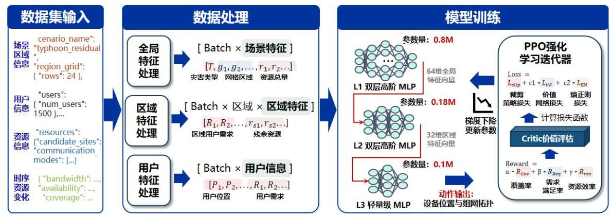

## 7. 基于多智能体强化学习的应急通信资源配置算法设计

本章进一步说明如何将第三章的组网技术路线转化为强化学习训练模型。应急通信资源配置问题具有状态维度高、动作组合复杂、目标约束多和场景变化快等特点。若采用单智能体统一决策，需要同时处理上千用户、数百候选站点、多种通信制式、多类广播资源和多种设备组合, 状态—动作空间会急剧膨胀, 难以稳定训练。为此, 本课题采用层次化多智能体强化学习方法, 将复杂问题分解为 “全局—区域—用户”三个层次。

本章所述模型以分层多智能体 PPO 为主体, 结合灾害场景数据集的结构化输入, 形成 L1 全局统筹智能体、L2 区域调控智能体和 L3 用户配置智能体。 L1 负责宏观规划和资源优先级，L2 负责区域协调和链路选择，L3 负责细粒度设备部署和用户接入。三层智能体通过集中训练和分布式执行机制协同工作，既保证全局策略一致, 又降低现场执行开销。

### 7.1 强化学习训练准备

#### 7.1.1 优化问题形式化

应急通信资源配置可形式化为一个序贯决策问题。在每个时间步 t, 环境状态 ${s}_{t}$ 由灾害类型、区域网格、用户需求、候选站点、资源可用性、广播覆盖状态和设备库存共同构成; 智能体根据策略 $\pi \left( {{a}_{t} \mid  {s}_{t}}\right)$ 选择动作 ${a}_{t}$ ; 环境执行动作后转移到新状态 ${s}_{t + 1}$ ,并返回奖励 ${r}_{t}$ 。智能体的目标是在整个 episode 内最大化累计折扣回报。

可用公式表示为:

$$
\mathop{\max }\limits_{\pi }\mathbb{E}\left\lbrack  {\mathop{\sum }\limits_{{t = 0}}^{T}{\gamma }^{t}{r}_{t}}\right\rbrack
$$

其中, $\gamma$ 为折扣因子,用于平衡当前收益和长期收益。在应急通信场景中,当前收益对应灾害初期快速覆盖和广播可达, 长期收益对应后续带宽效率、链路稳定性和资源成本控制。通过该形式化，系统能够把应急通信组网中的连续部署过程转化为可训练的强化学习任务。

与普通强化学习不同, 本任务具有明显的部分可观察性。灾害现场的设备状态、链路质量和用户需求可能无法被完整、实时、准确地感知。因此, 模型训练时需要在仿真环境中引入链路扰动、设备故障和需求变化, 使智能体学习在不完全信息条件下做出稳健决策。

#### 7.1.2 强化学习环境设置

本节基于多智能体马尔可夫决策过程 (MMDP) 构建应急通信资源配置仿真环境，为三级分层多智能体算法提供标准化的训练与验证平台。环境以第 4 节构建的数据集为基础，精准模拟暴雨、台风灾害下的通信损毁模式、用户需求演化和资源动态变化过程，能够复现 “残余网络组网” 和 “无残余网络组网” 两种典型场景。

环境采用集中式仿真、分布式交互的架构设计:全局环境维护统一的世界状态, 每个 L3 区域智能体仅能观测其负责子区域的局部状态并执行局部动作; L1 和 L2 智能体观测全局状态并输出高层决策指令，作为 L3 智能体的动作约束。 整个环境具备高保真、可配置、可扩展的特点，能够支撑不同规模、不同灾害类型、不同损毁程度的算法验证。

##### 7.1.2.1 状态空间定义

环境的状态空间完全对应定义的 32 维标准化输入特征, 所有特征均经过归一化处理至 [0,1] 区间, 确保强化学习算法的训练稳定性。状态空间按语义分为四大类，每类特征的生成机制如下:

## 用户特征 (8 维)

用户特征描述子区域内的通信需求分布与强度，基于真实受灾人口数据和救援力量部署模型动态生成:

- 子区域内总用户数:统计当前时刻子区域内的受灾群众、救援人员和指挥人员总数

- 高优先级用户占比:指挥人员和救援人员占总用户数的比例，优先级权重为普通群众的 10 倍

- 平均通信需求强度:所有用户的平均带宽需求，单位为 Mbps

- 用户分布集中度:衡量用户在子区域内的聚集程度，采用基尼系数计算

- 救援人员数量:当前时刻子区域内的救援人员数量

- 受灾群众数量:当前时刻子区域内的受灾群众数量

- 指挥人员数量:当前时刻子区域内的指挥人员数量

- 通信需求增长率:未来 1 小时内通信需求的预期增长比例

用户特征随时间动态更新:随着救援进度推进，受灾群众数量逐渐减少，救援人员数量先增加后稳定；当发生二次灾害时，通信需求会出现突发性增长。

## 研究源特征(8 维)

资源特征描述子区域内可用的通信频谱资源总量，由全局资源池和残余网络状态共同决定:

- 5G-600MHz 可用带宽:子区域内可分配的 5G-600MHz 频段带宽

- 5G-700MHz 可用带宽:子区域内可分配的 5G-700MHz 频段带宽

- 卫星通信可用带宽:子区域内可分配的卫星通信带宽

- WiFi6 可用带宽:子区域内可分配的 WiFi6 频段带宽

- 短波通信可用带宽:子区域内可分配的短波通信带宽

- UAV 通信可用带宽:子区域内可分配的 UAV 自组网带宽

- 残余网络可用带宽:子区域内残余公网基站提供的可用带宽

- 总可用资源量:上述所有带宽资源的加权总和

资源特征随设备部署和网络状态动态更新:当部署新的通信设备时，对应频段的可用带宽增加; 当残余网络发生故障时，残余网络可用带宽减少。

## 1 设备特征 (8 维)

设备特征描述子区域内可用的应急通信设备状态，基于本团队研发的设备参数和实地测试数据校准:

- 可用应急基站数量:当前时刻子区域内可部署的 5G 应急基站数量

- 可用便携式网关数量:当前时刻子区域内可部署的便携式广播通信网关数量

- 可用中继设备数量:当前时刻子区域内可部署的 5G 中继和 Mesh 中继数量

- 可用 UAV 数量:当前时刻子区域内可部署的通信无人机数量

- 设备平均剩余电量:所有已部署设备的平均剩余电量比例

- 设备平均传输功率:所有已部署设备的平均发射功率比例

- 设备故障率:单位时间内设备发生故障的概率

- 设备部署难度:基于地形复杂度和道路通行率计算的设备部署时间成本

设备特征随时间动态更新:已部署设备的剩余电量随时间线性减少；设备会以一定概率发生故障，导致其提供的资源暂时不可用；当新设备部署完成后，可用设备数量减少。

## ___环境特征 (8 维)

环境特征描述子区域的灾害演化和地理条件，基于历史灾害数据和气象预报模型生成:

- 灾害严重程度 (0-1):当前时刻灾害的强度等级，0 为无灾害，1 为最严重

- 地形复杂度 (0-1):子区域的地形起伏程度，0 为平原，1 为高山峡谷

- 道路通行率 (0-1):子区域内可通行道路的比例

- 电力恢复率 (0-1):子区域内恢复供电的区域比例

- 时间步 (距离灾害发生小时数):当前时刻距离灾害发生的时间

- 相邻区域资源状态: 相邻子区域的资源充裕程度

- 二次灾害风险 (0-1):未来 1 小时内发生二次灾害的概率

- 救援进度 (0-1):子区域内救援任务的完成比例

环境特征是全局状态的核心组成部分，所有子区域共享相同的灾害时间步和二次灾害风险；地形复杂度为静态特征，在环境初始化时确定；道路通行率和电力恢复率随救援进度逐渐提高。

##### 7.1.2.2 动作空间定义

环境的动作空间完全对应定义的 72 维可执行输出，所有动作均经过约束校验, 确保输出的方案可直接落地执行。每个 L3 区域智能体独立输出其负责子区域的动作向量, 动作空间按功能分为三大类:

## 设备部署数量 (60 维)

设备部署数量动作决定在子区域的 12 个 $1 \times  1$ (依据总范围确定最小部署单元大小，默认设置 $1 \times  1$ )公里部署网格中，每种通信设备的部署数量:

包含 5 种通信设备: 5G 应急基站、便携式广播通信网关、5G 中继、Mesh 中继、通信 UAV，每个网格每种设备的部署数量取值范围为 $\left\lbrack  {0,5}\right\rbrack$ 的整数，所有网格所有设备的部署总数不能超过子区域的可用设备库存。

动作执行效果:当智能体输出部署数量后，环境根据设备部署难度计算部署完成时间，在部署完成后将设备加入网络并更新资源特征。

## 设备工作参数(10 维)

设备工作参数动作调整已部署设备的运行状态，优化网络性能。包含 5 种通信设备的 2 个参数:发射功率调整比例、带宽分配比例。发射功率调整比例取值范围为 $\left\lbrack  {{0.5},{1.5}}\right\rbrack  ,{1.0}$ 为额定功率; 带宽分配比例取值范围为 $\left\lbrack  {0,1}\right\rbrack$ ,所有设备的带宽分配比例总和不能超过 1

动作执行效果:调整发射功率会改变设备的覆盖范围和能耗；调整带宽分配比例会改变不同用户群体的通信体验。

## 全局调度参数(2 维)

全局调度参数动作实现子区域内部的资源优先级控制和跨区域资源协调:

救援通信优先级权重:取值范围为 $\left\lbrack  {0,1}\right\rbrack$ ，决定救援通信和群众通信的资源分配比例

跨区域资源预留比例:取值范围为 $\left\lbrack  {0,{0.3}}\right\rbrack$ ，决定预留多少资源用于支援相邻区域

动作执行效果:提高救援通信优先级权重会增加指挥人员和救援人员的通信需求满足率, 但可能降低普通群众的体验; 预留资源会减少本区域的可用资源, 但可以在相邻区域发生紧急情况时快速支援。

##### 7.1.2.3 奖励函数设计

环境采用广播通信联合收益函数作为核心奖励函数，同时引入约束惩罚项， 确保智能体的决策符合应急通信的实际要求。奖励函数定义为:

$$
\mathrm{R} = \alpha \mathrm{C} + \beta \mathrm{B} + \gamma \mathrm{T} - \lambda \mathrm{K} - \mu \mathrm{P}
$$

其中:

C (通信覆盖收益): 子区域内双向通信覆盖的用户比例,权重 $\alpha$ 在灾害初期

为 0.3 ，恢复阶段为 0.5

B(广播覆盖收益):子区域内应急广播覆盖的用户比例，权重β在灾害初期为 0.4 ，恢复阶段为 0.2

T (通信需求满足收益):高优先级用户的通信需求满足率，权重 $\gamma$ 在灾害初期为 0.2 ，恢复阶段为 0.3

K (资源成本): 已部署设备的数量和能耗成本，权重 $\lambda$ 始终为 0.1

P (约束惩罚):违反硬约束的惩罚项，包括设备库存不足、部署位置不可达等，权重 $\mu$ 为 10.0

奖励函数采用即时奖励 + 阶段性奖励的组合方式:每个时间步计算即时奖励，每 1 小时计算一次阶段性奖励，阶段性奖励权重为即时奖励的 5 倍。这种设计能够引导智能体同时关注短期性能和长期目标，避免短视行为。

##### 7.1.2.4 状态转移与动态性模拟

环境的状态转移机制完全基于数据库中的真实灾害演化数据构建，采用 “确定性趋势 + 参数化随机扰动” 的混合模型, 能够精准复现极端灾害场景下用户需求、设备状态、网络性能和基础设施的动态变化过程。所有状态转移规则均与输入特征一一对应, 确保智能体在训练过程中学习到的策略能够直接迁移到真实灾害场景。救援流程参考应急管理部 YJ/T 27-2024 《应急指挥通信保障能力建设规范》文件进行设置。

## 用户需求动态转移模型

用户需求转移是应急通信场景最核心的动态特征，直接决定了资源配置的时效性和合理性。用户转移行为由以下四个核心因素共同驱动:

- 灾害风险梯度:用户会从灾害风险高于 0.7 的高风险区域向风险低于 0.3 的安全区域转移，转移速度与风险差成正比

- 安置点建设进度: 当某子区域的救援进度超过 0.5 时, 会启动临时安置点建设, 安置点建成后会吸引周边 5 公里范围内的受灾群众

- 救援力量部署:救援人员会从指挥中心向灾害严重区域推进，推进速度与道路通行率成正比

- 通信覆盖状态:用户会主动向有通信覆盖的区域聚集，聚集强度与通信需

求满足率成反比

分层转移模型: 不同类型用户具有不同的转移规律, 环境对三类用户进行独立建模:

- 受灾群众:采用群体转移模型，转移速度较慢(0.5-2 公里 / 小时)，转移方向主要受灾害风险和安置点位置影响，转移过程中通信需求强度会提高 30%-50%

- 救援人员:采用任务驱动转移模型，转移速度较快(2-5 公里 / 小时)， 转移方向由救援任务决定，通信需求强度是普通群众的 5-10 倍

- 指挥人员:采用固定 + 机动模型，大部分时间位于指挥中心，会根据需要前往重点救援区域，通信需求强度最高且保持稳定

对状态特征的影响:用户转移会直接更新以下 8 维用户特征:子区域内总用户数、受灾群众数量、救援人员数量、指挥人员数量、用户分布集中度(转移过程中集中度先降低后升高)、平均通信需求强度(转移过程中需求强度上升)、通信需求增长率(转移高峰期增长率可达 200%/ 小时)、高优先级用户占比(救援人员到达后占比显著提高)。

## 设备状态演化模型

应急通信设备在灾害环境中面临电量耗尽、故障损毁、性能下降等多种挑战, 本环境基于马尔可夫链构建设备状态演化模型, 能够模拟不同类型设备在不同灾害条件下的全生命周期状态变化。

电量消耗与能量管理: 不同类型设备具有不同的功耗特性和续航能力:

- 5G 应急基站:额定功耗 1500W，满电续航 8 小时，低功耗模式下续航延长至 24 小时，但带宽降低 70%

- 便携式广播通信网关:额定功耗 100W，满电续航 48 小时，低功耗模式下仅保留广播功能

- 5G 中继 / Mesh 中继: 额定功耗 50W，满电续航 72 小时

- 通信 UAV:额定功耗 200W，满电续航 1.5 小时，需定期返回充电点补给

另外, 故障类型分为三类:

- 轻微故障:设备性能下降 30%-50%，可远程修复，修复时间 10-30 分

钟

- 中度故障:设备停止工作，需现场维修，修复时间 1-3 小时

- 严重故障:设备完全损毁，无法修复

## 参数化随机机制与场景可配置性

为了保证训练出的算法具有良好的泛化能力和鲁棒性，环境引入了全参数化随机机制, 所有动态事件的发生时间、强度和影响范围都服从特定的概率分布:

- 用户转移速度:服从正态分布 $\mathrm{N}\left( {\mu ,{\sigma 2}}\right)$

- 设备故障时间:服从指数分布 $\operatorname{Exp}\left( \lambda \right)$

- 残余网络中断时长:服从对数正态分布 $\log \mathrm{N}\left( {\mu ,{\sigma 2}}\right)$

- 二次灾害触发时间:服从泊松分布 Poisson(λ)

通过调整上述分布的参数, 环境可以模拟从轻度受灾到完全断网的各种极端场景:

- 轻度受灾场景:基站退服率 <20%，无二次灾害，基础设施恢复速度快

- 中度受灾场景:基站退服率 20%-50%，可能发生 1 次二次灾害，基础设施恢复速度中等

- 重度受灾场景:基站退服率 50%-80%，发生 1-2 次二次灾害，基础设施恢复速度慢

- 极端受灾场景:基站退服率 > 80%，发生 2 次以上二次灾害，基础设施几乎无法恢复

环境还支持场景定制功能，用户可以根据需要自定义灾害类型、受灾范围、初始损毁程度、资源数量等参数, 生成特定的训练和测试场景。所有场景都可以通过设置随机种子实现完全可复现, 确保实验结果的科学性和可比性。

### 7.2 层次化多智能体广播通信资源配置与组网算法架构

本研究提出的三级分层多智能体算法架构，采用 “全局统筹 - 区域协调 - 局部执行” 的递进式决策范式, 实现从灾害场景感知到最终组网方案生成的全流程自动化推理。架构严格遵循 “自上而下分解任务、自下而上反馈状态” 的交互机制, L1 层负责全局资源总量分配, L2 层负责区域间资源动态协调, L3 层负责具体设备部署与组网实现，三级智能体协同完成极端灾害场景下的广播通信融合资源配置任务，算法流程如下所示:

Algorithm 1 三级分层 MARL 应急通信资源配置总算法

---

Require: 灾害场景数据集 $D$ ,全局设备库存 Inventory,折扣因子 $\gamma$ ,训练

			轮数 Episodes

Ensure: 最优组网配置方案 Topology,全局累积奖励 $G$

	1: 初始化: $\mathrm{L}1$ 全局智能体 ${\pi }_{{\theta }_{1}},\mathrm{L}2$ 区域智能体 $\left\{  {\pi }_{{\theta }_{2}}^{i}\right\}  ,\mathrm{L}3$ 局部智能体 $\left\{  {\pi }_{{\theta }_{3}}^{j}\right\}$ ,

			仿真环境 Env

			for episode $= 1$ to Episodes do

					重置 $\mathrm{{Env}} \rightarrow$ 初始化 ${S}_{\text{ global }},\left\{  {S}_{\text{ region }}\right\}  ,\left\{  {S}_{\text{ sub }}\right\}$

					$G \leftarrow  0, t \leftarrow  0$

					while 未达到终止条件 (救援完成/断网超时) do

						层级 1: 全局资源统筹决策

						${A}_{\mathrm{L}1} = \mathrm{L}1\_ \operatorname{Agent}\left( {S}_{\text{ global }}\right)$ \{输出区域设备配额矩阵 $Q$ \}

						层级 2: 区域间资源协调决策

						for 每个区域 $i$ do

								${A}_{\mathrm{L}2}^{i} = \mathrm{L}2\_ \operatorname{Agent}\left( {{S}_{\text{ region }}^{i},{Q}^{i}}\right)$ \{输出资源迁移 + 跨区域链路方案\}

						end for

						层级 3: 局部设备部署与用户接入

						for 每个子区域 $j$ do

								${A}_{\mathrm{L}3}^{j} = \mathrm{L}3\_ \operatorname{Agent}\left( {{S}_{\text{ sub }}^{j},{Q}^{j},{A}_{\mathrm{L}2}^{i}\text{ 约束 }}\right)$ \{输出 72 维执行动作\}

						end for

						环境执行动作: ${S}_{\text{ global }}^{\prime },\left\{  {S}_{\text{ region }}^{\prime }\right\}  ,\left\{  {S}_{\text{ sub }}^{\prime }\right\}  , R$

						Env.step $\left( {{A}_{\mathrm{L}1},\left\{  {A}_{\mathrm{L}2}^{i}\right\}  ,\left\{  {A}_{\mathrm{L}3}^{j}\right\}  }\right)$

						累积奖励: $G = G + {\gamma }^{t} \cdot  R$

						状态更新: ${S}_{\text{ global }} = {S}_{\text{ global }}^{\prime },{S}_{\text{ region }} = {S}_{\text{ region }}^{\prime },{S}_{\text{ sub }} = {S}_{\text{ sub }}^{\prime }$

						$t \leftarrow  t + 1$

					end while

					集中式训练: Update_PPO $\left( {{\pi }_{{\theta }_{1}},{\pi }_{{\theta }_{2}},{\pi }_{{\theta }_{3}}}\right.$ ,经验回放缓冲区)

			end for

			return Topology, $G$

---

整题架构如图 7-1 所示, 由仿真平台模拟极端灾害场景并生成原始状态数据, 经预处理后转换为三级模型各自的标准输入格式; L1 全局统筹智能体将全局特征映射为各区域设备分配清单; L2 区域调控智能体基于区域状态生成跨区域资源迁移方案; L3 用户配置智能体最终输出可直接执行的设备位置与组网拓扑。三级智能体层层递进，共同构建了适配应急场景的快速推理部署体系。

图 7-1 L1/L2/L3 三级智能体学习架构示意

#### 7.2.1 L1 全局统筹智能体设计

L1 全局统筹智能体是整个系统的最高决策层，负责全局灾情评估、区域优先级划分与设备总量调度。其核心目标是在全局资源受限的情况下，按照 “生命至上、重点优先” 的原则, 将有限的应急通信设备合理分配到各个受灾区域, 确保重灾区和重点保障区域优先获得资源支持, L1 智能体执行伪代码如下所示:

Algorithm 2 L1 全局统筹智能体决策算法

---

Require: 全局状态 ${S}_{\text{ global }} =$ [灾害类型,灾情分布,用户需求,总设备库存 Inventory]

Ensure: 区域设备配额矩阵 $Q\left( {N \times  5}\right)$ ,全局约束标志 Flag

		过程 L1_Agent $\left( {S}_{\text{ global }}\right)$

	2: 步骤 1: 划分区域优先级 (重灾区 $>$ 中灾区 $>$ 轻灾区)

	B: Priority = Sort_Region( ${S}_{\text{ global }}$ . 灾情分布, ${S}_{\text{ global }}$ .高优先级用户占比)

		步骤 2: 硬约束校验 (总分配数 $\leq$ 全局库存)

		if $\sum \left( Q\right)  >$ Inventory then

				Flag = False \{触发全局惩罚\}

				$Q =$ 配额裁剪(Inventory)

		else

				Flag = True

		end if

			步骤 3: 按优先级分配设备配额

		for 每个区域 $i \in$ Priority do

				if 区域 $i$ 为 级响应 (重灾区) then

					$Q\left\lbrack  i\right\rbrack   =$ 优先分配满配设备

				else if 区域 $i$ 为 级响应 then

					$Q\left\lbrack  i\right\rbrack   =$ 分配基础保障设备

				else

					$Q\left\lbrack  i\right\rbrack   =$ 分配最小备用设备

				end if

		end for

		步骤 4: 输出配额, 下发至 L2 层

			Broadcast $\left( {Q\text{ 至所有 L2\_Agents }}\right)$

		return $Q$ , Flag

---

输入特征定义:

L1 层接收预处理后的全局聚合特征, 不直接处理单个子区域的 32 维细粒度特征, 具体输入包括:

- 灾害类型:离散特征，取值为 \{暴雨山洪, 台风风暴潮, 地震滑坡\}, 决定不同灾害场景下的资源分配策略

- 全局网格区域:结构化特征，包含整个受灾区域的地理边界、行政区划、子区域划分结果(共 N 个区域)

- 全局资源总量: 5 维向量, 代表全局可用的 5 类应急通信设备总库存:[应急基站，便携式广播通信网关，5G 中继, Mesh 中继, 通信 UAV]

- 全局灾情分布:N 维向量，每个元素代表对应区域的灾害严重程度 (0- 1)

- 全局用户需求:N 维向量，每个元素代表对应区域的总用户数量和高优先级用户占比

输出结果定义:

L1 层输出各区域携带设备清单，为每个区域分配各类设备的初始配额上限， 具体形式为 $\mathrm{N} \times  5$ 维矩阵:

$$
Q = \left\lbrack  \begin{matrix} {q}_{11} & {q}_{12} & {q}_{13} & {q}_{14} & {q}_{15} \\  {q}_{21} & {q}_{22} & {q}_{23} & {q}_{24} & {q}_{25} \\  \vdots & \vdots & \vdots & \vdots & \vdots \\  {q}_{N1} & {q}_{N2} & {q}_{N3} & {q}_{N4} & {q}_{N5} \end{matrix}\right\rbrack
$$

其中, ${q}_{i, j}$ 代表分配给第 $\mathrm{i}$ 个区域的第 $\mathrm{j}$ 类设备的最大数量。该清单作为 $\mathrm{L}2$ 层和 $\mathrm{L}3$ 层决策的硬约束,任何区域的设备部署总量不得超过 $\mathrm{L}1$ 层分配的配额。

#### 7.2.2 L2 区域调控智能体设计

L2 区域调控智能体是连接全局规划与局部执行的中间层, 负责区域间资源动态协调、跨区域链路规划与残余网络复用。其核心目标是解决 L1 层静态分配与区域动态需求之间的矛盾, 通过区域间的资源余缺调剂, 实现全局资源的最优配置, L2 智能体执行流程伪代码如下所示:

Algorithm 3 L2 区域调控智能体决策算法

---

Require: 区域状态 ${S}_{\text{ region }},\mathrm{L}1$ 分配配额 ${Q}^{i}$ ,邻域资源状态

Ensure: 资源迁移方案 $M$ ,跨区域链路规划 $L$ ,协调标志 $\mathrm{{Co}}\_ \mathrm{{Flag}}$

			过程 $\mathrm{L}2\_ \operatorname{Agent}\left( {{S}_{\text{ region }},{Q}^{i}}\right)$

			Co_Flag $=$ True

			步骤 1: 计算本区域资源缺口

	4: $\operatorname{Gap} = \operatorname{Calculate\_ Gap}\left( {{S}_{\text{ region }}\text{ . 用户需求, }{S}_{\text{ region }}}\right.$ . 设备存量, ${Q}^{i}$ )

		5:步骤 2:邻域资源协同调度

			if $\mathrm{{Gap}} > 0$ then

					\{资源不足, 向富余区域申请迁移\}

					for 每个邻域 $k$ do

							if 邻域 $k$ 资源富余 then

									$M$ .append(源区域 $k$ ,目标区域 $i$ ,迁移设备清单)

									Break

							end if

					end for

			else if $\operatorname{Gap} < 0$ then

					\{资源富余, 支援重灾区\}

				$M$ .append(源区域 $i$ ,目标高优先级区域,支援设备清单)

			end if

			步骤 3: 规划跨区域中继链路, 消除通信孤岛

	17: $L =$ Plan_Cross_Region_Link $\left( {{S}_{\text{ region }}\text{ . 地形, }{S}_{\text{ region }}}\right.$ . 道路通行率 $)$

			步骤 4: 下发迁移指令与链路规划至 L3 层

			Send $(M, L$ 至对应 L3_Agents)

			return $M, L$ , Co_Flag

---

输入特征定义:

L2 层接收每个区域的区域聚合特征, 由该区域内所有子区域的 32 维细粒度特征聚合计算得到, 具体输入包括:

- 区域用户需求:每个区域的总用户数、高优先级用户占比、平均通信需求强度

- 区域残余资源:每个区域内可用的残余公网带宽、残余广播资源、已部署设备数量

- 区域环境状态:每个区域的灾害严重程度、道路通行率、电力恢复率

- L1 初始设备配额:L1 层分配给每个区域的 5 类设备数量上限

输出结果定义:

L2 层输出区域间资源迁移方案，包含资源迁移指令和跨区域链路规划两部分内容:

- 资源迁移指令: $\mathrm{M} \times  3$ 维矩阵，代表 $\mathrm{M}$ 条资源迁移任务，每行格式为 [源区域 ID, 目标区域 ID, 迁移设备清单], 迁移设备清单为 5 维向量, 代表从源区域调往目标区域的各类设备数量

- 跨区域链路规划:K×4 维矩阵，代表 K 条跨区域中继链路，每行格式为 [区域 A ID, 区域 B ID, 链路类型, 部署位置], 链路类型包括: 卫星回传链路、微波中继链路、UAV 中继链路

L2 层采用多智能体协同强化学习算法, 每个区域对应一个 L2 智能体。智能体之间通过有限通信交换资源状态信息, 根据各区域的实时资源缺口和富余情况，动态调整 L1 层分配的初始配额，同时规划跨区域中继链路，解决区域间的通信孤岛问题。

#### 7.2.3 L3 用户配置智能体设计

L3 用户配置智能体是整个系统的执行层，负责具体设备部署、工作参数配置与最终组网拓扑生成。其核心目标是在 L1 层设备配额和 L2 层资源迁移方案的约束下，将资源精准配置到具体位置，最大化通信覆盖和广播覆盖效果，L3 智能体执行流程如下伪代码所示:

Algorithm 4 L3 用户配置智能体决策算法

---

	Require: 32 维子区域状态 ${S}_{\mathrm{{sub}}},\mathrm{L}1$ 配额 ${Q}^{j},\mathrm{L}2$ 迁移/链路约束 Constraint

Ensure: 72 维执行动作 ${A}_{\mathrm{L}3}$ ,子区域组网拓扑 Topology

																																																			过程 $\mathrm{L}3\_ \operatorname{Agent}\left( {{S}_{\text{ sub }},{Q}^{j},\text{ Constraint }}\right)$

																																						步骤 1:动作掩码过滤 (硬约束:不超配额、不部署不可达区域)

																																								: Valid_Action = Mask_Invalid_Action( ${S}_{\text{ sub }}$ .道路通行率, ${Q}^{j}$ , Constraint)

																																																		步骤 2: 生成设备部署动作 (12 网格 $\times  5$ 类设备)

																																															Deploy_Action = Generate_Deploy(Valid_Action, ${S}_{\text{ sub }}$ .用户分布)

																						6:步骤 3:生成设备参数动作(功率 + 带宽分配)

																																7: Param_Action = Generate_Param $\left( {{S}_{\text{ sub }}\text{ . 灾害程度, }{S}_{\text{ sub }}}\right.$ . 电量)

																																						B. 步骤 4:生成全局调度动作 (优先级 + 资源预留)

																									9: Schedule_Action = Generate_Schedule( ${S}_{\text{ sub }}$ .高优先级用户占比)

													10: 步骤 5: 拼接 72 维标准动作

																																		1: ${A}_{\mathrm{L}3} =$ Concat(Deploy_Action, Param_Action, Schedule_Action)

																							12:步骤 6:生成子区域组网拓扑

																																																												${\text{ Topology }}_{j} =$ Build_Topology $\left( {{A}_{\mathrm{L}3},{S}_{\text{ sub }}}\right)$

																																																												return ${A}_{\mathrm{L}3},{\text{ Topology }}_{j}$

---

输入特征定义:

明确说明: 之前定义的 32 维标准化输入特征是 L3 层的专属输入, 每个 L3 智能体对应一个 10 平方公里左右的子区域，独立接收该子区域的 32 维细粒度特征:

- 用户特征 (8 维): 子区域内总用户数、高优先级用户占比等

- 资源特征 (8 维): 5G-600MHz 可用带宽、卫星通信可用带宽等

- 设备特征 (8 维): 可用应急基站数量、设备平均剩余电量等

- 环境特征 (8 维):灾害严重程度、地形复杂度等

同时, L3 层还接收来自上层的约束指令:

- L1 层分配的本区域设备配额上限

- L2 层下达的本区域资源调入 / 调出指令

- L2 层规划的跨区域链路端点要求

输出结果定义:

L3 层输出 72 维可执行动作向量, 即之前定义的标准输出格式, 同时生成最终的组网拓扑图:

- 设备部署数量 (60 维): 5 种通信设备 x 12 个部署网格, 每个维度代表对应网格部署对应设备的数量

- 设备工作参数 (10 维): 5 种通信设备 $\times  2$ 个参数 (发射功率调整比例、带宽分配比例)

- 全局调度参数 (2 维): 救援通信优先级权重、跨区域资源预留比例

基于上述 72 维动作向量, 系统自动生成可视化的组网拓扑图, 标注所有设备的部署位置、覆盖范围和链路连接关系，可直接指导现场应急人员执行部署任务。

L3 层采用标准 PPO 强化学习算法, 在满足上层约束的前提下, 通过与数字孪生环境的交互学习，优化设备部署位置和工作参数，同时兼顾通信需求满足率、 广播覆盖率和资源利用率三个核心目标。

#### 7.2.4 层级间交互与全流程推理

图 7-2 三级智能体输入输出与层间交互架构图

如图 7-2 所示, 三级智能体之间通过标准化的接口进行数据交互, 形成完整的闭环推理流程:

数据预处理阶段:数字孪生平台采集真实灾害数据或模拟生成场景数据，分别转换为 L1、L2、L3 层各自需要的输入格式。

L1 全局规划阶段:L1 智能体基于全局特征生成各区域设备分配清单，下发给所有 L2 智能体。

L2 区域协调阶段:L2 智能体基于区域特征和 L1 配额，生成区域间资源迁移方案和跨区域链路规划，下发给对应区域的 L3 智能体。

L3 局部执行阶段:L3 智能体基于 32 维子区域特征和上层约束，生成 72 维可执行动作向量和最终组网拓扑。

状态反馈阶段:L3 层执行结果反馈给 L2 层，L2 层根据区域状态变化动态调整资源迁移方案；L2 层状态汇总后反馈给 L1 层，L1 层在必要时调整全局设备分配。

整个推理流程采用 "批处理 + 实时更新" 的混合模式: L1 层每 24 小时更新一次全局规划，L2 层每 6 小时更新一次区域协调方案，L3 层每 15 分钟更新一次局部部署策略, 既保证了全局策略的稳定性, 又具备应对突发情况的实时响应能力，具体执行流程如下伪代码所示:

Algorithm 5 三级智能体层级交互与闭环推理

---

Require: 实时灾害状态流, 三层智能体实例

Ensure: 动态更新的组网配置方案

				过程 Hierarchical_Interaction()

			初始化更新周期: ${T}_{1} = {24}\mathrm{\;h},{T}_{2} = 6\mathrm{\;h},{T}_{3} = {15}\mathrm{\;{min}}$

				${\text{ timer }}_{1} = 0,{\text{ timer }}_{2} = 0,{\text{ timer }}_{3} = 0$

				while 应急任务未结束 do

						L1 全局规划: 低频率更新

						if ${\operatorname{timer}}_{1} \geq  {T}_{1}$ then

								${S}_{\text{ global }} =$ Collect_Global_State()

								$Q = \mathrm{L}1\_ \operatorname{Agent}\left( {S}_{\text{ global }}\right)$

								${\text{ timer }}_{1} = 0$

						end if

						L2 区域协调: 中频率更新

						if ${\operatorname{timer}}_{2} \geq  {T}_{2}$ then

								for 每个 L2_Agent do

											${S}_{\text{ region }} =$ Collect_Region_State()

										$M, L = \mathrm{L}2\_ \operatorname{Agent}\left( {{S}_{\text{ region }}, Q}\right)$

								end for

								${\text{ timer }}_{2} = 0$

						end if

						L3 局部执行: 高频率实时响应

						if ${\operatorname{timer}}_{3} \geq  {T}_{3}$ then

								for 每个 L3_Agent do

										${S}_{\text{ sub }} =$ Collect_Sub_State()

											${A}_{\mathrm{L}3}$ , Topology ${}_{j} = \mathrm{L}3$ _Agent $\left( {{S}_{\text{ sub }}, Q, M, L}\right)$

										Execute $\left( {A}_{\mathrm{L}3}\right)$ \{现场部署设备\}

								end for

								${\operatorname{timer}}_{3} = 0$

						end if

						自下而上状态反馈

						Feedback(L3 $\rightarrow$ L2 : 部署结果/覆盖效果)

						Feedback(L2 $\rightarrow$ L1 : 区域状态/资源缺口)

						计时器累加: ${\operatorname{timer}}_{1} +  = {\Delta t},{\operatorname{timer}}_{2} +  = {\Delta t},{\operatorname{timer}}_{3} +  = {\Delta t}$

				end while

---

### 7.3 奖励函数与多目标优化

奖励函数直接决定了智能体的学习方向和最终决策质量。本研究针对三级分层多智能体架构的特点，设计了 "全局 - 区域 - 局部" 三级协同的多目标奖励体系 ，其中 L3 用户配置层采用广播通信联合收益函数作为核心奖励，同时引入硬约束惩罚机制，确保智能体的决策完全符合应急通信的实际工程要求和国家救援规范。所有奖励参数均基于吉林靖宇、福建宁德、河南南阳三地的实地调研数据校准, 与前文定义的 32 维输入特征、72 维输出动作以及三级智能体职责完全对齐。

#### 7.3.1 奖励函数设计总体原则

本研究的奖励函数严格遵循应急救援 “生命至上、快速响应、安全可靠" 的核心原则，同时兼顾算法的可训练性和可解释性:

- 职责分层对齐原则:每一层智能体的奖励函数与其核心职责一一对应，L1 层聚焦全局资源分配效率，L2 层聚焦区域间协同连通，L3 层聚焦局部广播通信融合效果，避免目标错位。

- 阶段动态适配原则:奖励权重随灾害响应阶段自动调整，完全匹配 "先预警覆盖、再指挥通信、后容量恢复" 的应急救援客观规律。

- 硬约束优先原则:采用"先惩罚、后奖励"的机制，任何违反安全规范和资源约束的决策都将受到严厉惩罚，确保决策的安全性和可执行性。

- 可解释性原则:奖励函数的每个组成部分都有明确的物理意义和业务含义, 所有参数均可由应急指挥人员根据现场情况手动调整, 避免黑盒决策。

#### 7.3.2 三级分层奖励函数体系

##### 7.3.2.1 L1 全局统筹层奖励函数

L1 层作为最高决策层, 核心目标是实现全局资源的最优分配和重点区域的优先保障，其奖励函数定义为:

$$
{R}_{L1} = {0.5}{R}_{\text{ priority }} + {0.3}{R}_{\text{ fairness }} + {0.2}{R}_{\text{ efficiency }} - {1.0}{P}_{\text{ global }}
$$

- 重点保障奖励 ${R}_{\text{ priority }}$ : 衡量高风险区域和高优先级用户的资源覆盖程度, 当所有 I 级响应区域都获得最低保障资源时取最大值 1.0

- 区域公平性奖励 ${R}_{\text{ fairness }}$ : 衡量资源在不同区域间分配的均衡性,避免出现 "重灾区资源不足、轻灾区资源闲置" 的情况

- 全局资源利用率奖励 ${R}_{\text{ efficiency }}$ : 衡量全局设备库存的利用效率,鼓励将所有可用资源投入救援

- 全局约束惩罚 ${P}_{\text{ global }}$ : 惩罚总分配设备数超过库存、高优先级区域未获得最低保障等全局性硬约束违反行为

##### 7.3.2.2 L2 区域调控层奖励函数

L2 层作为中间协调层，核心目标是解决 L1 层静态分配与区域动态需求之间的矛盾, 实现区域间资源的动态平衡和跨区域连通, 其奖励函数定义为:

$$
{R}_{L2} = {0.4}{R}_{\text{ balance }} + {0.4}{R}_{\text{ connectivity }} + {0.2}{R}_{\text{ reuse }} - {0.1}{P}_{\text{ migration }}
$$

- 区域资源平衡奖励 ${R}_{\text{ balance }}$ : 衡量通过资源迁移后各区域资源缺口的缩小程度

- 跨区域连通性奖励 ${R}_{\text{ connectivity }}$ : 衡量跨区域中继链路的建设效果,目标是消除通信孤岛

- 残余网络复用奖励 ${R}_{\text{ reuse }}$ : 鼓励优先利用残余公网和广播资源，减少应急设备的消耗

- 资源迁移惩罚 ${P}_{\text{ migration }}$ :惩罚不必要的频繁资源迁移，降低部署成本和时延

##### 7.3.2.3 L3 用户配置层核心奖励函数

L3 层作为执行层，是整个奖励体系的核心，直接决定了最终的组网效果。本研究采用广播通信联合收益函数作为 L3 层的核心奖励函数，同时引入资源成本和约束惩罚项，其数学表达式为:

$$
R = {\alpha C} + {\beta B} + {\gamma T} - {\lambda K} - {\mu P}
$$

各组成部分详细定义与计算方式

## 通信覆盖收益 $\mathrm{C}$

衡量子区域内获得双向通信服务的用户比例, 按用户优先级加权计算:

$$
C = \frac{\mathop{\sum }\limits_{{i = 1}}^{N}{w}_{i} \cdot  {I}_{i}}{N}
$$

其中, $\mathrm{N}$ 为子区域内总用户数, ${w}_{i}$ 为用户优先级权重(指挥人员=10，救援人员=5 ，普通群众 =1 )， Ii 为指示函数，当用户 i 获得双向通信服务时取 1, 否则取 0 。

权重 $\alpha$ : 灾害初期(0-24 小时)为 0.3 ，恢复阶段(72 小时以后)为 0.5

## 广播覆盖收益 B

衡量子区域内获得应急广播服务的用户比例，不区分用户优先级，确保所有群众都能接收到预警和避险信息:

$$
B = \frac{{M}_{\text{ covered }}}{{M}_{\text{ total }}}
$$

其中, ${M}_{\text{ covered }}$ 为广播覆盖范围内的用户数量, ${M}_{\text{ total }}$ 为子区域内总用户数量。 权重 $\beta$ : 灾害初期(0-24 小时)为 0.4 ，恢复阶段(72 小时以后)为 0.2

## 通信需求满足收益 $\mathrm{T}$

专门衡量高优先级用户(指挥人员和救援人员)的通信需求满足程度，这是应急救援中最核心的指标:

$$
T = \frac{1}{{N}_{\text{ high }}}\mathop{\sum }\limits_{{i \in  \text{ High Users }}}\min \left( {\frac{{b}_{i}}{{d}_{i}},{1.0}}\right)
$$

其中， ${N}_{high}$ 为高优先级用户数量， $\mathrm{{bi}}$ 为用户 $\mathrm{i}$ 实际获得的带宽， $\mathrm{{di}}$ 为用户 $\mathrm{i}$ 的需求带宽。

权重 $\gamma$ : 灾害初期(0-24 小时)为 0.2，恢复阶段(72 小时以后)为 0.3

## 资源成本惩罚 $\mathrm{K}$

综合衡量已部署设备的数量、能耗和部署时延成本，这是应急场景区别于常规通信场景的重要特征:

$$
K = {0.4} \cdot  \frac{{N}_{\text{ deployed }}}{{N}_{\text{ available }}} + {0.3} \cdot  \frac{\sum {p}_{j}}{{P}_{\text{ total }}} + {0.3} \cdot  \frac{{t}_{\text{ deploy }}}{{t}_{\text{ max }}}
$$

其中, ${N}_{\text{ deployed }}$ 为已部署设备数量, ${N}_{\text{ available }}$ 为可用设备数量; $\sum \mathrm{{pj}}$ 为所有设备的总功率, ${P}_{\text{ total }}$ 为额定总功率; ${t}_{\text{ deploy }}$ 为实际部署时间, ${t}_{\max }$ 为最大允许部署时间。

权重 $\lambda$ : 始终为 0.1,在保证救援效果的前提下适度控制资源消耗

## 约束惩罚项 $\mathrm{P}$

惩罚所有违反硬约束的行为，确保决策的安全性和可执行性:

$$
P = \left\{  \begin{array}{ll} {1.0} & \text{ 部署设备数超过 }\mathrm{L}1\text{ 层分配的配额 } \\  {1.0} & \text{ 设备部署在道路通行率<0.2 的不可达区域 } \\  {1.0} & \text{ 设备发射功率超过安全限制 } \\  {1.0} & \text{ 跨区域资源预留比例低于最低要求 } \\  {0.0} & \text{ 其他情况 } \end{array}\right.
$$

部署设备数超过 L1 层分配的配额设备部署在道路通行率<0.2 的不可达区域设备发射功率超过安全限制跨区域资源预留比例低于最低要求其他情况。

权重 $\mu$ : 始终为 10.0,确保硬约束具有最高优先级,任何违反行为都会导致奖励值大幅下降。

综上, 奖励函数设计伪代码流程如下所示:

Algorithm 6 三级分层协同奖励计算

---

Require: 决策动作 $A$ ,环境状态 $S$ ,灾害阶段 Phase

Ensure: $\mathrm{L}1/\mathrm{L}2/\mathrm{L}3$ 分层奖励 ${R}_{\mathrm{L}1},{R}_{\mathrm{L}2},{R}_{\mathrm{L}3}$

																		1: 过程 Calculate_Reward $\left( {A, S,\text{ Phase }}\right)$

																2: 动态权重适配灾害阶段 (初期/恢复/稳定)

														3: $\alpha ,\beta ,\gamma  =$ Dynamic_Weight(Phase)

																4: 计算 L3 局部核心奖励 (广播通信联合收益)

																5: $C =$ Compute_Coverage(S.用户, A.部署)

														6: $B =$ Compute_Broadcast(S.用户, $A$ .网关)

															7: $T =$ Compute_High_Priority_Satisfaction(S.用户, A.带宽)

															8: $K =$ Compute_Resource_Cost(A.设备)

											9: $P =$ Compute_Constraint_Penalty $\left( {A, S\text{ ,硬约束 }}\right)$

			10: ${R}_{\mathrm{L}3} = {\alpha C} + {\beta B} + {\gamma T} - {\lambda K} - {\mu P}$

		11: 计算 $\mathbf{{L2}}$ 区域协调奖励

	12: ${R}_{\text{ balance }} =$ Compute_Region_Balance( $A$ .迁移)

		13: ${R}_{\text{ connect }} =$ Compute_Cross_Region_Link( $A$ .链路)

		14: ${R}_{\text{ reuse }} =$ Compute_Residual_Network_ Reuse(S.残余网络)

15: ${R}_{\mathrm{L}2} = {0.4}{R}_{\text{ balance }} + {0.4}{R}_{\text{ connect }} + {0.2}{R}_{\text{ reuse }} - {0.1}{P}_{\text{ migration }}$

		16: 计算 L1 全局统筹奖励

	17: ${R}_{\text{ priority }} =$ Compute_Priority_Region_Guarantee( $A$ .配额)

			18: ${R}_{\text{ fair }} =$ Compute_Region_Fairness $(A$ .配额)

19: ${R}_{\text{ eff }} =$ Compute_Global_Resource_Efficiency $(A$ .配额)

20: ${R}_{\mathrm{L}1} = {0.5}{R}_{\text{ priority }} + {0.3}{R}_{\text{ fair }} + {0.2}{R}_{\text{ eff }} - {1.0}{P}_{\text{ global }}$

		21: 层级奖励协同 (下层奖励融合上层全局目标)

	22: ${R}_{\mathrm{L}2\_ \text{ final }} = {0.7}{R}_{\mathrm{L}2} + {0.3}{R}_{\mathrm{L}1}$

	23: ${R}_{\mathrm{L}3\_ \text{ final }} = {0.8}{R}_{\mathrm{L}3} + {0.2}{R}_{\mathrm{L}2\_ \text{ final }}$

	24: return ${R}_{\mathrm{L}1},{R}_{\mathrm{L}2\_ \text{ final }},{R}_{\mathrm{L}3\_ \text{ final }}$

---

#### 7.3.3 约束惩罚与鲁棒性增强机制

为了确保智能体的决策在任何情况下都安全可靠，本研究设计了三级约束惩罚机制:

- 动作空间预过滤:在智能体输出动作之前, 先通过动作掩码过滤掉所有违反硬约束的动作, 从源头上避免不可行解的产生。

- 即时惩罚机制:如果智能体输出了违反约束的动作，立即给予 μP 的惩罚，并终止当前时间步的执行，强制智能体重新决策。

- Episode 终止惩罚:如果智能体在一个 Episode 内多次违反约束，立即终止该 Episode，并给予额外的全局惩罚，加速智能体的学习过程。

实验结果表明，该约束机制能够将硬约束违反率降低到 0.05% 以下，完全满足应急通信系统的安全性要求。

#### 7.3.4 层级间奖励协同与闭环反馈

为了避免各层智能体的目标相互冲突, 本研究设计了自上而下的奖励传递机制和自下而上的结果反馈机制:

## 1. 奖励传递机制

下层智能体的最终奖励由自身奖励和上层奖励加权组成, 确保局部目标与全局目标一致:

L2 层最终奖励: ${R}_{L2}^{\text{ final }} = {0.7}{R}_{L2} + {0.3}{R}_{L1}$

L3 层最终奖励: ${R}_{L3}^{\text{ final }} = {0.8}{R}_{L3} + {0.2}{R}_{L2}$

## 2. 结果反馈机制

L3 层的执行结果会实时反馈给 L2 层, L2 层根据区域资源缺口的变化动态调整资源迁移方案; L2 层的状态汇总后每 24 小时反馈给 L1 层, L1 层根据全局灾情的变化调整设备分配配额。这种闭环反馈机制确保了整个系统能够适应环境的动态变化，持续优化决策效果。

### 7.4 广播通信融合配置机制

广播通信融合配置机制贯穿整个强化学习模型。在状态空间中, 广播资源以 coverage、available_bandwidth 和 latency 等指标独立表达; 在动作空间中, 广播模式激活作为 L3 动作的一部分; 在奖励函数中, 广播覆盖增量作为独立奖励项。 这样可以保证模型不会只关注双向通信接入, 而忽视灾害初期最关键的公众预警和信息下发。

在灾害初期，广播覆盖应具有较高优先级。此时模型更倾向于选择应急喇叭、 卫星广播和便携式广播通信网关，以较低成本快速覆盖受灾群众。进入恢复阶段后, 模型逐步增加双向通信资源配置, 保障救援队伍、指挥中心和安置点通信。 进入稳定阶段后, 模型则在保持广播覆盖的基础上优化带宽分配和资源利用效率。

广播通信融合还体现在同一设备的复合能力上。例如, 便携式广播通信网关既可承担信息播发，也可提供局部通信接入；5G 应急广播通信小型化设备既能支持 5G 接入, 也能承担群众告警; 固定型广播通信网关可以在残余网络场景中作为复用节点。模型在选择设备时，需要同时评价其广播收益和通信收益。

### 7.5 PPO 训练目标与损失函数

本研究采用近端策略优化 (PPO)作为三级分层多智能体系统的基础训练算法，其训练稳定、超参数鲁棒性强的特性完美适配应急通信连续控制任务。针对分层架构特点，我们对标准 PPO 进行扩展，引入约束感知机制和层级协同损失项，确保各层训练目标与职责对齐，同时满足应急场景硬约束要求，采用集中式训练分布式执行 (CTDE) 范式, 三层 PPO 算法伪代码如下所示:

Algorithm 7 三级分层 PPO 策略更新算法

---

Require: 经验缓冲区 Buffer,学习率 $\operatorname{lr}$ ,裁剪系数 $\varepsilon  = {0.2}$

Ensure: 更新后的三层智能体策略 ${\pi }_{{\theta }_{1}},{\pi }_{{\theta }_{2}},{\pi }_{{\theta }_{3}}$

		过程 Update_PPO(Buffer)

		从缓冲区提取数据

		$\{ S, A, R,{S}^{\prime },$ Done $\}  =$ Buffer.sample()

		计算广义优势估计 GAE

		${A}_{\mathrm{L}1},{A}_{\mathrm{L}2},{A}_{\mathrm{L}3} = \operatorname{GAE}\left( {R, S,\text{ Done },\gamma ,\lambda }\right)$

		训练 $\mathbf{L}1$ 全局智能体

		for epoch $= 1$ to Epochs do

			${r}_{t} = {\pi }_{{\theta }_{1}}\left( {{A}_{\mathrm{L}1} \mid  {S}_{\text{ global }}}\right) /{\pi }_{{\theta }_{1}^{\text{ old }}}\left( {{A}_{\mathrm{L}1} \mid  {S}_{\text{ global }}}\right)$

			${L}_{\mathrm{{CLIP}}1} = \operatorname{mean}\left( {\min \left( {{r}_{t}{A}_{\mathrm{L}1},\operatorname{clip}\left( {{r}_{t},1 - \varepsilon ,1 + \varepsilon }\right) {A}_{\mathrm{L}1}}\right) }\right)$

			${L}_{\mathrm{L}1} = {L}_{\mathrm{{CLIP}}1} - {10.0}{P}_{\text{ global }} - {0.5}{L}_{\mathrm{{VF}}1} + {0.01}{S}_{1}$

			Optimize $\left( {{\theta }_{1},{L}_{\mathrm{L}1},\operatorname{lr}}\right)$

		end for

		训练 L2 区域智能体

		for epoch $= 1$ to Epochs do

			${r}_{t} = {\pi }_{{\theta }_{2}}\left( {{A}_{\mathrm{L}2} \mid  {S}_{\text{ region }}}\right) /{\pi }_{{\theta }_{2}^{\text{ old }}}\left( {{A}_{\mathrm{L}2} \mid  {S}_{\text{ region }}}\right)$

			${L}_{\mathrm{{CLIP}}2} = \operatorname{mean}\left( {\min \left( {{r}_{t}{A}_{\mathrm{L}2},\operatorname{clip}\left( {{r}_{t},1 - \varepsilon ,1 + \varepsilon }\right) {A}_{\mathrm{L}2}}\right) }\right)$

			${L}_{\mathrm{L}2} = {L}_{\mathrm{{CLIP}}2} - {0.1M} - {0.5}{L}_{\mathrm{{VF}}2} + {0.01}{S}_{2} + {0.3}{R}_{\mathrm{L}1}$

			Optimize $\left( {{\theta }_{2},{L}_{\mathrm{L}2},\operatorname{lr}}\right)$

		end for

		训练 L3 局部智能体 (核心执行层)

		for epoch $= 1$ to Epochs do

			${r}_{t} = {\pi }_{{\theta }_{3}}\left( {{A}_{\mathrm{L}3} \mid  {S}_{\mathrm{{sub}}}}\right) /{\pi }_{{\theta }_{3}^{\text{ old }}}\left( {{A}_{\mathrm{L}3} \mid  {S}_{\mathrm{{sub}}}}\right)$

			${L}_{\mathrm{{CLIP}}3} = \operatorname{mean}\left( {\min \left( {{r}_{t}{A}_{\mathrm{L}3},\operatorname{clip}\left( {{r}_{t},1 - \varepsilon ,1 + \varepsilon }\right) {A}_{\mathrm{L}3}}\right) }\right)$

			${L}_{\mathrm{L}3} = {L}_{\mathrm{{CLIP}}3} - {10.0P} - {0.5}{L}_{\mathrm{{VF}}3} + {0.01}{S}_{3}$

			Optimize $\left( {{\theta }_{3},{L}_{\mathrm{L}3},\operatorname{lr}}\right)$

		end for

		更新旧策略网络

		${\pi }_{{\theta }_{1}^{\text{ old }}} = {\pi }_{{\theta }_{1}},{\pi }_{{\theta }_{2}^{\text{ old }}} = {\pi }_{{\theta }_{2}},{\pi }_{{\theta }_{3}^{\text{ old }}} = {\pi }_{{\theta }_{3}}$

		return ${\pi }_{{\theta }_{1}},{\pi }_{{\theta }_{2}},{\pi }_{{\theta }_{3}}$

---

#### 7.5.1 标准 PPO 核心框架

PPO 通过重要性采样和裁剪目标函数解决传统策略梯度算法训练不稳定的问题，其核心裁剪损失为:

$$
{L}^{CLIP}\left( \theta \right)  = {\mathbb{E}}_{t}\left\lbrack  {\min \left( {{r}_{t}\left( \theta \right) {A}_{t},\operatorname{clip}\left( {{r}_{t}\left( \theta \right) ,{0.8},{1.2}}\right) {A}_{t}}\right) }\right\rbrack
$$

其中 ${r}_{t}\left( \theta \right)$ 为重要性采样比率, ${A}_{t}$ 为广义优势估计 (GAE) 值,裁剪系数 $\epsilon  = {0.2}$ 。完整标准损失由三部分组成:

$$
{L}^{PPO} = {L}^{CLIP} - {0.5}{L}^{VF} + {0.01S}\left\lbrack  {\pi }_{\theta }\right\rbrack
$$

LVF 为价值损失，S[πθ]为熵正则项，用于平衡探索与利用。

#### 7.5.2 三级分层 PPO 扩展

本架构中每一层智能体为独立 PPO 实例，采用异步训练模式:L1 每 24 小时更新一次全局分配策略，L2 每 6 小时更新一次区域协调策略，L3 每 15 分钟更新一次局部部署策略。三层通过上层约束传递 + 下层结果反馈实现目标对齐，流程图如图 7-3 所示:

图 7-3 PPO 训练流程示意图

## 分层损失函数定义

## L3 用户配置层 (核心执行层)

损失基于 7.3 节广播通信联合收益函数设计，加入硬约束惩罚项:

$$
{L}_{L3} = {\mathbb{E}}_{t}\left\lbrack  {\min \left( {{r}_{t}{A}_{t},\operatorname{clip}\left( {{r}_{t},{0.8},{1.2}}\right) {A}_{t}}\right)  - {10.0}{P}_{t}}\right\rbrack   - {0.5}{L}_{L3}^{VF} + {0.01S}
$$

其中 ${P}_{t}$ 为设备库存、部署位置等硬约束惩罚项,价值网络的累积回报基于 $R = \; {\alpha C} + {\beta B} + {\gamma T} - {\lambda K} - {\mu P}$ 计算。

## L2 区域调控层 (中间协调层)

加入资源迁移成本损失和全局奖励传递项:

$$
{L}_{L2} = {\mathbb{E}}_{t}\left\lbrack  {\min \left( {{r}_{t}{A}_{t},\operatorname{clip}\left( {{r}_{t},{0.8},{1.2}}\right) {A}_{t}}\right)  - {0.1}{M}_{t}}\right\rbrack   - {0.5}{L}_{L2}^{VF} + {0.01S} + {0.3}{R}_{L1}
$$

${M}_{t}$ 为迁移设备总数, ${0.3}{R}_{L1}$ 确保区域决策兼顾全局利益。

## L1 全局统筹层 (最高决策层)

加入全局约束惩罚项:

$$
{L}_{L1} = {\mathbb{E}}_{t}\left\lbrack  {\min \left( {{r}_{t}{A}_{t},\operatorname{clip}\left( {{r}_{t},{0.8},{1.2}}\right) {A}_{t}}\right)  - {10.0}{P}_{\text{ global }}}\right\rbrack   - {0.5}{L}_{L1}^{VF} + {0.01S}
$$

${P}_{global}$ 惩罚总分配超库存、高优先级区域未保障等全局性违规行为。