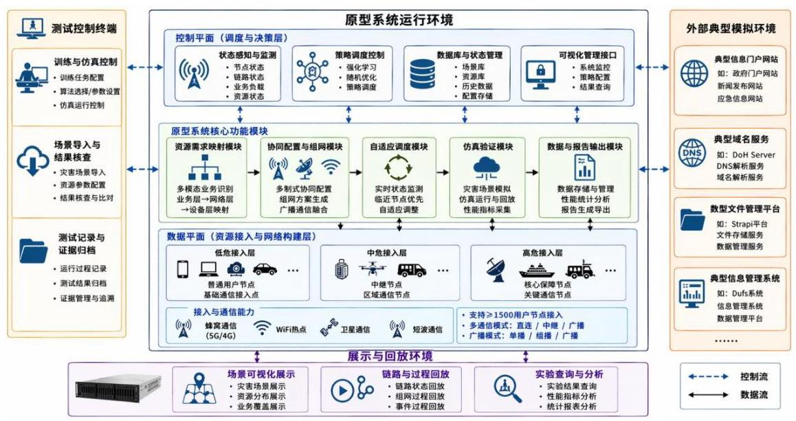
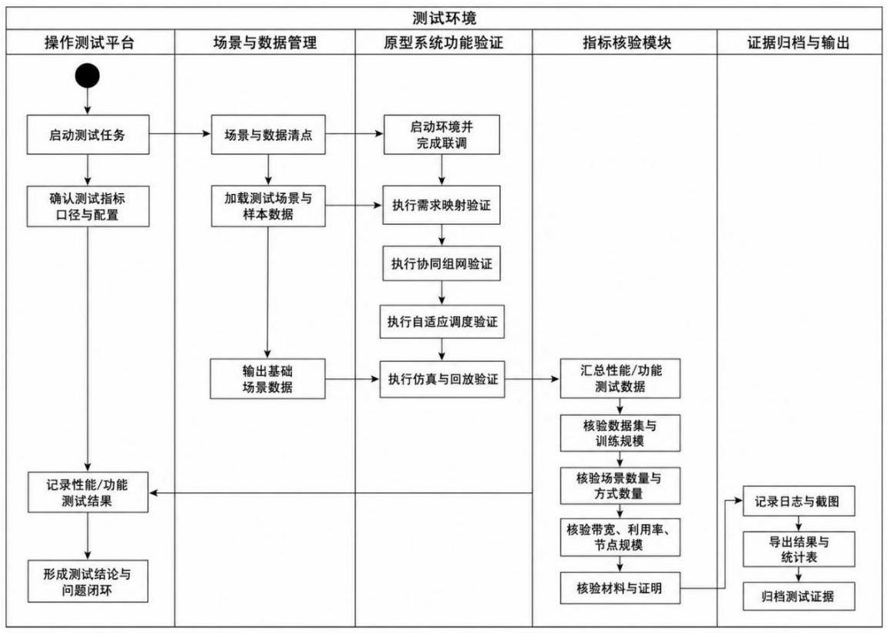
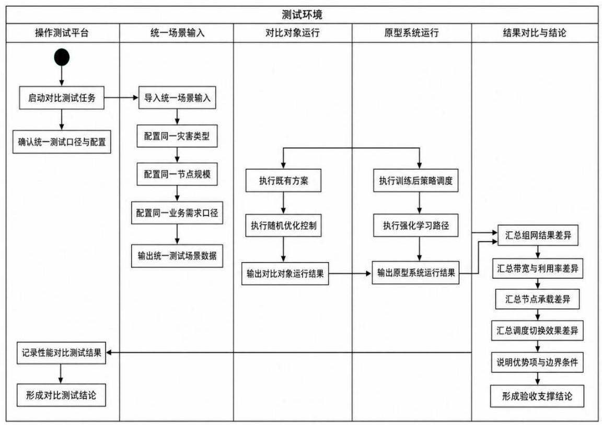

# 2024YFC3015301 应急通信网络多维资源动态配置系统 验收测试大纲

编 写___

校 对___

审 核___

批 准___

北京邮电大学

2026 年 4 月

## 目 录

1 范围和目的 3

2 测试依据 3

2.1 研究内容 3

2.2 关键技术 5

2.3 技术指标 6

2.4 成果形式 7

3 测试环境 8

3.1 总体介绍 8

3.2 原型系统 .11

3.3 场景设置 12

3.4 被测对象 15

3.5 计量工具 18

3.6 测试环境支撑工具 19

3.7 对比对象 20

4 测试项说明 22

5 测试用例描述 39

TC-YJ-01-01 业务-网络-设备层级式资源需求映射与感知验证测试 39

TC-YJ-02-01 多维度通信广播资源智能协同部署决策验证测试 .41

TC-YJ-03-01 网络资源实时自适应调度方案验证测试 .44

TC-YJ-04-01 资源调度仿真系统与性能验证测试 .46

TC-KT-01-01 层级式资源需求感知技术验证测试 48

TC-KT-02-01 全链式协同资源配置与组网方案生成技术验证测试 51

TC-KT-03-01 在线实时监测与自适应切换技术验证测试 53

TC-KT-04-01 广播通信融合网络模拟与调度仿真验证技术测试 55

TC-ZB-01-01 极端灾害通信资源变化数据集指标验证 57

TC-ZB-01-02 单场景训练与百万参数规模验证 59

TC-ZB-01-03 双灾害组网与残余/无残余网络能力验证 .61

TC-ZB-01-04 强化学习算法状态动作与奖励设计验证 63

TC-ZB-02-01 三场景训练与五百万参数规模验证 65

TC-ZB-02-02 智能组网方案带宽与利用率验证 67

TC-ZB-03-02 专用设备接入与 1200 用户能力验证 71

TC-ZB-03-03 仿真引擎确定性执行与中间状态存取验证 73

TC-ZB-04-01 原型系统与技术就绪度验证 75

TC-ZB-04-02 四类极端灾害数据仿真验证 77

TC-ZB-04-03 蜂窝、WiFi、卫星、短波通信方式仿真验证 79

TC-ZB-04-04 直连、中继与单/组/广播播发模式验证 .81

TC-ZB-04-05 强化学习、随机优化控制与策略调度三类逻辑验证 83

TC-ZB-04-06 1500 用户节点接入能力验证 85

TC-ZB-05-01 训练收敛性与策略稳定性验证 87

TC-ZB-05-02 基线方案对比与增量价值验证 89

TC-ZB-05-03 端到端集成链路贯通验证 91

TC-ZB-05-04 场景导出与回放轨迹一致性验证 93

TC-ZB-05-05 自适应切换触发与效果量化验证 .95

TC-ZB-06-01 跨场景策略泛化与迁移能力验证 97

TC-ZB-06-02 大规模节点持续运行稳定性验证 .99

TC-ZB-06-03 时变链路条件下调度鲁棒性验证 101

6 研究内容、关键技术和技术指标与测试用例对照表 103

## 1 范围和目的

本测试大纲用于指导国家重点研发计划“极端灾害多场景智能融合应急通信装备”项目课题 “应急通信网络多维资源动态配置方法” 原型系统是否覆盖课题任务书相关要求，是对本次测试任务进行测试需求分析、测试策划和测试设计后编写的文档，分别明确了本次测试的测试依据、测试环境、测试项说明、测试用例描述等内容, 规定了课题成果功能和性能的验收测试要求、验收测试方法以及合格判据。

本测试大纲的编写目的主要为 “应急通信网络多维资源动态配置方法” (课题编号:2024YFC3015301)生成测试报告提供依据，同时为验收测试阶段的管理工作和技术工作提供指导，支撑课题中期与完成时指标核查、评审材料准备、 第三方检测配合和综合绩效评价工作。

## 2 测试依据

测试依据的标准如下:

《国家重点研发计划课题任务书(课题编号:2024YFC3015301)》

### 2.1 研究内容

2.1.1 多场景业务与网络资源需求映射机制

研究层级式资源需求映射机制，面向文本、语音、视频等多场景应急业务， 设计步进式层间映射模型, 从业务层、网络层和设备层三个递进层面逐步映射, 针对暴雨、台风、地震、洪水等极端灾害条件下的业务保障需求，实现多体制网络环境中的应急通信资源需求感知与分析能力，为后续资源配置和组网生成提供输入基础。该研究内容的核心，是把以往依赖人工经验或静态规则描述的应急业务需求，转化为能够直接驱动资源配置策略的统一状态表达，使不同灾种、不同损毁条件和不同接入能力下的业务保障需求能够被系统一致识别、统一编码和持续更新。

2.1.2 多维度通信广播资源智能协同部署决策

研究全链式协同资源配置策略，面向应急广播和通信协同保障需求，综合考虑多制式、多频段、多节点、多设备条件下的资源状态，利用训练学习形成资源部署决策能力，在不同灾害场景中自动生成通信与广播协同配置策略，并形成可复用的组网方案，提升资源配置效率、带宽利用率和灾区覆盖效果。该研究内容聚焦解决传统资源配置方法在极端灾害场景下对预设条件依赖过强、对多体制资源协同支持不足的问题, 通过统一考虑蜂窝、卫星、WiFi、短波以及广播能力之间的组合关系，把离散的资源元素组织为可协同求解的整体配置问题。

2.1.3 网络资源实时自适应调度方案

研究应急通信资源实时监测和局部在线动态调整技术，围绕灾情变化、节点位置变化、负载变化和业务需求变化等因素, 基于临近节点优先调度思路和反馈式增补结果回传机制，动态切换资源配置模式，对局部资源进行自适应调整，持续维持整体通信与广播服务稳定运行。该研究内容面向的是灾区资源状态瞬时变化、保障需求持续波动、节点可用性快速演变等典型实际问题，其目标不是一次性完成组网, 而是在既有组网和既有资源条件基础上, 根据实时状态变化持续进行局部修正和动态补偿。

2.1.4 资源调度仿真系统与性能验证

设计并实现广播通信融合网络模拟与资源优化调度仿真系统，利用真实或准真实极端灾害场景数据模拟资源配置方法的运行过程，自动生成对应组网方案， 采集灾区覆盖率、带宽利用率、通信恢复时间、节点承载能力、模式切换效果等关键性能指标，通过迭代优化提升资源配置方法与组网方案性能。该研究内容承担课题工程化落地和性能验证的双重任务，一方面需要将前述需求映射、协同部署和自适应调度方法沉淀为可运行、可展示、可导出的原型系统；另一方面需要通过仿真执行、场景回放和指标统计，为课题研究结论提供可重复、可量化的验证依据。

### 2.2 关键技术

2.2.1 面向多体制网络的层级式资源需求感知技术

围绕应急业务需求感知问题，构建多场景业务与网络资源之间的层级映射关系, 在多灾种、多节点、多制式网络环境中识别业务需求、网络需求和设备需求的对应关系，为资源配置提供统一的状态输入和决策依据。该关键技术要解决的本质问题, 是如何在复杂受灾场景中把分散、异构、动态变化的应急业务请求转化为可直接参与资源配置求解的结构化状态, 并避免传统方法中过度依赖静态建模、人工经验或单一网络指标的问题。

2.2.2 全链式协同资源配置策略及组网方案生成技术

围绕广播与通信一体化配置问题, 研究面向多维资源的协同部署决策方法, 利用训练学习与策略推演实现资源在不同节点、不同通信体制和不同广播方式之间的全局协同配置，形成高灵活性、高效率的组网方案。该关键技术针对的是多维资源之间耦合度高、灾害场景变化快、传统优化配置难以兼顾全局效率与现场灵活性的难题, 其目标是在统一约束条件下综合考虑多类节点、多种链路和多种播发方式的组合关系，给出能够直接用于部署和仿真的组网方案。

2.2.3 在线实时监测与自适应切换的资源调度技术

围绕灾情动态变化与资源需求动态变化问题，研究实时监测、在线反馈、自适应切换和临近节点优先调配技术，对受灾区域内的资源状态进行连续感知，在局部资源不足或灾情突变时进行快速调整，持续保障整体系统稳定运行。该关键技术强调资源调度不应停留在静态配置结果上，而要能够面向灾害演进过程持续工作，在节点失效、链路受损、负载突增和保障重点变化等情况下快速发现偏差并进行局部纠偏，从而保持整体组网效果和服务连续性。

2.2.4 广播通信融合网络模拟与调度仿真验证技术

围绕方法验证与系统验证问题, 构建广播通信融合网络模拟与资源优化调度仿真验证技术，通过极端灾害场景输入、组网策略生成、仿真运行、性能计量、 场景回放和结果导出, 对所提出方法、策略和系统能力进行工程化验证与验收支撑。该关键技术的价值，在于把前述研究内容和关键算法统一落入可观测、可统计、可回放、可复测的工程化环境中, 使抽象的策略能力最终表现为能够直接接受验收检验的系统能力和结果证据。

### 2.3 技术指标

(1)建立极端灾害通信资源变化数据集，通信制式种类≥4(5G 600-700M $\mathrm{{Hz}}$ 、卫星、WiFi、短波等)；

(2)设计强化学习应急通信资源配置算法，完成至少 1 种极端灾害场景下训练，模型参数规模≥100 万；

(3)完成应急广播网组网架构设计方案，支持 2 种极端灾害场景，具备支持残余网络/无残余网络组网能力;

(4)建立应急广播与通信智能配置算法，支持通信制式≥4，完成至少 3 种 (暴雨、台风、地震等) 极端灾害场景下训练，模型参数 $\geq  {500}$ 万；通过技术进展报告描述算法原理和代码逻辑；

(5)形成智能应急广播与通信组网方案，支持极端灾害场景 ≥ 5 ，广播与通信方式 ≥ 4，单用户理论最大带宽支持 ≥ 40Mbps，理论带宽资源利用率 ≥ 95%。提交专家评审报告。

(6)实现资源优化调度仿真系统；

(7)至少完成 1 种(暴雨、台风、地震)极端灾害条件下的数据仿真；

(8)仿真系统中至少实现专用设备接入功能；

(9)支持不少于 1500 个用户节点接入；

(10)实现资源优化调度仿真系统 1 套(原型系统)，技术就绪度不低于 6 级;

(11)支持 ≥ 4 种 (暴雨、 台 风、地震、洪 水)极端灾害条件下的数据仿真；

(12)支持模拟蜂窝、WiFi、卫星、短波通信方式；

(13)支持模拟用户直连、中继转发通信方式，支持单/组/广播播发模式；

(14)支持强化学习、随机优化控制、策略调度 3 种资源配置逻辑；

### 2.4 成果形式

2.4.1 技术文件类

(1)《应急通信网络多维资源动态配置方法》专题报告；

(2)《多场景业务与网络资源需求映射机制研究报告》；

(3)《多维度通信广播资源智能协同部署决策研究报告》；

(4)《网络资源实时自适应调度方案研究报告》；

(5)《应急通信网络多维资源动态配置系统性能测试报告》；

(6)《应急通信网络多维资源动态配置系统第三方检测报告》；

(7)发表学术论文 9-15 篇，申请国家发明专利 3-4 项。

#### 2.4.2 实物成果类

广播通信融合网络模拟与资源优化调度仿真系统原型一套, 主要包括:

- 应急通信网络多维资源动态配置系统的功能软件代码

- 用于搭载应急通信网络多维资源动态配置系统的环境代码

- 用于支撑应急通信网络多维资源动态配置系统的服务器 1 台在主流门户网站或域名服务等基础服务典型模拟环境下开展应用验证。

## 3 测试环境

### 3.1 总体介绍

#### 3.1.1 硬件测试环境总览

图 3-1 硬件测试环境示意图

硬件配置环境的详细说明如表3-1所示。

表 3-1 测试环境说明

<table><tr><td>序号</td><td>硬件项名称</td><td>硬件配置</td><td>数量</td><td>备注</td></tr><tr><td>1</td><td>训练与仿真服务器:主运行服务器</td><td>架构: x86_64   CPU: Intel Xeon Gold 6148 @   2.40GHz，双路 40 核 80 线程   内存:64GB   硬盘容量:1TB NVMe SSD(系统盘)+2TB SSD(数据盘)   网络: 双口 10GbE + 单口千兆网口</td><td>1</td><td>用于运行广播通信融合资源优化调度原型系统，执行强化学习训练、策略评估、组网方案生成和链路分析, 并保存测试结果和导出材料。</td></tr><tr><td>2</td><td>外部仿真与回放服务器: ns-3 联动节点</td><td>架构: x86_64   CPU: 8 核 16 线程   内存:32GB   硬盘容量:500GB SSD(系统盘)+ 1TB SSD(数据盘)   网络: 单口千兆网口</td><td>1</td><td>用于运行外部网络仿真任务, 生成实验轨迹数据和历史回放数据, 为系统回放验证和结果复核提供支撑。</td></tr><tr><td>3</td><td>交换机:24 口千兆交换机</td><td>10/100/1000BASE-T 自适应以太网端口</td><td>1</td><td>连接原型系统运行服务器、外部仿真与回放服务器、测试操作平台和结果展示终端, 支撑测试环境的网络联通和联调访问。</td></tr><tr><td>4</td><td>测试操作平台</td><td>架构: x86 64   CPU: Intel Core i7-12700, 12 核 20 线程   内存:16GB DDR4   硬盘容量: 512GB SSD   网络: 集成千兆网口</td><td>1</td><td>用于测试人员发起训练与仿真任务、观察系统状态、执行联调操作、记录测试过程并整理测试证据。</td></tr></table>

<table><tr><td>5</td><td>结果展示终端</td><td>架构: x86_64   CPU: Intel Core i5-12500, 6 核 12 线程   内存:16GB DDR4   硬盘容量:512GB SSD   显示器:27 英寸，1920×1080   网络:集成千兆网口</td><td>1</td><td>用于展示场景预览、训练过程、测试结果和回放画面, 支撑结果复核和专家评审演示。</td></tr></table>

3.1.2 软件测试环境

测试环境中使用的软件详细说明如表3-2所示。

表 3-2 软件项一览表

<table><tr><td>序号</td><td>软件名称及版本</td><td>备注</td></tr><tr><td>1</td><td>Ubuntu 22.04 LTS</td><td>部署在资源优化调度原型系统运行服务器和外部仿真与回放服务器，用于支撑原型系统、外部网络仿真和回放环境运行。</td></tr><tr><td>2</td><td>Python 3.11</td><td>部署在资源优化调度原型系统运行服务器，用于运行训练程序、评估程序和数据处理程序。</td></tr><tr><td>3</td><td>PyTorch 2.4.0</td><td>部署在资源优化调度原型系统运行服务器, 用于支撑强化学习模型训练和策略推理。</td></tr><tr><td>4</td><td>FastAPI 0.110.0</td><td>部署在资源优化调度原型系统运行服务器，作为原型系统后端服务框架，提供训练、仿真、场景查询和结果导出能力。</td></tr><tr><td>5</td><td>Uvicorn 0.23.0</td><td>部署在资源优化调度原型系统运行服务器，用于承载后端服务运行。</td></tr><tr><td>6</td><td>Vue 3.4.0</td><td>部署在结果展示终端，用于构建原型系统前端展示界面。</td></tr><tr><td>7</td><td>Vite 5.0.0</td><td>部署在结果展示终端，用于支撑前端页面开发运行和展示。</td></tr><tr><td>8</td><td>Node 20</td><td>部署在结果展示终端和一体化部署环境, 用于支撑前端构建与运行。</td></tr><tr><td>9</td><td>SQLite 3</td><td>部署在外部仿真与回放服务器，用于保存实验历史记录和回放查询数据。</td></tr><tr><td>10</td><td>ns-3 3.46.1</td><td>部署在外部仿真与回放服务器, 用于生成网络仿真实验数据并支撑回放验证。</td></tr></table>

### 3.2 原型系统

3.2.1 硬件设备

(1)广播通信融合资源优化调度原型系统服务器版，具体配置:

- 架构: x86_64

- CPU: CPU: Intel Xeon Gold 6148 2.40GHz 双路 40 核 80 线程

- 内存:64GB DDR4

- 硬盘容量:1TB NVMe SSD + 2TB SSD

- 网络: 双口 10GbE 网卡，一口千兆网卡

运行广播通信融合资源优化调度原型系统，并承担训练、评估和结果生成任务。本原型服务器版基于高性能 x86 服务器和 Ubuntu 22.04 LTS 操作系统构建， 搭建广播通信融合资源优化调度原型系统。面向台风、洪水、地震等极端灾害场景设计场景驱动的强化学习资源配置能力, 通过多制式资源状态建模、策略训练学习、组网方案生成和结果展示联动，实现对残余网络与无残余网络条件下应急广播与通信资源的协同调度，为应急保障业务提供可训练、可评估、可展示的原型验证平台。

(2)广播通信融合资源优化调度原型系统联调展示版，具体配置:

- 架构:x86_64

- CPU: Intel Core i5-125006 核 12 线程

- 内存:16GB DDR4

- 硬盘容量:512GB SSD

运行原型系统展示界面和联调工具，用于场景预览、训练过程展示、测试结果查询和回放演示。本原型展示版基于 x86 工作站和 Ubuntu 22.04 LTS 操作系统构建，搭建原型系统展示与测试终端。面向验收测试、联调演示和结果复核场景设计轻量化交互能力，为专家评审和测试记录提供统一的人机交互支撑环境。

3.2.2 软件工具

(1)服务运行工具:FastAPI ，版本 0.110.0。用于支撑运行广播通信融合资源优化调度原型系统。FastAPI 作为轻量级高性能 Web 服务框架，凭借清晰的数据建模方式、异步接口处理能力和较好的工程扩展性，为资源优化调度原型系统提供了稳定的服务承载能力。其统一接口机制能够把场景查询、训练任务发起、 状态跟踪、仿真评估、结果导出和流式结果推送等能力组织为完整服务链路; 同时, 结合 Python 3.11 运行环境和强化学习训练模块, 可实现训练模块、场景管理模块、结果展示模块和外部仿真联动模块之间的快速协同, 为原型系统构建了从任务受理、策略执行到结果输出的统一软件运行环境。

### 3.3 场景设置

3.3.1 硬件设备

(1)外部仿真与回放服务器，具体配置:架构 x86_64, CPU 8 核 16 线程， 内存 32GB DDR4，硬盘容量 500GB SSD + 1TB SSD，网络为单口千兆网卡。 用于承载灾害场景导入、外部网络仿真、场景回放和结果复核任务。该服务器具备较强的多场景数据处理和连续运行能力，可支撑台风、洪水、地震等典型灾害场景的轨迹生成、状态记录和回放验证; 同时能够与原型系统运行服务器形成联动，完成大规模节点场景、残余网络场景和链路变化场景的联合验证，为场景设置环节提供稳定的外部仿真支撑环境。

3.3.2 软件工具

(1)场景仿真程序:ns-3，版本 3.46.1。用于生成外部网络仿真数据并支撑场景回放验证。ns-3 作为面向通信网络研究的离散事件仿真平台，具备较强的拓扑建模能力、链路状态表达能力和时间序列仿真能力, 可用于模拟灾害发生前后网络结构变化、链路中断恢复、节点状态演化和业务承载变化过程。通过与原型系统中的灾害场景设置、资源调度策略和结果回放模块协同，可形成 “场景输入、仿真执行、结果记录、回放复核”的完整场景验证链路，能够有效覆盖本课题多灾种、多节点、多制式场景设置需求。

3.3.3 差异性分析与有效性说明

本课题灾害场景设置的差异性核心体现在灾害机理、资源供给模式及场景驱动方式三个维度。从灾害机理看, 台风、洪水和地震分别代表大范围基站失效、 低洼区域链路受阻和节点拓扑突变三类典型网络受损形态; 前者更强调覆盖连续性和供电中断后的快速补强, 后者更强调局部区域通信恢复和应急广播触达, 而地震场景则更突出随机节点失效和多区域恢复路径的协调性。这种差异决定了不同场景对原型系统的需求感知、组网策略和恢复逻辑提出不同要求。

在资源供给模式上, 残余网络场景与无残余网络场景构成了两类显著不同的资源起点。残余网络场景强调对既有基站、链路和广播能力的继承与增补，适合检验系统在部分资源可用条件下的协同优化能力; 无残余网络场景则要求系统从近乎完全失联状态出发, 依靠卫星、WiFi、短波和临时节点等手段重建保障链路。 与此同时, 不同场景中通信制式和广播方式的组合也存在明显差异, 这使测试需要覆盖从单一主通道恢复到多制式协同保障的全链路验证需求。

场景驱动方式的分化进一步体现了测试场景的差异化设计逻辑。用户规模、 候选部署点数量、最大部署步数、区域网格和链路轨迹等要素，并不是简单并列的输入参数，而是共同决定场景复杂度和资源调度压力的关键变量。部分场景更突出大规模用户接入和广域覆盖问题，部分场景更突出链路波动和局部补盲问题， 还有部分场景更适合验证广播与通信协同恢复能力。这种驱动方式的差异使测试能够从空间、时间和资源三类维度同时观察系统能力。

外部仿真与回放服务器具备稳定的场景导入、轨迹生成和结果复核能力，可支撑多类灾害场景和多轮复测任务。该设备不仅能够承载场景回放和外部网络仿真, 还能够与原型系统运行环境协同工作, 把灾害场景、链路变化、节点状态和回放结果统一到同一验证链路之中, 为场景设置章节提供了可靠的硬件支撑基础。

ns-3 作为典型通信网络仿真平台, 能够对灾害前后网络拓扑、链路状态和节点行为进行细粒度刻画, 并把这些变化转换为可复核的仿真数据和回放结果。其软件能力与本课题的场景设置需求具有较高匹配度, 既能够体现多场景差异, 又能够为专家评审和复测验证提供统一、可重复的场景支撑环境。

本课题场景设置的设计有效性，核心在于通过差异化灾害条件对原型系统形成多维压力场，从而系统性暴露资源配置、组网生成、自适应调度和结果展示环节在不同场景下的能力边界。这些场景设置的有效性主要体现在以下层面:

场景设置紧密贴合真实灾害通信保障需求，通过构造台风、洪水、地震等典型极端灾害条件，全面检验系统在不同网络受损模式下的资源配置能力和保障连续性。例如, 台风场景能够验证大范围覆盖恢复和多区域协调能力, 洪水场景能够揭示局部孤岛区域的临时接入和广播补盲能力, 而地震场景则能体现随机节点失效条件下的应急恢复和策略稳定性。这种真实性设计保证了测试结果能够直接反映系统对实际灾害场景的适应能力，而不是局限于理想化实验环境。

场景设置通过多维度资源供给差异，验证系统对不同通信与广播资源的协同调度能力。例如, 残余网络场景更强调既有资源继承和增量补强, 无残余网络场景更强调卫星、短波和临时节点的快速接入，两类条件共同形成对系统资源组织能力的双重考验。这种差异化资源条件覆盖，确保测试不仅关注单一场景是否可运行，还关注系统是否能够在不同资源基础上形成合理、可解释的恢复路径。

场景设置通过时间维度与规模维度的双重变量设计，测试系统对动态变化场景的适应灵敏度。用户规模、部署步数、链路轨迹和状态演化过程，要求系统在连续场景中保持策略有效性和结果稳定性; 而场景间不同的规模和约束, 又使测试能够覆盖从局部恢复到大规模协同的多种运行状态。这种动态设计推动测试从静态结果观察转向全过程能力核验。

场景设置通过差异化组合形成灾害模拟矩阵，推动原型系统从单场景验证向多场景综合验证升级。若仅依赖单一灾种或单一资源条件，容易掩盖系统在复杂组合条件下的短板；而把灾害类型、资源条件、节点规模和链路变化组合起来后， 测试不仅能够发现系统在不同场景下的差异表现，还能更清晰地说明系统的适用边界和增量价值。最终，场景设置的有效性集中体现为能否通过差异化组合形成可复测、可比较、可解释的场景体系, 支撑对广播通信融合资源优化调度原型系统的全面验证。

综上，本课题场景设置的有效性本质是通过差异化灾害条件和资源条件形成动态压力场，系统性暴露资源优化调度原型系统在多场景适应、资源协同组织、 动态恢复和结果复核等方面的能力边界, 推动测试结论从单点功能判断提升为面向真实业务场景的综合能力验证。

### 3.4 被测对象

3.4.1 硬件设备

(1)广播通信融合资源优化调度原型系统运行服务器，具体配置:

- 架构: x86_64

- CPU: Intel Xeon Gold 6148 2.40GHz 双路 40 核 80 线程

- 内存:64GB DDR4

- 硬盘容量:1TB NVMe SSD + 2TB SSD

- 网络: 双口 10GbE 网卡，一口千兆网卡

运行广播通信融合资源优化调度原型系统，以及承载被测训练、仿真与结果生成任务。本被测运行服务器基于高性能 x86 服务器和 Ubuntu 22.04 LTS 操作系统构建，搭建资源优化调度原型系统被测运行环境。面向极端灾害场景下广播与通信资源协同保障需求设计统一测试对象，通过场景导入、训练执行、策略评估、组网生成和结果回放联动, 实现对需求感知、协同配置、自适应调度和结果展示等关键能力的集中验证, 为原型系统综合能力测试提供稳定、可复测的被测运行载体。

3.4.2 软件服务

(1)场景管理服务程序:广播通信融合资源优化调度场景管理服务，版本 1.0 。该服务用于管理台风、洪水、地震等典型灾害场景，覆盖用户分布、候选部署点、残余网络条件、通信制式和广播方式等关键输入要素，可为不同规模和不同资源条件下的测试任务提供统一场景入口。由于该服务直接决定测试输入的完整性和一致性, 其测试结果能够为场景构建、场景查询和场景复测等环节提供高参考价值的基础数据。

(2)训练调度服务程序:广播通信融合资源优化调度训练服务，版本 1.0。 该服务用于组织强化学习训练任务，支持灾害场景驱动下的策略学习、状态跟踪、 过程记录和训练结果归档，可为多轮训练、多场景训练和参数规模核验提供统一的任务执行环境。由于训练调度服务直接体现系统是否具备策略形成能力，其测试结果能够为模型训练能力、训练稳定性和策略收敛效果提供高参考价值的验证依据。

(3)策略评估与组网生成服务程序:广播通信融合资源优化调度评估服务， 版本 1.0。该服务用于在统一输入条件下执行策略仿真、生成资源部署结果并输出组网方案，可覆盖通信恢复、广播触达、理论带宽和资源利用率等关键结果项。 由于该服务直接反映系统对灾害通信保障任务的实际求解能力，其测试结果能够为组网方案合理性、资源调度有效性和结果可解释性提供高参考价值的比较依据。

(4)外部仿真回放服务程序:广播通信融合资源优化调度回放服务，版本 1.0 。该服务用于联动外部网络仿真环境，支持实验结果导入、历史记录查询、 场景回放和结果复核, 可把训练结果、仿真结果和外部实验结果组织为统一证据链。由于回放服务贯通测试结果留痕、复核和展示环节, 其测试结果能够为正式验收中的专家复核、过程追溯和复测验证提供高参考价值的支撑数据。

3.4.3 差异性分析与有效性说明

本实验选取场景管理服务、训练调度服务、策略评估与组网生成服务以及外部仿真回放服务四类具代表性的系统服务作为被测对象，核心在于构建覆盖 “场景输入、策略形成、结果生成、回放复核”全过程的测试矩阵，以验证广播通信融合资源优化调度原型系统在不同灾害场景下的综合运行效果。这些被测对象既面向应急通信保障业务中的核心运行链路，也直接对应课题任务书中需求感知、 协同配置、自适应调度和仿真验证等关键能力，因此具备明确的工程代表性和验收支撑价值。

这些服务虽属于同一原型系统内部的不同功能单元，但在输入要素、运行逻辑、输出形式和验证侧重点上存在明显差异。场景管理服务更强调测试输入的标准化和一致性; 训练调度服务更强调策略形成过程的连续性和稳定性; 策略评估与组网生成服务更强调部署结果的合理性与可解释性; 外部仿真回放服务则更强调结果留痕、过程复核和跨环境一致性。因此，对上述对象分别进行测试，不仅能够判断系统是否具备完整运行能力，也能够进一步说明系统在各关键环节中的短板和边界。

在分析其差异性时，我们聚焦于每类服务与真实业务运行需求之间的贴合程度, 从而评估测试结果的参考可信度与推广价值:

场景管理服务作为原型系统的输入起点，决定了灾害类型、节点规模、资源条件和业务需求是否能够被完整表达。与实际应急通信保障任务相比，测试场景虽然经过抽象和结构化处理, 但在灾害类型、节点分布、残余网络条件和资源组合方式等方面保留了核心业务要素，因此能够较好模拟真实场景下的资源约束和调度压力，其测试结果对后续各类能力验证具有基础性价值。

训练调度服务承担策略学习和训练过程组织任务，是原型系统形成资源优化能力的核心环节。与实际工程部署中长期在线学习或多系统协同优化相比，测试环境下的训练过程在运行规模和接入复杂度上相对可控，但在状态空间、动作空间、奖励反馈和训练收敛等核心机制上与实际求解逻辑保持一致。因此, 通过该服务进行测试, 能够较为真实地反映系统在多场景策略学习、模型规模形成和训练结果稳定性方面的能力边界。

策略评估与组网生成服务直接面向资源部署结果输出, 是体现课题应用价值的关键被测对象。与传统人工规划或单制式静态配置方式相比, 该服务能够在统一输入下综合考虑通信资源、广播资源和残余网络条件，形成更具适配性的部署结果。虽然测试输出仍以原型验证为主, 未完全替代实际工程实施流程, 但其在覆盖率、广播触达、理论带宽和资源利用率等关键结果上的表现，已能够较好代表系统面向真实灾害通信保障任务的决策质量。

外部仿真回放服务用于把系统结果与外部实验过程贯通起来, 是原型系统可复测、可复核能力的重要体现。与单纯依赖一次性结果展示的验证方式相比, 该服务增加了实验历史、场景回放和结果查询能力，使测试结论不再停留于静态截图或单次运行结果, 而能够形成完整证据链。虽然外部仿真环境与真实网络环境仍存在规模和复杂度差异, 但在链路变化表达、过程记录和结果复核方面, 该服务已经具备较强代表性。

整体来看，场景管理、训练调度、策略评估与组网生成以及外部仿真回放四类被测对象虽在侧重点和运行方式上各不相同，但其共同构成了广播通信融合资源优化调度原型系统从输入到输出再到复核的完整业务链条。通过上述差异性分析可见，实验所选被测对象基本具备代表性，其测试结果能够在保证验证可控的同时, 有效外推至课题所面向的典型应急通信保障场景, 为原型系统综合能力验收提供坚实支撑。

### 3.5 计量工具

3.5.1 硬件设备

测试结果计量平台:测试操作工作站，具体配置:

- 架构:x86_64

- CPU: Intel Core i7-12700 12 核 20 线程

- 内存:16GB DDR4

- 硬盘容量:512GB SSD

(1)测试操作工作站作为结果计量平台，基于 x86_64 架构设计，搭载 Intel Core i7-12700 十二核二十线程处理器，配备 16GB 内存及 512GB 固态硬盘， 为测试数据统计与结果核验提供了稳定可靠的硬件基础。该设备通过运行结果统计分析工具、测试记录工具和浏览器界面，可对场景输入、训练结果、仿真结果和回放结果进行统一核验，从而评估原型系统在覆盖恢复、广播触达、带宽利用和场景复测等方面的表现。其工作站级配置支持连续执行多轮测试记录整理和结果复核任务，为广播通信融合资源优化调度原型系统的指标计量、证据归档及结果对比提供关键支撑。

3.5.2 软件工具

(1)结果统计分析工具:Python，版本 3.11。Python 是一款通用的数据处理与统计分析软件环境, 具备较强的结构化数据读取能力、统计计算能力和图表生成能力，可对训练结果、仿真结果、场景导出结果和回放记录进行统一分析。通过编写简洁的统计程序, 即可完成覆盖率、广播触达率、平均奖励、理论带宽、 资源利用率和回放完整性等关键指标的自动化汇总，用于广播通信融合资源优化调度原型系统测试结果的统一计量和交叉核验。

3.5.3 差异性分析与有效性说明

本测试采用 Python 统计分析工具作为核心结果计量手段。该工具能够对场景输入、训练结果、仿真结果和回放结果进行统一读取与结构化统计，并把覆盖率、广播触达率、理论带宽、资源利用率和结果完整性等指标转换为可复核的量化结果。Python 工具通过多源结果汇总、结构化数据统计与图表化输出能力, 有效支撑了计量工具在原型系统测试中的关键作用。其输出的覆盖率、带宽和结果一致性等指标能够直接关联资源调度策略的有效性验证, 既满足单场景深度分析需求, 也适用于跨场景横向比较, 为广播通信融合资源优化调度原型系统提供了可量化的计量结果。

### 3.6 测试环境支撑工具

3.6.1 硬件设备

(1)测试操作平台:测试操作工作站，具体配置:

- 架构: x86_64

- CPU: - Intel Core i7-12700 12 核 20 线程

- 内存:16GB DDR4

- 硬盘容量:512GB SSD

- 网络:集成千兆网口

测试操作工作站基于 x86_64 架构设计, 搭载 Intel Core i7-12700 十二核二十线程处理器，配备 ${16}\mathrm{{GB}}$ 内存及 512GB 固态硬盘，是一套面向原型系统测试、联调和结果复核的工作站级设备。该平台主要用于控制原型系统运行环境、 发起训练与仿真测试任务、观察系统状态并整理测试结果。作为测试环境的核心操作节点, 该设备以稳定可靠的硬件性能与灵活的联调能力, 支撑从环境启动、 过程观察到结果归档的全流程测试工作，为原型系统验收测试提供关键操作平台。

(2)交换机:24 口千兆交换机，具体配置:10/100/1000BASE-T 自适应以太网端口

24 口千兆交换机是一款面向实验室测试环境的基础网络互联设备, 提供多端口千兆接入能力，支持原型系统运行服务器、外部仿真与回放服务器、测试操作平台和结果展示终端之间的稳定连接。该设备通过统一网络接入设计，为广播通信融合资源优化调度原型系统的测试环境提供了可靠的通信基础，保障训练任务、仿真任务、回放任务与展示终端之间的低延迟数据交互。

3.6.2 软件工具

(1)Visual Studio Code，版本 1.99。用于查看系统运行信息，提供终端操作窗口。Visual Studio Code 作为轻量级跨平台开发与调试工具，在广播通信融合资源优化调度原型系统测试环境中承担系统联调与日志查看的核心辅助角色。 其通过集成终端、文本编辑和文件管理能力，为测试人员执行环境检查、查看运行信息和整理测试记录提供高效交互界面。

(2) Docker Compose, 版本 2.24.6。Docker Compose 是一款面向多服务联合部署的容器编排工具，在本课题测试流程中作为原型系统部署与复测恢复的辅助工具, 支持前后端运行环境的一体化组织和统一管理。该软件部署于测试操作平台，可用于测试人员管理系统运行环境、执行联合部署和快速恢复标准测试环境，降低多轮测试过程中环境差异对测试结论的影响。

### 3.7 对比对象

3.7.1 硬件设备

资源配置对比测试服务器, 具体配置如下:

- 架构: x86_64

- CPU: Intel Xeon Gold 6148 2.40GHz 双路 40 核 80 线程

- 内存:64GB DDR4

- 硬盘容量:1TB NVMe SSD + 2TB SSD

- 网络: 双口 10GbE 网卡，一口千兆网卡

3.7.2 软件对象

单通信资源动态配置基线方案，版本 1.0。该方案来源于课题立项阶段的通信资源动态配置思路，历经场景约束统一、输入口径统一和结果输出统一等整理后, 成为面向灾害通信恢复任务的一类典型对比方案。其核心思想是围绕单一通信资源的覆盖恢复和节点补强进行部署决策，主要组成包括场景输入、节点候选集合、部署约束和结果评估四个部分。

3.7.3 差异性分析与有效性说明

单通信资源动态配置基线方案通过固定资源类型、简化决策维度和统一部署约束等方式，能够较清晰地体现传统应急通信恢复思路的性能边界。在应对灾害场景时，该基线主要面向通信恢复目标展开资源配置，不直接引入广播资源协同、 多制式联合决策和外部回放复核等扩展能力，因此与本课题当前系统之间形成了较为明确的能力层级差异。

单通信资源动态配置基线在应急通信保障研究中具有较强代表性, 这不仅体现在其来源明确、实现逻辑清晰、输入条件易于统一上, 更在于其能够较真实地反映传统单制式或单目标资源配置方案的适用边界。通过在统一灾害类型、统一节点规模和统一资源约束条件下与本课题原型系统进行对比, 可直接观察广播资源引入、多制式协同和策略学习机制对覆盖恢复、广播触达和资源利用结果带来的增量价值。

同时, 对比测试采用统一硬件平台和统一场景输入组织方式, 也为比较结果的可信度提供了基础保障。在正式测试中, 还可结合单制式固定组网、随机部署和残余网络与无残余网络等情形进行辅助比较, 从不同角度说明系统在资源组织、 策略形成和边界适配方面的综合能力。这种以代表性基线方案为主、以边界条件对比为辅的设计方式，使得对比对象既具备清晰的参考意义，也具备较好的验收解释价值。

## 4 测试项说明

本测试大纲依据《国家重点研发计划课题任务书(课题编号:

2024YFC3015301)》任务书的研究内容要求、关键技术要求、技术指标要求，研究相对应的测试项，确保覆盖任务书涉及的所有研究内容、关键技术和技术指标。

表4-1 测试项设置表

<table><tr><td>序号</td><td>测试项</td><td>研究内容</td><td>关键技术</td><td>对应技术指标</td><td>测试方法</td><td>相关专利、报告和证明</td></tr><tr><td>TC-YJ -01-01</td><td>业务-网络-设备层级式资源需求映射与感知验证测试</td><td>多场景业务与网络资源需求映射机制</td><td>无</td><td>无</td><td>在不同灾害场景下构造差异化优先级的应急业务需求输入,发起业务层 $\rightarrow$ 网络层 $\rightarrow$ 设备层逐级映射流程, 检查三层映射结果是否完整且层级间逻辑连贯; 通过对比不同优先级和不同灾种下的映射输出差异, 核查需求映射机制的场景适配能力与可解释性。</td><td>论文: A Novel Lyapunov based Dynamic Resource Allocation for UAVs-assisted Edge Computing   报告:《应急通信网络多维资源动态配置方法》专题报告</td></tr></table>

<table><tr><td>序号</td><td>测试项</td><td>研究内容</td><td>关键技术</td><td>对应技术指标</td><td>测试方法</td><td>相关专利、报告和证明</td></tr><tr><td>TC-YJ -02-01</td><td>多维度通信广播资源智能协同部署决策验证测试</td><td>多维度通信广播资源智能协同部署决策</td><td>无</td><td>无</td><td>在统一灾害场景和多制式资源输入条件下执行协同部署决策, 检查组网方案、节点选取结果、 通信方式选择和广播覆盖结果；对比残余网络与无残余网络条件下的组网方案差异, 核查协同部署策略对不同资源起点的适配能力及方案可解释性。</td><td>论文:Deep Reinforcement Learning for Multi-Hop Offloading in UAV-Assisted Edge Computing   专利:通信网络架构的生成方法、装置、电子设备及介质   报告:《应急通信网络多维资源动态配置技术进展报告》</td></tr><tr><td>TC-YJ -03-01</td><td>网络资源实时自适应调度方案验证测试</td><td>网络资源实时自适应调度方案</td><td>无</td><td>无</td><td>构造节点故障、负载突增和业务优先级变化等扰动条件, 检查系统实时监测、自适应切换触发和局部增补执行结果; 对比切换前后覆盖、带宽和资源利用等关键指标的变化趋势, 核查调度策略对动态变化的响应及时性和整体稳定性。</td><td>论文:Q-Learning Aided Intelligent Routing With Maximum Utility in Cognitive UAV Swarm for Emergency Communications   报告:《应急通信网络多维资源动态配置技术进展报告》</td></tr></table>

<table><tr><td>序号</td><td>测试项</td><td>研究内容</td><td>关键技术</td><td>对应技术指标</td><td>测试方法</td><td>相关专利、报告和证明</td></tr><tr><td>TC-YJ -04-01</td><td>资源调度仿真系统与性能验证测试</td><td>资源调度仿真系统与性能验证</td><td>无</td><td>无</td><td>启动原型系统并检查关键服务状态，执行场景导入、策略推演、性能计量、结果导出和回放查询全流程；核查导出文件完整性、回放结果与原始仿真的一致性, 以及关键性能指标的可统计性与可追溯性。</td><td>论文: UAV assisted cellular network traffic offloading: Joint swarm, 3D deployment, and user allocation optimization based on a data-aware method   专利:意图驱动的无线网络资源冲突解决方法及其装置   报告:《应急通信网络多维资源动态配置系统最终性能报告》 《应急通信网络多维资源动态配置系统第三方机构检测报告》</td></tr><tr><td>TC-KT -01-01</td><td>层级式资源需求感知技术验证测试</td><td>无</td><td>层级式资源需求感知技术</td><td>无</td><td>核查多场景业务输入下业务层、网络层和设备层的分层映射关系与层间逻辑连贯性; 在不同灾害场景和不同业务优先级条件下对比映射输出差异, 验证映射技术在多场景下的稳定性与可解释性。</td><td>论文:A Novel Lyapunov based Dynamic Resource Allocation for UAVs-assisted Edge Computing   报告:《应急通信网络多维资源动态配置方法》专题报告</td></tr></table>

<table><tr><td>序号</td><td>测试项</td><td>研究内容</td><td>关键技术</td><td>对应技术指标</td><td>测试方法</td><td>相关专利、报告和证明</td></tr><tr><td>TC-KT -02-01</td><td>全链式协同资源配置与组网方案生成技术验证测试</td><td>无</td><td>全链式协同资源配置与组网方案生成技术</td><td>无</td><td>执行全链式协同资源配置与组网方案生成流程, 检查节点选取、通信模式选择、广播模式分配和覆盖效果；在多种资源状态和不同残余网络条件下对比组网方案差异，验证技术输出的一致性与可解释性。</td><td>论文: Deep Reinforcement Learning for Multi-Hop Offloading in UAV-Assisted Edge Computing   专利:通信网络架构的生成方法、装置、电子设备及介质   报告:《应急通信网络多维资源动态配置技术进展报告》</td></tr><tr><td>TC-KT -03-01</td><td>在线实时监测与自适应切换技术验证测试</td><td>无</td><td>在线实时监测与自适应切换技术</td><td>无</td><td>引入节点变化、负载变化和业务需求变化等多类扰动条件, 检查系统状态持续监测、自适应策略切换和局部反馈调整效果；通过切换日志和指标变化对比, 验证切换触发条件合理性、切换过程连续性和切换后效果可量化性。</td><td>论文: Q-Learning Aided Intelligent Routing With Maximum Utility in Cognitive UAV Swarm for Emergency Communications   报告:《应急通信网络多维资源动态配置技术进展报告》</td></tr></table>

<table><tr><td>序号</td><td>测试项</td><td>研究内容</td><td>关键技术</td><td>对应技术指标</td><td>测试方法</td><td>相关专利、报告和证明</td></tr><tr><td>TC-KT -04-01</td><td>广播通信融合网络模拟与调度仿真验证技术测试</td><td>无</td><td>广播通信融合网络模拟与调度仿真验证技术</td><td>无</td><td>对场景加载、策略评估、结果导出、场景回放和历史查询等功能进行联合验证; 核查导出文件完整性、回放帧级结果与原始仿真轨迹的一致性，验证仿真验证技术是否具备支撑正式验收的证据输出与结果复测能力。</td><td>论文:UAV assisted cellular network traffic offloading: Joint swarm, 3D deployment, and user allocation optimization based on a data-aware method   专利:意图驱动的无线网络资源冲突解决方法及其装置   报告:《应急通信网络多维资源动态配置系统最终性能报告》</td></tr><tr><td>TC-ZB -01-01</td><td>极端灾害通信资源变化数据集指标验证</td><td>无</td><td>无</td><td>建立极端灾害通信资源变化数据集, 通信制式种类≥4。</td><td>统计数据集灾害类型数量、通信制式种类和时序资源变化字段，按去重口径核验数据集完整性; 抽查关键场景下的资源变化记录，验证数据字段与通信制式标识的一致性和可用性。</td><td></td></tr></table>

<table><tr><td>序号</td><td>测试项</td><td>研究内容</td><td>关键技术</td><td>对应技术指标</td><td>测试方法</td><td>相关专利、报告和证明</td></tr><tr><td>TC-ZB -01-02</td><td>单场景训练与百万参数规模验证</td><td>无</td><td>无</td><td>至少 1 种极端灾害场景训练， 模型参数规模 $\geq$ 100 万。</td><td>选择 1 类极端灾害场景提交训练任务， 观察训练过程与结束状态，统计模型参数总量; 检查训练产物完整性，包括模型权重、训练日志和评估指标文件，确认参数规模满足百万级门槛要求。</td><td></td></tr><tr><td>TC-ZB -01-03</td><td>双灾害组网与残余/无残余网络能力验证</td><td>无</td><td>无</td><td>组网架构支持 2 种极端灾害场景，具备残余网络络/无残余网络组网能力。</td><td>选择 2 类灾害场景, 分别在残余网络和无残余网络条件下生成组网方案, 比对方案差异并确认各类场景均可输出完整组网结果; 核查双条件下节点部署策略和通信方式选择是否存在合理差异。</td><td></td></tr></table>

<table><tr><td>序号</td><td>测试项</td><td>研究内容</td><td>关键技术</td><td>对应技术指标</td><td>测试方法</td><td>相关专利、报告和证明</td></tr><tr><td>TC-ZB -01-04</td><td>强化学习算法状态动作与奖励设计验证</td><td>无</td><td>无</td><td>设计强化学习应急通信资源配置算法, 状态空间、 动作空间和奖励函数设计合理且文档与代码一致。</td><td>核查算法设计文档中定义的状态空间维度、动作空间类型和奖励函数公式是否与代码实现一一对应; 通过构造边界状态输入和预期动作输出, 验证状态编码、动作解码和奖励计算的正确性。</td><td></td></tr><tr><td>TC-ZB -02-01</td><td>三场景训练与五百万参数规模验证</td><td>无</td><td>无</td><td>支持不少于 3 种极端灾害场景训练，模型参数不少于 500 万。</td><td>分别提交不少于 3 类极端灾害场景的训练任务, 观察各场景训练完成情况, 统计模型参数总规模; 检查技术进展报告中关于算法原理和代码逻辑的说明，核验训练记录与参数统计结果的一致性。</td><td></td></tr></table>

<table><tr><td>序号</td><td>测试项</td><td>研究内容</td><td>关键技术</td><td>对应技术指标</td><td>测试方法</td><td>相关专利、报告和证明</td></tr><tr><td>TC-ZB -02-02</td><td>智能组网方案带宽与利用率验证</td><td>无</td><td>无</td><td>形成智能应急广播与通信组网方案，支持场景之 5、方式≥4，单用户理论最大带宽≥40 Mbps， 理论带宽资源利用率≥95%。</td><td>按场景去重口径统计组网方案覆盖的极端灾害场景数量和广播与通信方式类别数量; 读取单用户理论最大带宽和理论带宽资源利用率结果, 与指标阈值逐一比对; 结合专家评审报告核验组网方案与指标要求的一致性。</td><td></td></tr><tr><td>TC-ZB -03-01</td><td>仿真系统初步实现与单灾害仿真验证</td><td>无</td><td>无</td><td>初步实现资源优化调度仿真系统; 至少完成 1 种极端灾害条件下的数据仿真。</td><td>启动仿真系统并检查关键功能可用性, 选择 1 类极端灾害场景执行完整仿真推演流程; 查看关键指标输出结果, 保存仿真记录和日志，形成阶段性验证证据。</td><td></td></tr></table>

<table><tr><td>序号</td><td>测试项</td><td>研究内容</td><td>关键技术</td><td>对应技术指标</td><td>测试方法</td><td>相关专利、报告和证明</td></tr><tr><td>TC-ZB -03-02</td><td>专用设备接入与 1200 用户能力验证</td><td>无</td><td>无</td><td>仿真系统中至少实现专用设备接入功能; 支持不少于 1200 个用户节点接入。</td><td>构造包含专用设备参数和大规模用户节点的场景输入，导入系统并执行仿真; 核查仿真结果中专设备生效状态和用户节点总数，确认节点规模未被截断且专用设备功能可正常使用。</td><td></td></tr><tr><td>TC-ZB -03-03</td><td>仿真引擎确定性执行与中间状态存取验证</td><td>无</td><td>无</td><td>仿真引擎在相同输入和相同随机种子下多次执行输出结果严格一致，支持中间状态保存与断点恢复。</td><td>使用固定 seed 对同一场景执行 3 次独立仿真, 比对最终部署结果和指标序列是否逐帧一致; 在仿真中间步保存状态快照后停止，从快照恢复继续执行至结束，比对恢复执行与连续执行的结果是否完全一致。</td><td></td></tr></table>

<table><tr><td>序号</td><td>测试项</td><td>研究内容</td><td>关键技术</td><td>对应技术指标</td><td>测试方法</td><td>相关专利、报告和证明</td></tr><tr><td>TC-ZB -04-01</td><td>原型系统与技术就绪度验证</td><td>无</td><td>无</td><td>实现资源优化调度仿真系统 1 套，TRL 技术就绪度不低于 6 级。</td><td>验证原型系统可部署运行，检查训练、 仿真、导出或回放关键链路联调状态; 核对第三方检测材料、 专家评审材料和技术就绪度支撑材料， 确认运行、检测、评审三类证据齐全且检测对象一致性满足要求。</td><td></td></tr><tr><td>TC-ZB -04-02</td><td>四类极端灾害数据仿真验证</td><td>无</td><td>无</td><td>支持不少于 4 种极端灾害条件下的数据仿真。</td><td>统计系统支持的灾害场景类别并按灾害类型去重; 选择不同灾害场景分别执行仿真, 核查仿真记录有效性和场景结果差异性, 与任务书规定的不少于 4 类阈值进行比对判定。</td><td></td></tr></table>

<table><tr><td>序号</td><td>测试项</td><td>研究内容</td><td>关键技术</td><td>对应技术指标</td><td>测试方法</td><td>相关专利、报告和证明</td></tr><tr><td>TC-ZB -04-03</td><td>蜂窝、 WiFi、 卫星、短波通信方式仿真验证</td><td>无</td><td>无</td><td>支持模拟蜂窝、WiFi、卫星、短波通信方式。</td><td>在统一场景下统计通信方式类别分布, 在仿真中分别调用不同通信方式并检查仿真过程是否正常; 查看仿真结果中的通信方式标识, 确认蜂窝、WiFi、 卫星、短波四类方式均可被正确识别和仿真执行。</td><td></td></tr><tr><td>TC-ZB -04-04</td><td>直连、中继与单/ 组/广播播发模式验证</td><td>无</td><td>无</td><td>支持模拟用户直连、中继转发通信方式, 支持单/ 组/广播播发模式。</td><td>分别构造单点业务、群组业务和全域广域播发场景输入并执行仿真; 加入中继或专用设备再次执行仿真, 对比直连与中继条件下的覆盖和连通结果差异, 确认系统能够模拟多种通信方式和播发模式。</td><td></td></tr><tr><td>TC-ZB -04-05</td><td>强化学习、随机优化控制与策略调度三类逻辑验证</td><td>无</td><td>无</td><td>支持强化学习、随机优化控制、策略调度 3 种资源配置逻辑。</td><td>分别执行随机优化控制路径、强化学习训练路径和训练后策略调度路径，核查各路径入口配置、执行过程和输出结果; 比较三类逻辑的输入输出差异, 确认逻辑边界清晰、结果相互独立且均可形成独立验证证据。</td><td></td></tr></table>

<table><tr><td>序号</td><td>测试项</td><td>研究内容</td><td>关键技术</td><td>对应技术指标</td><td>测试方法</td><td>相关专利、报告和证明</td></tr><tr><td>TC-ZB -04-06</td><td>1500 用户节点接入能力验证</td><td>无</td><td>无</td><td>支持不少于 1500 个用户节点接入。</td><td>加载不少于 1500 用户节点的大规模场景， 执行完整仿真过程并检查结果中的用户总数; 确认节点规模未被截断、仿真无异常中断, 导出结果完整可读取, 形成大规模节点承载能力判定。</td><td></td></tr><tr><td>TC-ZB -05-01</td><td>训练收敛性与策略稳定性验证</td><td>无</td><td>无</td><td>强化学习训练过程在多轮运行中稳定收敛，奖励曲线呈现合理上升趋势。</td><td>执行多轮独立训练，记录奖励曲线和损失曲线的变化趋势; 对比各轮收敛步数和最终奖励水平的轮间差异, 核查训练产物完整性并确认策略输出具备可复现性。</td><td></td></tr><tr><td>TC-ZB -05-02</td><td>基线方案对比与增量价值验证</td><td>无</td><td>无</td><td>在统一场景输入下，系统策略相比基线方案在覆盖、带宽和资源利用等指标上体现正向增量。</td><td>在统一灾害类型、节点规模和业务需求口径下，分别执行基线方案和系统策略; 计算覆盖、带宽和资源利用率等关键指标的差值或比值, 检查不同场景下增量方向的一致性和稳定性。</td><td></td></tr></table>

<table><tr><td>序号</td><td>测试项</td><td>研究内容</td><td>关键技术</td><td>对应技术指标</td><td>测试方法</td><td>相关专利、报告和证明</td></tr><tr><td>TC-ZB -05-03</td><td>端到端集成链路贯通验证</td><td>无</td><td>无</td><td>从场景加载、 需求映射、组网生成到结果导出和回放查询的全链路一次性贯通。</td><td>启动系统，依次执行场景加载、需求映射、策略推演、组网生成、仿真运行、结果导出和回放查询全流程; 核查各环节输出的衔接正确性, 确认全链路无断点、无异常中断且各环节输出数据一致。</td><td></td></tr><tr><td>TC-ZB -05-04</td><td>场景导出与回放轨迹一致性验证</td><td>无</td><td>无</td><td>仿真系统导出的场景和轨迹数据通过回放功能正确复原, 回放结果与原始仿真一致。</td><td>导出灾害初始场景、部署后场景和仿真轨迹数据, 加载导出文件执行回放; 按关键帧比对接入节点状态、链路状态和覆盖结果, 确认回放轨迹与原始仿真输出保持一致。</td><td></td></tr><tr><td>TC-ZB -05-05</td><td>自适应切换触发与效果量化验证</td><td>无</td><td>无</td><td>系统在扰动条件下正确触发自适应切换, 切换前后指标改善可量化。</td><td>建立初始配置并记录基线指标, 引入节点故障或负载突变扰动; 观察切换触发事件和时间戳, 采集切换后指标并与基线对比, 量化调度效果并确认变化方向符合调度目标。</td><td></td></tr></table>

<table><tr><td>序号</td><td>测试项</td><td>研究内容</td><td>关键技术</td><td>对应技术指标</td><td>测试方法</td><td>相关专利、报告和证明</td></tr><tr><td>TC-ZB -06-01</td><td>跨场景策略泛化与迁移能力验证</td><td>无</td><td>无</td><td>在一种灾害场景上训练的策略向其他灾害场景泛化时性能保持能力在合理范围内。</td><td>在训练场景上执行策略评估获取基准指标， 将同一策略加载到未训练灾害场景上执行评估并记录迁移性能; 计算性能衰减或保持比例, 评估策略在不同灾种间的泛化效果和适用边界。</td><td></td></tr><tr><td>TC-ZB -06-02</td><td>大规模节点持续运行稳定性验证</td><td>无</td><td>无</td><td>系统在大规模节点场景下连续执行多轮仿真时保持稳定运行, 无异常中断或资源泄漏。</td><td>加载不少于 1500 节点的大规模场景, 连续执行多轮仿真任务并记录各轮运行状态; 监控内存和 CPU 资源占用趋势, 确认无异常中断、无持续增长性资源泄漏。</td><td></td></tr></table>

<table><tr><td>序号</td><td>测试项</td><td>研究内容</td><td>关键技术</td><td>对应技术指标</td><td>测试方法</td><td>相关专利、报告和证明</td></tr><tr><td>TC-ZB -06-03</td><td>时变链路条件下调度鲁棒性验证</td><td>无</td><td>无</td><td>在链路状态随时间动态变化条件下, 调度策略适应中断与恢复过程, 维持整体组网效果。</td><td>加载链路时变场景并建立初始组网状态, 依次触发链路中断和链路恢复事件; 观察调度响应及时性和调整方向, 对比事件前后覆盖、带宽和连接状态等关键指标变化趋势, 确认调度策略在链路动态变化中维持服务连续性。</td><td></td></tr><tr><td>TC-ZB -06-04</td><td>多策略路径综合对比与边界分析验证</td><td>无</td><td>无</td><td>在统一场景下对多条策略路径进行综合对比, 明确各路径优劣特征和适用边界条件。</td><td>在统一场景和同一指标口径下分别执行各策略路径，汇总覆盖、带宽利用率和恢复时间形成横向对比表; 分析各路径在不同场景规模和资源条件下的性能表现与适用边界, 形成多策略对比结论。</td><td></td></tr></table>

应急通信网络多维资源动态配置系统基本测试流程如图 4-2 所示。

图 4-2 实物原型系统性能/功能测试数据流图

应急通信网络多维资源动态配置原型系统与对比对象基本测试流程如图 4-3 所示。

图 4-3 原型系统与对比对象性能对比测试数据流图

## 5 测试用例描述

TC-YJ-01-01 业务-网络-设备层级式资源需求映射与感知验证测试 TC-YJ-02-01 多维度通信广播资源智能协同部署决策验证测试

<table><tr><td colspan="2">用例名称</td><td colspan="2">业务-网络-设备层级式资源需求映射与感知验证测试</td><td>用例编号</td><td>TC-YJ-01-01</td></tr><tr><td colspan="2">测试说明</td><td colspan="4">本测试的目的是，验证当前系统已经形成“场景需求元数据 - 网络通信/广播模式 - 设备与用户恢复结果”的三级可追溯链路。 测试以首页、场景接口、场景导入接口和策略仿真接口为入口, 检查业务需求相关字段、网络模式字段和设备/用户恢复字段之间是否能够在同一系统链路中逐层映射，并对不同灾害场景输出差异进行复核。</td></tr><tr><td colspan="2">对应研究内容</td><td colspan="4">对应研究内容 Y1 “多场景业务与网络资源需求映射机制”; 本用例不直接判定数量型技术指标, 但为后续组网、调度和仿真验证提供输入一致性证据。</td></tr><tr><td colspan="2">追踪关系</td><td colspan="4">研究内容:Y1；关键技术:K1；支撑测试项:TC-KT-01-01。</td></tr><tr><td colspan="2">前提和约束</td><td colspan="4">后端接口 `/api/scenarios`、`/api/simulate/scene`、`/api/simulate` 可访问；产物目录中至少存在 1 个可用 checkpoint；若前端未显示训练权重，则先在训练页或通过 `/api/train/artifacts` 确认权重路径。</td></tr><tr><td colspan="6">操作过程</td></tr><tr><td>步骤</td><td colspan="2">操作</td><td colspan="2">预期结果</td><td>评估准则</td></tr><tr><td>步骤 1</td><td colspan="2">目的:确认系统已经把需求侧信息组织为可供调度使用的结构化场景元数据。   步骤:先访问首页，在“场景选择”下拉框选择目标场景并点击 “刷新数据”；再进入设备管理页，在 “场景选择”下拉框选择同一场景并点击 “刷新设备库”; 随后 调 用 、 GET /api/scenarios` ，记录 `reward profiles `region grid` `base stations` `candidate site preview` `communication modes` 、 `broadcast modes` 等字段。</td><td colspan="2">接口返回中包含灾害类型、 区域网格、奖励模式、设备类型、通信方式和广播方式等多类字段；前端页面能读取并展示同口径内容。</td><td>场景元数据字段齐全, 且 API 与前端展示口径一致。</td></tr></table>

<table><tr><td>步骤 2</td><td>目的:确认系统可以把场景元数据转为可观测的初始网络状态。   步骤:在首页切换到 `typhoon residual` `earthquake residual` 两个场景并各点击 1 次“刷新数据”观察预览变化；随后分别 调 用 、POST /api/simulate/scene`，检查响应 中 的 `scenario`、 `initial state`、`scene` 三段结构，记录初始覆盖率、广播率、残余基站数量和用户总数。</td><td>两个场景均返回完整的场景描述、初始网络状态和可视化场景结构；不同灾种下初始覆盖率、残余基站数量或区域标签存在差异。</td><td>场景导入结果不是空数据, 且能形成差异化初始状态。</td></tr><tr><td>步骤 3</td><td>目的:确认系统把网络模式和设备动作映射为可追溯的策略步骤。   步骤:进入策略测试页，在 “场景选择”下拉框选择其中 1 个场景，在“算法选择” 区点击 1 个已训练算法卡片后点击“开始测试”；同时 调 用 `POST /api/simulate` ，检查 `reports[0].steps[].action_des c.comm mode   `broadcast mode`   `region_label` 、 `site_index` 和   `reports[0].final_state.user_de tails` 等字段。</td><td>三仿真返回中每一步均带有通信方式、广播方式、部署位置和步后状态；最终状态中能看到用户连接情况和广播覆盖情况。</td><td>策略步骤字段可从 “网络方式”追溯到 “设备部署”和“用户恢复结果”。</td></tr><tr><td>步骤 4</td><td>目的:确认不同灾害场景的三级映射结果具有可解释差异。   步骤:对比两个场景在 `initial state` 、 `steps` 和 `final state` 中的主要字段， 并同步比对首页预览变化和策略测试页终态结果，重点记录残余网络条件、前 5 步模式组合、终态覆盖率和广播率的差异。</td><td>不同场景下动作路径、模式选择和恢复结果存在差异, 且差异与场景初始资源条件相匹配。</td><td>能形成“场景需求差异导致网络模式和设备策略差异”的测试结论。</td></tr></table>

<table><tr><td colspan="2">用例名称</td><td colspan="2">多维度通信广播资源智能协同部署决策验证测试</td><td>用例编号</td><td></td><td>TC-YJ-02-01</td></tr><tr><td colspan="2">测试说明</td><td colspan="5">本测试的目的是, 验证当前系统在多通信制式、多广播方式、 残余网络与无残余网络等条件下, 能够输出协同部署结果和组网方案文件。测试通过设备管理页、策略测试页、场景接口、 仿真接口和训练产物目录联合验证协同部署决策的真实性、差异性和可复核性。</td></tr><tr><td colspan="2">对应研究内容</td><td colspan="5">对应研究内容 Y2 “多维度通信广播资源智能协同部署决策”; 关联技术指标 J3、J6。</td></tr><tr><td colspan="2">追踪关系</td><td colspan="5">研究内容:Y2；关键技术:K2；支撑测试项:TC-KT-02-01、 TC-ZB-01-03、TC-ZB-02-02。</td></tr><tr><td colspan="2">前提和约束</td><td colspan="5">`/api/scenarios`、`/api/simulate` 可访问；至少存在 1 个已完成训练的场景权重; `artifacts/runs/` 目录中可读取组网方案 JSON 文件。</td></tr><tr><td colspan="7">操作过程</td></tr><tr><td>步骤</td><td colspan="2">操作</td><td></td><td>预期结果</td><td></td><td>评估准则</td></tr><tr><td>步骤 1</td><td colspan="2">目的:确认系统输入层已经提供多维协同部署所需的设备和模式集合。   操作:打开设备管理页，在 “场景选择”下拉框中依次切换 `typhoon_residual`、 `flood_no_residual`、   earthquake_residual` 三个场景, 并在每次切换后点击“刷新设备库”；同时调</td><td colspan="3">系统能够列出蜂窝、卫星、 WiFi、短波或中继语义设备，以及对应支持模式；场景间模式集合存在差异。</td><td>设备与模式集合真实可见, 且不是单一固定配置。</td></tr></table>

<table><tr><td></td><td>用 `GET /api/scenarios`， 记录每个场景的   `base_stations`、   supported_modes`、   communication_modes`、   broadcast_modes`。</td><td></td><td></td></tr><tr><td>步骤 2</td><td>目的:验证在残余网络和无残余网络起点下，系统会给出不同协同部署路径。   操作:进入策略测试页，在 “场景选择”下拉框中分别选择   earthquake_residual` 和 `flood_no_residual`，在 “算法选择”区点击同一算法卡片后分别点击“开始测试”；同时对两次输入调用 `POST /api/simulate`，记录   `steps[].action_desc`、   `final_state.coverage_ra tio`.   `final_state.broadcast_r atio `   remaining_budget`。</td><td>两次仿真均能完成;动作路径、初始状态和最终结果存在可解释差异, 尤其是残余基站数量、前几步模式选择和覆盖改善方向不同。</td><td>协同部署结果与资源起点条件相匹配, 不出现完全相同的空泛输出。</td></tr><tr><td>步骤 3</td><td>目的:验证系统对协同部署结果有可复核的方案文件输出。   操作:检查对应训练目录中</td><td>方案文件存在，且包含残余网络与无残余网络两套拓扑描述以及关键统计字段。</td><td>组网方案已有文件化产物可供验收复</td></tr></table>

<table><tr><td></td><td>的   `broadcast_architecture_ *. json`，核对文件中的 residual_topology`、 no_residual_topology ` 通信/广播方式统计、理论带宽和利用率字段。</td><td></td><td>核。</td></tr><tr><td>步骤 4</td><td>目的:验证方案文件与仿真动作结果口径一致。   操作: 把方案文件中的主要方式集合、关键设备类别与策略测试页 “测试结果” 区及   reports[0].steps[].acti on_desc` 中的   `comm_mode`、   `broadcast_mode`、部署区域逐项比对，形成“方案字段 - 仿真字段”对照表。</td><td>方案文件与仿真动作使用相同或可映射的模式命名和部署语义; 不存在方案文件与仿真结果完全脱节的情况。</td><td>形成可追溯的协同部署验证证据链。</td></tr></table>

TC-YJ-03-01 网络资源实时自适应调度方案验证测试 TC-YJ-04-01 资源调度仿真系统与性能验证测试

<table><tr><td colspan="2">用例名称</td><td colspan="2">网络资源实时自适应调度方案验证测试</td><td>用例编号</td><td>TC-YJ-03-01</td></tr><tr><td colspan="2">测试说明</td><td colspan="4">本测试的目的是, 验证当前系统在流式仿真过程中能够持续输出状态、动作和结果, 并在初始资源条件变化时表现出不同的调度路径。由于当前系统未单独暴露 “切换触发事件” 专用字段, 因此本用例以流式日志、动作序列、覆盖改善和对照场景差异作为在线自适应调度的系统级证据。</td></tr><tr><td colspan="2">对应研究内容</td><td colspan="4">对应研究内容 Y3 “网络资源实时自适应调度方案”; 关联测试项 TC-KT-03-01、TC-ZB-05-05。</td></tr><tr><td colspan="2">追踪关系</td><td colspan="4">研究内容:Y3；关键技术:K3。</td></tr><tr><td colspan="2">前提和约束</td><td colspan="4">存在可用 checkpoint; 浏览器或测试脚本可接收 `text/event-stream`；测试记录中应保存原始 SSE 事件或终端日志。</td></tr><tr><td colspan="6">操作过程</td></tr><tr><td>步骤</td><td colspan="2">操作</td><td></td><td>预期结果</td><td>评估准则</td></tr><tr><td>步骤 1</td><td colspan="2">目的:确认流式仿真链路完整可用。   步骤:对   `flood_no_residual` 发起 POST   /api/simulate/stream`，记录 `status`、`log`、   `result`、`end` 事件，并保存每条事件的时间顺序。</td><td colspan="2">流式响应按“初始化 - 运行中 - 结果 - 结束”顺序返回, 未出现事件链中断或空响应。</td><td>实时调度测试入口真实可用, 流式链路完整。</td></tr><tr><td>步骤 2</td><td colspan="2">目的:提取系统实际输出的动作级调度证据。</td><td colspan="2">流式日志能够反映每一步动作的通信方式、广播方式</td><td>调度过程具有动作</td></tr></table>

<table><tr><td></td><td>步骤:在事件日志中提取 Step` 相关信息，记录 `comm_mode`、   broadcast_mode`、   coverage_delta`、   broadcast_delta`、   remaining_budget 等字   段。</td><td>以及步后状态变化; 覆盖和广播改善数据可直接读取。</td><td>级可观测性。</td></tr><tr><td>步骤 3</td><td>目的:验证初始资源变化会导致调度路径变化。   步骤: 在同一场景、同一 checkpoint、同一   `eval_seed` 下，再次发起 POST   /api/simulate/stream`，但传入 1 组   `custom_base_stations`; 比较两次运行前 5 步动作组合与初始覆盖率。</td><td>自定义残余基站接入后, 初始覆盖率或残余基站数量发生变化, 前 5 步动作路径也随之变化。</td><td>资源条件变化能在系统输出中引发可观察的调度差异。</td></tr><tr><td>步骤 4</td><td>目的:验证流式输出与最终结果口径一致。   操作: 把最后一条   `episode_end` 或   result` 事件中的覆盖率、 广播率、步数和奖励，与同步调用 `POST   /api/simulate` 的结果进行比对。</td><td>流式事件链的最终统计值与非流式仿真结果一致，或存在明确、可解释的小数舍入差异。</td><td>流式事件链的最终统计值与非流式仿真结果一致，或存在明确、可解释的小数舍入差异。</td></tr></table>

<table><tr><td colspan="2">用例名称</td><td colspan="2">资源调度仿真系统与性能验证测试</td><td>用例编号</td><td>TC-YJ-04-01</td></tr><tr><td colspan="2">测试说明</td><td colspan="4">本测试的目的是, 验证当前原型系统已经形成 “场景导入、策略执行、结果导出、回放复核、链路分析”的最小可运行闭环。 测试通过首页、策略测试页、场景回放页、链路仿真页及对应后端接口，验证系统是否具备面向正式验收的完整运行与证据输出能力。</td></tr><tr><td colspan="2">对应研究内容</td><td colspan="4">对应研究内容 Y4 “资源调度仿真系统与性能验证”; 关联技术指标 J7、J8、J12。</td></tr><tr><td colspan="2">追踪关系</td><td colspan="4">研究内容:Y4；关键技术:K4；支撑测试项:TC-KT-04-01、 TC-ZB-03-01、TC-ZB-04-01。</td></tr><tr><td colspan="2">前提和约束</td><td colspan="4">前后端服务可启动; 至少存在 1 个可用 checkpoint; 如无历史回放, 可通过本用例现场生成; 链路分析支持 Mahimahi, ns-3 部分以当前环境状态据实记录。</td></tr><tr><td colspan="6">操作过程</td></tr><tr><td>步骤</td><td colspan="2">操作</td><td></td><td>预期结果</td><td>评估准则</td></tr><tr><td>步骤 1</td><td colspan="2">目的:验证系统具备场景导入和预览能力。   步骤:通过首页或策略测试页调用 `POST   /api/simulate/scene` 导入 1 个灾害场景，记录区域网格、 用户数量、残余基站和初始覆盖率。</td><td colspan="2">场景成功导入，前端可见区域、设备和用户的可视化预览，接口返回结构完整。</td><td>场景导入与预览链路真实可用。</td></tr><tr><td>步骤 2</td><td colspan="2">目的:验证系统具备策略执行和结果展示能力。   步骤:调用 `POST</td><td colspan="2">系统返回平均奖励、平均覆盖率、分步动作、最终状态和导出结果; 前端结果面板</td><td>仿真执行和结果展示链路真</td></tr></table>

<table><tr><td></td><td>/api/simulate` 或 `POST /api/simulate/stream` 完成 1 次仿真，查看测试页结果面板和实时终端内容。</td><td>可正常展示。</td><td>实可用。</td></tr><tr><td>步骤 3   步骤 4</td><td>目的:验证系统具备结果导出和回放复核能力。   步骤:检查 `scene_export` 返回的   `disaster_scene_path` 、   `deployment_scene_path` 是否真实落盘；在回放页选择本次测试生成的本地回放， 查看至少 1 帧首末态信息。 目的:验证系统具备链路分析入口。   操作:在链路仿真页执行 1 次 Mahimahi trace 模拟, 并查询 `GET /api/ns3/status` 或 `GET /api/experiments`, 记录当前外部回放状态。</td><td>导出文件存在且可读取；回放页能够读取新生成会话， 逐帧显示关键指标和场景状态。   Mahimahi 可返回容量、吞吐、发送速率和统计结果; ns-3 状态接口可返回运行状态和实验数量, 即使当前未启动实验也能给出明确响应。</td><td>结果导出和回放复核均能在当前系统完成具体操作。   链路分析能力和外部回放状态查询能力均可在系统中被复核。</td></tr></table>

TC-KT-01-01 层级式资源需求感知技术验证测试 TC-KT-02-01 全链式协同资源配置与组网方案生成技术验证测试 TC-KT-03-01 在线实时监测与自适应切换技术验证测试 TC-KT-04-01 广播通信融合网络模拟与调度仿真验证技术测试

<table><tr><td colspan="2">用例名称</td><td colspan="2">层级式资源需求感知技术验证测试</td><td>用例编号</td><td>TC-KT-01-01</td></tr><tr><td colspan="2">测试说明</td><td colspan="4">本测试的目的是, 验证层级式资源需求感知技术在代码定义、 场景元数据和运行结果之间保持一致。测试通过读取数据集解析逻辑、环境观测编码逻辑和仿真结果字段，核查系统是否真实形成业务层、网络层和设备层的分层表达。</td></tr><tr><td colspan="2">对应关键技术</td><td colspan="4">对应关键技术 K1 “面向多体制网络的层级式资源需求感知技术”；关联研究内容 Y1。</td></tr><tr><td colspan="2">追踪关系</td><td colspan="4">关键技术: K1; 研究内容: Y1。</td></tr><tr><td colspan="2">前提和约束</td><td colspan="4">可读取 `data/resource_dataset.py`   envs/multimodal_comm_env.py` 和   services/evaluation.py`；至少存在 1 个可仿真的场景和 checkpoint。</td></tr><tr><td colspan="6">操作过程</td></tr><tr><td>步骤</td><td colspan="2">操作</td><td></td><td>预期结果</td><td>评估准则</td></tr><tr><td>步骤 1</td><td colspan="2">目的:核查场景解析阶段对需求侧输入的结构化组织。   步骤: 检查   `data/resource_dataset.p y 中对   communication_modes`、   broadcast_modes`、   reward_profiles`   region_grid`   user_clusters` 的解析和约束逻辑，并与   `data/scenarios.json` 样</td><td colspan="2">代码中存在对通信方式、广播方式、奖励模式、区域网格和用户聚集需求的显式解析, 且场景文件可提供对应数据。</td><td>需求输入已形成可计算结构。</td></tr></table>

<table><tr><td></td><td>例进行对照。。</td><td></td><td></td></tr><tr><td>步骤 2</td><td>目的:核查环境层是否把需求组织为可供策略使用的观测与动作语义。   步骤:检查   `envs/multimodal_comm_en v.py 中观测向量构成、动作解码、模式快照和 `info` 字段输出, 记录业务需求相关字段如何映射到网络状态和设备部署语义。</td><td>环境代码中能够看到区域位置、需求强度、连接状态、 广播状态以及动作对应站点和模式的解码逻辑。</td><td>层级式感知技术在环境层具有明确实现, 不是文档孤立描述。</td></tr><tr><td>步骤 3</td><td>目的:核查运行结果是否覆盖业务、网络和设备三层信息。   步骤:对 2 个场景执行 `POST /api/simulate`，记录 `initial_state`、 `steps[].action_desc`、 `final_state.user_detail s` 字段，并将其按 “需求 - 网络方式 - 设备/用户结果”分类整理。</td><td>仿真结果中可以分别观察到需求侧状态、网络模式选择和设备/用户恢复结果, 且字段命名清晰。</td><td>运行结果能够复原三层映射链路。</td></tr><tr><td>步骤 4</td><td>目的:运行结果能够复原三层映射链路。   步骤:将场景字段、环境编码字段和仿真输出字段逐项建立对照表, 检查是否存在</td><td>大部分关键字段可以逐项对齐; 若出现个别字段仅在设计或仅在运行存在，可据实标注说明。</td><td>形成“代码定义 - 运行结果” 一致性证据, 可直接支</td></tr></table>

<table><tr><td></td><td>定义字段在运行中缺失，或运行字段在设计中无来源的情况。</td><td></td><td>撑关键技术验收。</td></tr></table>

<table><tr><td colspan="2">用例名称</td><td colspan="2">全链式协同资源配置与组网方案生成技术验证测试</td><td>用例编号</td><td>TC-KT-02-01</td></tr><tr><td colspan="2">测试说明</td><td colspan="4">本测试的目的是, 验证系统已经形成从场景输入、奖励模式配置、 训练任务发起、策略推演到组网方案输出的完整技术链。测试通过训练页、训练接口、仿真接口和组网方案文件联合核查协同配置与组网方案生成技术的真实性和可复核性。</td></tr><tr><td colspan="2">对应研究内容</td><td colspan="4">对应关键技术 K2 “全链式协同资源配置策略及组网方案生成技术”；关联研究内容 Y2、技术指标 J3、J6。</td></tr><tr><td colspan="2">追踪关系</td><td colspan="4">关键技术:K2；研究内容:Y2。</td></tr><tr><td colspan="2">前提和约束</td><td colspan="4">训练接口 `/api/train`、训练事件流 `/api/train/\{run_id\}/stream`、仿真接口 `/api/simulate` 可访问；训练目录可写。</td></tr><tr><td colspan="6">操作过程</td></tr><tr><td>步骤</td><td colspan="2">操作</td><td>预期结果</td><td></td><td>评估准则</td></tr><tr><td>步骤 1</td><td colspan="2">目的:确认系统允许从场景和奖励模式出发组织训练。   步骤:在模型训练页或通过 `POST /api/train` 选择同一场景的不同   `reward_mode` 发起训   练，记录训练请求参数和返回 `run_id`。</td><td colspan="2">系统能够接收场景、算法、奖励模式和超参数配置, 并返回可追踪的训练任务编号。</td><td>训练入口具备全链式协同配置起点能力。</td></tr><tr><td>步骤 2</td><td colspan="2">目的:确认训练过程和结果具备可追踪性。   步骤:订阅 `GET /api/train/\{run_id\}/stream`</td><td colspan="2">训练事件持续输出, 训练结束后目录中存在权重元数据、训练指标和曲线图。</td><td>策略形成过程具备完整留痕，非一次性黑盒执行。</td></tr></table>

<table><tr><td></td><td>, 记录 `episode`、`update`、 `evaluation`、`completed` 事件；训练结束后检查对应 run 目录中的 `policy_meta.json`、 `training_metrics.json`、 `training_coverage_curve.p ng`。</td><td></td><td></td></tr><tr><td>步骤 3</td><td>目的:确认训练结果可直接用于组网推演。   步骤:使用训练得到的 checkpoint 调用 `POST /api/simulate`，记录 `steps[].action_desc`、 `final_state.coverage_ratio` 、`broadcast_ratio` 和 `remaining_budget`。</td><td>训练产物可被仿真接口成功加载, 并输出完整动作路径和终态指标。</td><td>训练结果与组网推演链路能够直接贯通。</td></tr><tr><td>步骤 4</td><td>目的:确认系统形成了独立的方案输出。   步骤:检查训练目录中的 `broadcast architecture_*.j son`，把方案文件中的方式集合、带宽指标和残余/ 无残余方案，与仿真输出中的动作路径和终态结果逐项比对。</td><td>方案文件可读取，且与仿真动作口径一致, 能够独立作为组网方案产物保存和复核。</td><td>形成完整的 “输入 - 训练 - 方案 - 推演" 技术链证据。</td></tr></table>

<table><tr><td colspan="2">用例名称</td><td colspan="2">在线实时监测与自适应切换技术验证测试</td><td>用例编号</td><td>TC-KT-03-01</td></tr><tr><td colspan="2">测试说明</td><td colspan="4">本测试的目的是, 验证系统具备持续状态输出、实时动作记录、 结果回传和对照场景差异复核能力。由于当前系统主要以流式日志和动作级结果体现自适应切换过程，因此本用例重点检查在线监测链路、动作变化证据和最终回传结果的一致性。</td></tr><tr><td colspan="2">对应关键技术</td><td colspan="4">对应关键技术 K3 “在线实时监测与自适应切换的资源调度技术”；关联研究内容 Y3。</td></tr><tr><td colspan="2">追踪关系</td><td colspan="4">关键技术:K3；研究内容:Y3。</td></tr><tr><td colspan="2">前提和约束</td><td colspan="4">存在可用 checkpoint; 流式接口可访问；测试记录需保存原始事件流或前端终端日志。</td></tr><tr><td colspan="6">操作过程</td></tr><tr><td>步骤</td><td colspan="2">操作</td><td colspan="2">预期结果</td><td>评估准则</td></tr><tr><td>步骤 1</td><td colspan="2">目的:验证系统具备在线状态监测输出。   步骤:启动 `POST /api/simulate/stream`，记录初始化、步进、结果和结束事件的顺序，并保存至少 1 条原始 SSE 会话记录。</td><td colspan="2">事件能够持续输出, 顺序合理,且在会话结束时有明确完成状态。</td><td>在线监测链路稳定可用。</td></tr><tr><td>步骤 2</td><td colspan="2">目的:验证系统具备动作变化的实时可观测性。   步骤:从事件流中抽取前 10 步动作日志, 记录每一步的 comm_mode`、</td><td colspan="2">每一步日志都能对应到明确的通信/广播模式和步后状态，不出现无法识别的空动作信息。</td><td>动作切换和结果反馈可被实时观察和</td></tr></table>

<table><tr><td></td><td>`broadcast_mode`、覆盖改善和预算变化。</td><td></td><td>追溯。</td></tr><tr><td>步骤 3</td><td>目的:验证不同起点条件会引发不同调度行为。   步骤:保持相同 checkpoint 和 seed, 在默认场景和添加 custom_base_stations 的场景上分别运行流式仿真, 比较前几步动作和终态结果。</td><td>不同起点下, 动作路径或终态指标发生变化; 变化方向与初始残余资源差异相匹配。</td><td>系统对起点条件变化存在可观察响应, 而非固定脚本式输出。</td></tr><tr><td>步骤 4</td><td>目的:验证在线结果与最终统计结果一致。   操作:把事件流最后一条结果与对应的非流式仿真结果、前端终端摘要和 reports[0].final_state 对照。</td><td>在线摘要、接口结果和最终状态三者数据保持一致，必要时仅存在小数展示差异。</td><td>在线监测、 自适应调度和结果回传形成闭环。</td></tr></table>

<table><tr><td colspan="2">用例名称</td><td colspan="2">广播通信融合网络模拟与调度仿真验证技术测试</td><td>用例编号</td><td>TC-KT-04-01</td></tr><tr><td colspan="2">测试说明</td><td colspan="4">本测试的目的是, 验证当前系统已经形成 “场景预览、策略测试、结果导出、本地回放、链路分析和外部实验查询” 的仿真验证框架。该用例以系统真实页面和接口为对象, 不借助额外未实现工具补足流程。</td></tr><tr><td colspan="2">对应关键技术</td><td colspan="4">对应关键技术 K4 “广播通信融合网络模拟与调度仿真验证技术”；关联研究内容 Y4、技术指标 J7、J8、J12、J13。</td></tr><tr><td colspan="2">追踪关系</td><td colspan="4">关键技术:K4；研究内容:Y4。</td></tr><tr><td colspan="2">前提和约束</td><td colspan="4">首页、模型训练、策略测试、场景回放、链路仿真、设备管理页面可访问；后端接口健康。</td></tr><tr><td colspan="6">操作过程</td></tr><tr><td>步骤</td><td colspan="2">操作</td><td colspan="2">预期结果</td><td>评估准则</td></tr><tr><td>步骤 1</td><td colspan="2">目的:验证系统具备仿真前场景信息展示能力。   操作:打开首页，检查训练产物状态、Mahimahi 状态、 ns-3 状态和场景预览信息； 再调用 `POST   /api/simulate/scene` 获取同一场景数据。</td><td colspan="2">首页概览与场景接口返回口径一致，能够展示场景、 链路和训练状态三类信息。</td><td>仿真验证框架具备统一入口。</td></tr><tr><td>步骤 2</td><td colspan="2">目的:验证系统具备策略测试和结果导出能力。   操作:在策略测试页运行 1 次仿真, 检查页面结果面板、 终端日志和</td><td colspan="2">策略测试页能展示平均奖励、覆盖率和步进动作; 场景导出文件真实生成并可下载。</td><td>仿真验证链路具备可执行和可导出性。</td></tr></table>

<table><tr><td></td><td>scene_export` 两个 JSON 文件。</td><td></td><td></td></tr><tr><td>步骤 3</td><td>目的:验证系统具备本地回放复核能力。   操作:进入场景回放页，选择刚生成的回放记录，拖动帧序号滑块查看首帧、中间帧和末帧的吞吐、丢包、覆盖和预算等信息。</td><td>回放页可读取本地回放，逐帧显示关键指标和场景状态，帧切换正常。</td><td>仿真结果能够被回放复核，而非只能静态查看。</td></tr><tr><td>步骤 4</td><td>目的:验证系统具备链路分析和外部实验查询能力。   操作:在链路仿真页执行 1 次 Mahimahi trace 模拟, 随后查看 ns-3 原生面板或查询 `GET   /api/experiments`。</td><td>Mahimahi 返回链路统计结果；ns-3 原生面板或实验查询接口能够给出明确响应和状态信息。</td><td>广播通信融合仿真验证技术具备多来源结果复核能力。</td></tr></table>

TC-ZB-01-01 极端灾害通信资源变化数据集指标验证

<table><tr><td colspan="2">用例名称</td><td colspan="2">极端灾害通信资源变化数据集指标验证</td><td>用例编号</td><td>TC-ZB-01-01</td></tr><tr><td colspan="2">测试说明</td><td colspan="4">本测试的目的是, 验证当前仓库内置的数据集已经被系统接入, 并且每个场景的通信制式数量满足不少于 4 种的约束要求。测试同时核查数据解析逻辑和前端可见元数据，避免出现“数据文件有定义但系统未接入”的情况。</td></tr><tr><td colspan="2">对应关键技术</td><td colspan="4">J1 建立极端灾害通信资源变化数据集, 通信制式种类不少于 4 种。</td></tr><tr><td colspan="2">追踪关系</td><td colspan="4">技术指标: J1。</td></tr><tr><td colspan="2">前提和约束</td><td colspan="4">可读取 `data/scenarios.json` 与 `data/resource_dataset.py`; `/api/scenarios` 可访问。</td></tr><tr><td colspan="6">操作过程</td></tr><tr><td>步骤</td><td colspan="2">操作</td><td colspan="2">预期结果</td><td>评估准则</td></tr><tr><td>步骤 1</td><td colspan="2">目的:统计场景文件中的通信制式数量。   步骤: 打开   `data/scenarios.json`，分别统计 `typhoon_residual`、 `flood_no_residual`、 `earthquake_residual` 的 `communication_modes` 数量, 并记录对应 `broadcast modes` 数量。</td><td colspan="2">三个场景均给出 5 类左右通信制式，并同时定义广播方式集合。</td><td>数据文件层满足 “通信制式不少于 4 种”的基础条件。</td></tr><tr><td>步骤 2</td><td colspan="2">目的:核查系统对场景通信制式数量有真实约束。   步骤:检查</td><td colspan="2">代码中存在对通信制式数量或场景完整性的检查逻辑，非法数据不会被静默吞</td><td>数据集约束己进入系统代码</td></tr></table>

<table><tr><td></td><td>`data/resource_dataset.py` 中场景解析与校验逻辑，记录最少通信制式数量和非法场景处理逻辑。</td><td>掉。</td><td>逻辑。</td></tr><tr><td>步骤 3</td><td>目的:验证场景数据已被接口层接入。   步骤: 调用 `GET   /api/scenarios`，核对返回的   `communication_modes`、   `broadcast_modes`、   `reward_profiles` 与场景文件一致。</td><td>接口返回与数据文件保持一致，场景元数据可直接供前端使用。</td><td>数据集已真实接入系统, 而非仅存在于文件目录。</td></tr><tr><td>步骤 4</td><td>目的:抽查时序资源变化记录的完整性。   步骤:在场景文件中抽查 `t ime_series.mode_metrics`、`t ime_series.broadcast_metrics 场景基础信息整理抽查记录。</td><td>时序资源变化字段完整，可支撑后续环境状态变化和仿真推演。</td><td>形成数据集完整性和接入性的双重证据。</td></tr></table>

TC-ZB-01-02 单场景训练与百万参数规模验证

<table><tr><td colspan="2">用例名称</td><td colspan="2">单场景训练与百万参数规模验证</td><td>用例编号</td><td>TC-ZB-01-02</td></tr><tr><td colspan="2">测试说明</td><td colspan="4">本测试的目的是, 验证当前系统至少可以完成 1 个多场景灾害场景训练，并且策略模型参数规模达到百万级。测试同时检查训练事件、训练产物和参数统计结果, 确保 “训练可完成” 和 “模型规模可核验” 两项结论均有系统响应支撑。</td></tr><tr><td colspan="2">对应关键技术</td><td colspan="4">J2 至少 1 种极端灾害场景训练，模型参数规模不少于 100 万。</td></tr><tr><td colspan="2">追踪关系</td><td colspan="4">技术指标: J2。</td></tr><tr><td colspan="2">前提和约束</td><td colspan="4">测试环境已安装 `torch`；`/api/train` 和 /api/train/\{run_id\}/stream` 可访问；训练目录可写。</td></tr><tr><td colspan="6">操作过程</td></tr><tr><td>步骤</td><td colspan="2">操作</td><td colspan="2">预期结果</td><td>评估准则</td></tr><tr><td>步骤 1</td><td colspan="2">目的:验证单场景训练入口可用。   步骤: 以   typhoon_residual` 或   earthquake_residual` 为场景，调用 `POST   /api/train` 发起   multimodal 训练，记录返回 `run_id`。</td><td colspan="2">训练任务成功创建,系统返回可追踪的任务编号。</td><td>单场景训练链路已真实打通。</td></tr><tr><td>步骤 2</td><td colspan="2">目的:验证训练过程可持续观察。   步骤:订阅 `GET /api/train/\{run_id\}/stre am`，保存 `status`、</td><td colspan="2">训练事件持续输出, 最终出现完成状态;过程中能够看到奖励、覆盖率或更新信息。</td><td>训练过程具有可观察性。</td></tr></table>

<table><tr><td></td><td>episode、、update 、 `evaluation`、`completed` 事件和关键指标。</td><td></td><td></td></tr><tr><td>步骤 3</td><td>目的:验证训练产物完整。 步骤:检查本次 run 目录下的 `policy_meta.json` training_metrics.json ` training_coverage_curve .png` 是否生成，并记录 checkpoint 路径。</td><td>训练目录中存在权重元数据、训练指标和曲线图, 且路径可供后续仿真复用。</td><td>训练完成具备最小产物集合。</td></tr><tr><td>步骤 4</td><td>目的:核查模型参数规模。 步骤:读取   configs/default_config. py 中   `multimodal_hidden_sizes 配置，并使用当前模型定义统计参数总量, 或记录 `MultimodalPolicy` 初始化时的参数预算校验结果。</td><td>参数统计结果达到或超过 1,000,000 ; 若统计脚本与初始化校验同时可用, 则两者结论一致。</td><td>模型规模判定基于真实统计结果。</td></tr></table>

TC-ZB-01-03 双灾害组网与残余/无残余网络能力验证 TC-ZB-01-04 强化学习算法状态动作与奖励设计验证

<table><tr><td colspan="2">用例名称</td><td colspan="2">双灾害组网与残余/无残余网络能力验证</td><td>用例编号</td><td></td><td>TC-ZB-01-03</td></tr><tr><td colspan="2">测试说明</td><td colspan="5">本测试的目的是, 验证当前系统至少支持 2 种灾害场景, 并且能够表现残余网络和无残余网络两类起点条件下的组网能力差异。测试以场景接口、场景导入接口和方案文件为主要证据源。</td></tr><tr><td colspan="2">对应技术指标</td><td colspan="5">J3 组网架构支持 2 种极端灾害场景, 具备残余网络/无残余网络组网能力。</td></tr><tr><td colspan="2">追踪关系</td><td colspan="5">技术指标:J3；关联研究内容:Y2。</td></tr><tr><td colspan="2">前提和约束</td><td colspan="5">`/api/scenarios`、`/api/simulate/scene` 可访问；如需方案文件对比，需至少存在对应场景的训练产物。</td></tr><tr><td colspan="7">操作过程</td></tr><tr><td>步骤</td><td colspan="2">操作</td><td colspan="3">预期结果</td><td>评估准则</td></tr><tr><td>步骤 1</td><td colspan="2">目的:确认系统支持不少于 2 种灾害场景。   步骤:调用 `GET /api/scenarios`，记录场景名称与灾害类型, 并按灾害类型去重统计。</td><td colspan="3">系统返回台风、洪水、地震等多个场景，至少可统计出 2 类不同灾害类型。</td><td>灾害场景数量满足最低核验前提。</td></tr><tr><td>步骤 2</td><td colspan="2">目的:确认系统同时存在残余网络与无残余网络场景。   步骤:分别对   `typhoon_residual` 和   `flood_no_residual` 调用   `POST /api/simulate/scene`, 记录   `has_residual_network`、</td><td colspan="3">一个场景显示存在残余网络, 另一个场景显示无残余网络或空残余站点集合，两者初始覆盖率存在差异。</td><td>系统真实体现两类网络起点条件。</td></tr></table>

<table><tr><td></td><td>`initial_state.residual_base_st ations` 和初始覆盖率。</td><td></td><td></td></tr><tr><td>步骤 3   步骤 4</td><td>目的:确认两类场景均能形成方案或推演结果。   步骤:分别对上述场景执行仿真，或检查对应   `broadcast_architecture_*.jso n` 中的 `residual_topology` 与 `no_residual_topology`。   目的:验证两类起点条件对组网路径具有实际影响。   操作:对比两个场景的初始状态、前若干步动作和终态覆盖率, 整理差异说明。</td><td>两类场景都能输出完整推演结果或方案文件，且字段结构完整。   不同起点下动作路径和终态表现存在可解释差异，而非简单同构输出。</td><td>残余/无残余组网能力具备真实输出对象。   形成“多灾害 + 双起点”组网能力证据。</td></tr></table>

<table><tr><td colspan="2">用例名称</td><td colspan="2">强化学习算法状态动作与奖励设计验证</td><td colspan="2">用例编号</td><td>TC-ZB-01-04</td></tr><tr><td colspan="2">测试说明</td><td colspan="5">本测试的目的是, 验证当前系统中强化学习算法的状态空间、 动作空间和奖励设计在代码、配置和运行结果三个层面是一致的。测试以环境定义、默认配置、训练页参数项和仿真结果差异作为主要验证对象。</td></tr><tr><td colspan="2">对应技术指标</td><td colspan="5">J4 设计强化学习应急通信资源配置算法, 状态空间、动作空间和奖励函数设计合理且文档与代码一致。</td></tr><tr><td colspan="2">追踪关系</td><td colspan="5">技术指标:J4；关联关键技术:K1、K2。</td></tr><tr><td colspan="2">前提和约束</td><td colspan="5">可读取 `envs/multimodal_comm_env.py`   configs/default_config.py`；训练页或测试页中的奖励模式切换功能可访问。</td></tr><tr><td colspan="7">操作过程</td></tr><tr><td>步骤</td><td colspan="2">操作</td><td colspan="2">预期结果</td><td></td><td>评估准则</td></tr><tr><td>步骤 1</td><td colspan="2">目的:核查状态空间设计。 操作:检查环境代码中的观测向量组成、区域位置编码、 需求字段、连接状态字段和广播状态字段，并记录维度说明。</td><td colspan="2">状态空间包含位置、 需求、连接和广播等核心状态信息，字段定义明确。</td><td colspan="2">状态空间设计在代码中可直接验证。</td></tr><tr><td>步骤 2</td><td colspan="2">目的:核查动作空间设计。 操作:检查环境动作解码逻辑, 记录动作如何映射到候选站点、通信模式和广播模式; 必要时通过仿真结果抽查 `action_desc`。</td><td colspan="2">动作能够被解码为具体站点和模式组合, 动作语义清晰。</td><td colspan="2">动作空间与业务语义存在一一映射。</td></tr></table>

<table><tr><td>步骤 3</td><td>目的:核查奖励设计。   操作:检查   `reward_profiles`、成本权重和覆盖/广播权重定义; 在训练页或测试页切换不同 `reward_mode`，记录配置变化。</td><td>系统支持不同奖励模式, 权重项可被显式查看或配置。</td><td>奖励设计在配置层真实存在。</td></tr><tr><td>步骤 4</td><td>目的:验证奖励模式会影响运行结果。   操作:使用相同场景和同类 checkpoint, 在不同   `reward_mode` 下分别执行仿真，对比前几步动作、终态覆盖率和广播率。</td><td>不同奖励模式下动作路径或终态指标出现差异, 差异方向与权重设计相匹配。</td><td>状态、动作、奖励三要素在运行层具备可解释性。</td></tr></table>

TC-ZB-02-01 三场景训练与五百万参数规模验证 TC-ZB-02-02 智能组网方案带宽与利用率验证

<table><tr><td colspan="2">用例名称</td><td colspan="2">三场景训练与五百万参数规模验证</td><td>用例编号</td><td>TC-ZB-02-01</td></tr><tr><td colspan="2">测试说明</td><td colspan="4">本测试的目的是, 验证当前系统具备 3 个灾害场景训练能力, 并据实统计当前模型参数规模是否达到 500 万门槛。对于超过当前实现能力的阈值, 本用例仍按真实系统统计结果判定, 不通过修改口径或跳过参数统计来规避结论。</td></tr><tr><td colspan="2">对应技术指标</td><td colspan="4">J4 支持不少于 3 种极端灾害场景训练，模型参数不少于 500 万，并形成技术进展说明材料。</td></tr><tr><td colspan="2">追踪关系</td><td colspan="4">技术指标:J4。</td></tr><tr><td colspan="2">前提和约束</td><td colspan="4">`/api/train` 可访问；训练目录可写；测试环境可执行模型参数统计；技术进展材料在当前项目目录中可读取时应一并核对。</td></tr><tr><td colspan="6">操作过程</td></tr><tr><td>步骤</td><td colspan="2">操作</td><td colspan="2">预期结果</td><td>评估准则</td></tr><tr><td>步骤 1</td><td colspan="2">目的:验证三场景训练入口均可用。   步骤: 分别对 `typhoon_residual`、 `flood_no_residual`、 `earthquake_residual` 发起训练任务，并记录三个 `run_id`。</td><td colspan="2">三个场景均能成功创建训练任务，未出现“场景不存在”或“配置非法”响应。</td><td>三场景训练能力真实存在。</td></tr><tr><td>步骤 2</td><td colspan="2">目的:验证三场景训练过程和产物完整。   步骤:分别观察三次训练的事件流，待结束后检查各自 run 目录中的   `policy_meta.json`、</td><td colspan="2">三次训练均形成独立目录和完整产物, 不因场景变化而丢失关键文件。</td><td>三场景训练具备可复核的产物链。</td></tr></table>

<table><tr><td></td><td>`training_metrics.json`、 `training_coverage_curve.png ` 和方案文件。</td><td></td><td></td></tr><tr><td>步骤 3   步骤 4</td><td>目的:统计当前模型参数规模。   步骤:读取当前   `MultimodalPolicy`、 `MPPOPolicy` 或对应实际训练模型定义, 统计参数总量; 如不同算法参数量不同, 则记录最大值和默认值。   目的: 形成据实结论。   操作:把三场景训练完成情况、参数总量统计值与 5,000,000 阈值进行比对, 并在记录中注明“达到/未达到”。</td><td>参数总量得到真实统计值， 可与 5,000,000 阈值直接比较。   三场景训练能力有明确结论; 参数规模也有明确结论，即使当前未达门槛亦如实记录。</td><td>参数规模判定基于当前系统真实实现。   用例既覆盖指标, 又不脱离当前系统实际能力。</td></tr></table>

<table><tr><td colspan="2">用例名称</td><td colspan="2">智能组网方案带宽与利用率验证</td><td>用例编号</td><td></td><td>TC-ZB-02-02</td></tr><tr><td colspan="2">测试说明</td><td colspan="5">本测试的目的是, 验证当前系统输出的组网方案文件中是否已经给出场景实例数、方式数、单用户理论带宽和理论带宽利用率等关键指标, 并据此判断当前系统对完成时指标的支撑程度。 测试按 “当前系统真实可生成的方案文件和统计结果” 进行， 不以口头描述代替文件证据。</td></tr><tr><td colspan="2">对应技术指标</td><td colspan="5">J5 形成智能应急广播与通信组网方案，支持场景不少于 5 个、 方式不少于 4 类, 单用户理论最大带宽不低于 40 Mbps, 理论带宽资源利用率不低于 95%。</td></tr><tr><td colspan="2">追踪关系</td><td colspan="5">技术指标:J5；关联研究内容:Y2。</td></tr><tr><td colspan="2">前提和约束</td><td colspan="5">至少存在 1 个或多个 `broadcast_architecture_*.json` 文件；可读取 `planning/broadcast_architecture.py` 和场景文件。</td></tr><tr><td colspan="7">操作过程</td></tr><tr><td>步骤</td><td></td><td>操作</td><td colspan="2">预期结果</td><td colspan="2">评估准则</td></tr><tr><td>步骤 1</td><td colspan="2">目的:确认当前系统可生成组网方案文件。   步骤:检查 `artifacts/runs/` 下是否存在   `broadcast_architecture_*.jso n`，若不存在，则对 3 个场景各发起 1 次训练以生成对应方案。</td><td colspan="2">系统能够为至少 1 个场景生成方案文件; 如进行了补训, 则补训结束后出现对应方案文件。</td><td colspan="2">组网方案验证有真实文件入口。</td></tr><tr><td>步骤 2</td><td colspan="2">目的: 统计方式数和理论指标。   步骤:读取每个方案文件中的 `communication modes`</td><td colspan="2">方案文件给出方式集合、单用户理论带宽和利用率目标或统计值。</td><td></td><td>关键指标可从文   件直接读取, 而不   是仅在说明文档   中出现。</td></tr></table>

<table><tr><td></td><td>`broadcast_modes`、   `per_user_bandwidth_mbps`、 `target_bandwidth_utilization ”等字段并汇总。</td><td></td><td></td></tr><tr><td>步骤 3</td><td>目的:统计当前系统可形成的组网场景实例数量。   步骤:按“灾害场景 $\times$ residual/no_residual 拓扑” 口径统计当前方案文件中可覆盖的场景实例数, 并记录去重规则。</td><td>当前系统至少能形成 3 个灾害场景及其拓扑方案; 统计口径清晰，可据实得出 3 组或 6 组实例结论。</td><td>场景数量结论可复核，避免口径混乱。</td></tr><tr><td>步骤 4</td><td>目的:与指标阈值进行对比判定。   步骤: 把统计出的场景数、 方式数、单用户理论带宽和理论带宽利用率，与 J6 阈值逐项比对, 形成当前系统支撑情况说明。</td><td>带宽和利用率是否达标有明确结论; 场景数和方式数是否达标同样有明确结论。</td><td>完成时指标判定基于文件化证据和清晰统计口径。</td></tr></table>

TC-ZB-03-01 仿真系统初步实现与单灾害仿真验证

<table><tr><td colspan="2">用例名称</td><td colspan="2">仿真系统初步实现与单灾害仿真验证</td><td>用例编号</td><td></td><td>TC-ZB-03-01</td></tr><tr><td colspan="2">测试说明</td><td colspan="5">本测试的目的是, 验证当前系统已经具备最小可用仿真闭环, 并可完成至少 1 个灾害场景的数据仿真。该用例同时作为中期 “仿真系统初步实现” 与 “至少 1 种极端灾害条件仿真” 两项指标的共用验证路径。</td></tr><tr><td colspan="2">对应技术指标</td><td colspan="5">J6 初步实现资源优化调度仿真系统；J7 至少完成 1 种极端灾害条件下的数据仿真。</td></tr><tr><td colspan="2">追踪关系</td><td colspan="5">技术指标:J6、J7。</td></tr><tr><td colspan="2">前提和约束</td><td colspan="5">至少存在 1 个可用 checkpoint; 策略测试页和仿真接口可访问。</td></tr><tr><td colspan="7">操作过程</td></tr><tr><td>步骤</td><td colspan="2">操作</td><td colspan="3">预期结果</td><td>评估准则</td></tr><tr><td>步骤 1</td><td colspan="2">目的:验证灾害场景可被系统导入。   步骤:对 `typhoon_residual` 或 `earthquake_residual` 调用 `POST   /api/simulate/scene`，查看返回的场景描述和初始网络状态。</td><td colspan="3">系统成功导入灾害场景，并返回区域、用户、设备和初始覆盖信息。</td><td>仿真系统已具备场景输入能力。</td></tr><tr><td>步骤 2</td><td colspan="2">目的:验证灾害场景可完成策略仿真。   步骤: 调用 `POST /api/simulate`，记录平均奖励、平均覆盖率、步进动作和最终状态。</td><td colspan="3">仿真成功结束，返回结构完整, 无关键字段缺失。</td><td>仿真系统已具备单场景推演能力。</td></tr></table>

<table><tr><td>步骤 3</td><td>目的:验证仿真结果可被前端展示。   步骤:在策略测试页查看实时终端、结果概览、设备恢复表格和导出面板。</td><td>前端能展示覆盖率、广播率、动作日志和用户恢复情况，不出现页面结构性报错。</td><td>仿真系统已具备基本展示能力。</td></tr><tr><td>步骤 4</td><td>目的:验证仿真结果可形成文件证据。   步骤:检查 `scene_export` 导出的两个 JSON 文件，并记录导出路径和文件大小。</td><td>导出文件存在且可读取，为单灾害仿真形成留痕证据。</td><td>仿真系统 “输入 - 运行 - 展示 - 导出" 最小闭环成立。</td></tr></table>

TC-ZB-03-02 专用设备接入与 1200 用户能力验证 TC-ZB-03-03 仿真引擎确定性执行与中间状态存取验证

<table><tr><td colspan="2">用例名称</td><td colspan="2">专用设备接入与 1200 用户能力验证</td><td>用例编号</td><td>TC-ZB-03-02</td></tr><tr><td colspan="2">测试说明</td><td colspan="4">本测试的目的是, 验证当前系统已经实现专用设备或残余基站接入功能，并能够支持不少于 1500 个用户节点的场景运行。 测试以策略测试页和仿真接口为入口，观察自定义站点接入前后的场景状态变化和用户规模口径一致性。</td></tr><tr><td colspan="2">对应技术指标</td><td colspan="4">J8 仿真系统中至少实现专用设备接入功能；J9 支持不少于 1500 个用户节点接入。</td></tr><tr><td colspan="2">追踪关系</td><td colspan="4">技术指标: J8、J9。</td></tr><tr><td colspan="2">前提和约束</td><td colspan="4">选择 `num_users >= 1500` 的场景；测试页支持自定义 `custom_base_stations` 输入；至少存在 1 个可用 checkpoint。</td></tr><tr><td colspan="6">操作过程</td></tr><tr><td>步骤</td><td colspan="2">操作</td><td></td><td>预期结果</td><td>评估准则</td></tr><tr><td>步骤 1</td><td colspan="2">目的:确认当前场景具备不少于 1500 用户的规模。   步骤: 通过 `GET   /api/scenarios` 或场景文件查看   `flood_no_residual`、 `earthquake_residual`、 `typhoon_residual` 的 num_users` 字段。</td><td colspan="2">场景列表中至少有 1 个场景用户数不小于 1500 ，且字段清晰可见。</td><td>用户规模核验入口明确。</td></tr><tr><td>步骤 2</td><td colspan="2">目的:验证专用设备接入入口可用。   步骤:在策略测试页添加 1</td><td colspan="2">自定义站点接入后, 导入场景的残余基站信息或初始覆盖率发生变化。</td><td>专用设备接入功能真实生效,</td></tr></table>

<table><tr><td></td><td>至 2 个   custom_base_stations 重新调用、POST   /api/simulate/scene` 导入场景, 并记录   initial_state.residual_ base_stations`、初始覆盖率变化。</td><td></td><td>而非仅修改前端表单。</td></tr><tr><td>步骤 3</td><td>目的:验证大规模用户场景可完成仿真。   步骤:在接入前和接入后分别执行 1 次仿真, 记录 `final_state.total_users `、`user_details` 数量和最终覆盖率。</td><td>仿真可顺利完成, 返回结果中的用户总数与场景规模一致，用户明细完整。</td><td>1200 级用户场景可被系统真实处理。</td></tr><tr><td>步骤 4</td><td>目的:验证专用设备接入对结果有可观察影响。   步骤:比较接入前后的初始覆盖率、前几步动作和终态覆盖率, 整理变化说明。</td><td>接入后至少在初始状态、动作路径或终态结果上出现差异。</td><td>专用设备接入不是无效配置, 具备系统响应。</td></tr></table>

<table><tr><td colspan="2">用例名称</td><td colspan="2">仿真引擎确定性执行与中间状态存取验证</td><td>用例编号</td><td></td><td>TC-ZB-03-03</td></tr><tr><td colspan="2">测试说明</td><td colspan="5">本测试的目的是, 在当前系统未单独提供断点恢复接口的情况下, 验证固定随机种子下的仿真可重复执行, 并且中间状态能够通过步骤报告、导出场景和本地回放三种载体被保存和复核。测试据实验证当前系统的 “可重复 + 可留痕” 能力, 而不虚构专用状态快照接口。</td></tr><tr><td colspan="2">对应技术指标</td><td colspan="5">扩展验证项: 仿真结果在相同输入和相同随机种子下具有可重复性, 中间状态可通过现有系统产物复核。</td></tr><tr><td colspan="2">追踪关系</td><td colspan="5">扩展支撑测试项，用于加强第 5 章可复测性论证；与研究内容 Y4 相关。</td></tr><tr><td colspan="2">前提和约束</td><td colspan="5">存在 1 个可用 checkpoint; `/api/simulate`、`/api/simulate/stream`、 回放页可访问；本用例中的“中间状态存取”以现有导出和回放能力代替专用断点恢复接口。</td></tr><tr><td colspan="7">操作过程</td></tr><tr><td>步骤</td><td colspan="2">操作</td><td>预期结果</td><td></td><td></td><td>评估准则</td></tr><tr><td>步骤 1</td><td colspan="2">目的:验证固定 seed 下仿真结果可重复。   步骤:对同一场景、同一 checkpoint、相同   `eval_seed` 连续执行两次 'POST /api/simulate', 记录两次的 `steps_taken`、终态覆盖率、终态广播率和前几步动作。</td><td>两次结果在动作序列、   步数和终态统计上保持   一致，或仅存在可解释   的微小格式差异。</td><td></td><td></td><td>确定性执行能力可通过现有接口复核。</td></tr><tr><td>步骤 2</td><td colspan="2">目的:验证流式步骤记录</td><td>事件流中能够观察到每</td><td></td><td></td><td>中间状态在事件流中</td></tr></table>

<table><tr><td></td><td>可作为中间状态留痕。   步骤: 对同一输入执行 1 次 `POST   /api/simulate/stream`，保存前、中、后阶段的步骤日志和状态变化。</td><td>一步的模式选择和步后覆盖变化, 可作为中间状态记录。</td><td>具有可追溯留痕。</td></tr><tr><td>步骤 3</td><td>目的:验证导出文件可保存关键场景状态。   步骤:检查 `scene_export` 导出的 `disaster_scene`、 `deployment_scene` 两个 JSON 文件，记录用户数、 站点数和覆盖结果。</td><td>导出文件能保存灾害初态和部署后态, 为中间/ 终态复核提供文件证据。</td><td>状态存取能力至少在文件级成立。</td></tr><tr><td>步骤 4</td><td>目的:验证回放页可恢复关键状态。   步骤:在回放页打开本次会话，查看首帧和末帧的用户数、站点数、覆盖率和预算字段, 并与导出文件对比。</td><td>回放首末帧与导出文件中的关键统计量一致或可映射, 形成跨载体复核闭环。</td><td>当前系统已具备“可重复执行 + 多载体状态复核”能力。</td></tr></table>

TC-ZB-04-01 原型系统与技术就绪度验证

<table><tr><td colspan="2">用例名称</td><td colspan="2">原型系统与技术就绪度验证</td><td>用例编号</td><td>TC-ZB-04-01</td></tr><tr><td colspan="2">测试说明</td><td colspan="4">本测试的目的是, 验证当前系统是否已形成可运行的一套原型系统, 并为技术就绪度判断提供运行层证据。考虑到技术就绪度最终仍需结合第三方检测和专家评审材料，本用例重点验证系统运行、联调和结果形成能力，并将材料核查作为配套说明项。</td></tr><tr><td colspan="2">对应技术指标</td><td colspan="4">J10 实现资源优化调度仿真系统 1 套, 技术就绪度不低于 6 级。</td></tr><tr><td colspan="2">追踪关系</td><td colspan="4">技术指标:J10；关联研究内容:Y4。</td></tr><tr><td colspan="2">前提和约束</td><td colspan="4">首页、训练页、测试页、回放页、链路页、设备管理页可访问； 后端主要接口均可访问；如有检测或评审材料，应同步核对目录位置和对象一致性。</td></tr><tr><td colspan="6">操作过程</td></tr><tr><td>步骤</td><td></td><td>操作</td><td></td><td>预期结果</td><td>评估准则</td></tr><tr><td>步骤 1</td><td colspan="2">目的:验证原型系统页面层完整。   步骤:依次访问首页、模型训练、策略测试、场景回放、 链路仿真、设备管理 6 个页面；在首页使用“场景选择” “刷新数据”，在模型训练页查看“场景录入”“导入组网算法” “参数设置”, 在策略测试页确认 “开始测试”按钮，在场景回放页点击“刷新列表”，在链路仿</td><td colspan="2">六个页面均可访问，核心区域加载正常，不出现整页空白或明显结构性报错。</td><td>原型系统具备面向验收展示的完整页面层。</td></tr></table>

<table><tr><td></td><td>真页确认“启动 ns-3 仿真/ 导入最新 trace/刷新状态” 在设备管理页点击 “刷新设备库”, 记录页面可见功能区域和加载结果。</td><td></td><td></td></tr><tr><td>步骤 2</td><td>目的:验证原型系统接口层完整。   步骤:依次调用   `/api/health`、   `/api/scenarios`、   `/api/train/artifacts`、 `/api/mahimahi/status`、 `/api/ns3/status`。</td><td>健康检查、场景查询、训练产物查询、链路状态查询和外部仿真状态查询均给出明确响应。</td><td>原型系统具备面向联调和复核的接口层。。</td></tr><tr><td>步骤 3</td><td>目的:验证原型系统业务链可实际运行。   步骤:在模型训练页点击算法卡片并点击 “启动训练” 形成 1 次短训练; 在策略测试页选择同一场景和算法后点击“开始测试”；在场景回放页点击“刷新列表”并点选本次会话；在链路仿真页点击“刷新状态”后，在 Mahimahi 区点击“启动 Mahimahi”执行 1 次链路模拟; 记录各环节输入输出。</td><td>训练、仿真、回放和链路模拟四类核心业务链均可完成并形成结果。</td><td>原型系统不是静态界面, 而是可运行系统。</td></tr></table>

TC-ZB-04-02 四类极端灾害数据仿真验证 TC-ZB-04-03 蜂窝、WiFi、卫星、短波通信方式仿真验证 TC-ZB-04-04 直连、中继与单/组/广播播发模式验证 TC-ZB-04-05 强化学习、随机优化控制与策略调度三类逻辑验证

<table><tr><td colspan="2">用例名称</td><td colspan="2">四类极端灾害数据仿真验证</td><td>用例编号</td><td>TC-ZB-04-02</td></tr><tr><td colspan="2">测试说明</td><td colspan="4">本测试的目的是, 按当前系统真实能力统计极端条件仿真实例数量, 并核查是否达到 4 组。当前仓库内置 3 个 RL 灾害场景, 外加 1 类外部 ns-3 实验链路, 因此本用例按 “RL 场景仿真 + 外部实验/导入仿真”组合方式开展实际核验。</td></tr><tr><td colspan="2">对应技术指标</td><td colspan="4">J11 支持不少于 4 种极端灾害条件下的数据仿真。</td></tr><tr><td colspan="2">追踪关系</td><td colspan="4">技术指标: J11。</td></tr><tr><td colspan="2">前提和约束</td><td colspan="4">`/api/simulate`、`/api/experiments`、`/api/inport`、`/api/ns3/run` 可访问；若当前未构建 ns-3，可先查询历史实验记录，再据实记录缺口。</td></tr><tr><td colspan="6">操作过程</td></tr><tr><td>步骤</td><td colspan="2">操作</td><td colspan="2">预期结果</td><td>评估准则</td></tr><tr><td>步骤 1</td><td colspan="2">目的:统计当前 RL 灾害场景仿真能力。   步骤:分别对   `typhoon_residual`、   `flood_no_residual`、   `earthquake_residual` 执行   1 次仿真, 记录每次仿真的输入、结果和证据路径。</td><td colspan="2">三个内置场景均可完成仿真并形成结果记录。</td><td>当前系统至少具备 4 个灾害场景仿真实例。</td></tr><tr><td>步骤 2</td><td colspan="2">目的:核查外部实验仿真或导入仿真能力。   步骤:查询 `GET /api/experiments`；如无实验记录，则执行 `POST /api/import` 导入已有</td><td colspan="2">系统能够给出已有实验列表, 或在导入/生成后出现新的外部实验记录。</td><td>第四类仿真实例核验有真实系统入口。</td></tr></table>

<table><tr><td></td><td>`trace.json` 或调用 `POST /api/ns3/run` 生成新实验后再次查询。</td><td></td><td></td></tr><tr><td>步骤 3   步骤 4</td><td>目的:形成统一仿真实例清单。   步骤:将四个 RL 场景结果与外部实验记录合并, 整理为 “实例编号 - 来源 - 证据位置 - 是否完成" 的清单。   目的:与指标阈值进行据实对比。   操作:把清单数量与 “不少于 4 种极端条件”阈值逐项比对, 并在结论中明确写出当前达到情况。</td><td>可形成 3 组或 4 组以上实例的清单, 数量真实可追溯。   达到或未达到均有客观依据; 若外部实验未能形成第 4 组, 也明确记录缺口来源。</td><td>仿真实例数量结论清晰, 不依赖主观解释。   指标判定建立在真实实例清单之上。</td></tr></table>

<table><tr><td colspan="2">用例名称</td><td colspan="2">蜂窝、WiFi、卫星、短波通信方式仿真验证</td><td colspan="2">用例编号</td><td>TC-ZB-04-03</td></tr><tr><td colspan="2">测试说明</td><td colspan="5">本测试的目的是, 验证当前系统已经接入并可在数据层和运行层复核蜂窝、WiFi、卫星、短波四类通信方式。测试通过场景文件、场景接口、设备管理页和仿真动作记录对四类方式进行分类核验。</td></tr><tr><td colspan="2">对应技术指标</td><td colspan="5">J12 支持模拟蜂窝、WiFi、卫星、短波通信方式。</td></tr><tr><td colspan="2">追踪关系</td><td colspan="5">技术指标: J12。</td></tr><tr><td colspan="2">前提和约束</td><td colspan="5">可读取 `data/scenarios.json`; `/api/scenarios` 和仿真接口可访问; 至少能完成 1 次策略仿真。</td></tr><tr><td colspan="7">操作过程</td></tr><tr><td>步骤</td><td colspan="2">操作</td><td colspan="2">预期结果</td><td colspan="2">评估准则</td></tr><tr><td>步骤 1</td><td colspan="2">目的:确认四类通信方式在数据层存在。   步骤:统计三个场景的 `communication_modes`, 把 `5G_600MHz`、   `5G_700MHz`、   `5G_mmWave` 归为蜂窝， 把 `WiFi6` 归为 WiFi，把 `Satellite_Ka`、   `Satellite_Ku` 归为卫星， 把 `Shortwave_HF` 归为短波。</td><td colspan="2">场景数据中能够明确找到四类通信方式对应项。</td><td colspan="2">四类方式在数据层真实存在。</td></tr><tr><td>步骤 2</td><td colspan="2">目的:确认四类方式在设备层存在映射。   步骤:打开设备管理页，</td><td colspan="2">设备库中能找到支持四类方式的设备，方式与设备映射明确。</td><td colspan="2">四类方式不是孤立字段, 而是与设备能力关联。</td></tr></table>

<table><tr><td></td><td>在“场景选择”下拉框中逐个选择场景并点击“刷新设备库”，必要时点击设备卡片查看装备介绍； 同时调用 `/api/scenarios`， 检查各类基站的   `supported_modes`，确认蜂窝、WiFi、卫星、短波方式均有对应设备承载。</td><td></td><td></td></tr><tr><td>步骤 3</td><td>目的: 确认方式在运行层可被策略调用。   步骤:进入策略测试页， 选择 1 个场景和 1 个已训练算法, 点击“开始测试”; 必要时切换场景重复测试, 从   `reports[0].steps[].action_d esc.comm mode` 中提取实际出现的方式名称。</td><td>动作记录中出现蜂窝、 卫星、WiFi 或短波相关方式，或在多次仿真中逐步覆盖到四类方式。</td><td>通信方式具备运行层证据。</td></tr><tr><td>步骤 4</td><td>目的:形成四类方式的统一核对表。   步骤:按“方式类别 - 场景字段 - 设备字段 - 运行字段”整理核对表，并记录当前已实际出现与暂未触发的方式。</td><td>核对表能完整说明四类方式的接入状态和运行情况。</td><td>四类通信方式核验结果清晰可追溯。</td></tr></table>

<table><tr><td colspan="2">用例名称</td><td colspan="2">直连、中继与单/组/广播播发模式验证</td><td colspan="2">用例编号</td><td>TC-ZB-04-04</td></tr><tr><td colspan="2">测试说明</td><td colspan="5">本测试的目的是, 验证当前系统对直连恢复、中继语义设备和广播覆盖结果具备真实可操作的验证入口, 并据实核查单播/组播/广播播发模式的字段暴露情况。对于当前系统未单独暴露的协议层字段, 本用例明确记录 “部分支持”, 不采用臆测方式补足。</td></tr><tr><td colspan="2">对应技术指标</td><td colspan="5">J13 支持模拟用户直连、中继转发通信方式, 支持单/组/广播播发模式。</td></tr><tr><td colspan="2">追踪关系</td><td colspan="5">技术指标: J13。</td></tr><tr><td colspan="2">前提和约束</td><td colspan="5">'/api/simulate/scene'、'/api/simulate'、设备管理页和组网方案文件可访问；测试记录需区分“系统已显式支持”和“需材料补充说明” 的部分。</td></tr><tr><td colspan="7">操作过程</td></tr><tr><td>步骤</td><td colspan="2">操作</td><td>预期结果</td><td></td><td></td><td>评估准则</td></tr><tr><td>步骤 1</td><td colspan="2">目的:验证直连语义在当前系统中的表现。   步骤:导入存在残余网络的场景, 记录   `initial_state.connected_use rs`、   `residual base stations` 和初始覆盖率, 作为用户直连恢复的初始证据。</td><td colspan="2">残余网络场景中存在已连接用户和已启用残余基站，能够体现直连条件。</td><td colspan="2">直连能力有真实状态字段支撑。</td></tr><tr><td>步骤 2</td><td colspan="2">目的:验证中继语义设备在当前系统中的表现。   步骤:检查场景设备库中</td><td colspan="2">设备库中可找到具备中继、卫星转发或临时接入语义的设备类型。</td><td colspan="2">中继转发能力有设备层证据。</td></tr></table>

<table><tr><td></td><td>的 `orbital_relay`、 `satellite_relay`、 `shortwave_node`、 `mesh_uav` 等设备类型和对应 `supported_modes`。</td><td></td><td></td></tr><tr><td>步骤 3</td><td>目的:验证广播相关结果在当前系统中的表现。   步骤:执行 1 次仿真，记录 `broadcast_modes`、 `broadcast_ratio`、   `user_details.broadcast_ser ved` 和方案文件中的广播层描述。</td><td>系统能输出广播方式集合、广播覆盖率和用户是否被广播覆盖的信息。</td><td>广播播发能力有运行层证据。</td></tr><tr><td>步骤 4</td><td>目的:核查单播/组播独立字段暴露情况。   步骤:检查仿真接口、场景导出文件和前端结果页是否单独暴露单播、组播字段; 若未暴露, 则在记录中注明需通过设计材料补充说明。</td><td>若系统存在独立字段， 则可直接记录; 若不存在, 也能形成 “当前系统部分支持, 需材料补充”的明确结论。</td><td>测试步骤全部可在当前系统完成, 结论据实、不拔高。</td></tr></table>

<table><tr><td colspan="2">用例名称</td><td colspan="2">强化学习、随机优化控制与策略调度三类逻辑验证</td><td colspan="2">用例编号</td><td>TC-ZB-04-05</td></tr><tr><td colspan="2">测试说明</td><td colspan="5">本测试的目的是, 验证当前系统已经具备训练后强化学习策略、随机动作基线和多算法策略调度三类可操作逻辑。考虑到当前仓库并未独立提供名为 “随机优化控制” 的后端接口, 本用例以现有环境随机动作脚本作为随机基线实现，以 DQN/A3C/MPPO 作为额外调度路径，并据实形成三类逻辑对比。</td></tr><tr><td colspan="2">对应技术指标</td><td colspan="5">J14 支持强化学习、随机优化控制、策略调度 3 种资源配置逻辑。</td></tr><tr><td colspan="2">追踪关系</td><td colspan="5">技术指标: J14。</td></tr><tr><td colspan="2">前提和约束</td><td colspan="5">测试环境可执行本地 Python 脚本; 至少存在 1 个已训练策略; 除 PPO 外, 若 DQN/A3C/MPPO 未提前训练, 则可先生成最小可用权重后再执行。</td></tr><tr><td colspan="7">操作过程</td></tr><tr><td>步骤</td><td colspan="2">操作</td><td>预期结果</td><td></td><td></td><td>评估准则</td></tr><tr><td>步骤 1</td><td colspan="2">目的:验证强化学习策略调度路径可用。   步骤:使用已训练好的 PPO 或 MPPO 权重调用 `POST /api/simulate`，记录平均奖励、覆盖率、广播率和步数。</td><td colspan="2">训练后策略可以被系统成功加载并输出完整仿真结果。</td><td colspan="2">强化学习路径真实可用。</td></tr><tr><td>步骤 2</td><td colspan="2">目的:验证随机动作基线路径可用。   步骤:使用本地脚本调用当前环境并采用 `action_space.sample()` 或</td><td colspan="2">随机动作能够在同一环境下运行结束, 并生成同口径统计结果。</td><td colspan="2">随机基线路径真实可执行。</td></tr></table>

<table><tr><td></td><td>等效随机动作方式运行若干 episode, 记录平均奖励和覆盖率。</td><td></td><td></td></tr><tr><td>步骤 3</td><td>目的:验证第二类策略调度路径可用。   步骤:使用 DQN、A3C 或 MPPO 其中一种非 PPO 路径在同一场景上执行仿真, 记录平均奖励、覆盖率、广播率和步数。</td><td>至少一种额外算法路径可以完成仿真, 并产生可比较的指标。</td><td>第三类逻辑不依赖概念名称，而有实际运行证据。</td></tr><tr><td>步骤 4</td><td>目的:形成三类逻辑综合对比。   步骤: 把强化学习结果、 随机基线结果和额外算法结果按统一表头汇总，比较奖励、覆盖率、广播率和动作步数。</td><td>三类逻辑均形成可比结果, 能够给出定量差异说明。</td><td>指标 J16 以当前系统真实可执行逻辑完成覆盖。</td></tr></table>

TC-ZB-04-06 1500 用户节点接入能力验证

<table><tr><td colspan="2">用例名称</td><td colspan="2">1500 用户节点接入能力验证</td><td colspan="2">用例编号</td><td>TC-ZB-04-06</td></tr><tr><td colspan="2">测试说明</td><td colspan="5">本测试的目的是, 验证当前系统能够处理不少于 1500 用户节点的场景输入，并在导入、仿真、结果展示三个层面保持口径一致。测试以 `typhoon residual` 场景作为主要验证对象。</td></tr><tr><td colspan="2">对应技术指标</td><td colspan="5">J15 支持不少于 1500 个用户节点接入。</td></tr><tr><td colspan="2">追踪关系</td><td colspan="5">技术指标: J17。</td></tr><tr><td colspan="2">前提和约束</td><td colspan="5">`typhoon residual` 场景可访问；至少存在 1 个可用 checkpoint； 策略测试页可打开结果明细表格。</td></tr><tr><td colspan="7">操作过程</td></tr><tr><td>步骤</td><td colspan="2">操作</td><td colspan="2">预期结果</td><td colspan="2">评估准则</td></tr><tr><td>步骤 1</td><td colspan="2">目的:验证数据层定义达到 1500 用户。   步骤:查看 `data/scenarios.json` 和 `/api/scenarios` 中 `typhoon_residual.num_use rs` 的值。</td><td colspan="2">场景文件和接口返回均显示用户数为 1500 或以上。</td><td colspan="2">数据层达到指标要求。</td></tr><tr><td>步骤 2</td><td colspan="2">目的:验证场景导入层达到 1500 用户。   步骤: 调用 `POST /api/simulate/scene` 导入 `typhoon_residual`，记录 `initial_state.total_users`。</td><td colspan="2">场景导入结果中的用户总数与数据层保持一致。</td><td colspan="2">预览层达到指标要求。</td></tr><tr><td>步骤 3</td><td colspan="2">目的:验证运行层达到 1500 用户。   步骤:执行 1 次仿真，记</td><td colspan="2">仿真结果中的用户总数与明细数量保持一致, 无明显截断现象。</td><td colspan="2">运行层达到指标要求。</td></tr></table>

<table><tr><td></td><td>录 `final_state.total_users` 与 `user_details` 数量，并检查是否出现截断或异常。</td><td></td><td></td></tr><tr><td>步骤 4</td><td>目的:验证前端可展示该规模结果。   步骤:在策略测试页展开设备恢复表格并滚动查看部分明细, 确认页面未出现崩溃或整页报错。</td><td>前端可以加载并浏览大规模用户结果, 即使采用分页或局部渲染也能正常查看。</td><td>1500 用户能力在展示层可被验证和复核。</td></tr></table>

TC-ZB-05-01 训练收敛性与策略稳定性验证

<table><tr><td colspan="2">用例名称</td><td colspan="2">训练收敛性与策略稳定性验证</td><td colspan="2">用例编号</td><td>TC-ZB-05-01</td></tr><tr><td colspan="2">测试说明</td><td colspan="5">本测试的目的是, 验证当前系统训练过程存在基本收敛迹象, 并可对重复训练之间的波动进行量化。测试通过训练事件流、训练指标文件和覆盖率曲线图进行联合判断。</td></tr><tr><td colspan="2">对应技术指标</td><td colspan="5">扩展验证项:训练过程稳定收敛，策略结果可复核。</td></tr><tr><td colspan="2">追踪关系</td><td colspan="5">扩展支撑测试项；关联技术指标 J2、J5 和第 4 章收敛性验证要求。</td></tr><tr><td colspan="2">前提和约束</td><td colspan="5">可执行至少 2 次相同场景训练；训练目录可写；   `training_metrics.json`、`training_coverage_curve.png` 可生成。</td></tr><tr><td colspan="7">操作过程</td></tr><tr><td>步骤</td><td colspan="2">操作</td><td colspan="2">预期结果</td><td colspan="2">评估准则</td></tr><tr><td>步骤 1</td><td colspan="2">目的:获得同口径重复训练样本。   步骤:对同一场景、同一算法和同类超参数执行 2 次训练，分别记录 `run id` 和训练目录。</td><td colspan="2">两次训练均能完成, 且拥有独立 run 目录和指标文件。</td><td colspan="2">重复训练样本可用。</td></tr><tr><td>步骤 2</td><td colspan="2">目的:核查训练过程曲线。 步骤:查看两次训练的 `training_metrics.json` 中 `episode_rewards`. `episode_coverages`. `eval_history`，以及 `training_coverage_curve.p ng` 图像。</td><td colspan="2">曲线整体存在改善趋势, 评估历史和曲线图能反映训练变化过程。</td><td colspan="2">收敛性判断有多源证据。</td></tr><tr><td>步骤 3</td><td colspan="2">目的:量化重复训练波动。</td><td colspan="2">重复训练间存在可量化</td><td></td><td>策略稳定性可通过差</td></tr></table>

<table><tr><td></td><td>步骤:比较两次训练最终的平均覆盖率、平均奖励、 最佳覆盖率和总步数, 记录差值。</td><td>波动, 但不会出现一轮正常、一轮完全失效的结构性异常。</td><td>值和波动范围描述。</td></tr><tr><td>步骤 4</td><td>目的:记录异常情况。   步骤:检查事件流和训练目录是否出现中断、产物缺失、曲线空白或明显发散；若有异常，记录触发条件和日志位置。</td><td>训练异常能够被明确识别并留痕，没有异常时也能形成 “未见异常” 的记录。</td><td>稳定性结论可追溯、可复核。</td></tr></table>

TC-ZB-05-02 基线方案对比与增量价值验证 TC-ZB-05-03 端到端集成链路贯通验证 TC-ZB-05-04 场景导出与回放轨迹一致性验证

<table><tr><td colspan="2">用例名称</td><td colspan="2">基线方案对比与增量价值验证</td><td colspan="2">用例编号</td><td>TC-ZB-05-02</td></tr><tr><td colspan="2">测试说明</td><td colspan="5">本测试的目的是, 验证训练后策略相对于随机基线或其他算法结果具备可量化增量价值。测试使用统一场景、统一指标口径和统一结果表头，避免因为统计口径变化导致结论失真。</td></tr><tr><td colspan="2">对应技术指标</td><td colspan="5">扩展验证项:系统策略相对对照方案在覆盖、广播或奖励上体现正向增量。</td></tr><tr><td colspan="2">追踪关系</td><td colspan="5">扩展支撑测试项；关联技术指标 J16 和第 4 章对比对象章节。</td></tr><tr><td colspan="2">前提和约束</td><td colspan="5">至少存在 1 个训练好策略和 1 组随机动作基线结果; 若同时具备 DQN/A3C/MPPO 结果, 可加入第三列对比。</td></tr><tr><td colspan="7">操作过程</td></tr><tr><td>步骤</td><td colspan="2">操作</td><td colspan="2">预期结果</td><td colspan="2">评估准则</td></tr><tr><td>步骤 1</td><td colspan="2">目的:获得主策略结果。 步骤:选择统一场景，使用训练后 PPO 或 MPPO 权重执行 1 次仿真, 记录奖励、覆盖率、广播率、 步数和剩余预算。</td><td colspan="2">主策略结果完整可用, 指标字段齐全。</td><td colspan="2">主策略对比样本可用。</td></tr><tr><td>步骤 2</td><td colspan="2">目的:获得随机基线结果。 步骤:在同一场景上使用随机动作脚本运行同口径测试, 记录与主策略相同的统计项。</td><td colspan="2">随机基线结果完整可用, 统计口径与主策略一致。</td><td colspan="2">对照组样本可用。</td></tr><tr><td>步骤 3</td><td colspan="2">目的:可选获得第三类算法结果。   步骤:若存在 DQN、A3C 或 MPPO 其他场景权重,</td><td colspan="2">可形成两组或三组对照结果, 均使用同口径字段。</td><td colspan="2">多算法对照能够增强增量判断可信度。</td></tr></table>

<table><tr><td></td><td>则在同一场景上执行仿真并记录结果。</td><td></td><td></td></tr><tr><td>步骤 4</td><td>目的:形成增量价值结论。 步骤:计算主策略相对随机基线和其他策略在覆盖率、广播率、奖励上的差值, 整理成对比表并给出结论。</td><td>增量值可被直接量化, 且差值方向清晰。</td><td>增量价值判定有明确数值依据。</td></tr></table>

<table><tr><td colspan="2">用例名称</td><td colspan="2">端到端集成链路贯通验证</td><td colspan="2">用例编号</td><td>TC-ZB-05-03</td></tr><tr><td colspan="2">测试说明</td><td colspan="5">本测试的目的是, 验证从训练、测试、导出、回放到链路查询的端到端主链路是否能够在同一系统中贯通。测试强调同一次业务链上的输入输出衔接, 而不仅是各模块分别可用。</td></tr><tr><td colspan="2">对应技术指标</td><td colspan="5">扩展验证项:从训练产物形成到结果复核的主链路贯通。</td></tr><tr><td colspan="2">追踪关系</td><td colspan="5">扩展支撑测试项; 关联研究内容 Y2、Y3、Y4。</td></tr><tr><td colspan="2">前提和约束</td><td colspan="5">前后端可启动; 训练、仿真、回放和链路接口可访问; 若已有合适权重，可使用已有权重缩短测试时间。</td></tr><tr><td colspan="7">操作过程</td></tr><tr><td>步骤</td><td colspan="2" rowspan="2">操作   目的:形成或确认训练产物。   步骤:进入模型训练页， 在“导入组网算法”区点击 1 个算法卡片，在“参数设置”中确认参数后点击底部“启动训练”；或从 `GET   /api/train/artifacts` 选择 1 个可用产物并记录其 checkpoint 路径。</td><td>预期结果</td><td></td><td></td><td>评估准则</td></tr><tr><td>步骤 1</td><td colspan="2">训练产物路径明确, 可供后续测试调用。</td><td colspan="2">端到端链路拥有明确起点。</td></tr><tr><td>步骤 2</td><td colspan="2">目的:验证训练产物可直接进入测试环节。   步骤:进入策略测试页， 在“场景选择”下拉框选择与上一步一致的场景,</td><td colspan="2">同一 checkpoint 可被测试页加载并生成结果、导出文件和本地回放。</td><td colspan="2">训练与测试链路贯通。</td></tr></table>

<table><tr><td></td><td>在“算法选择”区点击对应算法卡片后点击“开始测试”, 并保存结果、“下载受灾场景 JSON” “下载部署后场景 JSON”导出文件。</td><td></td><td></td></tr><tr><td>步骤 3</td><td>目的:验证测试结果可直接进入回放环节。   步骤:进入回放页点击“刷新列表”，在“回放记录” 列表中打开本次会话，查看首帧和末帧指标, 并拖动“帧序号”滑块完成逐帧核查。</td><td>新生成回放能在回放页直接查看, 不需要手工改写数据。</td><td>测试与回放链路贯通。</td></tr><tr><td>步骤 4</td><td>目的:验证业务链可延伸到链路查询环节。   步骤:在链路仿真页点击 “刷新状态”，在   Mahimahi 区点击 “启动 Mahimahi”执行 1 次链路容量回放，必要时再查询 `GET /api/ns3/status`，把结果附在同一业务链记录中。</td><td>业务链最后能连接到链路分析或外部实验状态查询, 形成一套完整记录。</td><td>训练、测试、回放、链路查询四段链路贯通。</td></tr></table>

<table><tr><td colspan="2">用例名称</td><td colspan="2">场景导出与回放轨迹一致性验证</td><td colspan="2">用例编号</td><td>TC-ZB-05-04</td></tr><tr><td colspan="2">测试说明</td><td colspan="5">本测试的目的是, 验证导出的灾害场景文件、部署后场景文件与本地回放中的首末态和关键统计量保持一致。测试通过同一条测试会话在文件和回放两个载体上的交叉核验, 确认系统结果可复核、可追溯。</td></tr><tr><td colspan="2">对应技术指标</td><td colspan="5">扩展验证项: 导出场景和本地回放在关键统计量上保持一致。</td></tr><tr><td colspan="2">追踪关系</td><td colspan="5">扩展支撑测试项；关联研究内容 Y4。</td></tr><tr><td colspan="2">前提和约束</td><td colspan="5">已生成至少 1 条本地回放记录和对应 `scene export` 文件；回放页可访问。</td></tr><tr><td colspan="7">操作过程</td></tr><tr><td>步骤</td><td colspan="2">操作</td><td colspan="2">预期结果</td><td></td><td>评估准则</td></tr><tr><td>步骤 1</td><td colspan="2">目的:形成同源导出与回放样本。   步骤:运行 1 次策略测试并保存回放，记录 `scene_export` 返回的两个文件路径和回放会话标题。</td><td colspan="2">同一次测试同时生成导出文件和本地回放记录。</td><td colspan="2">交叉核验样本同源可追溯。</td></tr><tr><td>步骤 2</td><td colspan="2">目的:读取导出文件中的关键统计量。   步骤:打开导出的 `disaster scene.json` 和 `deployment_scene.json`, 记录节点数、用户数、站点数和关键状态字段。</td><td colspan="2">导出文件可读，且包含首态/终态关键统计信息。</td><td colspan="2">文件级数据具备复核价值。</td></tr><tr><td>步骤 3</td><td colspan="2">目的:读取回放中的关键</td><td>回放页可读取同一会</td><td></td><td></td><td>回放级数据具备复核</td></tr></table>

<table><tr><td></td><td>统计量。   步骤:在回放页打开同一会话，查看首帧和末帧的吞吐、覆盖率、预算、节点数量等信息。</td><td>话，并显示与导出文件对应的关键状态。</td><td>价值。</td></tr><tr><td>步骤 4</td><td>目的:比较导出与回放的一致性。   步骤:把导出文件中的首末态与回放首末帧逐项比对, 记录完全一致项、可映射项和差异项。</td><td>大部分关键统计量保持一致; 如存在差异, 也能定位到字段定义或展示口径原因。</td><td>形成“导出文件 - 本地回放”一致性结论。</td></tr></table>

TC-ZB-05-05 自适应切换触发与效果量化验证

<table><tr><td colspan="2">用例名称</td><td colspan="2">自适应切换触发与效果量化验证</td><td colspan="2">用例编号</td><td>TC-ZB-05-05</td></tr><tr><td colspan="2">测试说明</td><td colspan="5">本测试的目的是, 在当前系统未单独暴露专门切换事件字段的情况下，使用动作变化和覆盖改善来量化自适应切换效果。测试强调“当前系统可观测到什么就验证什么”，避免把不存在的切换标志强行写入步骤。</td></tr><tr><td colspan="2">对应技术指标</td><td colspan="5">扩展验证项:系统在低覆盖场景下的动作变化和指标改善可作为自适应切换效果证据。</td></tr><tr><td colspan="2">追踪关系</td><td colspan="5">扩展支撑测试项；关联研究内容 Y3 和关键技术 K3。</td></tr><tr><td colspan="2">前提和约束</td><td colspan="5">存在可用 checkpoint; '/api/simulate/stream' 可访问；测试记录需保存动作日志和指标差异。</td></tr><tr><td colspan="7">操作过程</td></tr><tr><td>步骤</td><td colspan="2">操作</td><td>预期结果</td><td></td><td colspan="2">评估准则</td></tr><tr><td>步骤 1</td><td colspan="2">目的:选择切换压力较大的初始场景。   步骤: `flood_no_residual` 或其他低初始覆盖场景上启动流式仿真, 记录初始覆盖率和广播率。</td><td colspan="2">场景起点覆盖率较低， 适合作为观察后续动作变化和改善的对象。</td><td colspan="2">测试对象具有可观察调度压力。</td></tr><tr><td>步骤 2</td><td colspan="2">目的:提取动作变化证据。 步骤:从前若干步、中间若干步和后若干步日志中提取 `comm_mode`、 `broadcast_mode`、 `coverage_delta`、 `broadcast_delta`。</td><td colspan="2">能够观察到不同阶段动作模式和覆盖改善情况, 动作路径不是单一重复模式。</td><td colspan="2">存在可量化的动作变化证据。</td></tr></table>

<table><tr><td>步骤 3</td><td>目的:量化累计改善。   步骤:分别统计前期和后期若干步的累计覆盖改善和累计广播改善, 整理成量化表。</td><td>后续阶段相对前期阶段出现可量化改善, 或至少能看出动作在持续调整。</td><td>切换效果可通过指标差值表达。</td></tr><tr><td>步骤 4</td><td>目的:与对照场景比较调度强度。   步骤: 在存在残余基站的场景上重复一次流式仿真, 对比两种起点条件下前几步动作和终态改善幅度。</td><td>无残余场景与残余场景的动作强度和改善路径存在差异, 可形成对照结论。</td><td>自适应切换效果结论建立在对照样本基础上。</td></tr></table>

TC-ZB-06-01 跨场景策略泛化与迁移能力验证 TC-ZB-06-02 大规模节点持续运行稳定性验证

<table><tr><td colspan="2">用例名称</td><td colspan="2">跨场景策略泛化与迁移能力验证</td><td colspan="2">用例编号</td><td>TC-ZB-06-01</td></tr><tr><td colspan="2">测试说明</td><td colspan="5">本测试的目的是, 验证一个场景上训练得到的策略在其他场景上仍然能够被当前系统加载并完成仿真, 同时量化迁移性能损失。测试以现有权重和现有场景为基础, 不引入额外不可执行场景。</td></tr><tr><td colspan="2">对应技术指标</td><td colspan="5">扩展验证项:策略具备跨场景可运行性和可量化的泛化表现。</td></tr><tr><td colspan="2">追踪关系</td><td colspan="5">扩展支撑测试项; 关联技术指标 J5。</td></tr><tr><td colspan="2">前提和约束</td><td colspan="5">至少存在 1 个已训练 checkpoint; `/api/simulate` 可访问; 建议使用 PPO 或 MPPO 权重作为主样本。</td></tr><tr><td colspan="7">操作过程</td></tr><tr><td>步骤</td><td colspan="2">操作</td><td colspan="2">预期结果</td><td colspan="2">评估准则</td></tr><tr><td>步骤 1</td><td colspan="2">目的:获得训练场景基准结果。   步骤:选择 1 个已训练权重, 在其原始训练场景上执行仿真，记录平均覆盖率和平均奖励。</td><td colspan="2">原始训练场景结果完整可用，可作为基准。</td><td colspan="2">迁移对比拥有统一参照。</td></tr><tr><td>步骤 2</td><td colspan="2">目的:验证异场景可运行。 步骤:使用同一权重，在另外 2 个不同灾害场景上分别执行仿真并记录结果。</td><td colspan="2">异场景仿真能够完成， 不出现因场景切换导致的结构性失败。</td><td colspan="2">策略具备跨场景可运行性。</td></tr><tr><td>步骤 3</td><td colspan="2">目的:量化泛化损失。   步骤:计算原始训练场景与异场景之间在覆盖率、 奖励和广播率上的差异。</td><td colspan="2">泛化损失可被直接量化, 并据此判断策略在异场景中的保持程度。</td><td colspan="2">泛化结论有明确数值支撑。</td></tr></table>

<table><tr><td>步骤 4</td><td>目的:可选增强对比。   步骤:若存在其他算法权重, 可重复上述步骤形成多算法迁移对比表。</td><td>可得到更丰富的迁移结果对比; 若无其他算法权重, 也可保持单算法迁移结论。</td><td>泛化能力验证可扩展但不依赖额外不存在条件。</td></tr></table>

<table><tr><td colspan="2">用例名称</td><td colspan="2">大规模节点持续运行稳定性验证</td><td>用例编号</td><td>TC-ZB-06-02</td></tr><tr><td colspan="2">测试说明</td><td colspan="4">本测试的目的是, 验证当前系统在 1200 至 1500 级大规模场景下连续执行多轮仿真时, 接口结构、结果结构和文件输出保持稳定，不出现明显资源泄漏、线程卡死或结构性失败。</td></tr><tr><td colspan="2">对应技术指标</td><td colspan="4">扩展验证项:系统在大规模节点场景下具备连续运行稳定性。</td></tr><tr><td colspan="2">追踪关系</td><td colspan="4">扩展支撑测试项；关联技术指标 J10、J17。</td></tr><tr><td colspan="2">前提和约束</td><td colspan="4">至少选择 1 个 1200+ 用户场景; 存在可用 checkpoint; 测试过程中应记录每轮执行结果和异常情况。</td></tr><tr><td colspan="6">操作过程</td></tr><tr><td>步骤</td><td colspan="2">操作</td><td colspan="2">预期结果</td><td>评估准则</td></tr><tr><td>步骤 1</td><td colspan="2">目的:选择大规模场景样本。 步骤:从 `GET /api/scenarios` 中选择 `typhoon_residual`、 `earthquake_residual` 或 `flood_no_residual` 作为样本，并记录用户规模。</td><td colspan="2">场景规模满足 1200 或 1500 级要求。</td><td>样本符合大规模条件。</td></tr><tr><td>步骤 2</td><td colspan="2">目的:验证连续多轮仿真可执行。   步骤:在同一场景上连续执行多次 `/api/simulate`，记录每轮耗时、覆盖率、广播率和步数。</td><td colspan="2">多轮仿真均能返回结果, 不出现连续性失败。</td><td>连续运行能力可被实际验证。</td></tr><tr><td>步骤 3</td><td colspan="2">目的:验证长会话或长日志链路稳定。   步骤:对同一场景执行 1 次</td><td colspan="2">流式仿真在大规模场景下可正常结束，日志结构完整。</td><td>长会话链路稳定。</td></tr></table>

<table><tr><td></td><td>流式仿真, 保存完整事件流并记录日志长度。</td><td></td><td></td></tr><tr><td>步骤 4</td><td>目的:检查结果结构和文件结构是否稳定。   步骤: 核对每轮返回中的 `user_details`、`steps`、 `scene_export` 是否完整，并记录是否出现 HTTP 5xx 或文件写入失败。</td><td>每轮结果结构基本一致; 若出现异常,能够定位到具体轮次和错误位置。</td><td>稳定性结论有完整执行记录支撑。</td></tr></table>

TC-ZB-06-03 时变链路条件下调度鲁棒性验证

<table><tr><td colspan="2">用例名称</td><td colspan="2">时变链路条件下调度鲁棒性验证</td><td>用例编号</td><td>TC-ZB-08-01</td></tr><tr><td colspan="2">测试说明</td><td colspan="4">本测试的目的是, 验证当前系统在不同 Mahimahi 时变 trace 条件下能够稳定输出链路统计结果, 并且链路分析链路不会破坏主调度链路。由于当前调度仿真和链路仿真是两条并行链路, 本用例以“多 trace 可运行 + 主链路不受影响”作为鲁棒性验证依据。</td></tr><tr><td colspan="2">对应技术指标</td><td colspan="4">扩展验证项: 不同链路时变条件下的链路分析稳定性与主调度链路并存能力。</td></tr><tr><td colspan="2">追踪关系</td><td colspan="4">扩展支撑测试项；关联研究内容 Y4。</td></tr><tr><td colspan="2">前提和约束</td><td colspan="4">`/api/mahimahi/traces`、`/api/mahimahi/simulate`、 `/api/simulate` 可访问；至少存在 2 条以上 trace。</td></tr><tr><td colspan="6">操作过程</td></tr><tr><td>步骤</td><td colspan="2">操作</td><td></td><td>预期结果</td><td>评估准则</td></tr><tr><td>步骤 1</td><td colspan="2">目的:确认可用 trace 列表。   操作:调用 `GET   /api/mahimahi/traces`，记录 `damaged-station`、   `mobile-patrol`、   `temp-relay` 等 trace 名称和平均吞吐率。</td><td colspan="2">系统返回多条 trace 及其基础信息。</td><td>时变链路样本可用。</td></tr><tr><td>步骤 2</td><td colspan="2">目的:验证不同 trace 可稳定执行。   操作:对至少 2 到 3 条 trace 分别调用 `POST</td><td colspan="2">不同 trace 均可返回统计结果, 且结果数值存在区分度。</td><td>时变链路分析在多样本下稳定。</td></tr></table>

<table><tr><td></td><td>/api/mahimahi/simulate`, 记录平均容量、平均吞吐、 利用率和交付量。</td><td></td><td></td></tr><tr><td>步骤 3</td><td>目的:验证链路分析不会破坏主调度链路。   操作:在完成链路分析后立即执行 1 次策略仿真, 检查仿真接口是否仍能正常返回。</td><td>策略仿真仍可正常运行，不因链路分析调用而失效。</td><td>链路分析链与主调度链可并存。</td></tr><tr><td>步骤 4</td><td>目的:验证前端链路图表稳定。   操作:在链路仿真页查看 trace 结果曲线和终端输出, 确认页面无明显报错、 无空图。</td><td>链路页可以稳定显示容量、 吞吐和日志信息。</td><td>鲁棒性验证同时覆盖接口层和页面层。</td></tr></table>

## 6 研究内容、关键技术和技术指标与测试用例对照表

<table><tr><td>序号</td><td>分类</td><td>合同要求</td><td>对应的测试用例或研究成果</td></tr><tr><td>Y1</td><td rowspan="4">研究内容</td><td>模态业务与网络资源需求映射机制。   面向多场景应急业务，建立业务层、网络层和设备层三级映射关系, 在多灾种、多体制条件下实现应急通信资源需求感知与分析。</td><td>《多场景业务与网络资源需求映射机制研究报告》;   测试用例: TC-YJ-01-01</td></tr><tr><td>Y2</td><td>多维度通信广播资源智能协同部署决策。   围绕通信与广播一体化保障，综合多制式、 多频段、多节点和多设备条件，生成协同资源配置策略和组网方案。</td><td>《多维度通信广播资源智能协同部署决策研究报告》;   测试用例: TC-YJ-02-01</td></tr><tr><td>Y3</td><td>网络资源实时自适应调度方案。   围绕灾情变化、节点变化和业务变化，开展实时监测、在线切换、局部增补和反馈式资源调度。</td><td>《网络资源实时自适应调度方案研究报告》; 测试用例: TC-YJ-03-01</td></tr><tr><td>Y4</td><td>资源调度仿真系统与性能验证。   构建广播通信融合网络模拟与资源优化调度仿真系统，完成场景导入、策略推演、结果导出、性能计量与回放验证。</td><td>《广播通信融合网络模拟与资源优化调度仿真系统性能测试报告》；   测试用例: TC-YJ-04-01</td></tr><tr><td>K1</td><td rowspan="4">关键技术</td><td>面向多体制网络的层级式资源需求感知技术。   实现多场景业务需求向网络需求和设备需求的逐层传递。</td><td>《多场景业务与网络资源需求映射机制研究报告》;   测试用例: TC-KT-01-01</td></tr><tr><td>K2</td><td>全链式协同资源配置策略及组网方案生成技术。   通过训练学习与策略推演实现通信与广播资源协同部署。</td><td>《多维度通信广播资源智能协同部署决策研究报告》;   测试用例: TC-KT-02-01</td></tr><tr><td>K3</td><td>在线实时监测与自适应切换的资源调度技术。   实现资源状态连续感知、局部调整与整体稳定运行。</td><td>《网络资源实时自适应调度方案研究报告》; 测试用例: TC-KT-03-01</td></tr><tr><td>K4</td><td>广播通信融合网络模拟与调度仿真验证技</td><td>《广播通信融合网络模拟与资源优化调度仿真系统性能测试报告》；</td></tr></table>

<table><tr><td>序号</td><td>分类</td><td>合同要求</td><td>对应的测试用例或研究成果</td></tr><tr><td></td><td></td><td>术。   实现极端灾害场景输入、策略评估、场景回放和结果导出。</td><td>测试用例:TC-KT-04-01</td></tr><tr><td>J1</td><td rowspan="14">技术指标</td><td>建立极端灾害通信资源变化数据集, 通信制式种类不少于 4 种。</td><td>测试用例: TC-ZB-01-01</td></tr><tr><td>J2</td><td>至少 1 种极端灾害场景训练，模型参数规模不少于 100 万。</td><td>测试用例: TC-ZB-01-02</td></tr><tr><td>J3</td><td>组网架构支持 2 种极端灾害场景, 具备残余网络/无残余网络组网能力。</td><td>测试用例: TC-ZB-02-01</td></tr><tr><td>J4</td><td>支持不少于 3 种极端灾害场景训练，模型参数不少于 500 万。</td><td>测试用例: TC-ZB-02-02</td></tr><tr><td>J5</td><td>形成智能应急广播与通信组网方案，支持不少于 5 个极端灾害场景、 4 类广播与通信方式, 单用户理论最大带宽不低于 40 Mbps, 理论带宽资源利用率不低于 95%。</td><td>测试用例: TC-ZB-02-02</td></tr><tr><td>J6</td><td>实现资源优化调度仿真系统。；</td><td>测试用例: TC-ZB-03-01</td></tr><tr><td>J7</td><td>至少完成 1 种极端灾害条件下的数据仿真。</td><td>测试用例: TC-ZB-03-01</td></tr><tr><td>J8</td><td>仿真系统中至少实现专用设备接入功能。</td><td>测试用例: TC-ZB-03-02</td></tr><tr><td>J9</td><td>支持不少于 1500 个用户节点接入。</td><td>测试用例: TC-ZB-03-02</td></tr><tr><td>J10</td><td>实现资源优化调度仿真系统 1 套, 技术就绪度不低于 6 级。</td><td>测试用例: TC-ZB-04-01</td></tr><tr><td>J11</td><td>支持不少于 4 种极端灾害条件下的数据仿真。</td><td>测试用例: TC-ZB-04-02</td></tr><tr><td>J12</td><td>支持模拟蜂窝、WiFi、卫星、短波通信方式。</td><td>测试用例: TC-ZB-04-03</td></tr><tr><td>J13</td><td>支持模拟用户直连、中继转发通信方式，支持单/组/广播播发模式。</td><td>测试用例: TC-ZB-04-04</td></tr><tr><td>J14</td><td>支持强化学习、随机优化控制、策略调度 3 种资源配置逻辑。</td><td>测试用例: TC-ZB-04-05</td></tr></table>

某项测试用例对研究内容、关键技术和技术指标的支撑状况可以分为 “完全支撑(用“●”注明)、部分支撑(用“○”注明) 和不支撑(用空白表示)，其对照表如表所示:

表 6-1 研究内容与测试用例对照表

<table><tr><td>类别</td><td colspan="2">合同要求</td><td>TC-YJ-01-01</td><td>TC-YJ-02-01</td><td>TC-YJ-02-02</td><td>TC-YJ-03-01</td><td>TC-YJ-04-01</td></tr><tr><td rowspan="4">研究内容</td><td>Y1</td><td>多场景业务与网络资源需求映射机制</td><td>●</td><td></td><td></td><td></td><td></td></tr><tr><td>Y2</td><td>多维度通信广播资源智能协同部署决策</td><td></td><td>●</td><td>●</td><td></td><td></td></tr><tr><td>Y3</td><td>网络资源实时自适应调度方案</td><td></td><td></td><td></td><td>●</td><td></td></tr><tr><td>Y4</td><td>资源调度仿真系统与性能验证</td><td></td><td></td><td></td><td></td><td>●</td></tr></table>

表 6-2 关键技术与测试用例对照表

<table><tr><td>类别</td><td colspan="2">合同要求</td><td>TC-KT-01-01</td><td>TC-KT-02-01</td><td>TC-KT-03-01</td><td>TC-KT-04-01</td></tr><tr><td rowspan="4">关键技术</td><td>K1</td><td>面向多体制网络的层级式资源需求感知技术</td><td>●</td><td></td><td></td><td></td></tr><tr><td>K2</td><td>全链式协同资源配置策略及组网方案生成技术</td><td></td><td>-</td><td></td><td></td></tr><tr><td>K3</td><td>在线实时监测与自适应切换的资源调度技术</td><td></td><td></td><td>●</td><td></td></tr><tr><td>K4</td><td>广播通信融合网络模拟与调度仿真验证技术</td><td></td><td></td><td></td><td>●</td></tr></table>

表 6-3 技术指标与测试用例对照表

<table><tr><td>类别</td><td colspan="2">合同要求</td><td>TC-ZB-01- 01</td><td>TC-ZB-01-0 2</td><td>TC-ZB-01-0 3</td><td>TC-ZB-0 2-01</td><td>TC-ZB-0 2-02</td></tr><tr><td rowspan="5">技术指标</td><td>J1</td><td>建立极端灾害通信资源变化数据集，通信制式种类不少于 4 种</td><td>●</td><td></td><td></td><td></td><td></td></tr><tr><td>J2</td><td>至少 1 种极端灾害场景训练，模型参数规模不少于 100 万</td><td></td><td>●</td><td></td><td></td><td></td></tr><tr><td>J3</td><td>组网架构支持 2 种极端灾害场景，具备残余网络/无残余网络组网能力</td><td></td><td></td><td>$\bullet$</td><td></td><td></td></tr><tr><td>J4</td><td>支持不少于 3 种极端灾害场景训练，模型参数不少于 500 万</td><td></td><td></td><td></td><td>●</td><td></td></tr><tr><td>J5</td><td>形成智能应急广播与通信组网方案，场景不少于 5 个，方式不少于 4 类，单用户理论带宽不低于 40 Mbps，理论带宽利用率不低于 95%</td><td></td><td></td><td></td><td></td><td>●</td></tr></table>

<table><tr><td>类别</td><td colspan="2">合同要求</td><td>TC-ZB-03-01</td><td>TC-ZB-03-02</td><td>TC-ZB-04-01</td><td>TC-ZB-04-02</td><td>TC-ZB-04-03</td></tr><tr><td rowspan="7">技术指标</td><td>J6</td><td>实现资源优化调度仿真系统</td><td>$\bullet$</td><td></td><td></td><td></td><td></td></tr><tr><td>J7</td><td>至少完成 1 种极端灾害条件下的数据仿真</td><td>$\bullet$</td><td></td><td></td><td></td><td></td></tr><tr><td>J8</td><td>仿真系统中至少实现专用设备接入功能</td><td></td><td>$\bullet$</td><td></td><td></td><td></td></tr><tr><td>J9</td><td>支持不少于 1500 个用户节点接入</td><td></td><td>$\bullet$</td><td></td><td></td><td></td></tr><tr><td>J10</td><td>实现资源优化调度仿真系统 1 套，技术就绪度不低于 6 级</td><td></td><td></td><td>●</td><td></td><td></td></tr><tr><td>J11</td><td>支持不少于 4 种极端灾害条件下的数据仿真</td><td></td><td></td><td></td><td>●</td><td></td></tr><tr><td>J12</td><td>支持模拟蜂窝、WiFi、卫星、短波通信方式</td><td></td><td></td><td></td><td></td><td>●</td></tr></table>

<table><tr><td>类别</td><td colspan="2">合同要求</td><td>TC-ZB-04-04</td><td>TC-ZB-04-05</td></tr><tr><td rowspan="2">技术指标</td><td>J13</td><td>支持模拟用户直连、中继转发通信方式，支持单/组/广播播发模式</td><td>●</td><td></td></tr><tr><td>J14</td><td>支持强化学习、随机优化控制、 策略调度 3 种资源配置逻辑</td><td></td><td>●</td></tr></table>

表 6-5 词汇表

<table><tr><td>模块</td><td>名词</td><td>别名</td><td>解释</td></tr><tr><td rowspan="7">资源需求感知与配置</td><td>多场景应急业务</td><td></td><td>在应急场景中需要被保障的地震、洪水等多类型业务。</td></tr><tr><td>资源需求映射</td><td>层级式映射</td><td>将业务需求逐步映射到网络需求和设备需求的过程。</td></tr><tr><td>业务层需求</td><td></td><td>从业务连续性、业务优先级和业务类型角度描述的资源需求表达。</td></tr><tr><td>网络层需求</td><td></td><td>从带宽、覆盖、链路和接入方式角度描述的网络资源需求表达。</td></tr><tr><td>设备层需求</td><td></td><td>从基站、终端、专用设备和中继节点等资源实体角度描述的设备需求表达。</td></tr><tr><td>元强化学习</td><td></td><td>利用多场景经验训练策略并提升不同灾害场景适应能力的方法。</td></tr><tr><td>需求优先级</td><td></td><td>按照应急任务的重要程度、紧迫程度和业务连续性要求对需求进行排序的表达方式。</td></tr><tr><td rowspan="6">调度与组网</td><td>残余网络</td><td></td><td>灾害发生后仍保留部分可用节点或链路资源的网络条件。</td></tr><tr><td>无残余网络</td><td></td><td>灾害发生后初始网络基础能力基本不可用的条件。</td></tr><tr><td>专用设备</td><td></td><td>用于应急增补的专用通信、广播或中继设备。</td></tr><tr><td>组网方案</td><td></td><td>面向特定灾害场景生成的通信与广播协同部署结果。</td></tr><tr><td>协同部署决策</td><td>全链式协同配置</td><td>在多节点、多制式、多设备条件下统一生成资源配置和组网方案的方法。</td></tr><tr><td>局部增补</td><td></td><td>在局部资源不足或节点失效情况下对附近节点或专用设备进行补充调度的过程。</td></tr><tr><td rowspan="3">仿真与回放</td><td>资源优化调度仿真系统</td><td>原型系统</td><td>用于验证资源配置方法、组网方案和调度效果的软件原型平台。</td></tr><tr><td>单/组/广播播发模式</td><td></td><td>面向单点用户、用户群组和广域对象的不同业务播发范围。</td></tr><tr><td>技术就绪度</td><td>TRL</td><td>衡量技术在相关环境中原型化、集成化和工程化成熟程度的指标。</td></tr></table>

<table><tr><td rowspan="3"></td><td>场景导出</td><td></td><td>将灾害初始场景、部署后场景或关键阶段结果以文件形式导出的过程。</td></tr><tr><td>实验查询</td><td></td><td>对历史仿真任务、统计结果和关键指标进行检索与复核的功能。</td></tr><tr><td>回放验证</td><td></td><td>对仿真过程中的关键帧、链路变化和组网结果进行回看验证的过程。</td></tr></table>