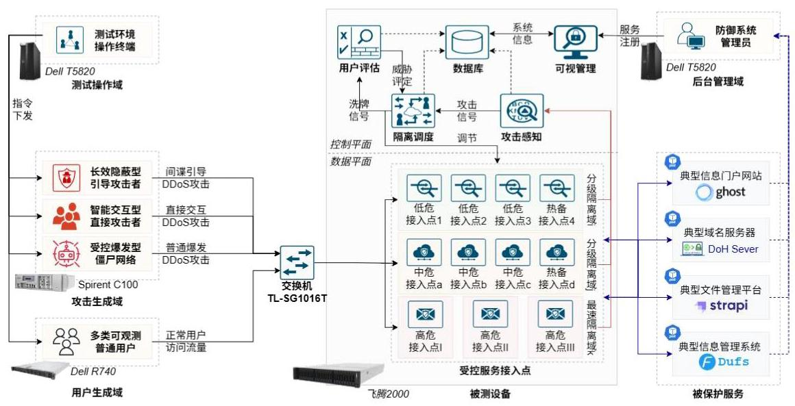
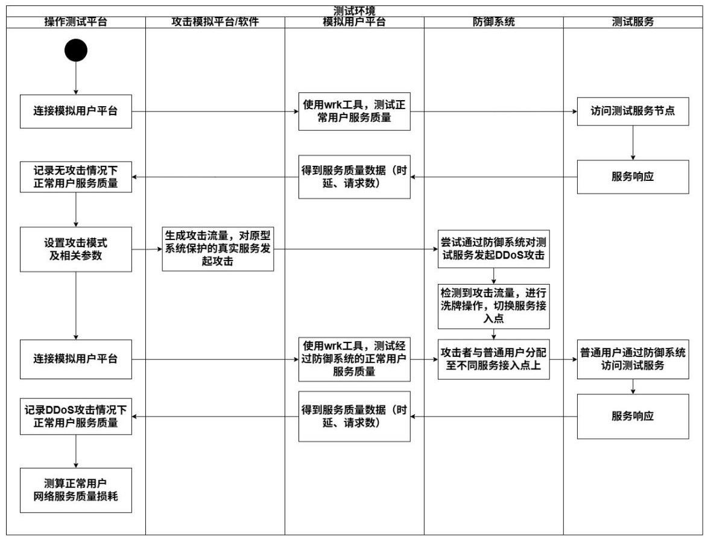
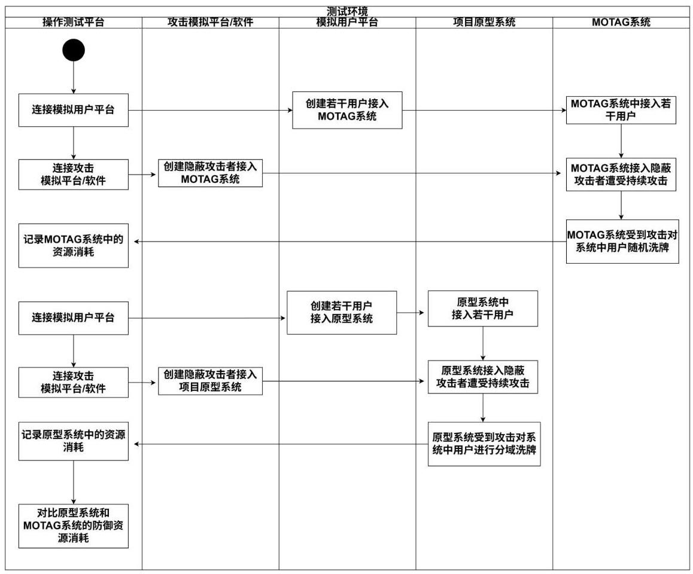

# 31511080202-JZX6Y202211010822 基础服务 DDoS 自适应主动防御技术 验收测试大纲

编 写___周 赞

校 对___杨树杰___

审 核___ 许长桥

批 准___

北京邮电大学/中国泰尔实验室

2025 年 4 月

## 目 录

1 范围和目的 3

2 测试依据 3

2.1 研究内容 3

2.2 关键技术 5

2.3 技术指标 6

2.4 成果形式 7

3 测试环境 8

3.1 总体介绍 8

3.2 原型系统 10

3.3 攻击设置 12

3.4 防御对象 15

3.5 计量工具 19

3.6 测试环境支撑工具 20

3.7 对比对象 21

4 测试项说明 24

5 测试用例描述 46

TC-YJ-01-01 DDoS 主动防御系统架构验证测试 .46

TC-YJ-02-01 系统攻击感知能力验证 .48

TC-YJ-02-02 系统代理间感知与防御能力验证 .50

TC-YJ-03-01 用户分域的主动响应隔离技术功能验证测试 52

TC-YJ-04-01 行为评分的用户封禁技术功能验证测试 54

TC-YJ-05-01 主动防御实物原型系统验证测试 .56

TC-KT-01-01 主动低耗的防御系统架构功能验证测试 58

TC-KT-02-01 基于 LSTM 的攻击感知技术验证 .60

TC-KT-03-01 智能洗牌的主动响应隔离技术功能验证测试 62

TC-KT-04-01 多部图评估的用户封禁机制功能验证测试 65

TC-ZB-01-01 信息门户网站 DDoS 主动防御能力验证 68

TC-ZB-01-02 域名服务器服务保障能力测试 70

TC-ZB-01-03 信息管理平台 DDoS 主动防御能力验证 72

TC-ZB-01-04 文件管理系统服务保障能力测试 74

TC-ZB-02-01 10w 级 DDoS 攻击流量抑制测试 76

TC-ZB-03-01 攻击阻断能力效果测试 79

TC-ZB-03-02 原型系统封禁能力测试 81

TC-ZB-04-01 资源消耗型 DDoS 攻击下正常用户网络服务质量损耗比测试 83

TC-ZB-04-02 原型系统低成本部署测试 86

TC-ZB-05-01 主动响应周期动态调节测试 89

TC-ZB-06-01 Challenge Collapsar 资源消耗型 DDoS 抵御测试 .91

TC-ZB-06-02 HTTP POST FLOOD 资源消耗型 DDoS 抵御测试 94

TC-ZB-06-03 HTTP GET FLOOD 资源消耗型 DDoS 抵御测试 97

TC-ZB-06-04 HTTP 非对称攻击资源消耗型 DDoS 抵御测试 100

TC-ZB-06-05 HTTP 重复单次攻击资源消耗型 DDoS 抵御测试 103

TC-ZB-06-06 SYN FLOOD 资源消耗型 DDoS 抵御测试 106

TC-ZB-06-07 TCP PUSH+ACK FLOOD 资源消耗型 DDoS 抵御测试.109

TC-ZB-06-08 Slowloris 资源消耗型 DDoS 抵御测试 112

TC-ZB-06-09 HTTP Download FLOOD 资源消耗型 DDoS 抵御测试

TC-ZB-06-10 HTTP Killer FLOOD 资源消耗型 DDoS 抵御测试 118

TC-ZB-07-01 反向代理服务器动态 IP 切换功能测试 .121

TC-ZB-08-01 系统 IP 过滤环能力验证 .123

6 研究内容、关键技术和技术指标与测试用例对照表 125

## 1 范围和目的

本测试大纲用于指导测试基础服务 DDoS 自适应主动防御技术原型系统是否覆盖“十四五”装备预先研究项目“基础服务 DDoS 自适应主动防御技术预研合同” 相关要求, 是对本次测试任务进行测试需求分析、测试策划和测试设计后编写的文档，分别明确了本次测试的测试依据、测试环境、测试项说明、测试用例描述等内容, 规定了课题成果功能和性能的验收测试要求、验收测试方法以及合格判据。

本测试大纲的编写目的主要为“基础服务 DDoS 自适应主动防御技术” (项目编号:31511080202)生成测试报告提供依据，同时为验收测试阶段的管理工作和技术工作提供指导。

## 2 测试依据

测试依据的标准如下:

《基础服务 DDoS 自适应主动防御技术全周期合同》

### 2.1 研究内容

2.1.1 DDoS 主动防御系统架构

从主动防御调度机制和防御资源动态管控技术两方面开展研究，实现对基础服务设施的自适应动态有效防护。主要包含以下 3 点创新功能:(1)在抵御多维资源消耗型 DDoS 攻击的同时, 将发动或引导资源消耗型 DDoS 的用户与正常的用户隔离，确保用户的服务质量受影响最小化；(2)对发动资源消耗型 DDoS 的用户直接封禁，对于引导僵尸网络发动资源消耗型 DDoS 的用户，在洗牌过程中管理用户的可信评分，从而实现对引导资源消耗型 DDoS 用户的高效准确封禁； (3)感知网络安全态势，自适应调整主动响应周期，对代理服务器上放置的网络资源弹性分配，从而降低防御开销，提升在面对资源消耗型 DDoS 时的抵御能力。

2.1.2 多维度 DDoS 攻击感知技术

开展基于谱残差的特征提取模型与基于 LSTM 的主动检测机制研究, 实现对资源消耗型 DDoS 的精确感知。首先，通过收集用户请求流量，提取无状态和有状态特征, 并在代理服务器内部对资源消耗情况进行实时监控, 提取多维资源特性 (CPU 使用率、内存、带宽等), 通过谱残差计算处理, 变换得到显著性特征。进一步地, 采用长短期记忆深度神经网络 (LSTM) 检测攻击波动特征, 同时融入注意力机制及时准确地判知资源消耗型 DDoS 攻击，为响应隔离与用户封禁提供认知基础。

2.1.3 用户分域的主动响应隔离技术

从基于模糊系统的自适应分级策略和长效收益的渐进式最速隔离算法两部分开展研究, 减少发动或引导资源消耗型 DDoS 的用户与正常用户连接同一反向代理服务器时对正常用户网络性能的负面影响。首先, 通过自适应分级策略对不同安全等级的用户进行智能分级, 并进行主动隔离分域, 实现不同的用户域具有不同的代理节点, 保证不同安全等级用户间完全隔离。其次, 以安全域为洗牌单位对用户-代理节点映射关系进行基于历史收益状态的洗牌, 在渐进访问过程中生成新的映射关系，提高洗牌效率，降低洗牌频率，实现筛选速率最大化。

2.1.4 行为评分的用户封禁技术

开展主成分主动萃取的属性刻画与多部图评估的用户行为评分研究, 从而有效封禁引导僵尸网络发动资源消耗型 DDoS 的用户。首先, 收集用户高维网络参量, 采用主成分分析重构海量数据, 萃取挖掘关键网络参量, 为用户可信评估提供基础; 其次, 构建多部图模型, 对用户进行可信评估度量, 通过得到的评估结果实现从用户群体中区分发动或引导资源消耗型 DDoS 用户，同时保证识别精度高、普通用户误判比率低的显著性效果。

2.1.5 主动防御实物原型系统设计实现与验证

结合上述 4 项关键技术, 进一步研制主动防御实物原型系统, 达到规模化、 完备化、实物化部署。在真实网络环境下面对资源消耗型 DDoS 进行实际测试, 并根据实验室级别及用户级别的实验结果进行反馈调优, 为实现基础服务 DDoS 自适应主动防御技术的实际部署奠定基础。

### 2.2 关键技术

2.2.1 主动低耗的防御系统架构设计

研究一种基于反向代理洗牌的主动防御系统，针对直接发起的资源消耗型 DDoS 攻击实现主动发现与封禁，针对引导资源消耗型 DDoS 攻击的用户进行洗牌与评分实现封禁。将强化学习与主动响应机制相结合, 根据网络安全态势动态调整主动响应周期, 从而减少无效的主动响应。应用控制论进行反向代理服务器资源动态分配，调整单个反向代理节点的资源配额来实现动态伸缩效果，从而有效保障防御系统持久化、稳定化运行。

2.2.2 基于 LSTM 的攻击感知技术

研究一种基于 LSTM 的攻击感知技术，通过实时监控代理服务器内部的资源消耗情况，收集对应特征(CPU 使用率、内存、带宽等)；同时汇聚挖掘反向代理服务器的入口流量，提取无状态特征和有状态特征。并通过谱残差计算处理矢量特征，从而变换获取更具显著性的泛在判断依据。考虑到资源消耗型 DDoS 的攻击波动存在逐渐上升与保持峰值两个阶段，拟采用长短期记忆神经网络 (LSTM) 实现正常服务性能与资源消耗型 DDoS 攻击行为的区分, 从具有时间序列的网络数据中实现攻击行为挖掘，最终在攻击各阶段有效识别资源消耗型 DDoS，为后续技术提供认知基础。

2.2.3 智能洗牌的主动响应隔离技术

研究一种智能洗牌的主动响应隔离技术，以最大化防御者可能获得的收益和最小化防御者付出的洗牌开销作为联合优化目标, 考虑历史安全收益, 将用户与反向代理服务器连接关系的重分配过程建模成最优化问题, 通过启发式算法求解, 解决大规模最优化计算问题, 最终实现近似最优的洗牌策略, 提高防御系统对发动或引导资源消耗型 DDoS 用户的筛选速率, 从而快速将发动或引导资源消耗型 DDoS 的用户聚集至局部反向代理服务器上，减少资源消耗型 DDoS 对正常用户网络性能的负面影响。

2.2.4 多部图评估的用户封禁机制

研究一种多部图评估的用户封禁机制, 首先记录不同用户访问反向代理服务器时单次连接的静态特征、内容特征以及基于时间窗口的资源波动特征等多维度信息。随后根据收集信息通过主成分分析法重构关键网络参量，以此作为数据支撑构建多部图评估模型。并进一步计算用户行为的总偏离度, 分析并实时维护用户可信值。该过程结合主动响应机制，最终显著区分发动或引导资源消耗型 DDoS 的用户与正常用户，从而实现精准封禁，阻断资源消耗型 DDoS 的持续攻击。

### 2.3 技术指标

(1)可为信息门户网站、域名服务器、信息管理平台等 3 种基础服务提供 DDoS 主动防御；

(2)具备对十万级并发连接、十万级 QPS(每秒查询次数) DDoS 攻击的抑制能力;

(3)具备攻击阻断能力，DDoS 攻击持续时间相对现有 MOTAG 方案降低 60%以上；具备封禁能力，系统运行 1 小时内对发动或引导资源消耗型 DDoS 的用户封禁比例达到 90%以上;

(4)在服务资源消耗型 DDoS 攻击下，正常用户网络服务质量(如时延)损耗占比小于等于 30%；实现防御的低成本部署，与最具代表性的 MOTAG 方案相比，资源消耗降低 30%；

(5)具备灵敏的主动防御能力，防御系统最高主动响应周期(重分配用户与代理连接关系的周期)小于 $5\mathrm{s}$ ，最低主动响应周期小于 ${15}\mathrm{s}$ ，设置至少 3 种主动响应周期;

(6) 能抵御 Challenge Collapsar、HTTP Post Flood、HTTP Get Flood、HTTP 非对称攻击、HTTP 重复单次攻击、SYN Flood、TCP PUSH+ACK 攻击等 10 种资源消耗型 DDoS;

(7)反向代理服务器具有动态 IP 地址切换的功能；

(8) 提供基础服务的服务器具有 IP 过滤环, 拒绝非法 IP 的访问;

(9)技术成熟度达到 5 级。

### 2.4 成果形式

#### 2.4.1 技术文件类

(1)《基础服务 DDoS 自适应主动防御技术总结报告》；

(2)《基础服务 DDoS 自适应主动防御系统架构研究报告》；

(3)《基础服务 DDoS 自适应主动防御攻击感知技术研究报告》；

(4)《基础服务 DDoS 自适应主动防御主动响应隔离技术研究报告》；

(5)《基础服务 DDoS 自适应主动防御用户封禁技术研究报告》；

(6)《基础服务 DDoS 自适应主动防御系统的性能测试报告》；

(7)《基础服务 DDoS 自适应主动防御系统第三方测试报告》；

(8)发表学术论文 9-15 篇，申请国家发明专利 3-4 项。

#### 2.4.2 实物成果类

基础服务 DDoS 自适应主动防御实物原型系统一套, 主要包括:

- 基础服务 DDoS 自适应主动防御原型系统的功能软件代码

- 用于搭载基础服务 DDoS 自适应主动防御原型系统的环境代码

- 用于支撑基础服务 DDoS 自适应主动防御原型系统的服务器 4 台在主流门户网站或域名服务等基础服务典型模拟环境下开展应用验证。

## 3 测试环境

### 3.1 总体介绍

#### 3.1.1 硬件测试环境总览

图 3-1 硬件测试环境示意图

硬件配置环境的详细说明如表3-1所示。

表 3-1 测试环境说明

<table><tr><td>序号</td><td>硬件项名称</td><td>硬件配置</td><td>数量</td><td>备注</td></tr><tr><td>1</td><td>国产化主动防御系统原型样机</td><td>架构: aarch64   CPU: FT-2000+ 64 核 64 线程内存:32GB*4   硬盘容量:3 * 1.92T SSD 硬盘网络:一张双网口 25G 网卡，一张电口千兆网卡</td><td>1</td><td>运行基础服务 DDoS 自适应主动防御实物原型系统，以及运行被保护的真实服务。</td></tr><tr><td>2</td><td>攻击模拟服务器: Spirent C100</td><td>SPT-C100-4X10G/16X1G-GT</td><td>1</td><td>用于模拟攻击流量, 对 DDoS 自适应系统与测试服务发起攻击</td></tr><tr><td>3</td><td>交换机: TL-SG1016T</td><td>10/100/1000BASE-T 端口</td><td>1</td><td>连接高性能服务器、攻击模拟器以及测试操作平台</td></tr><tr><td>4</td><td>用户服务测试平台:戴尔 PowerEdge 12G R420</td><td>架构: x86_64   CPU: Intel(R) Xeon(R) CPU   E5-2403 v2 8 核 8 线程   内存:8GB*8   硬盘容量:1 * 1.92T SSD + 256G SSD 硬盘</td><td>1</td><td>用 wrk 性能测试工具，基于真实环境数据模拟广域网网络环境(时延 30ms)，通过访问测试服务，评估正常用户网络服务质量。</td></tr><tr><td>5</td><td>测试操作平台: 戴尔 Precision 5820</td><td>架构: x86_64   CPU: 英特尔 i7-7820X 8 内核 16 线程   内存:16GB*4   硬盘容量:512G 固态硬盘   网络:集成四口千兆</td><td>1</td><td>用于测试者控制攻击模拟器 C100, 配置各项攻击参数, 发起针对防御系统的攻击模拟。同时控制高性能服务器与模拟用户服务器，管理测试环境。</td></tr></table>

3.1.2 软件测试环境

测试环境中使用的软件详细说明如表3-2所示。

表 3-2 软件项一览表

<table><tr><td>序号</td><td>软件名称及版本</td><td>备注</td></tr></table>

<table><tr><td>1</td><td>Kubernetes 1.30.1</td><td>部署在国产化主动防御系统原型样机:浪潮NF2180M3，用于支撑运行基础服务DDoS自适应主动防御实物原型系统，以及运行被保护的真实服务。</td></tr><tr><td>2</td><td>Dufs 0.41.0</td><td>部署在国产化主动防御系统原型样机，作为被保护的文件管理系统。</td></tr><tr><td>3</td><td>satishweb/doh-server v2.3.10</td><td>部署在国产化主动防御系统原型样机，作为被保护的域名服务器。</td></tr><tr><td>4</td><td>Ghost 5.118.1</td><td>部署在国产化主动防御系统原型样机，作为被保护的信息门户网站。</td></tr><tr><td>5</td><td>Strapi 5.12.6</td><td>部署在国产化主动防御系统原型样机，作为被保护的信息管理平台。</td></tr><tr><td>6</td><td>Visual Studio Code 1.99</td><td>部署在测试操作平台。用于查看系统数据库内的信息</td></tr><tr><td>7</td><td>Spirent TestCenter 4.98</td><td>部署在测试操作平台。用于测试者控制攻击模拟器C100，配置各项攻击参数, 发起针对防御系统的攻击模拟。</td></tr><tr><td>8</td><td>wrk debian/4.1.0-3+b2</td><td>部署在用户服务测试平台。用于服务性能测试</td></tr><tr><td>9</td><td>MHDDoS 2.4.2</td><td>部署在用户服务测试平台。用于生成多种类型DDoS攻击流量,</td></tr></table>

### 3.2 原型系统

3.2.1 硬件设备

(1)国产化主动防御系统原型样机机架版，具体配置:

- 架构:aarch64

- CPU: FT-2000+ 64 核 64 线程

- 内存:32GB*4

- 硬盘容量:3 * 1.92T SSD 硬盘

- 网络: 一张双网口 25G 网卡，一张电口千兆网卡

运行基础服务 DDoS 自适应主动防御实物原型系统，以及运行被保护的真实服务。本原型样机基于国产飞腾 FT-2000+ 64 核处理器和统信 UOS 操作系统构建, 搭建基础服务自适应 DDoS 原型系统。面向 DDoS 攻击场景设计轻量化自适应防御能力，通过动态流量分析、协议状态感知与策略联动，实现对 SYN FLOOD、 HTTP GET/POST FLOOD 等主流攻击以及间谍引导的新型 DDoS 攻击的实时检测与响应, 为核心业务服务提供国产化、低延迟、高可靠性的抗攻击防护验证样机。

(2)国产化主动防御系统原型样机便携版，具体配置:

- 架构:amd64

- CPU: 海光 3350 3.0G 8C

- 内存:16G DDR4 NVMe 2280

- 硬盘容量:512GB M.2

运行基础服务 DDoS 自适应主动防御实物原型系统，以及运行被保护的真实服务。本原型样机基于海光 3350 处理器和 Debian 操作系统构建, 搭建便携式基础服务自适应 DDoS 原型系统。面向 DDoS 攻击场景设计轻量化自适应防御能力, 基于全国产化信创系统, 为核心业务服务提供国产化、低延迟、高可靠性的可堆叠抗攻击防护验证样机。

3.2.2 软件工具

(1)服务运行工具:Kubernetes ，版本 1.30.1。用于支撑运行基础服务 DDoS 自适应主动防御实物原型系统。Kubernetes 作为云原生领域的核心容器编排系统， 凭借其自动化管理、高可用保障及灵活扩展能力，为国产化 DDoS 自适应防御原型系统提供了坚实的技术底座。其智能调度机制通过动态分配 CPU/内存资源， 结合节点亲和性策略与拓扑分布优化，显著提升海量攻击流量的处理效率；同时， 健康检查与水平扩缩容 (HPA) 功能可实时监测防御组件的 QPS、连接数等指标， 在遭遇 SYN Flood 或 HTTP GET Flood 攻击时, 自动触发防御副本的弹性扩容(如, 确保防护链路在高压场景下持续生效。在国产化适配层面, Kubernetes 原生支持 ARM64 架构，与飞腾处理器及统信 UOS 深度协同，通过内核参数调优与资源隔离技术，进一步释放国产硬件的多核并行计算潜力，为 DDoS 防御系统构建了从容器编排、资源调度到安全管控的全栈可信运行环境。

### 3.3 攻击设置

3.3.1 硬件设备

(1)攻击模拟服务器:Spirent C100，具体配置 SPT-C100-4X10G/16X1G-GT。 用于模拟攻击流量, 对 DDoS 主动防御原型系统与测试服务发起攻击。Spirent C100 专业级 DDoS 攻防测试系统具备多维攻击流量生成能力, 可精准模拟 SYN FLOOD、HTTP GET/POST FLOOD 等网络层与应用层混合攻击，支持 IPv4/IPv6 双栈环境下 TCP/UDP、HTTP/HTTPS(含 SSL/TLS 加密)、DNS、SIP 等全协议栈流量仿真。该系统通过高密度端口配置实现 300 万 QPS 超高并发攻击压力， 既能生成 10 万级 QPS 的海量数据流量验证原型系统极限抗压能力，又可构建包含动态源 IP 伪装、协议字段变异等复杂特征的智能攻击流量, 全面检测防御系统在应对大规模 DDoS 攻击时的业务连续性保障能力, 为金融、云计算等行业的网络安全架构提供多维度、全协议覆盖的攻防验证解决方案。

3.3.2 软件工具

(1)攻击模拟程序:MHDDoS， 版本 2.4.2。用于生成多种类型 DDoS 攻击流量，对 DDoS 主动防御原型系统与测试服务发起攻击。MHDDoS 是一款基于 Python3 的 DDoS 攻击脚本，支持多种攻击方法能够模拟第四/七层多达 56 种不同的 DDoS 攻击。包括流量洪水(如 UDP Flood、ICMP Flood)应用层攻击 (如 HTTP GET/POST Flood) 协议层攻击 (如 SYN Flood、ACK Flood) 反射/ 放大攻击 (如 DNS/NTP 放大) 可以有效覆盖本项目测试需求。

3.3.3 差异性分析与有效性说明

十种资源消耗型 DDoS 攻击测试场景的差异性核心体现在攻击作用层面、资源消耗模式及攻击触发机制 三个维度。从作用层面看, HTTP GET Flood 与 TCP PUSH+ACK Flood 分别代表应用层与传输层攻击形态:前者通过高频 HTTP 请求直接冲击 Web 服务器解析能力, 后者利用 TCP 协议字段畸形组合 (PUSH+ACK 标志位)迫使服务器维持无效连接状态；而 Slowloris 与 HTTPS DDoS 则聚焦应用层慢速攻击与加密资源消耗，前者通过延迟发送 HTTP 头部耗尽连接池，后者依赖海量 TLS 握手过程榨取 CPU 计算资源。这种分层特性导致不同测试场景对系统资源的掠夺路径存在本质区别。

在资源消耗模式上, HTTP POST Flood 与 download DDoS 形成存储子系统与网络带宽的双重压力:前者通过大体积请求体占用数据库写入队列，后者依赖持续的大文件下载耗尽出口带宽与磁盘 I/O; 相比之下，killer DDoS 作为混合攻击模式，同时消耗带宽、连接表、CPU 与内存资源，其多维资源耗尽可能暴露防御系统的协同阻断盲区。而 HTTP 非对称攻击与单次重复攻击 则以低代价请求引发高代价响应，前者通过请求/响应比失衡放大资源损耗(如小请求触发大数据导出)，后者模拟合法高频行为(如 API 轮询)挑战动态封禁阈值设定。 这种差异性使测试需覆盖从网络层到应用层的全栈资源监控需求。

攻击触发机制的分化进一步凸显测试场景的差异化设计逻辑。TCP SYN Flood 作为经典洪泛攻击, 依赖伪造源 IP 制造半连接风暴, 其攻击效率取决于网络层协议栈实现缺陷；Slowloris 则通过精确控制请求发送节奏维持长连接， 对应用层线程池调度机制提出针对性挑战; 而 Challenge Collapsar 型攻击利用 HTTPS 泛洪验证 DNS 服务在加密场景下的服务能力边界。

Spirent C100 专业级 DDoS 攻防测试系统具备多维攻击流量生成能力, 可精准模拟 SYN FLOOD、HTTP GET/POST FLOOD 等网络层与应用层混合攻击，支持 IPv4/IPv6 双栈环境下 TCP/UDP、HTTP/HTTPS(含 SSL/TLS 加密)、DNS、 SIP 等全协议栈流量仿真。该系统通过高密度端口配置实现 300 万 QPS 超高并发攻击压力，既能生成 10 万级 QPS 的海量数据流量验证原型系统极限抗压能力， 又可构建包含动态源 IP 伪装、协议字段变异等复杂特征的智能攻击流量, 全面检测防御系统在应对大规模 DDoS 攻击时的业务连续性保障能力, 为金融、云计算等行业的网络安全架构提供多维度、全协议覆盖的攻防验证解决方案。

MHDDoS 是一款基于 Python3 的 DDoS 攻击脚本, 支持多种攻击方法能够模拟第四/七层多达 56 种不同的 DDoS 攻击。包括流量洪水(如 UDP Flood、ICMP Flood)应用层攻击(如 HTTP GET/POST Flood)协议层攻击(如 SYN Flood、 ACK Flood)反射/放大攻击 (如 DNS/NTP 放大)可以有效覆盖本项目测试需求。

十种资源消耗型 DDoS 攻击测试场景的设计有效性, 核心在于其通过差异化攻击模式对防御系统形成多维压力场, 从而系统性暴露防御体系在协议栈覆盖、 资源保护粒度、响应灵敏度及业务适配性上的潜在脆弱性。这些攻击设置的有效性体现在以下层面:

攻击设置紧密贴合真实威胁场景，通过模拟高频简单攻击与隐蔽复杂攻击， 全面检验防御系统的基础流量清洗能力与深层威胁识别能力。例如, GET Flood 能验证 CDN 或清洗设备的带宽吞吐阈值, 而 Challenge Collapsar 型攻击通过加密握手洪泛榨取 CPU 资源的设计，则能揭示 SSL/TLS 协处理器的性能边界与防御系统在加密流量解析环节的盲区。这种真实性模拟确保测试结果能够直接反映防御体系对实际威胁的应对能力，而非局限于实验室环境下的理想状态。

攻击设置通过多维度资源掠夺路径，验证防御系统对关键资源的保护完整性。 例如, HTTP POST Flood 通过大体积请求体冲击数据库写入队列, download DDoS 依赖持续大文件下载耗尽出口带宽与磁盘 I/O，两者形成存储子系统与网络带宽的双重压力; 而 killer DDoS 作为混合攻击形态, 则通过同时耗尽带宽、连接表、 CPU 与内存资源，暴露网络层清洗设备与应用层 WAF 之间的协同阻断漏洞。这种差异化资源消耗路径的覆盖，确保防御体系不仅关注单一维度的资源保护，还需建立全链路资源监控机制。

攻击设置通过时间维度与协议深度的双重变量设计，测试防御系统对低频高持续性威胁的感知灵敏度。例如, Slowloris 通过精确控制请求发送节奏维持长连接, HTTPS DDoS 依赖高频 TLS 握手过程榨取 CPU 资源, 两者均要求防御策略从短周期流量统计转向动态资源消耗比分析。此外, TCP PUSH+ACK Flood 通过畸形标志位组合迫使服务器进入异常处理流程，验证协议栈实现的安全性；而单次重复攻击模拟合法高频行为，挑战误封禁阈值的动态调整能力。这种触发机制的复杂性设计，迫使防御系统突破传统流量基线依赖，转向基于行为逻辑的深度解析。

攻击设置通过差异化组合形成威胁模拟矩阵，推动防御体系从被动拦截向主动弹性防护升级。例如, 仅依赖流量清洗设备可能无法应对 Slowloris 的慢速攻击，仅部署应用层 WAF 可能遗漏 TCP 协议层畸形报文检测，而忽视混合攻击场景可能导致多层防护协同失效。这种闭环验证链条(如从网络层 SYN Flood、传输层 TCP PUSH+ACK 到应用层 Slowloris 的递进式穿透) 不仅暴露防御短板, 还驱动防御机制从单一维度限流向多维资源管理演进。最终, 攻击测试的有效性集中体现为能否通过差异化攻击组合构建动态压力场, 将防御策略从 “被动拦截” 升级为“主动弹性防护”，实现从流量清洗到业务逻辑保护的全栈防护闭环。

综上, 十种攻击设置的有效性本质是通过差异化设计形成动态压力场, 系统性暴露防御体系在协议层覆盖、资源保护粒度、响应灵敏度及业务适配性上的不足。推动防御机制从孤立设备防护向协同弹性架构演进，最终实现对复杂威胁场景的全面覆盖。

### 3.4 防御对象

3.4.1 硬件设备

(1)国产化主动防御系统原型样机，具体配置:

- 架构:aarch64

- CPU: FT-2000+ 64 核 64 线程

- 内存:32GB*4

- 硬盘容量:3 * 1.92T SSD 硬盘

- 网络: 一张双网口 25G 网卡，一张电口千兆网卡

运行基础服务 DDoS 自适应主动防御实物原型系统，以及运行被保护的真实服务。本原型样机基于国产飞腾 FT-2000+ 64 核处理器和统信 UOS 操作系统构建, 搭建基础服务自适应 DDoS 原型系统。面向 DDoS 攻击场景设计轻量化自适应防御能力，通过动态流量分析、协议状态感知与策略联动，实现对 SYN FLOOD、 HTTP GET/POST FLOOD 等主流攻击以及间谍引导的新型 DDoS 攻击的实时检测与响应, 为核心业务服务提供国产化、低延迟、高可靠性的抗攻击防护验证样机。

3.4.2 软件服务

(1)信息门户网站:Ghost，版本:5.118.1。Ghost 自发布以来，已服务超过 300 万网站，用户涵盖个人博客、企业官网、新闻媒体及教育机构。全球排名前 10 万的网站中, Ghost 占比稳步提升泛用性强。基于 Node.js 与 Docker 部署, 默认支持 MySQL/PostgreSQL/SQLite，覆盖主流关系型数据库测试需求，可为多种场景提供定制:如企业新闻中心，教育机构门户，政府机构平台等。由于 Ghost 使用领域和场景广泛, 其测试结果能够为其他信息门户网站提供高参考价值的基准数据

(2)域名服务器:DoH，版本 2.3.10。satishweb/doh-server 在 docker hub 上拥有超过五百万的下载量, 为所有同类 doh 服务镜像中最高。自发布以来 satishweb/doh-server 持续保持着更新和优化, 拥有较好的维护频率, 保证的服务的稳定性。该镜像支持多种架构，包括 linux/amd64，linux/arm64，linux/arm/v7 等等, 这意味着其可在从树莓派到企业级服务器的各种设备上运行, 提供了极大的灵活性。其测试结果能够为其他域名服务器系统提供高参考价值的基准数据。

(3)信息管理平台:Strapi，版本 5.12.6。Strapi 是 GitHub 上最受欢迎的内容管理系统之一, Star 数超过 57k，下载量超百万次，被全球数万家企业采用。用户涵盖初创公司、中型企业到大型组织，证明其在不同规模团队中的可靠性。泛用性高, 多场景适配, 包括企业内容发布系统, 电商平台如管理产品目录、 用户评价、订单数据，内部信息管理如员工手册、知识库、CRM 系统等，测试该系统即可覆盖大部分场景下的内容管理系统。

(4)文件管理系统:Dufs，版本0.41.0。Dufs是一款一个开源，简洁的文件服务器，支持权限控制，web界面上传，检索文件。Dufs使用领域和场景广泛， 其测试结果能够为其他文件管理系统提供高参考价值的基准数据。

3.4.3 差异性分析与有效性说明

本实验选取 Ghost、DoH 服务器、Strapi 和 Dufs 四类具代表性的系统作为 DDoS 攻击防御测试对象，核心在于构建覆盖内容发布、协议解析、动态交互与文件传输等关键场景的测试矩阵，以验证不同类型业务系统在遭受 DDoS 攻击时的防护效果。这些系统所模拟的服务不仅广泛应用于民用互联网领域，如门户网站、电商平台、DNS 解析和文件服务等，同时也具备明确的军民两用背景与现实需求。一方面，军队内部的作战指挥、信息通告、战场数据调度等系统对高可用、高安全性的信息服务平台高度依赖; 另一方面, 军事单位在民用互联网上也广泛建设门户网站、政策公告平台与服务接入系统，例如国防部官网、军队文职招录平台、军转安置服务系统等均对内容管理、域名解析与数据传输系统提出实际需求。

这些系统虽采用开源或简化架构实现，但在功能结构、通信协议和资源消耗路径上高度拟真现实部署场景。因此, 对其抗 DDoS 能力的评估不仅具有民用网络防护价值，也为包括军事单位在公网部署的涉军信息系统在内的高风险目标提供可靠的安全策略验证基础。通过实验模拟可帮助完善“战时-平时一体化”网络空间防御体系，为防护关键军政系统抵御网络攻击提供支撑。

在分析其差异性时, 我们聚焦于每个系统与真实同类系统在架构、规模和防护机制方面的差异，从而评估测试结果的参考可信度与推广价值:

Ghost 作为开源信息门户系统，广泛用于博客、资讯网站等场景。与大型商业门户如 WordPress 或企业定制 CMS 系统相比，其主要差异在于功能深度与部署复杂度。Ghost 缺乏较为复杂的插件生态与流量负载分层架构 (如缓存反向代理、 多级 CDN)，但其基于 Node. js 和 Docker 的技术栈，以及对主流数据库的支持， 使其在处理内容渲染与动态加载等方面具有典型代表性。测试中使用 Ghost 系统， 虽未完全复现大流量商业门户的结构，但其在承压能力与 HTTP Flood 响应上的表现，足以反映门户类系统在 DDoS 攻击下的核心脆弱点，因此具备较强的验证有效性。

实验部署的 DoH 服务系统基于轻量化容器实现, 遵循 IETF 标准的 DNS over HTTPS 协议, 模拟了当下 Cloudflare、Google DNS 等公共解析服务的核心通信逻辑。但与真实高可用 DNS 服务系统相比, 其差异主要体现在后端集群容错设计上。然而，由于 DoH 协议本身的敏感性(如 TLS 握手、加密查询、连接重用等) 已在实验环境完整模拟，因此在测试协议层攻击(如 UDP 反射、TLS 滥用)时， 能有效评估相关防御机制的鲁棒性，其测试有效性在协议语义及资源消耗层面具有高度可信度。

Strapi 作为头部开源 CMS 系统, 广泛用于电商、SaaS 平台等需要复杂数据交互的场景。相较于 Shopify、Salesforce 等商业平台, Strapi 的差异在于部署规模、后台安全策略以及用户行为管理体系。但在 API 结构设计、GraphQL 查询引擎和高频数据写入支持等方面，其与真实系统高度相似。测试中利用 Strapi 构建复杂数据交互场景，能够精准模拟 RESTful API 泛洪、嵌套查询滥用和数据库锁等待问题, 因此能充分验证防御策略在数据型业务中的表现, 其测试结果对实际部署具有很强的参考价值。

Dufs 是一款轻量级 Web 文件服务器，其架构简洁，权限控制机制明确，适合模拟中小企业或局域网内的文件传输服务。尽管与企业级文件系统(如 Nextcloud、企业 FTP 或分布式对象存储)在数据冗余、并发控制和安全隔离方面存在明显差异，但 Dufs 在文件上传、目录浏览、并发连接等方面保留了关键资源消耗路径。测试中围绕带宽耗尽、大文件处理与元数据爆炸展开攻击模拟, 能有效触达实际文件服务系统的关键性能瓶颈，因此具备验证文件类系统 DDoS 防御策略的实际价值。

整体来看，Ghost、DoH、Strapi 与 Dufs 四个测试系统虽在功能覆盖与部署规模上略有不同于企业级实际系统，但其核心业务逻辑、通信协议特性与资源消耗路径均高度拟真。这种总分结构的模拟设计，形成了从门户内容展示、协议解析、中间层数据交互到底层文件传输的完整测试矩阵。通过上述差异性分析可见， 实验所用系统基本具备代表性, 其防御测试结果能在保证现实可控的同时, 有效外推至实际部署环境, 为 DDoS 防御策略的实效性验证提供坚实支撑。

### 3.5 计量工具

3.5.1 硬件设备

用户服务测试平台:戴尔 PowerEdge 12G R420 具体配置:

- 架构: x86_64

- CPU: Intel(R) Xeon(R) CPU E5-2403 v2 8 核 8 线程

- 内存:8GB*8

- 硬盘容量:1 * 1.92T SSD + 256G SSD 硬盘

(1)戴尔 PowerEdge 12G R420 服务器作为用户服务测试平台，基于 x86_64 架构设计，搭载 Intel Xeon E5-2403 v2 八核八线程处理器(主频 1.8GHz)，配备 64GB 内存(8×8GB DDR3)及混合存储方案(1.92TB SSD+256GB SSD)，为网络性能测试提供了稳定可靠的硬件基础。该设备通过部署 wrk 性能测试工具， 可精准模拟广域网场景下的 ${30}\mathrm{\;{ms}}$ 网络时延，对目标服务进行高并发压力测试， 从而评估防御系统在保障正常用户服务质量(QoS)方面的效能。其企业级硬件设计支持 7 × 24 小时持续运行，在搭载 wrk 工具后能够生成大规模 HTTP/HTTPS 请求流，复现真实用户访问模式(如突发流量、分布式请求)，并通过内置 SSD 存储的低延迟特性保障测试数据的快速读写与日志记录，为 DDoS 防御原型系统的性能基线校准、策略优化及业务连续性验证提供关键支撑。

3.5.2 软件工具

(1)性能测试工具 wrk，版本: debian/4.1.0-3+b2。Wrk 是一款现代化的高性能 HTTP 基准测试工具, 专为高并发、低延迟的性能测试场景设计。基于多线程模型和异步非阻塞 I/O，充分利用多核 CPU 性能，单机可模拟数万并发连接。核心代码用 C 语言编写, 内存占用极低, 适合长时间压力测试。提供吞吐量 (Requests/sec) 、延迟分布 (Latency Percentiles) 、错误率等关键指标。通过简单命令即可启动测试。用于被保护服务的性能测试。

3.5.3 差异性分析与有效性说明

本测试采用 wrk 工具作为核心服务质量统计手段。wrk 是一款高性能 HTTP 基准测试工具, 支持多线程压力生成与 Lua 脚本扩展, 能够精准模拟真实业务场景下的请求模式。wrk 输出的延迟分布(平均延迟、标准差、最大延迟)、吞吐量(请求/秒)及错误率(超时/服务不可达)等指标，能够直接反映防御系统在攻击下的服务质量波动。wrk 工具通过高并发压测、协议层细粒度统计与可编程请求模式设计，有效支撑了服务质量计量在 DDoS 防御测试中的关键作用。其输出的延迟、吞吐量与错误率指标能够直接关联防御策略的有效性验证, 既满足了单一场景的深度分析需求, 也适用于跨类型的横向服务质量对比, 为受保护服务的服务质量提供了可量化的计量结果。

### 3.6 测试环境支撑工具

3.6.1 硬件设备

(1)测试操作平台:戴尔 Precision 5820，具体配置:

- 架构: x86_64

- CPU: 英特尔 i7-7820X 8 内核 16 线程

- 内存:16GB*4

- 硬盘容量:512G 固态硬盘

- 网络:集成四口千兆

戴尔 Precision 5820 测试操作平台基于 x86_64 架构设计，搭载英特尔 i7-7820X 八核十六线程处理器(主频 2.6GHz，睿频至 4.3GHz)，配备 64GB 内存(16GB×4)及512GB NVMe 固态硬盘，集成四口千兆网卡，是一款面向高性能计算与复杂网络测试场景的工作站级设备。该平台主要用于控制 Spirent C100 专业级 DDoS 攻防测试系统，通过其高并发处理能力配置 SYN Flood、HTTP Flood 等攻击参数, 并精准发起针对国产化防御原型系统的混合攻击模拟。作为测试环境的核心控制节点，该设备以稳定可靠的硬件性能与灵活的网络拓扑管理能力, 支撑从攻击生成、防御响应到业务服务质量评估的全流程自动化测试, 为国产化防御系统的抗压性、策略有效性及业务连续性验证提供关键操作平台。

(2)交换机:TL-SG1016T 具体配置:10/100/1000BASE-T端口

TL-SG1016T 是一款企业级非网管型千兆交换机, 提供 16 个自适应 RJ45 端口, 支持 10/100/1000Mbps 速率自动协商与全双工/半双工模式切换, 具备即插即用特性，无需复杂配置即可实现高性能网络连接。该设备通过高密度千兆端口设计，为国产化 DDoS 防御原型系统的测试环境提供了稳定可靠的网络通信基础， 保障高性能服务器、攻击模拟器 (Spirent C100) 及测试操作平台 (Dell Precision 5820)间的低延迟数据交互。

3.6.2 软件工具

(1)Visual Studio Code，版本 1.99。用于查看系统各项指标信息，提供终端运行窗口。Visual Studio Code 作为轻量级跨平台代码编辑器，在国产化 DDoS 防御测试环境中承担系统监控与终端操作的核心辅助工具角色。其通过集成实时指标可视化插件与多终端功能，为防御系统的资源分析、策略调试及测试任务执行提供高效交互界面。

(2)Spirent TestCenter, 版本 4.98。Spirent TestCenter 是 Spirent 公司推出的高性能网络测试软件, 专为复杂网络场景下的协议仿真、流量生成与性能验证设计。在国产化 DDoS 防御原型系统的测试流程中，该软件部署于测试操作平台 (Dell Precision 5820), 作为 Spirent C100 攻击模拟器的控制中枢, 提供图形化界面与脚本化配置能力, 支持从基础流量洪流到高级混合攻击的全流程模拟, 精准验证防御系统在应对 SYN Flood、HTTP Flood、DNS 反射等多维度攻击时的检测与响应效能, 用于测试者控制攻击模拟器 C100, 配置各项攻击参数, 发起针对防御系统的攻击模拟。

### 3.7 对比对象

3.7.1 硬件设备

浪潮 NF2183 服务器，具体配置如下:

- 架构: aarch64

- CPU: FT-2000+ 64 核 64 线程

- 内存:32GB*4

- 硬盘容量:3 * 1.92T SSD 硬盘

- 网络: 一张双网口 25G 网卡，一张电口千兆网卡

3.7.2 软件对象

MOTAG (Moving Target Defense Against Internet Denial of Service Attacks) 原由乔治梅森大学团队提出用以防范系统内部的 DoS 攻击，历经多个团队不断迭代补充，成为通过动态目标策略保护集中式在线服务免受 DDoS 攻击的一类典型架构。其核心思想是利用一层秘密的移动代理来调解客户端与受保护的应用服务器之间的所有通信，主要组件包括身份验证服务器、代理、过滤环和应用服务器。

3.7.3 差异性分析与有效性说明

MOTAG 通过隐匿应用服务器 IP 地址、定期更换代理节点、客户端认证以及随机洗牌用户-代理映射关系等多重防御方法, 有效混淆攻击者, 降低其成功攻击的可能性。在应对攻击时，MOTAG 采取代理替换、客户端重新分配和随机洗牌机制等措施, 确保通信的持续性和安全性。此外, MOTAG 还具有长期代理可重用性和保持代理稳定性等安全特性, 使得物理代理节点具备更高的可重用性, 并防止内部人员的恶意分析。

MOTAG 在移动目标防御(MTD)策略中具有很强的代表性，这不仅体现在其创新性的防御机制、动态性和适应性、全面的安全防护上，更在于其灵活性和可扩展性以及长期的安全考量。MOTAG 创新性地通过在应用服务器周围部署一层秘密的移动代理来实现对应用服务器的保护。这一策略在不触及网络架构核心的前提下, 实现了防御策略的灵活调整与优化。这种部署方式不仅极大地增强了 MOTAG 的灵活性，使其能够无缝融入并有效保护各种复杂的网络环境，同时也为移动目标防御领域开辟了新的应用路径，展现了其广阔的应用前景与深远的战略价值。

同时, MOTAG 的长期安全考量也为其在 MTD 策略中的代表性地位奠定了坚实基础。通过长期代理可重用性和保持代理稳定性等机制, MOTAG 确保了系统在长期运行中的安全性和稳定性, 有效抵御了潜在的安全威胁。这种对长期安全的持续关注使得 MOTAG 在 MTD 策略中更具前瞻性和可持续性。

## 4 测试项说明

本测试大纲依据《基础服务 DDoS 自适应主动防御技术全周期合同》合同的研究内容要求、关键技术要求、技术指标要求，研究相对应的测试项，确保覆盖合同涉及的所有研究内容、关键技术和技术指标。

表4-1 测试项设置表

<table><tr><td>序号</td><td>测试项</td><td>研究内容</td><td>关键技术</td><td>对应技术指标</td><td>测试方法</td><td>相关专利、报告和证明</td></tr><tr><td>TC-YJ -01-01</td><td>DDoS 主动防御系统架构验证测试</td><td>DDoS 主动防御系统架构</td><td>无</td><td>无</td><td>验证当反向代理达到最大并发连接限制时, 能够有效阻塞新请求直至已有请求完成处理, 同时确保未达限的代理服务不受影响正常运作; 验证在不中断现有服务的情况下，通过实时调节连接数阈值来优化防御效果, 整个过程需保证用户请求的服务连续性, 确保所有合法访问均能正常响应。</td><td>论文:A Hierarchical PoW-Powered Access Mechanism for Shuffling-Based Moving Target Defense System   Imperceptible Shuffle-Based Moving Target Defense for Budget-Friendly Web Service DDoS Protection   专利:基于移动目标防御系统工作量证明的用户接入方法及装置   报告:《基础服务 DDoS 自适应主动防御系统架构研究报告》</td></tr><tr><td>TC-YJ -02-01</td><td>系统攻击感知能力验证</td><td>多维度 DDoS 攻击感知技术</td><td>无</td><td>无</td><td>本测试利用 MHDDoS 工具产生攻击流量， 对原型系统发起攻击，观察系统的感知能力</td><td>专利:基于移动目标防御系统的分布式拒绝服务攻击侦测方法   报告:《基础服务 DDoS 自适应主动防御攻击感知技术研究报告》</td></tr></table>

<table><tr><td>序号</td><td>测试项</td><td>研究内容</td><td>关键技术</td><td>对应技术指标</td><td>测试方法</td><td>相关专利、报告和证明</td></tr><tr><td>TC-YJ -02-02</td><td>系统代理间感知与防御能力验证</td><td>多维度 DDoS 攻击感知技术</td><td>无</td><td>无</td><td>利用 MHDDoS 工具产生 DDoS 攻击流量， 对原型系统发起攻击，观察系统的感知能力和防御能力</td><td>论文: Unveiling the Power of Collaboration: Detect DDoS Attacks on Proxies through Moving Target Defense with Multi-Proxy Synergy   专利:基于移动目标防御系统的分布式拒绝服务攻击侦测方法   报告:《基础服务 DDoS 自适应主动防御攻击感知技术研究报告》</td></tr><tr><td>TC-YJ -03-01</td><td>用户分域的主动响应隔离技术功能验证测试</td><td>用户分域的主动响应隔离技术</td><td>无</td><td>无</td><td>模拟攻击对原型系统发起攻击，观察防御系统对用户分级分域的效果; 经过一段时间后观察快速洗牌域的建立情况与恶意用户封禁情况。</td><td>专利:基于多层级代理的洗牌方法及装置   论文:MARL-MOTAG: Multi-Agent Reinforcement Learning Based Moving Target Defense to thwart DDoS attacks   报告:《基础服务 DDoS 自适应主动防御主动响应隔离技术研究报告》</td></tr></table>

<table><tr><td>序号</td><td>测试项</td><td>研究内容</td><td>关键技术</td><td>对应技术指标</td><td>测试方法</td><td>相关专利、报告和证明</td></tr><tr><td>TC-YJ -04-01</td><td>行为评分的用户封禁技术功能验证测试</td><td>行为评分的用户封禁技术</td><td>无</td><td>无</td><td>创建间谍用户，并通过间谍用户引导针对防御系统的模拟攻击, 经过一段时间后, 观察系统内正常用户评分和间谍用户的封禁情况，以此验证行为评分的用户封禁技术</td><td>专利:一种基于移动目标防御系统中多代理策略的分布式拒绝服务攻击者识别方法   终端可信度确定方法、装置、服务设备和存储介质   论文: DDoS Attacker Detection in Multi-Agent Moving Target Defense Systems Based on Spatiotemporal Feature Fusion.   报告:《基础服务 DDoS 自适应主动防御用户封禁技术研究报告》</td></tr></table>

<table><tr><td>序号</td><td>测试项</td><td>研究内容</td><td>关键技术</td><td>对应技术指标</td><td>测试方法</td><td>相关专利、报告和证明</td></tr><tr><td>TC-YJ -05-01</td><td>主动防御实物原型系统验证测试</td><td>主动防御实物原型系统设计实现与验证</td><td>无</td><td>无</td><td>测试主动防御实物原型系统能否运行; 测试主动防御实物原型系统运行时, 被保护服务能否正常访问; 测试遭受 DDoS 攻击情况下， 被保护服务能否正常访问</td><td>论文: Towards Attack-Resistant Service Function Chain Migration: A Model-based Adaptive Proximal Policy Optimization Approach   A Mutation-Enabled Proactive Defense Against Service-Oriented Man-in-The-Middle Attack in Kubernetes   Game theoretic defense scheme for DDoS attacks based on finite rationality analysis   专利:基于移动目标防御系统工作量证明的用户接入方法及装置   报告:《基础服务 DDoS 自适应主动防御系统架构研究报告》</td></tr></table>

<table><tr><td>序号</td><td>测试项</td><td>研究内容</td><td>关键技术</td><td>对应技术指标</td><td>测试方法</td><td>相关专利、报告和证明</td></tr><tr><td>TC-KT -01-01</td><td>主动低耗的防御系统架构功能验证测试</td><td>无</td><td>主动低耗的防御系统架构设计</td><td>无</td><td>测试验证系统防御资源的动态可调节性, 系统在运行时可对反向代理这一防御资源进行动态调整, 用户请求服务进程不受影响。</td><td>论文:Towards Attack-Resistant Service Function Chain Migration: A Model-based Adaptive Proximal Policy Optimization Approach   A Mutation-Enabled Proactive Defense Against Service-Oriented Man-in-The-Middle Attack in Kubernetes   专利:特征选择方法、装置及设备   防御策略模型训练方法、防御策略确定方法和设备   报告:《基础服务 DDoS 自适应主动防御系统架构研究报告》</td></tr><tr><td>TC-KT -02-01</td><td>基 于 LSTM 的攻击感知技术验证</td><td>无</td><td>基于 LSTM 的攻击感知技术</td><td>无</td><td>利用 MHDDoS 工具产生攻击流量，对原型系统发起攻击，观察系统的感知能力</td><td>论文: Unveiling the Power of Collaboration: Detect DDoS Attacks on Proxies through Moving Target Defense with Multi-Proxy Synergy   专利:基于移动目标防御系统的分布式拒绝服务攻击侦测方法   报告:《基础服务 DDoS 自适应主动防御攻击感知技术研究报告》</td></tr></table>

<table><tr><td>序号</td><td>测试项</td><td>研究内容</td><td>关键技术</td><td>对应技术指标</td><td>测试方法</td><td>相关专利、报告和证明</td></tr><tr><td>TC-KT -03-01</td><td>智能洗牌的主动响应隔离技术功能验证测试</td><td>无</td><td>智能洗牌的主动响应隔离技术</td><td>无</td><td>模拟攻击对原型系统发起攻击，观察防御系统快速洗牌域的建立情况与恶意用户封禁情况，与 MOTAG 方法对比， 比较用户筛选速率与洗牌次数。</td><td>专利:一种移动目标防御系统中多层级代理的高效洗牌方法   论文: ClusterX: Adaptive Collaborative Scheduling of Layered User-Proxy Mapping to Enhance DDoS Defense in Distributed Clusters   Device-Cloud Collaborative DDoS Resistance for QoS-Sensitive Mobile Applications: A Seamlessly Shuffle-based Moving Target Defense Approach   报告:《基础服务 DDoS 自适应主动防御主动响应隔离技术研究报告》</td></tr><tr><td>TC-KT -04-01</td><td>多部图评估的用户封禁机制功能验证测试</td><td>无</td><td>多部图评估的用户封禁机制</td><td>无</td><td>创建间谍用户，并通过间谍用户引导针对防御系统的模拟攻击, 经过一段时间后, 观察系统内用户评分和间谍用户的封禁情况，以此验证多部图评估的用户封禁机制。</td><td>专利:一种基于移动目标防御系统中多代理策略的分布式拒绝服务攻击者识别方法   终端可信度确定方法、装置、服务设备和存储介质   论文: DDoS Attacker Detection in Multi-Agent Moving Target Defense Systems Based on Spatiotemporal Feature Fusion.   报告:《基础服务 DDoS 自适应主动防御用户封禁技术研究报告》</td></tr></table>

<table><tr><td>序号</td><td>测试项</td><td>研究内容</td><td>关键技术</td><td>对应技术指标</td><td>测试方法</td><td>相关专利、报告和证明</td></tr><tr><td>TC-ZB -01-01</td><td>信息门户网站 DDoS 主动防御能力验证</td><td>无</td><td>无</td><td>可为信息门户网站、域名服务器、 信息管理平台等 3 种基础服务提供 DDoS 主动防御</td><td>利用 MHDDoS 工具产生 DDoS 攻击流量， 对信息门户系统发起攻击, 观察系统的感知能力和防御能力。</td><td></td></tr><tr><td>TC-ZB -01-02</td><td>域名服务器服务保障能力测试</td><td>无</td><td>无</td><td>可为信息门户网站、域名服务器、 信息管理平台等 3 种基础服务提供 DDoS 主动防御</td><td>利用 MHDDOS 生成 DDoS 攻击流量，对域名服务系统发起攻击，测算系统部署后面对攻击，基础服务的服务情况。</td><td></td></tr><tr><td>TC-ZB -01-03</td><td>信息管理平台 DDoS 主动防御能力验证</td><td>无</td><td>无</td><td>可为信息门户网站、域名服务器、 信息管理平台等 3 种基础服务提供 DDoS 主动防御</td><td>利用 MHDDoS 工具产生 DDoS 攻击流量， 对信息管理平台发起攻击，观察系统的感知能力和防御能力。</td><td></td></tr><tr><td>TC-ZB -01-04</td><td>文件管理系统服务保障能力测试</td><td>无</td><td>无</td><td>可为信息门户网站、域名服务器、 信息管理平台等 3 种基础服务提供 DDoS 主动防御</td><td>利用 MHDDOS 生成 DDoS 攻击流量，对文件管理系统发起攻击，测算系统部署后面对攻击, 基础服务的服务情况。</td><td></td></tr></table>

<table><tr><td>序号</td><td>测试项</td><td>研究内容</td><td>关键技术</td><td>对应技术指标</td><td>测试方法</td><td>相关专利、报告和证明</td></tr><tr><td>TC-ZB -02-01</td><td>10w 级 DDoS 攻击流量抑制测试</td><td>无</td><td>无</td><td>具备对十万级并发连接、十万级 QPS(每秒查询次数)DDoS 攻击的抑制能力</td><td>测试主动防御原型系统在十万级并发连接、十万级 QPS DDoS 攻击下，能否保障用户正常服务， 同时封禁攻击者</td><td></td></tr><tr><td>TC-ZB -03-01</td><td>攻击阻断能力效果测试</td><td>无</td><td>无</td><td>具备攻击阻断能力, DDoS 攻击持续时间相对现有 MOTAG 方案降低 60%以上; 具备封禁能力, 系统运行 1 小时内对发动或引导资源消耗型 DDoS 的用户封禁比例达到 90% 以上;</td><td>MOTAG 方案降低 60%以上利用攻击脚本模拟 DDoS 攻击，对部署不同方案的原型系统发动攻击, 测算攻击持续时间并比较, 本项目方案攻击持续时间相比</td><td></td></tr><tr><td>TC-ZB -03-02</td><td>原型系统封禁能力测试</td><td>无</td><td>无</td><td>具备攻击阻断能力, DDoS 攻击持续时间相对现有 MOTAG 方案降低 60%以上; 具备封禁能力, 系统运行 1 小时内对发动或引导资源消耗型 DDoS 的用户封禁比例达到 90% 以上;</td><td>创建间谍用户，并通过间谍用户引导针对防御系统的模拟攻击, 经过一段时间后, 观察系统内间谍用户的封禁情况。</td><td></td></tr></table>

<table><tr><td>序号</td><td>测试项</td><td>研究内容</td><td>关键技术</td><td>对应技术指标</td><td>测试方法</td><td>相关专利、报告和证明</td></tr><tr><td>TC-ZB -04-01</td><td>资源消耗型 DDoS 攻击下正常用户网络服务质量损耗比测试</td><td>无</td><td>无</td><td>在服务资源消耗型 DDoS 攻击下，正常用户网络服务质量(如时延)损耗占比小于等于 30%; 实现防御的低成本部署，与最具代表性的   MOTAG 方案相比，资源消耗降低30%</td><td>利用 MHDDoS 工具产生 DDoS 攻击流量, 对原型系统发起攻击，测算系统部署后面对 DDoS 攻击, 基础服务的服务质量损耗比。</td><td></td></tr><tr><td>TC-ZB -04-02</td><td>原型系统低成本部署测试</td><td>无</td><td>无</td><td>在服务资源消耗型 DDoS 攻击下，正常用户网络服务质量(如时延)损耗占比小于等于 30%; 实现防御的低成本部署，与最具代表性的   MOTAG 方案相比，资源消耗降低 30%</td><td>验证原型系统具备低成本部署的能力， 与最具代表性的 MOTAG 方案相比， 资源消耗降低 30%。</td><td></td></tr></table>

<table><tr><td>序号</td><td>测试项</td><td>研究内容</td><td>关键技术</td><td>对应技术指标</td><td>测试方法</td><td>相关专利、报告和证明</td></tr><tr><td>TC-ZB -05-01</td><td>主动响应周期动态调节测试</td><td>无</td><td>无</td><td>具备灵敏的主动防御能力，防御系统最高主动响应周期(重分配用户与代理连接关系的周期) 小于 5s，最低主动响应周期小于 15s，设置至少 3 种主动响应周期;</td><td>过模拟用户访问与攻击行为，观察防御系统在创建独立洗牌域后主动响应周期的动态变化, 评估其灵敏性与多级响应能力。</td><td></td></tr><tr><td>TC-ZB -06-01</td><td>Challen ge Collapsa r资源消耗型 DDoS 抵御测试</td><td>无</td><td>无</td><td>能抵御 Challenge Collapsar、 HTTP Post Flood、HTTP Get Flood、 HTTP 非对称攻击、HTTP 重复单次攻击、SYN Flood、TCP PUSH+ACK 攻击等 10 种资源消耗型 DDoS;</td><td>利用 MHDDoS 工具产生 DDoS 攻击流量, 对原型系统发起攻击, 测算系统部署后面对 DDoS 攻击，基础服务的服务质量损耗比。</td><td></td></tr></table>

<table><tr><td>序号</td><td>测试项</td><td>研究内容</td><td>关键技术</td><td>对应技术指标</td><td>测试方法</td><td>相关专利、报告和证明</td></tr><tr><td>TC-ZB -06-02</td><td>HTTP POST FLOOD 资源消耗型 DDoS 抵御测试</td><td>无</td><td>无</td><td>能抵御 Challenge Collapsar、 HTTP Post Flood、HTTP Get Flood、 HTTP 非对称攻击、HTTP 重复单次攻击、SYN Flood、TCP PUSH+ACK 攻击等 10 种资源消耗型 DDoS;</td><td>利用 MHDDoS 工具产生 DDoS 攻击流量, 对原型系统发起攻击, 测算系统部署后面对 DDoS 攻击, 基础服务的服务质量损耗比。</td><td></td></tr></table>

<table><tr><td>序号</td><td>测试项</td><td>研究内容</td><td>关键技术</td><td>对应技术指标</td><td>测试方法</td><td>相关专利、报告和证明</td></tr><tr><td>TC-ZB -06-03</td><td>HTTP GET FLOOD 资源消耗型 DDoS 抵御测试</td><td>无</td><td>无</td><td>能抵御 Challenge Collapsar、 HTTP Post Flood、HTTP Get Flood、 HTTP 非对称攻击、HTTP 重复单次攻击、SYN Flood、TCP PUSH+ACK 攻击等 10 种资源消耗型 DDoS;</td><td>利用 MHDDoS 工具产生 DDoS 攻击流量, 对原型系统发起攻击, 测算系统部署后面对 DDoS 攻击, 基础服务的服务质量损耗比。</td><td></td></tr></table>

<table><tr><td>序号</td><td>测试项</td><td>研究内容</td><td>关键技术</td><td>对应技术指标</td><td>测试方法</td><td>相关专利、报告和证明</td></tr><tr><td>TC-ZB -06-04</td><td>HTTP 非对称攻击资源消耗型 DDoS 抵御测试</td><td>无</td><td>无</td><td>能抵御 Challenge Collapsar、 HTTP Post Flood、HTTP Get Flood、 HTTP 非对称攻击、HTTP 重复单次攻击、SYN Flood、TCP PUSH+ACK 攻击等 10 种资源消耗型 DDoS;</td><td>利用 MHDDoS 工具产生 DDoS 攻击流量, 对原型系统发起攻击, 测算系统部署后面对 DDoS 攻击, 基础服务的服务质量损耗比。</td><td></td></tr></table>

<table><tr><td>序号</td><td>测试项</td><td>研究内容</td><td>关键技术</td><td>对应技术指标</td><td>测试方法</td><td>相关专利、报告和证明</td></tr><tr><td>TC-ZB -06-05</td><td>HTTP 重复单次攻击资源消耗型 DDoS 抵御测试</td><td>无</td><td>无</td><td>能抵御 Challenge Collapsar、 HTTP Post Flood、HTTP Get Flood、 HTTP 非对称攻击、HTTP 重复单次攻击、SYN Flood、TCP PUSH+ACK 攻击等 10 种资源消耗型 DDoS;</td><td>利用 MHDDoS 工具产生 DDoS 攻击流量, 对原型系统发起攻击, 测算系统部署后面对 DDoS 攻击, 基础服务的服务质量损耗比。</td><td></td></tr></table>

<table><tr><td>序号</td><td>测试项</td><td>研究内容</td><td>关键技术</td><td>对应技术指标</td><td>测试方法</td><td>相关专利、报告和证明</td></tr><tr><td>TC-ZB -06-06</td><td>SYN FLOOD 资源消耗型 DDoS 抵御测试</td><td>无</td><td>无</td><td>能抵御 Challenge Collapsar、 HTTP Post Flood、HTTP Get Flood、 HTTP 非对称攻击、HTTP 重复单次攻击、SYN Flood、TCP PUSH+ACK 攻击等 10 种资源消耗型 DDoS;</td><td>利用 MHDDoS 工具产生 DDoS 攻击流量, 对原型系统发起攻击, 测算系统部署后面对 DDoS 攻击，基础服务的服务质量损耗比。</td><td></td></tr></table>

<table><tr><td>序号</td><td>测试项</td><td>研究内容</td><td>关键技术</td><td>对应技术指标</td><td>测试方法</td><td>相关专利、报告和证明</td></tr><tr><td>TC-ZB -06-07</td><td>TCP PUSH+ ACK FLOOD 资源消耗型 DDoS 抵御测试</td><td>无</td><td>无</td><td>能抵御 Challenge Collapsar、 HTTP Post Flood、HTTP Get Flood、 HTTP 非对称攻击、HTTP 重复单次攻击、SYN Flood、TCP PUSH+ACK 攻击等 10 种资源消耗型 DDoS;</td><td>利用 MHDDoS 工具产生 DDoS 攻击流量, 对原型系统发起攻击, 测算系统部署后面对 DDoS 攻击，基础服务的服务质量损耗比。</td><td></td></tr></table>

<table><tr><td>序号</td><td>测试项</td><td>研究内容</td><td>关键技术</td><td>对应技术指标</td><td>测试方法</td><td>相关专利、报告和证明</td></tr><tr><td>TC-ZB -06-08</td><td>Slowlori s 资源消耗型 DDoS 抵御测试</td><td>无</td><td>无</td><td>能抵御 Challenge Collapsar、 HTTP Post Flood、HTTP Get Flood、 HTTP 非对称攻击、HTTP 重复单次攻击、SYN Flood、TCP PUSH+ACK 攻击等 10 种资源消耗型 DDoS;</td><td>利用 MHDDoS 工具产生 DDoS 攻击流量, 对原型系统发起攻击, 测算系统部署后面对 DDoS 攻击, 基础服务的服务质量损耗比。</td><td></td></tr></table>

<table><tr><td>序号</td><td>测试项</td><td>研究内容</td><td>关键技术</td><td>对应技术指标</td><td>测试方法</td><td>相关专利、报告和证明</td></tr><tr><td>TC-ZB -06-09</td><td>HTTP Downlo ad FLOOD 资源消耗型 DDoS 抵御测试</td><td>无</td><td>无</td><td>能抵御 Challenge Collapsar、 HTTP Post Flood、HTTP Get Flood、 HTTP 非对称攻击、HTTP 重复单次攻击、SYN Flood、TCP PUSH+ACK 攻击等 10 种资源消耗型 DDoS;</td><td>利用 MHDDoS 工具产生 DDoS 攻击流量, 对原型系统发起攻击, 测算系统部署后面对 DDoS 攻击，基础服务的服务质量损耗比。</td><td></td></tr></table>

<table><tr><td>序号</td><td>测试项</td><td>研究内容</td><td>关键技术</td><td>对应技术指标</td><td>测试方法</td><td>相关专利、报告和证明</td></tr><tr><td>TC-ZB -06-10</td><td>HTTP Killer FLOOD 资源消耗型 DDoS 抵御测试</td><td>无</td><td>无</td><td>能抵御 Challenge Collapsar、 HTTP Post Flood、HTTP Get Flood、 HTTP 非对称攻击、HTTP 重复单次攻击、SYN Flood、TCP PUSH+ACK 攻击等 10 种资源消耗型 DDoS;</td><td>利用 MHDDoS 工具产生 DDoS 攻击流量, 对原型系统发起攻击, 测算系统部署后面对 DDoS 攻击, 基础服务的服务质量损耗比。</td><td></td></tr><tr><td>TC-ZB -07-01</td><td>反向代理服务器动态 IP 切换功能测试</td><td>无</td><td>无</td><td>反向代理服务器具有动态 IP 地址切换的功能</td><td>模拟用户通过防御系统正常访问目标用户, 观察代理 IP 的变化情况。</td><td></td></tr><tr><td>TC-ZB -08-01</td><td>系统 IP 过滤环能力验证</td><td>无</td><td>无</td><td>提供基础服务的服务器具有 IP 过滤环, 拒绝非法 IP 的访问</td><td>利用 MHDDoS 工具产生攻击流量，对原型系统发起攻击，观察系统对攻击者的封禁情况，验证系统具备 IP 过滤环的能力, 阻止非法 IP 的访问。</td><td></td></tr></table>

基础服务 DDoS 自适应主动防御系统基本测试流程如图 4-2 所示。

图 4-2 实物原型系统性能/功能测试数据流图

基础服务 DDoS 自适应主动防御系统与对比对象基本测试流程如图 4-3 所示。

图 4-3 实物原型与 MOTAG 系统性能对比测试数据流图

## 5 测试用例描述

TC-YJ-01-01 DDoS 主动防御系统架构验证测试

<table><tr><td colspan="2">用例名称</td><td colspan="2">DDoS 主动防御系统架构验证测试</td><td>用例编号</td><td></td><td>TC-YJ-01-01</td></tr><tr><td colspan="2">测试说明</td><td colspan="5">本测试的目的是, 验证主动低耗的防御系统架构设计的有效性。 本测试验证系统防御资源的动态可调节性, 系统在运行时可对反向代理这一防御资源进行动态调整, 用户请求服务进程不受影响。</td></tr><tr><td colspan="2">对应研究内容</td><td colspan="5">Y1 DDoS 主动防御系统架构</td></tr><tr><td colspan="2">追踪关系</td><td colspan="5">《基础服务 DDoS 自适应主动防御系统架构研究报告》-第四章- 第四节-系统管理模块</td></tr><tr><td colspan="2">前提和约束</td><td colspan="5">无</td></tr><tr><td colspan="7">操作过程</td></tr><tr><td>步骤</td><td colspan="2">操作</td><td colspan="3">预期结果</td><td>评估准则</td></tr><tr><td>步骤 1</td><td colspan="2">目的:模拟第一位正常用户访问   步骤:在主机 firefox 网页中访问代理 1 ，自动重定向</td><td colspan="3">1.   服务正常访问</td><td>与预期结果一致</td></tr><tr><td>步骤 2</td><td colspan="2">目的:模拟第二位正常用户访问   步骤:主机模拟正常用户访问。在主机中命令行使用 curl -vL   http://manager-proxy1.ft2000 .bupt-narc.cn/访问代理 1，服务器自动进行重定向，若重定向代理与网页重定向代理不一致, 则在 Another Redis Desktop Manager 中编辑网页至相同代理，刷新网页</td><td colspan="3">服务正常访问</td><td>与预期结果一致</td></tr><tr><td>步骤 3</td><td colspan="2">目的:通过模拟攻击触发系统自动防御机制, 将反向代理的最大连接数动态降为 1 步骤: 在 Another Redis Desktop Manager 中 编 辑 DB1(用户信息)修改代理的最大连接数为 1</td><td colspan="3">模拟系统在 5 秒内自动检测到攻击并触发防护，将代理最大连接数降为 1</td><td>代理的最大连接数修改成功</td></tr></table>

<table><tr><td>步骤 4</td><td>目的:测试系统能否正确阻塞超额请求并维持服务稳定性,当重定向代理的最大连接数设为 1 且已有请求占用时,证明限流策略正确触发步骤:刷新网页</td><td>服务阻塞不能访问, 返回响应显示已达最大请求</td><td>与预期结果一致</td></tr><tr><td>步骤 5</td><td>目的:模拟攻击停止后，确认主机网页的访问能否立即恢复正常(HTTP 200)，证明系统无需重启即可实时生效新限流策略，同时保持服务稳定性。   步骤: 在 Another Redis Desktop Manager 中 编 辑 DB1(用户信息)修改重定向代理的最大连接数改回原数值, 主机网页刷新尝试访问</td><td>攻击停止后，主机网页的请求应能恢复访问，证明系统无需重启即可实时生效新策略并维持服务稳定性。</td><td>配置变更实时生效且不影响其他服务</td></tr></table>

TC-YJ-02-01 系统攻击感知能力验证

<table><tr><td>用例名称</td><td colspan="2">系统攻击感知能力验证</td><td>用例编号</td><td></td><td>TC-YJ-02-01</td></tr><tr><td>测试说明</td><td colspan="5">本测试的目的是, 验证 DDoS 攻击下系统的攻击感知能力。本测试利用 MHDDoS 工具产生攻击流量，对原型系统发起攻击，观察系统的感知能力</td></tr><tr><td>对应研究内容</td><td colspan="5">Y2 多维度 DDoS 攻击感知技术</td></tr><tr><td>追踪关系</td><td colspan="5">《基础服务 DDoS 自适应主动防御攻击感知技术研究报告》-第五章-实验验证</td></tr><tr><td>前提和约束</td><td colspan="5">无</td></tr><tr><td colspan="6">操作过程</td></tr><tr><td>步骤</td><td>操作</td><td colspan="3">预期结果</td><td>评估准则</td></tr><tr><td>步骤 1</td><td>目的:运行用户访问脚本，   生成正常用户和攻击者对服   务进行正常访问。   操作: 运行 user.py，生成   用户并访问服务。</td><td colspan="3">生成 98 正常用户和 2 攻击者, 且均成功访问服务。 控制台输出: INFO:root:Scheduler connected from 用户 IP, 打开 Redis DB1(用户信息) 数据库存在 100 名用户</td><td>控制台正确 输出用户数量, 数据库中有用户信息记录</td></tr><tr><td>步骤 2</td><td>目的:攻击者发动攻击，通   过MHDDoS流量生成工具，向   原型系统发起 DDoS 攻击。   操作: 运行   indirect_ddos_test.py, 对   系统发动攻击</td><td colspan="3">终端输出攻击发起情况，包括攻击类型、攻击目标 IP、 攻击流量大小等信息</td><td>终端正 确输出攻击的预期结果中的各类信息</td></tr><tr><td>步骤 3</td><td>目的:通过 Prometheus 查看   系统 CPU 资源消耗和流量大   小。</td><td colspan="3">在 Prometheus 的图表中出现系统反向代理服务器和调度器一段时间内 CPU 占</td><td>能看到 CPU 利用率和流量大小</td></tr></table>

<table><tr><td></td><td>操作:浏览器中打开   Prometheus，查询   container_cpu_usage_seco nds_total 和   container_network_receiv e_bytes_total 参数</td><td>用率和流量大小。</td><td>的数据图</td></tr><tr><td>步骤 4</td><td>目的:打开 Redis 数据库查看系统状态, 观察是否感知到攻击。   操作: 打开 Redis DB10 (代理被攻击信息) 数据库, 观察系统是否发出被攻击信号。</td><td>Redis DB10(代理被攻击信息)数据库中记录了受攻击的时间点和受攻击的代理服务器。</td><td>数据库正确记录预期结果中被攻击的信息</td></tr></table>

TC-YJ-02-02 系统代理间感知与防御能力验证 TC-YJ-03-01 用户分域的主动响应隔离技术功能验证测试 TC-YJ-04-01 行为评分的用户封禁技术功能验证测试

<table><tr><td>用例名称</td><td colspan="2">系统代理间感知与防御能力验证</td><td>用例编号</td><td></td><td>TC-YJ-02-02</td></tr><tr><td>测试说明</td><td colspan="5">本测试的目的是, 测算 DDoS 攻击下系统的代理间感知能力和阻断能力。本测试利用MHDDoS 工具产生 DDoS 攻击流量，对原型系统发起攻击，观察系统的感知能力和防御能力。</td></tr><tr><td>对应研究内容</td><td colspan="5">Y2 多维度 DDoS 攻击感知技术</td></tr><tr><td>追踪关系</td><td colspan="5">《基础服务 DDoS 自适应主动防御攻击感知技术研究报告》-第四章-第二节-代理间感知</td></tr><tr><td>前提和约束</td><td colspan="5">无</td></tr><tr><td colspan="6">操作过程</td></tr><tr><td>步骤</td><td>操作</td><td colspan="3">预期结果</td><td>评估准则</td></tr><tr><td>步骤 1</td><td>目的:运行用户访问脚本，   生成正常用户和攻击者对服   务进行正常访问。   步骤:运行 user.py，生成   用户并访问服务。</td><td colspan="3">生成 98 正常用户和 2 攻击者, 且均成功访问服务。 控制台输出:   INFO:root:Scheduler connected from 用户 IP, 打开 Redis DB1(用户信息) 数据库显示用户信息</td><td>控制台正确输出信息，数据库中有用户信息记录</td></tr><tr><td>步骤 2</td><td>目的:攻击者发起攻击，使   用MHDDoS流量生成工具，向   原型系统发起 DDoS 攻击   步骤: 运行   indirect_ddos.py, 对系统   发动攻击</td><td colspan="3">终端输出攻击发起情况，包括攻击类型、攻击目标 ip、 攻击流量大小等信息</td><td>终端正确输出攻击的预期结果中的各类信息</td></tr><tr><td>步骤 3</td><td>目的:通过 Prometheus 查看   攻击发生后各代理内存占</td><td colspan="3">在 Prometheus 的图表中出现系统反向代理服务器一</td><td>能看到各代理内存</td></tr></table>

<table><tr><td></td><td>用, 观测受攻击代理的异常内存占用比例。   步骤:浏览器中打开 Prometheus，查询 container_memory_usage_b ytes 参数并统计各代理内存占用比例。</td><td>段时间内存占用大小。</td><td>占用的数据图。</td></tr><tr><td>步骤 4</td><td>目的:打开 Redis 数据库查看系统状态, 观察是否感知到攻击。   操作: 打开 Redis DB10 (代理被攻击信息) 数据库, 观察系统是否发出被攻击信号。</td><td>Redis DB10(代理被攻击信息)数据库中记录了受攻击的时间点和受攻击的代理服务器。</td><td>数据库正确记录预期结果中被攻击的信息</td></tr></table>

<table><tr><td colspan="2">用例名称</td><td colspan="2">用户分域的主动响应隔离技术功能验证测试</td><td>用例编号</td><td>TC-YJ-03-01</td></tr><tr><td colspan="2">测试说明</td><td colspan="4">本测试的目的是验证用户分域的主动响应隔离技术的实现情况与有效性。   本测试模拟攻击对原型系统发起攻击, 观察防御系统对用户分级分域的效果; 经过一段时间后观察快速洗牌域的建立情况与恶意用户封禁情况。</td></tr><tr><td colspan="2">对应研究内容</td><td colspan="4">Y3 用户分域的主动响应隔离技术</td></tr><tr><td colspan="2">追踪关系</td><td colspan="4">《基础服务 DDoS 自适应主动防御主动响应隔离技术研究报告》 第四、五章</td></tr><tr><td colspan="2">前提和约束</td><td colspan="4">前提:系统部署完成，相关测试脚本和工具准备就绪约束: 无</td></tr><tr><td colspan="6">操作过程</td></tr><tr><td>步骤</td><td colspan="2">操作</td><td></td><td>预期结果</td><td>评估准则</td></tr><tr><td>步骤 1</td><td colspan="2">目的:初始化防御系统并确保服务正常启动。   步骤:进入项目 test/k8s 目录, 输入命令 vela up -f   master.yml，启动防御系统。   在 k8s 插件中选择 scheduler 容器, 查看其日志,   监控 scheduler 容器日志输出。</td><td colspan="2">防御系统各组件成功启动, 控制台显示服务运行状态正常，scheduler 容器日志无 error 信息输出。</td><td>启动无报错，日志输出正常，与预期一致</td></tr><tr><td>步骤 2</td><td colspan="2">目的:模拟 98 名正常用户访问服务，观察用户接入情况。 步骤: 进入 tests 目录执行脚</td><td colspan="2">所有用户正常接入系统， Redis DB1 (用户信息数据库)中共记录 98 条用户访</td><td>日志输出与数据库信息符合</td></tr></table>

<table><tr><td></td><td>本 user.py, 使用 Redis 数据库监控工具查看 Redis DB1 (用户信息数据库)数据库内容。</td><td>问信息。用户默认等级为 level=2,初始代理位于安全域 2 。scheduler 容器日志输出当前各安全域用户分布及“暂无可疑用户”。</td><td>预期</td></tr><tr><td>步骤 3</td><td>目的:模拟攻击过程，验证主动响应隔离及封禁机制。 步骤:正常访问 30 秒后，执行脚本 indirect_ddos_test.py 模拟攻击行为。监控 Redis DB1 (用户信息数据库) 查看用户代理变动，监控 Redis DB3(封禁信息库)查看封禁用户信息，持续观察 scheduler 容器日志。</td><td>攻击行为触发防御机制，用户等级(level)动态调整。 日志中周期性输出洗牌信息及安全域分布。出现可疑用户时，系统建立独立洗牌域, 日志中记录“出现 x 名可疑用户”; 当日志信息出现暂无可疑用户时, Redis DB3(封禁信息库) 中出现封禁用户信息。</td><td>可疑用户成功识别并封禁，洗牌域按策略建立与释放，日志输出与数据库状态符合预期</td></tr></table>

<table><tr><td colspan="2">用例名称</td><td colspan="2">行为评分的用户封禁技术功能验证测试</td><td>用例编号</td><td>TC-YJ-04-01</td></tr><tr><td colspan="2">测试说明</td><td colspan="4">本测试的目的是, 验证行为评分的用户封禁技术的实现情况与有效性。   本测试创建间谍用户，并通过间谍用户引导针对防御系统的模拟攻击, 经过一段时间后, 观察系统内正常用户评分和引导发动 DDoS 攻击的恶意用户的封禁情况, 以此验证行为评分的用户封禁技术</td></tr><tr><td colspan="2">对应关键技术</td><td colspan="4">Y4 行为评分的用户封禁技术</td></tr><tr><td colspan="2">追踪关系</td><td colspan="4">《基础服务 DDoS 自适应主动防御用户封禁技术研究报告》</td></tr><tr><td colspan="2">前提和约束</td><td colspan="4">无</td></tr><tr><td colspan="6">操作过程</td></tr><tr><td>步骤</td><td colspan="2">操作</td><td colspan="2">预期结果</td><td>评估准则</td></tr><tr><td>步骤 1</td><td colspan="2">目的:启动防御系统   步骤: 启动防御系统，观察控制台输出, 确认服务正常启动</td><td colspan="2">防御系统相关服务正常启动，控制台显示服务正在运行</td><td>终端打印出原型系统启动日志, 无报错</td></tr><tr><td>步骤 2</td><td colspan="2">目的:模拟真实攻击场景， 接入 5 名间谍与 100 名正常用户, 通过间谍攻击者引导针对原型系统的 DDoS 攻击步骤: 1. 运行用户接入和攻击启动脚本   2. 通过 Redis DB1 (用户信息库)查看用户和间谍接入</td><td colspan="2">终端输出攻击情况，包括攻击类型、攻击目标 IP 等 Redis DB1(用户信息库) 中查看到用户和间谍正常接入防御系统</td><td>终端持续输出攻击信息   用户信息库中查看到正常用户和引导发动 DDoS</td></tr></table>

<table><tr><td></td><td>情况</td><td></td><td>攻击的恶意用户的 IP</td></tr><tr><td>步骤 3</td><td>目的:查看行为评分的用户封禁技术对正常用户和引导发动 DDoS 攻击的恶意用户的评分结果   步骤:打开终端，查看正常用户和引导发动 DDoS 攻击的评分结果</td><td>终端打印出正常用户和引导发动 DDoS 攻击的恶意用户的评分结果</td><td>终端中打印出系统中用户的评分结果。</td></tr><tr><td>步骤 4</td><td>目的:验证行为评分的用户封禁技术封禁的准确性   步骤:使用 Redis 数据库查看封禁列表, 与实际标签列表进行比对与计算, 生成准确率、召回率、假阴性率、 假阳性率的计算结果</td><td>在终端中打印出准确率、召回率、假阴性率、假阳性率等评估指标的计算结果</td><td>观察到行为评分的用户封禁技术的多种评估指标, 包括准确率、召回率、假阴性率、假阳性率</td></tr></table>

TC-YJ-05-01 主动防御实物原型系统验证测试 TC-KT-01-01 主动低耗的防御系统架构功能验证测试 TC-KT-02-01 基于 LSTM 的攻击感知技术验证

<table><tr><td colspan="2">用例名称</td><td colspan="2">主动防御实物原型系统验证测试</td><td>用例编号</td><td>TC-YJ-05-01</td></tr><tr><td colspan="2">测试说明</td><td colspan="4">本测试的目的是, 测试主动防御实物原型系统能否运行; 测试主动防御实物原型系统运行时，被保护服务能否正常访问；测试遭受 DDoS 攻击情况下，被保护服务能否正常访问</td></tr><tr><td colspan="2">对应研究内容</td><td colspan="4">Y5 主动防御实物原型系统设计实现与验证</td></tr><tr><td colspan="2">追踪关系</td><td colspan="4">《基础服务 DDoS 自适应主动防御系统架构研究报告》第七、八章</td></tr><tr><td colspan="2">前提和约束</td><td colspan="4">前提:所有测试用例都通过验证   约束: 无</td></tr><tr><td colspan="6">操作过程</td></tr><tr><td>步骤</td><td colspan="2">操作</td><td colspan="2">预期结果</td><td>评估准则</td></tr><tr><td>步骤 1</td><td colspan="2">目的:验证主动防御实物原型能否正常启动   步骤:在主动防御实物原型系统样机上，启动主动防御原型系统。</td><td colspan="2">终端启动页面输出运行提示信息。</td><td>原型系统成功运行, 且无异常中止退出。</td></tr><tr><td>步骤 2</td><td colspan="2">目的:验证主动防御实物原型系统运行情况下，能否通过主动防御原型系统访问被保护服务。   步骤:进入主动防御系统， 注册被保护服务文件管理系统 Dufs。注册成功后， 访问 Dufs。</td><td colspan="2">主动防御系统页面显示被保护服务，被保护服务被纳入主动防御系统保护之下。</td><td>主动防御系统管理保存被注册服务。同时能够访问被保护服务文件管理系统 Dufs，所有请求响应返回码均不出现非 2xx 或 3xx</td></tr><tr><td>步骤 3</td><td colspan="2">目的:生成 DDoS 攻击流量用于模拟针对主动防御</td><td colspan="2">MHDDoS 工具产生针对主动防御原型系统以</td><td>MHDDoS 攻击控制界面上观察到 DDoS 攻</td></tr></table>

<table><tr><td></td><td>原型系统与被保护服务的攻击   步骤:使用 MHDDoS 流量生成工具，生成 DDoS 攻击流量, 攻击目标为主动防御原型系统与被保护服务文件管理系统 Duf。</td><td>及被保护服务的攻击流量。</td><td>击流量产生，提示信息显示攻击进度与类型。</td></tr><tr><td>步骤 4</td><td>目的:验证在 DDoS 攻击情况下，能否通过主动防御原型系统访问被保护服务。   步骤: 在 DDoS 攻击期间， 访问被保护服务文件管理系统 Duf。</td><td>能够访问被保护服务文件管理系统 Dufs</td><td>所有请求响应返回码均不出现非 2xx 或 3xx</td></tr></table>

<table><tr><td colspan="2">用例名称</td><td colspan="2">主动低耗的防御系统架构功能验证测试</td><td>用例编号</td><td>TC-KT-01-01</td></tr><tr><td colspan="2">测试说明</td><td colspan="4">本测试的目的是, 验证 DDoS 主动防御系统架构的实现情况与有效性。   本测试验证当反向代理达到最大并发连接限制时, 能够有效阻塞新请求直至已有请求完成处理，同时确保未达限的代理服务不受影响正常运作；验证在不中断现有服务的情况下，通过实时调节连接数阈值来优化防御效果。</td></tr><tr><td colspan="2">对应关键技术</td><td colspan="4">K1 主动低耗的防御系统架构设计</td></tr><tr><td colspan="2">追踪关系</td><td colspan="4">《基础服务 DDoS 自适应主动防御系统架构研究报告》-第四章- 第四节-系统管理模块</td></tr><tr><td colspan="2">前提和约束</td><td colspan="4">无</td></tr><tr><td colspan="6">操作过程</td></tr><tr><td>步骤</td><td colspan="2">操作</td><td colspan="2">预期结果</td><td>评估准则</td></tr><tr><td>步骤 1</td><td colspan="2">目的:将代理最大连接数进行初始化   步骤: 在 Another Redis Desktop Manager 中编辑 DB1(用户信息)修改重定向代理的最大连接数均改为 10000</td><td colspan="2">最大连接数修改成功</td><td>与预期结果一致</td></tr><tr><td>步骤 2</td><td colspan="2">目的:通过模拟攻击触发系统自动防御机制   步骤:主机模拟用户若干次</td><td colspan="2">访问成功并自动进行重定向</td><td>与预期结果一致</td></tr></table>

<table><tr><td></td><td>访问。在主机中命令行使用 curl -vL   http://manager-proxy1.ft 2000. bupt-narc.cn/访问代理 1</td><td></td><td></td></tr><tr><td>步骤 3</td><td>目的:验证可通过实时调节连接数阈值来优化防御效果步骤:若干次访问后可在数据库中看到最大连接数下降</td><td>最大连接数下降</td><td>与预期结果一致</td></tr></table>

<table><tr><td colspan="2">用例名称</td><td colspan="2">基于 LSTM 的攻击感知技术验证</td><td>用例编号</td><td></td><td>TC-KT-02-01</td></tr><tr><td colspan="2">测试说明</td><td colspan="5">本测试的目的是, 验证 DDoS 攻击下系统的攻击感知能力。本测试利用 MHDDoS 工具产生攻击流量, 对原型系统发起攻击, 观察系统的感知能力</td></tr><tr><td colspan="2">对应关键技术</td><td colspan="5">K2 基于 LSTM 的攻击感知技术</td></tr><tr><td colspan="2">追踪关系</td><td colspan="5">《基础服务 DDoS 自适应主动防御攻击感知技术研究报告》-第四章-第一节-代理级感知</td></tr><tr><td colspan="2">前提和约束</td><td colspan="5">无</td></tr><tr><td colspan="7">操作过程</td></tr><tr><td>步骤</td><td colspan="2">操作</td><td colspan="3">预期结果</td><td>评估准则</td></tr><tr><td>步骤 1</td><td colspan="2">目的:运行用户访问脚本， 生成正常用户和攻击者对服务进行正常访问。   操作: 运行 user.py，生成用户并访问服务。</td><td colspan="3">生成 98 正常用户和 2 攻击者, 且均成功访问服务。 控制台输出: INFO:root:Scheduler connected from 用户 IP, 打开 Redis DB1(用户信息) 数据库存在 100 名用户</td><td>控制台正确 输出用户数量, 数据库中有用户信息记录</td></tr><tr><td>步骤 2</td><td colspan="2">目的:攻击者发动攻击，通过MHDDoS流量生成工具，向原型系统发起 DDoS 攻击。   操作: 运行   indirect_ddos_test.py, 对系统发动攻击</td><td colspan="3">终端输出攻击发起情况，包括攻击类型、攻击目标 IP、 攻击流量大小等信息</td><td>终端正确输出攻击的预期结果中的各类信息</td></tr><tr><td>步骤 3</td><td colspan="2">目的:通过 Prometheus 查看系统 CPU 资源消耗和流量大小。</td><td colspan="3">在 Prometheus 的图表中出现系统反向代理服务器和调度器一段时间内 CPU 占</td><td>能看到 CPU 利用率和流量大小</td></tr></table>

<table><tr><td></td><td>操作:浏览器中打开   Prometheus，查询   container_cpu_usage_seco nds_total 和   container_network_receiv e_bytes_total 参数</td><td>用率和流量大小。</td><td>的数据图</td></tr><tr><td>步骤 4</td><td>目的:打开 Redis 数据库查看系统状态, 观察是否感知到攻击。   操作: 打开 Redis DB10 (代理被攻击信息) 数据库, 观察系统是否发出被攻击信号。</td><td>Redis DB10(代理被攻击信息)数据库中记录了受攻击的时间点和受攻击的代理服务器。</td><td>数据库正确记录预期结果中被攻击的信息</td></tr></table>

TC-KT-03-01 智能洗牌的主动响应隔离技术功能验证测试

<table><tr><td colspan="2">用例名称</td><td colspan="2">智能洗牌的主动响应隔离技术功能验证测试</td><td>用例编号</td><td>TC-KT-03-01</td></tr><tr><td colspan="2">测试说明</td><td colspan="4">本测试的目的是验证智能洗牌的主动响应隔离技术的实现情况与有效性。   本测试模拟攻击对原型系统发起攻击, 观察防御系统快速洗牌域的建立情况与恶意用户封禁情况, 与 MOTAG 方法对比, 比较用户筛选速率与洗牌次数。</td></tr><tr><td colspan="2">对应关键技术</td><td colspan="4">K3 智能洗牌的主动响应隔离技术</td></tr><tr><td colspan="2">追踪关系</td><td colspan="4">《基础服务 DDoS 自适应主动防御主动响应隔离技术研究报告》 4.3 和 5.2 部分</td></tr><tr><td colspan="2">前提和约束</td><td colspan="4">前提:测试环境已部署，相关脚本与配置已准备，数据库初始化完成   约束: 无</td></tr><tr><td colspan="6">操作过程</td></tr><tr><td>步骤</td><td colspan="2">操作</td><td></td><td>预期结果</td><td>评估准则</td></tr><tr><td>步骤 1</td><td colspan="2">目的:运行采用本项目方案的防御系统，等待防御系统初始化, 监控 scheduler 容器日志。   步骤:进入项目 test/k8s 目录, 输入命令 vela up -f master.yml，启动防御系统。   在 k8s 插件中选择 scheduler 容器, 查看其日志,   监控 scheduler 容器日志输出。</td><td colspan="2">所有防御模块成功启动，控制台日志正常输出，无 error 信息。</td><td>启动无报错, 日志输出正常，与预期一致</td></tr></table>

<table><tr><td>步骤 2</td><td>目的:模拟 98 名正常用户访问服务，观察用户接入情况。 步骤:进入 tests 目录执行脚本 user.py, 使用 Redis 数据库监控工具查看 Redis DB1 (用户信息数据库)数据库内容。</td><td>所有用户正常接入系统， Redis DB1(用户信息数据库)中共记录 98 条用户访问信息。用户默认等级为 level=2,初始代理位于安全域 2 。scheduler 容器日志输出当前各安全域用户分布及“暂无可疑用户”。</td><td>数据库与日志输出符合预期, 系统正常接入用户</td></tr><tr><td>步骤 3</td><td>目的:模拟攻击并评估防御响应效果。   步骤: 等待用户访问 30 秒后, 执行   indirect_ddos_test.py 发起攻击, 持续观察 scheduler 日志，记录首次攻击检测时间与最终攻击阻断时间，计算攻击持续时间。</td><td>日志中首次输出“收到攻击信号”即为检测到攻击开始的时间; 最后一次输出为攻击被阻断时间。</td><td>与预期结果一致</td></tr><tr><td>步骤 4</td><td>目的:关闭本项目方案的防御系统，开启 MOTAG 方案的防御系统。   步骤: 使用 kubectl delete - f master.yml 停止当前系统， 执行 docker compose up 启动基于 MOTAG 的防御系统, 并监控 scheduler 日志输出。</td><td>系统正常启动，控制台与日志无报错信息。</td><td>启动无误， 系统就绪</td></tr><tr><td>步骤 5</td><td>执行 indirect_ddos.py 模拟攻击，记录开始攻击时间与攻击被阻断时间，计算</td><td>MOTAG 方案可检测攻击并进行一定程度的隔离防御，输出日志供分析。</td><td>与预期结果一致</td></tr></table>

<table><tr><td></td><td>MOTAG 方案下的攻击持续时间。</td><td></td><td></td></tr><tr><td>步骤 6</td><td>计算比较本项目方案与 MOTAG 方案的攻击持续时间。</td><td>本项目方案的攻击持续时间优于 MOTAG 方案。</td><td>与预期结果一致</td></tr></table>

TC-KT-04-01 多部图评估的用户封禁机制功能验证测试 TC-ZB-01-01 信息门户网站 DDoS 主动防御能力验证 TC-ZB-01-02 域名服务器服务保障能力测试

<table><tr><td colspan="2">用例名称</td><td colspan="2">多部图评估的用户封禁机制功能验证测试</td><td>用例编号</td><td>TC-KT-04-01</td></tr><tr><td colspan="2">测试说明</td><td colspan="4">本测试的目的是, 验证系统多部图评估的用户封禁机制的实现情况与有效性。   本测试创建引导发动 DDoS 攻击的恶意用户，并通过间谍用户引导针对防御系统的模拟攻击, 经过一段时间后, 观察系统内用户评分和间谍用户的封禁情况, 以此验证多部图评估的用户封禁机制。</td></tr><tr><td colspan="2">对应关键技术</td><td colspan="4">K4 多部图评估的用户封禁机制</td></tr><tr><td colspan="2">追踪关系</td><td colspan="4">《基础服务 DDoS 自适应主动防御用户封禁技术研究报告》</td></tr><tr><td colspan="2">前提和约束</td><td colspan="4">无</td></tr><tr><td colspan="6">操作过程</td></tr><tr><td>步骤</td><td colspan="2">操作</td><td colspan="2">预期结果</td><td>评估准则</td></tr><tr><td>步骤 1</td><td colspan="2">目的:启动防御系统并记录初始化时间   步骤:启动防御系统，观察控制台输出，确认服务正常启动</td><td colspan="2">防御系统相关服务正常启动，控制台显示服务正在运行</td><td>终端打印出原型系统启动日志, 无报错</td></tr><tr><td>步骤 2</td><td colspan="2">目的:模拟真实攻击场景， 接入 5 名间谍与 100 名正常用户, 通过引导发动 DDoS 攻击的恶意用户引导针对原型系统的 DDoS 攻击   步骤: 1. 运行用户接入和攻击启动脚本</td><td colspan="2">终端输出攻击情况，包括攻击类型、攻击目标 IP 等 Redis DB1(用户信息库) 中查看到用户和间谍以及间谍引导的攻击者正常接入防御系统。</td><td>终端持续输出攻击信息   用户信息库中查看到正常用户和引导</td></tr></table>

<table><tr><td></td><td>2. 通过 Redis DB1 (用户信息库)查看用户和间谍接入情况</td><td></td><td>发动 DDoS 攻击的恶意用户的 IP</td></tr><tr><td>步骤 3</td><td>目的:查看依据反向代理信息和用户信息构造出的多部图结构以及依据多部图结   构, 对系统内用户的评估结果   步骤: 1. 打开终端，查看评估容器的打印日志   2. 打开 Redis DB6(用户评分统计库)，查看多部图评估的用户封禁机制对各个用户的评分</td><td>评估容器的日志记录依据系统状态和用户信息构造出的图结构   Redis DB6(用户评分统计库)中出现系统对不同用户的评估结果</td><td>成功观察到构造的多部图结构   在用户评分统计数据库中, 观察到不同用户的评分信息</td></tr><tr><td>步骤 4</td><td>目的:验证多部图评估的用户封禁机制封禁的准确性， 统计防御机制在攻击检测中的真阳性率、假阳性率、召回率等核心性能指标   步骤:使用 Redis 数据库查看封禁列表, 结合实际的引导发动 DDoS 攻击的恶意用户标签数据集, 执行脚本进行标签比对与指标计算, 生成包含准确率、召回率、假阴性率、假阳性率的计算结</td><td>在终端中打印出准确率、召回率、假阴性率、假阳性率等评估指标的计算结果</td><td>观察到行为评分的用户封禁技术的多种评估指标, 包括准确率、召回率、假阴性率、假阳性率</td></tr></table>

<table><tr><td></td><td>果</td><td></td><td></td></tr></table>

<table><tr><td colspan="2">用例名称</td><td colspan="2">信息门户网站 DDoS 主动防御能力验证</td><td>用例编号</td><td></td><td>TC-ZB-01-01</td></tr><tr><td colspan="2">测试说明</td><td colspan="5">本测试的目的是, 验证系统可为信息门户网站提供 DDoS 主动防御能力。本测试利用 MHDDoS 工具产生 DDoS 攻击流量，对信息门户系统发起攻击，观察系统的感知能力和防御能力。</td></tr><tr><td colspan="2">对应技术指标</td><td colspan="5">Z1 可为信息门户网站、域名服务器、信息管理平台等 3 种基础服务提供 DDoS 主动防御；</td></tr><tr><td colspan="2">追踪关系</td><td colspan="5">无</td></tr><tr><td colspan="2">前提和约束</td><td colspan="5">无</td></tr><tr><td colspan="7">操作过程</td></tr><tr><td>步骤</td><td colspan="2">操作</td><td colspan="3">预期结果</td><td>评估准则</td></tr><tr><td>步骤 1</td><td colspan="2">目的:测试能在无攻击情况下，不通过基础服务 DDoS 自适应主动防御实物原型系统服务接入点，正常访问信息门户网站。   步骤:在测试服务器上，使用 wrk 性能测试工具, 向信息门户网站直接发送访问请求。</td><td colspan="3">终端输出访问平均响应时间与请求数量，所有请求都得到正确响应, 无错误信息。</td><td>终端正确输出 wrk 测试的各类信息。</td></tr><tr><td>步骤 2</td><td colspan="2">目的:测试在 DDoS 攻击下， 不通过基础服务 DDoS 自适应主动防御实物原型系统服务接入点，无法正常访问信息门户网站。</td><td colspan="3">MHDDoS 终端输出攻击发起情况，包括攻击类型、攻击目标 IP、攻击流量大小等信息。wrk 终端输出访问平均响应时间与请求数量,</td><td>终端正确输出攻击的预期结果中的各类信息及</td></tr></table>

<table><tr><td></td><td>步骤:使用 MHDDoS 工具， 生成 DDoS 攻击流量，在攻击期间使用 wrk 性能测试工具, 向信息门户网站直接发送访问请求。</td><td>请求无法得到正确响应，统计请求数为 0 。</td><td>wrk 测试的各类信息。</td></tr><tr><td>步骤 3</td><td>目的:使用 MHDDoS 工具， 生成 DDoS 攻击流量, 在攻击期间，通过基础服务   DDoS 自适应主动防御实物原型系统服务接入点访问信息门户网站，验证系统防御能力。   步骤: 使用 MHDDoS 工具, 生成 DDoS 攻击流量, 在攻击期间使用 wrk 性能测试工具, 通过基础服务 DDoS 自适应主动防御实物原型系统服务接入点访问信息门户网站。</td><td>MHDDoS 终端输出攻击发起情况, 包括攻击类型、攻击目标 IP、攻击流量大小等信息。Wrk 终端输出访问平均响应时间与请求数量, 所有请求都得到正确响应, 无错误信息。</td><td>终端正确输出攻击的预期结果中的各类信息及 wrk 测试的各类信息。</td></tr></table>

<table><tr><td colspan="2">用例名称</td><td colspan="2">域名服务器服务保障能力测试</td><td colspan="2">用例编号</td><td>TC-ZB-01-02</td></tr><tr><td colspan="2">测试说明</td><td colspan="5">DOH (DNS over HTTPS) 域名服务器在军用场景下因其通信加   密特性有助于提升网络安全与抗干扰能力，在民用场景则广泛   应用于保护用户隐私、防止 DNS 劫持与审查，在军民两个场景   中都有实际的应用。本测试的目的是, 测试 DDoS 攻击下原型   系统对域名服务系统提供主动防御的能力。本测试利用   MHDDOS 生成 DDoS 攻击流量, 对域名服务系统发起攻击, 测算系统部署后面对攻击，基础服务的服务情况。</td></tr><tr><td colspan="2">对应技术指标</td><td colspan="5">Z1 可为信息门户网站、域名服务器、信息管理平台等 3 种基础服务提供 DDoS 主动防御；</td></tr><tr><td colspan="2">追踪关系</td><td colspan="5">无</td></tr><tr><td colspan="2">前提和约束</td><td colspan="5">无</td></tr><tr><td colspan="7">操作过程</td></tr><tr><td>步骤</td><td colspan="2">操作</td><td colspan="2">预期结果</td><td></td><td>评估准则</td></tr><tr><td>步骤 1</td><td colspan="2">目的:测试无攻击情况下， 不通过基础服务 DDoS 自适应主动防御实物原型系统服务接入点使用 DOH 域名服务的正常用户的网络服务质量。   操作:在测试服务器上，使用 wrk 性能测试工具, 向 DOH 域名服务直接发送访问请求，进行性能测试。</td><td colspan="2">能够使用 DoH 域名服务器并收集到无攻击无系统情况下用户访问响应时间和请求数量。</td><td></td><td>终端输出访问平   均响应时间与请   求数量, 所有请求   响应返回码均不   出现非 2xx 或 3xx</td></tr><tr><td>步骤 2</td><td colspan="2">目的:测试无攻击情况下， 通过基础服务 DDoS 自适应</td><td>能够使用 DoH 域名   服务器并收集到无</td><td></td><td></td><td>终端输出访问平   均响应时间与请</td></tr></table>

<table><tr><td></td><td>主动防御实物原型系统服务接入点使用 DOH 域名服务的正常用户的网络服务质量。   操作:使用 wrk 性能测试工具, 通过服务接入点向 DOH 域名服务发送访问请求，进行性能测试</td><td>攻击部署防御系统情况下用户访问响应时间和请求数量。</td><td>求数量, 所有请求响应返回码均不出现非 2xx 或 3xx</td></tr><tr><td>步骤 3</td><td>使用 MHDDoS 流量生成工具生成 DDoS 攻击流量，向原型系统发起攻击</td><td>MHDDoS 攻击控制界面上观察到 DDoS 攻击流量产生的信息。</td><td>显示出攻击类型、 攻击时长和线程数。</td></tr><tr><td>步骤 4</td><td>目的:在攻击期间，检测通过基础服务 DDoS 自适应主动防御实物原型系统服务接入点使用 Doh 域名服务器的正常用户的网络服务质量， 验证系统防御能力。   操作:使用 wrk 性能测试工具, 通过服务接入点向 DOH 域名服务发送访问请求，进行性能测试</td><td>能够使用 DoH 域名服务器并收集到遭受攻击且部署防御系统情况下用户访问响应时间和请求数量。</td><td>终端输出访问平均响应时间与请求数量, 请求仍可以得到正确响应， 所有请求响应返回码均不出现非 2xx 或 3xx</td></tr></table>

TC-ZB-01-03 信息管理平台 DDoS 主动防御能力验证 TC-ZB-01-04 文件管理系统服务保障能力测试 TC-ZB-02-01 10w 级 DDoS 攻击流量抑制测试

<table><tr><td colspan="2">用例名称</td><td colspan="2">信息管理平台 DDoS 主动防御能力验证</td><td>用例编号</td><td></td><td>TC-ZB-01-0</td></tr><tr><td colspan="2">测试说明</td><td colspan="5">本测试的目的是, 验证系统可为信息管理平台提供 DDoS 主动防御能力。本测试利用 MHDDoS 工具产生 DDoS 攻击流量，对信息管理平台发起攻击, 观察系统的感知能力和防御能力。</td></tr><tr><td colspan="2">对应技术指标</td><td colspan="5">Z1 可为信息门户网站、域名服务器、信息管理平台等 3 种基础服务提供 DDoS 主动防御；</td></tr><tr><td colspan="2">追踪关系</td><td colspan="5">无</td></tr><tr><td colspan="2">前提和约束</td><td colspan="5">无</td></tr><tr><td colspan="7">操作过程</td></tr><tr><td>步骤</td><td colspan="2">操作</td><td colspan="3">预期结果</td><td>评估准则</td></tr><tr><td>步骤 1</td><td colspan="2">目的:测试能在无攻击情况下，不通过基础服务 DDoS 自适应主动防御实物原型系统服务接入点，正常访问信息管理平台。   步骤:在测试服务器上，使用 wrk 性能测试工具, 向信息管理平台直接发送访问请求。</td><td colspan="3">终端输出访问平均响应时间与请求数量，所有请求都得到正确响应, 无错误信息。</td><td>终端正确输出 wrk 测试的各类信息。</td></tr><tr><td>步骤 2</td><td colspan="2">目的:测试在 DDoS 攻击下， 不通过基础服务 DDoS 自适应主动防御实物原型系统服务接入点，无法正常访问信息管理平台。</td><td colspan="3">MHDDoS 终端输出攻击发起情况，包括攻击类型、攻击目标 IP、攻击流量大小等信息。wrk 终端输出访问平均响应时间与请求数量,</td><td>终端正确输出攻击的预期结果中的各类信息及</td></tr></table>

<table><tr><td></td><td>步骤:使用 MHDDoS 工具， 生成 DDoS 攻击流量，在攻击期间使用 wrk 性能测试工具, 向信息管理平台直接发送访问请求。</td><td>请求无法得到正确响应，统计请求数为 0 。</td><td>wrk 测试的各类信息。</td></tr><tr><td>步骤 3</td><td>目的:使用 MHDDoS 工具， 生成 DDoS 攻击流量, 在攻击期间，通过基础服务   DDoS 自适应主动防御实物原型系统服务接入点访问信息管理平台，验证系统防御能力。   步骤: 使用 MHDDoS 工具, 生成 DDoS 攻击流量, 在攻击期间使用 wrk 性能测试工具, 通过基础服务 DDoS 自适应主动防御实物原型系统服务接入点访问信息管理平台。</td><td>MHDDoS 终端输出攻击发起情况，包括攻击类型、攻击目标 IP、攻击流量大小等信息。Wrk 终端输出访问平均响应时间与请求数量, 所有请求都得到正确响应， 无错误信息。</td><td>终端正确输出攻击的预期结果中的各类信息及 wrk 测试的各类信息。</td></tr></table>

<table><tr><td colspan="2">用例名称</td><td colspan="2">文件管理系统服务保障能力测试</td><td colspan="2">用例编号</td><td>TC-ZB-01-04</td></tr><tr><td colspan="2">测试说明</td><td colspan="5">Dufs 文件管理系统的极简架构与权限控制特性，则使其在文件存储与传输场景中展现高扩展性, 这在军民两个场景下都有很好的适用性。本测试的目的是, 测试 DDoS 攻击下原型系统对文件管理系统提供主动防御的能力。本测试利用 MHDDOS 生成 DDoS 攻击流量，对文件管理系统发起攻击，测算系统部署后面对攻击，基础服务的服务情况。</td></tr><tr><td colspan="2">对应技术指标</td><td colspan="5">Z1 可为信息门户网站、域名服务器、信息管理平台等 3 种基础服务提供 DDoS 主动防御；</td></tr><tr><td colspan="2">追踪关系</td><td colspan="5">无</td></tr><tr><td colspan="2">前提和约束</td><td colspan="5">无</td></tr><tr><td colspan="7">操作过程</td></tr><tr><td>步骤</td><td colspan="2">操作</td><td colspan="2">预期结果</td><td></td><td>评估准则</td></tr><tr><td>步骤 1</td><td colspan="2">目的:测试无攻击情况下， 不通过基础服务 DDoS 自适应主动防御实物原型系统服务接入点访问文件管理系统的正常用户的网络服务质量。   步骤:在测试服务器上，使用 wrk 性能测试工具, 向文件管理系统直接发送访问请求, 进行性能测试。</td><td colspan="2">能够访问文件管理系统 Dufs 并收集到无攻击无系统情况下用户访问响应时间和请求数量。</td><td></td><td>终端输出访问平   均响应时间与请   求数量, 所有请求   响应返回码均不   出现非 2xx 或 3xx</td></tr><tr><td>步骤 2</td><td colspan="2">目的:测试无攻击情况下， 通过基础服务 DDoS 自适应主动防御实物原型系统服务</td><td colspan="2">能够访问文件管理系统 Dufs 并收集到无攻击部署防御系</td><td></td><td>终端输出访问平   均响应时间与请   求数量, 所有请求</td></tr></table>

<table><tr><td></td><td>接入点访问文件管理系统的正常用户的网络服务质量。 步骤: 使用 wrk 性能测试工具, 通过服务接入点向文件管理系统发送访问请求，进行性能测试</td><td>统情况下用户访问响应时间和请求数量。</td><td>响应返回码均不出现非 2xx 或 3xx</td></tr><tr><td>步骤 3</td><td>目的:利用 MHDDoS 生成攻击流量，以对原型系统发起攻击   步骤:使用 MHDDoS 流量生成工具，输入指定命令， 生成 DDoS 攻击流量, 向原型系统发起攻击</td><td>MHDDoS 攻击控制界面上观察到   DDoS 攻击流量产生的信息。</td><td>显示出攻击类型、 攻击时长和线程数。</td></tr><tr><td>步骤 4</td><td>目的:在攻击期间，检测通过基础服务 DDoS 自适应主动防御实物原型系统服务接入点访问文件管理系统的正常用户的网络服务质量，验证系统防御能力。   步骤: 使用 wrk 性能测试工具, 通过服务接入点向文件管理系统发送访问请求，进行性能测试</td><td>能够访问文件管理系统 Dufs 并收集到遭受攻击且部署防御系统情况下用户访问响应时间和请求数量。</td><td>终端输出访问平均响应时间与请求数量, 请求仍可以得到正确响应, 所有请求响应返回码均不出现非 2xx 或 3xx</td></tr></table>

<table><tr><td colspan="2">用例名称</td><td colspan="2">10w 级 DDoS 攻击流量抑制测试</td><td colspan="2">用例编号</td><td>TC-ZB-02-01</td></tr><tr><td colspan="2">测试说明</td><td colspan="5">本测试的目的是, 测试主动防御原型系统在十万级并发连接、十万级 QPS DDoS 攻击下, 能否保障用户正常服务, 同时封禁攻击者</td></tr><tr><td colspan="2">对应技术指标</td><td colspan="5">Z2 具备对十万级并发连接、十万级 QPS(每秒查询次数)DDoS 攻击的抑制能力;</td></tr><tr><td colspan="2">追踪关系</td><td colspan="5">无</td></tr><tr><td colspan="2">前提和约束</td><td colspan="5">前提:测试环境正常、相关脚本准备完毕、Redis 数据库可访问约束: 无</td></tr><tr><td colspan="7">操作过程</td></tr><tr><td>步骤</td><td colspan="2">操作</td><td>预期结果</td><td></td><td colspan="2">评估准则</td></tr><tr><td>步骤 1</td><td colspan="2">目的:测试无攻击情况下， 不通过基础服务 DDoS 自适应主动防御实物原型系统服务接入点访问 Dufs 文件管理服务的正常用户网络服务质量。   步骤: 在 Dufs 文件管理服务服务器上, 使用 wrk 性能测试工具, 向 Dufs 文件管理服务直接发送访问请求, 进行性能测试。</td><td colspan="2">能够访问被保护服务文件管理系统 Dufs 并收集到无攻击无系统情况下用户访问响应时间和请求数量。</td><td colspan="2">终端输出访问平均响应时间与请求数量, 所有请求响应返回码均不出现非 2xx 或 3xx</td></tr><tr><td>步骤 2</td><td colspan="2">目的:测试无攻击情况下， 通过基础服务 DDoS 自适应主动防御实物原型系统服务接入点访问 Dufs 文件管理服务的正常用户网</td><td colspan="2">能够访问被保护服务文件管理系统 Dufs 并收集到无攻击部署防御系统情况下用户访问响应时间和请求数量。</td><td colspan="2">终端输出访问平均响应时间与请求数量，所有请求响应返回码均不出现非 2xx 或 3xx</td></tr></table>

<table><tr><td></td><td>络服务质量。   步骤:使用 wrk 性能测试工具，通过服务接入点向 Dufs 文件管理服务发送访问请求，进行性能测试</td><td></td><td></td></tr><tr><td>步骤 3</td><td>目的:构建 C100 测试实例, 用于模拟 10w 级 DDoS 攻击   步骤: 在 Avalanche Commander 软件中，开启一个测试实例, 选择 Client.spf，创建成功后选择 AdvAppConnsPerSec</td><td>成功创建一个测试实例, 测试实例拥有相关配置模版。</td><td>Avalanche Commander 软件控制页面上出现新创建的测试实例</td></tr><tr><td>步骤 4</td><td>目的:使用 C100 进行模拟 DDoS 攻击。   步骤: 配置 client 各项信息。选择 load 配置, 生成十万级 QPS 的攻击流量。 选择 action 配置, 选中服务接入点 url 作为攻击目标, 检查子网和端口配置, 使用端口 7 作为攻击发起点。配置完成后发起十万级 QPS 的 DDoS 攻击</td><td>成功运行测试, 产生针对主动防御原型系统和被保护服务的 10w 级 QPS 攻击流量。</td><td>在 Avalanche Commander 软件上观测到 10w 级 QPS 攻击流量产生。</td></tr><tr><td>步骤 5</td><td>目的:在攻击期间，测算通过基础服务 DDoS 自适应主动防御实物原型系统服务接入点访问 Dufs 文件管理服务的正常用户网</td><td>能够访问被保护服务文件管理系统 Dufs 并收集到遭受攻击且部署防御系统情况下用户访问响应时间和请求数量。</td><td>终端输出访问平均响应时间与请求数量, 所有请求响应返回码均不出现非 2xx 或 3xx</td></tr></table>

<table><tr><td></td><td>络服务质量。   步骤:使用 wrk 性能测试工具，通过服务接入点向 Dufs 文件管理服务发送访问请求，进行性能测试</td><td></td><td></td></tr><tr><td>步骤 6</td><td>目的:计算服务质量损耗比, 检查攻击者是否被封禁   步骤:检查用户封禁信息数据库，基于步骤 1、2、 5 的输出数据，测算正常用户网络服务质量损耗占比</td><td>攻击者被封禁，结合步骤 1、2、5 输出的用户访问响应时间和请求数量, 依据公式: 正常访问质量数据/攻击下服务质量数据 * 100%，能够测算正常用户网络服务质量损耗占比。</td><td>Redis DB3 封禁数据库内观测到被封禁的攻击者 IP，在 DDoS 攻击期间正常用户网络服务质量损耗占比小于等于 30%，系统能够抑制 10w 级 DDoS 攻击流量</td></tr></table>

TC-ZB-03-01 攻击阻断能力效果测试

<table><tr><td colspan="2">用例名称</td><td colspan="2">攻击阻断能力效果测试</td><td>用例编号</td><td></td><td>TC-ZB-03-01</td></tr><tr><td colspan="2">测试说明</td><td colspan="5">本测试的目的是, 比较本项目方案和 motag 方案下的攻击持续时间。利用攻击脚本模拟 DDoS 攻击, 对部署不同方案的原型系统发动攻击，测算攻击持续时间并比较，本项目方案攻击持续时间相比 MOTAG 方案降低 60%以上</td></tr><tr><td colspan="2">对应技术指标</td><td colspan="5">Z3① 具备攻击阻断能力，DDoS 攻击持续时间相对现有 MOTAG 方案降低 60%以上；</td></tr><tr><td colspan="2">追踪关系</td><td colspan="5">无</td></tr><tr><td colspan="2">前提和约束</td><td colspan="5">前提:测试环境正常、相关脚本准备完毕、Redis 可访问约束: 无</td></tr><tr><td colspan="7">操作过程</td></tr><tr><td>步骤</td><td colspan="2">操作</td><td colspan="3">预期结果</td><td>评估准则</td></tr><tr><td>步骤 1</td><td colspan="2">目的:初始化防御系统并确保服务正常启动。   步骤:进入项目 test/k8s 目   录, 输入命令 vela up -f   master.yml，启动防御系统。   在 k8s 插件中选择 scheduler 容器, 查看其日志,   监控 scheduler 容器日志输出。</td><td colspan="3">系统启动正常，控制台无错误信息, 服务可用</td><td>启动无报错, 日志输出正常，与预期一致</td></tr><tr><td>步骤 2</td><td colspan="2">目的:模拟 98 名正常用户访问服务。   步骤:进入 tests 目录执行脚本 user.py, 模拟用户连接。</td><td colspan="3">Redis DB1 (用户信息数据库)中生成 98 条记录, 默认等级 Level=2，访问通过安全域 2;日志输出用户分布信息</td><td>用户模拟成功, 访问数据准确, 日志符合预期</td></tr></table>

<table><tr><td>步骤 3</td><td>目的:模拟攻击并评估防御响应效果。   步骤: 等待用户访问 30 秒后, 执行   indirect_ddos_test.py 发起攻击，持续观察 scheduler 日志, 记录首次攻击检测时间与最终攻击阻断时间。</td><td>scheduler 日志中首次输出 “检测到攻击”即为攻击识别时间; 最终一次输出为攻击被阻断时间。期间出现若干“洗牌”日志。   计算二者差值得出攻击持续时间(T1)</td><td>日志时间点有效，T1 获取成功</td></tr><tr><td>步骤 4</td><td>目的:关闭本项目方案的防御系统，开启 MOTAG 方案的防御系统。   步骤: 使用 kubectl delete - f master.yml 停止当前系统， 在命令行输入 docker compo se up，运行 MOTAG 方案的防御系统。</td><td>MOTAG 系统正常启动， 日志无报错</td><td>启动成功， 状态正常</td></tr><tr><td>步骤 5</td><td>执行 indirect ddos.py 模拟攻击, 记录开始攻击时间与攻击被阻断时间, 计算   MOTAG 方案下的攻击持续时间。</td><td>成功阻断攻击，获取完整攻击持续时间(T2)</td><td>日志时间点有效，T2 获取成功</td></tr><tr><td>步骤 6</td><td>计算比较本项目方案相对 MOTAG 方案攻击持续时间的下降比例: (T2 - T1)/T2 × 100%</td><td>具备攻击阻断能力，DDoS 攻击持续时间相对现有 MOTAG 方案降低 60%以上。</td><td>降低比例 ≥60%，满足指标要求</td></tr></table>

TC-ZB-03-02 原型系统封禁能力测试

<table><tr><td colspan="2">用例名称</td><td colspan="2">原型系统封禁能力测试</td><td>用例编号</td><td></td><td>TC-ZB-03-02</td></tr><tr><td colspan="2">测试说明</td><td colspan="5">本测试的目的是，验证原型系统在遭受间谍引导的 DDoS 攻击时， 对引导发动 DDoS 攻击的恶意用户的封禁能力。   本测试创建引导发动 DDoS 攻击的恶意用户，并通过引导发动 DDoS 攻击的恶意用户引导针对防御系统的模拟攻击，经过一段时间后，观察系统内引导发动 DDoS 攻击的恶意用户的封禁情况。</td></tr><tr><td colspan="2">对应技术指标</td><td colspan="5">Z3 具备封禁能力，系统运行 1 小时内对发动或引导资源消耗型 DDoS 的用户封禁比例达到 90%以上；</td></tr><tr><td colspan="2">追踪关系</td><td colspan="5">《基础服务 DDoS 自适应主动防御用户封禁技术研究报告》第六章</td></tr><tr><td colspan="2">前提和约束</td><td colspan="5">前提:测试环境准备完毕、Redis 数据库可访问约束: 无</td></tr><tr><td colspan="7">操作过程</td></tr><tr><td>步骤</td><td colspan="2">操作</td><td colspan="3">预期结果</td><td>评估准则</td></tr><tr><td>步骤 1</td><td colspan="2">目的:启动原型系统并记录初始化时间, 为后续开展攻击模拟以及计算系统识别间谍所需时间做好准备   步骤:运行原型系统脚本， 启动原型系统</td><td colspan="3">系统启动正常，控制台无错误信息, 服务可用</td><td>终端打印出原型系统启动日志, 无报错</td></tr><tr><td>步骤 2</td><td colspan="2">目的:模拟真实攻击场景， 创建 5 名间谍与 100 名正常用户接入防御系统，并通过引导发动 DDoS 攻击的恶意用户引导针对原型系统的</td><td colspan="3">终端输出攻击情况，包括攻击类型、攻击目标 IP 等 Redis DB1(用户信息库) 查看到用户和间谍正常接入防御系统</td><td>终端成功输出当前攻击情况数据库中查看到接</td></tr></table>

<table><tr><td></td><td>DDoS 攻击   步骤: 1. 运行用户接入和攻击启动脚本   2. 通过数据库查看用户和间谍接入情况</td><td></td><td>入系统的用户信息。</td></tr><tr><td>步骤 3</td><td>目的:评估是否能够在 1 小时内实现引导发动 DDoS 攻击的恶意用户封禁率超过 90%的目标   步骤:经过一段时间后，打开 数据库, 查看被封禁的间谍用户列表，统计封禁数量; 同时记录当前时间，与步骤 1 中的系统初始化时间对比</td><td>打开 Redis DB3(封禁信息库)数据库，查看引导发动 DDoS 攻击的恶意用户被封禁状况</td><td>引导发动 DDoS 攻击的恶意用户成功被封禁，且用时少于一小时</td></tr><tr><td>步骤 4</td><td>目的:验证行为评分的用户封禁技术封禁的准确性   步骤:使用 Redis 数据库查看封禁列表, 结合实际的引导发动 DDoS 攻击的恶意用户标签数据集，执行脚本进行标签比对与指标计算, 生成包含准确率、召回率、假阴性率、假阳性率的计算结果</td><td>在终端中打印出准确率、召回率、假阴性率、假阳性率等评估指标的计算结果</td><td>观察到行为评分的用户封禁技术的多种评估指标, 其中间谍用户封禁比例超过 90%，且没有用户被误判</td></tr></table>

TC-ZB-04-01 资源消耗型 DDoS 攻击下正常用户网络服务质量损耗比测试

<table><tr><td colspan="2">用例名称</td><td colspan="2">资源消耗型 DDoS 攻击下正常用户网络服务质量损耗比测试</td><td colspan="2">用例编号</td><td>TC-ZB-04-01</td></tr><tr><td colspan="2">测试说明</td><td colspan="5">本测试的目的是, 利用 MHDDoS 工具产生 DDoS 攻击流量, 对原型系统发起攻击，测算系统部署后面对 DDoS 攻击，基础服务的服务质量损耗比。</td></tr><tr><td colspan="2">对应技术指标</td><td colspan="5">Z4 在服务资源消耗型 DDoS 攻击下，正常用户网络服务质量(如时延)损耗占比小于等于 30%；</td></tr><tr><td colspan="2">追踪关系</td><td colspan="5">无</td></tr><tr><td colspan="2">前提和约束</td><td colspan="5">前提:测试环境正常、相关脚本准备完毕、Redis 数据库可访问约束: 无</td></tr><tr><td colspan="7">操作过程</td></tr><tr><td>步骤</td><td colspan="2">操作</td><td colspan="2">预期结果</td><td colspan="2">评估准则</td></tr><tr><td>步骤 1</td><td colspan="2">目的:测试无攻击情况下， 不通过基础服务 DDoS 自适应主动防御实物原型系统服务接入点访问 Dufs 文件管理服务的正常用户网络服务质量。   步骤:在测试服务器上， 使用 wrk 性能测试工具， 向 Dufs 文件管理服务直接发送访问请求，进行性能测试。</td><td colspan="2">能够访问被保护服务文件管理系统 Dufs 并收集到无攻击无系统情况下用户访问响应时间和请求数量。</td><td colspan="2">终端输出访问平均响应时间与请求数量, 所有请求响应返回码均不出现非 2xx 或 3xx</td></tr><tr><td>步骤 2</td><td colspan="2">目的:测试无攻击情况下， 通过基础服务 DDoS 自适应主动防御实物原型系统</td><td colspan="2">能够访问被保护服务文件管理系统 Dufs 并收集到无攻击部署防御系统</td><td colspan="2">终端输出访问平均响应时间与请求数量，所有请求响应返回码均</td></tr></table>

<table><tr><td></td><td>服务接入点访问 Dufs 文件管理服务的正常用户网络服务质量。   步骤: 使用 wrk 性能测试工具，通过服务接入点向 Dufs 文件管理服务发送访问请求，进行性能测试</td><td>情况下用户访问响应时间和请求数量。</td><td>不出现非 2xx 或 3xx</td></tr><tr><td>步骤 3</td><td>目的:生成 TCP   PUSH+ACK DDoS 攻击流量   步骤: 使用 MHDDoS 流量生成工具，向原型系统发起 TCP PUSH+ACK DDoS 攻击</td><td>MHDDoS 工具页面观测到攻击流量产生</td><td>与预期结果一致</td></tr><tr><td>步骤 4</td><td>目的:在攻击期间，测算通过基础服务 DDoS 自适应主动防御实物原型系统服务接入点访问 Dufs 文件管理服务的正常用户网络服务质量。   步骤: 使用 wrk 性能测试工具，通过服务接入点向 Dufs 文件管理服务发送访问请求，进行性能测试</td><td>能够访问被保护服务文件管理系统 Dufs 并收集到遭受攻击且部署防御系统情况下用户访问响应时间和请求数量。</td><td>终端输出访问平均响应时间与请求数量，所有请求响应返回码均不出现非 2xx 或 3xx</td></tr><tr><td>步骤 5</td><td>目的:计算服务质量损耗比   步骤: 基于步骤 1、2、4 的输出数据，测算正常用户网络服务质量损耗占比</td><td>结合步骤 1、2、4 输出的用户访问响应时间和请求数量，依据公式: 正常访问质量数据/攻击下服务质量数据 *</td><td>在 DDoS 攻击期间正常用户网络服务质量损耗占比小于等于 30%</td></tr></table>

<table><tr><td></td><td></td><td>100%，能够测算正常用户网络服务质量损耗占比。</td><td></td></tr></table>

TC-ZB-04-02 原型系统低成本部署测试 TC-ZB-05-01 主动响应周期动态调节测试 TC-ZB-06-03 HTTP GET FLOOD 资源消耗型 DDoS 抵御测试 TC-ZB-06-04 HTTP 非对称攻击资源消耗型 DDoS 抵御测试 TC-ZB-06-05 HTTP 重复单次攻击资源消耗型 DDoS 抵御测试 TC-ZB-06-06 SYN FLOOD 资源消耗型 DDoS 抵御测试

<table><tr><td colspan="2">用例名称</td><td colspan="2">原型系统低成本部署测试</td><td>用例编号</td><td></td><td>TC-ZB-04-02</td></tr><tr><td colspan="2">测试说明</td><td colspan="5">本测试的目的是验证原型系统具备低成本部署的能力, 与最具代表性的 MOTAG 方案相比, 资源消耗降低 30%。</td></tr><tr><td colspan="2">对应技术指标</td><td colspan="5">Z4 实现防御的低成本部署，与最具代表性的 MOTAG 方案相比， 资源消耗降低 30%。</td></tr><tr><td colspan="2">追踪关系</td><td colspan="5">无</td></tr><tr><td colspan="2">前提和约束</td><td colspan="5">前提:测试环境准备完毕、Redis 和 Prometheus 数据库可访问约束: 无</td></tr><tr><td colspan="7">操作过程</td></tr><tr><td>步骤</td><td colspan="2">操作</td><td colspan="3">预期结果</td><td>评估准则</td></tr><tr><td>步骤 1</td><td colspan="2">目的:运行 MOTAG 系统并创建 100 名正常用户接入防御系统   步骤:1、启动 MOTAG 系统 2、执行用户创建脚本   3、通过 redis 数据库查看接入防御系统的用户</td><td colspan="3">MOTAG 系统正常启动, 终端打印MOTAG 系统启动信息， Redis DB1 (用户信息库) 出现接入用户的信息</td><td>用户信息库中观察到接入用户信息</td></tr><tr><td>步骤 2</td><td colspan="2">目的:在 MOTAG 系统运行一段时间后，通过 Prometheus 监控其CPU资源消耗情况， 评估系统在遭受攻击时的资源使用情况   步骤:在浏览器中打开   Prometheus, 选择查询参数 sum(rate(container_cpu_u sage_seconds_total \{conta</td><td colspan="3">打开浏览器，访问   Prometheus 暴漏端口, 通过 Prometheus 查看 MOTAG 系统中的反向代理服务器在一段时间内 CPU 占用率</td><td>在图表中出现MOTAG 系统反向代理在一段时间内 CPU 占用率</td></tr></table>

<table><tr><td></td><td>iner_label_com_docker_co mpose_service="proxy2"\}[ 40s]))，查看 MOTAG 系统中各个组件 CPU 占用率图表</td><td></td><td></td></tr><tr><td>步骤 3</td><td>目的:运行原型系统并创建 100 名正常用户接入原型系统   步骤:1、启动原型系统   2、执行用户创建脚本   3、通过 redis 数据库查看接入原型系统的用户</td><td>原型系统正常启动, 终端打印MOTAG 系统启动信息， Redis DB1 (用户信息库) 出现接入用户的信息</td><td>用户信息库中观察到接入用户信息</td></tr><tr><td>步骤 4</td><td>目的:在原型系统运行一段时间后，通过 Prometheus 监控其CPU资源消耗情况， 评估原型系统在遭受攻击时的资源使用情况。   步骤:在浏览器中打开 Prometheus，选择查询参数 sum(rate(container_cpu_u sage_seconds_total \{conta iner_label_com_docker_co mpose_service="proxy2"\}[ 40s]))，查看原型系统中各个组件的 CPU 占用率图表</td><td>打开浏览器，访问   Prometheus 暴漏端口，通过 Prometheus 查看原型系统中的反向代理服务器在一段时间内 CPU 占用率</td><td>在图表中出现原型系统反向代理在一段时间内 CPU 占用率</td></tr><tr><td>步骤 5</td><td>目的:比较原型系统和 MOTAG 系统的资源使用情况步骤:在浏览器中打开两个图表, 通过两个图表, 比较 MOTAG 系统和原型系统在接</td><td>通过两个图表对比原型系统的防御资源消耗和 MOTAG 系统的防御资源消耗</td><td>对比MOTAG 防御系统， 原型系统的防御资源消耗降</td></tr></table>

<table><tr><td></td><td>入相同用户和遭受相同攻击下的 CPU 占用率。</td><td></td><td>低30%</td></tr></table>

<table><tr><td colspan="2">用例名称</td><td colspan="2">主动响应周期动态调节测试</td><td>用例编号</td><td></td><td>TC- KT-05-01</td></tr><tr><td colspan="2">测试说明</td><td colspan="5">本测试的目的是验证防御系统具备灵敏的主动防御能力, 防御系统最高主动响应周期小于 $5\mathrm{s}$ ，最低主动响应周期小于 ${15}\mathrm{s}$ ，设置至少 3 中主动响应周期。   测试通过模拟用户访问与攻击行为, 观察防御系统在创建独立洗牌域后主动响应周期的动态变化, 评估其灵敏性与多级响应能力。</td></tr><tr><td colspan="2">对应技术指标</td><td colspan="5">Z5 具备灵敏的主动防御能力，防御系统最高主动响应周期小于 5s，最低主动响应周期小于 15s，设置至少 3 中主动响应周期。</td></tr><tr><td colspan="2">追踪关系</td><td colspan="5">无</td></tr><tr><td colspan="2">前提和约束</td><td colspan="5">前提:测试环境正常、相关脚本准备完毕、Redis 可访问约束: 无</td></tr><tr><td colspan="7">操作过程</td></tr><tr><td>步骤</td><td colspan="2">操作</td><td colspan="3">预期结果</td><td>评估准则</td></tr><tr><td>步骤 1</td><td colspan="2">目的:初始化防御系统并确保服务正常启动。   步骤: 进入项目 test/k8s 目录, 输入命令 vela up -f   master.yml，启动防御系统。   在 k8s 插件中选择 scheduler 容器, 查看其日志,   监控 scheduler 容器日志输出。</td><td colspan="3">防御系统各组件正常运行， 控制台与日志无错误输出</td><td>启动无报错，日志输出正常，与预期一致</td></tr><tr><td>步骤 2</td><td colspan="2">目的:模拟 98 名正常用户访问服务，观察用户接入情况。 步骤:进入 tests 目录执行脚</td><td>Redis DB1(用户信息数据   库)中记录 98 条连接信   息，所有用户默认等级为</td><td></td><td></td><td>用户访问模拟成功， 连接数据</td></tr></table>

<table><tr><td></td><td>本 user.py, 使用 Redis 数据库监控工具查看 Redis DB1 (用户信息数据库)数据库内容。</td><td>Level 2, 均通过安全域 2 中的代理连接; scheduler 日志显示各安全域用户分布及 “暂无可疑用户”</td><td>准确, 日志输出符合预期</td></tr><tr><td>步骤 3</td><td>目的:模拟攻击行为，观察洗牌周期变化   步骤: 等待用户访问 30 秒后, 执行   indirect_ddos_test.py 发起攻击，持续观察 scheduler 日志。通过 Redis DB3(封禁信息库)监控封禁用户；记录 scheduler 日志中洗牌周期的时间戳与周期变化情况</td><td>系统检测攻击，自动建立独立洗牌域；scheduler 日志输出多次洗牌时间点; 搜索关键字 “洗牌周期”, 洗牌周期在 3-15 秒内波动， 数量 $\geq  3$ 种; 封禁用户信息写入 Redis DB3(封禁信息库)</td><td>防御系统最高主动响应周期小于 5s，最低主动响应周期小于 15s, 设置至少 3 中主动响应周期</td></tr></table>

TC-ZB-06-01 Challenge Collapsar 资源消耗型 DDoS 抵御测试

<table><tr><td colspan="2">用例名称</td><td colspan="2">Challenge Collapsar 资源消耗型 DDoS 抵御测试</td><td colspan="2">用例编号</td><td>TC-ZB-06-01</td></tr><tr><td colspan="2">测试说明</td><td colspan="5">本测试的目的是, 验证主动防御实物原型系统能抵御 Challenge Collapsar 资源消耗型 DDoS</td></tr><tr><td colspan="2">对应技术指标</td><td colspan="5">Z6 能抵御 Challenge Collapsar、HTTP Post Flood、HTTP Get Flood、 HTTP 非对称攻击、HTTP 重复单次攻击、SYN Flood、TCP PUSH+ACK 攻击等 10 种资源消耗型 DDoS</td></tr><tr><td colspan="2">追踪关系</td><td colspan="5">无</td></tr><tr><td colspan="2">前提和约束</td><td colspan="5">前提:测试环境正常、相关脚本准备完毕、Redis 数据库可访问约束: 无</td></tr><tr><td colspan="7">操作过程</td></tr><tr><td>步骤</td><td colspan="2">操作</td><td colspan="2">预期结果</td><td></td><td>评估准则</td></tr><tr><td>步骤 1</td><td colspan="2">目的:测试无攻击情况下， 不通过基础服务 DDoS 自适应主动防御实物原型系统服务接入点访问 Dufs 文件管理服务的正常用户网络服务质量。   步骤:在测试服务器上， 使用 wrk 性能测试工具, 向 Dufs 文件管理服务直接发送访问请求，进行性能测试。</td><td colspan="2">能够访问被保护服务文件管理系统 Dufs 并收集到无攻击无系统情况下用户访问响应时间和请求数量。</td><td colspan="2">终端输出访问平均响应时间与请求数量, 所有请求响应返回码均不出现非 2xx 或 3xx</td></tr><tr><td>步骤 2</td><td colspan="2">目的:测试无攻击情况下， 通过基础服务 DDoS 自适应主动防御实物原型系统</td><td colspan="2">能够访问被保护服务文件管理系统 Dufs 并收集到无攻击部署防御系统</td><td colspan="2">终端输出访问平均响应时间与请求数量, 所有请求响应返回码均</td></tr></table>

<table><tr><td></td><td>服务接入点访问 Dufs 文件管理服务的正常用户网络服务质量。   步骤: 使用 wrk 性能测试工具, 通过服务接入点向 Dufs 文件管理服务发送访问请求，进行性能测试</td><td>情况下用户访问响应时间和请求数量。</td><td>不出现非 2xx 或 3xx</td></tr><tr><td>步骤 3</td><td>目的: 生成 Challenge Collapsar DDoS 攻击流量步骤: 使用 MHDDoS 流量生成工具，向原型系统发起 Challenge Collapsar DDoS 攻击</td><td>MHDDoS 工具产生针对主动防御原型系统以及被保护服务的攻击流量。</td><td>MHDDoS 攻击控制界面上观察到 DDoS 攻击流量产生，提示信息显示攻击进度与类型。</td></tr><tr><td>步骤 4</td><td>目的:在攻击期间，测算通过基础服务 DDoS 自适应主动防御实物原型系统服务接入点访问 Dufs 文件管理服务的正常用户网络服务质量。   步骤: 使用 wrk 性能测试工具，通过服务接入点向 Dufs 文件管理服务发送访问请求，进行性能测试</td><td>能够访问被保护服务文件管理系统 Dufs 并收集到遭受攻击且部署防御系统情况下用户访问响应时间和请求数量。</td><td>终端输出访问平均响应时间与请求数量, 所有请求响应返回码均不出现非 2xx 或 3xx</td></tr><tr><td>步骤 5</td><td>目的:计算服务质量损耗比   步骤: 基于步骤 1、2、4 的输出数据，测算正常用户网络服务质量损耗占比</td><td>结合步骤 1、2、4 输出的用户访问响应时间和请求数量，依据公式: 正常访问质量数据/攻击下服务质量数据 * 100%，能够测算正常用</td><td>在 Challenge Collapsar DDoS 攻击期间正常用户网络服务质量损耗占比小于等于 30%</td></tr></table>

<table><tr><td></td><td></td><td>户网络服务质量损耗占比。系统能够抵御 Challenge Collapsar DDoS 攻击</td><td></td></tr></table>

TC-ZB-06-02 HTTP POST FLOOD 资源消耗型 DDoS 抵御测试

<table><tr><td colspan="2">用例名称</td><td colspan="2">HTTP POST FLOOD 资源消耗型 DDoS 抵御测试</td><td colspan="2">用例编号</td><td>TC-ZB-06-02</td></tr><tr><td colspan="2">测试说明</td><td colspan="5">本测试的目的是, 验证主动防御实物原型系统能抵御 HTTP POST Flood 资源消耗型 DDoS</td></tr><tr><td colspan="2">对应技术指标</td><td colspan="5">Z6 能抵御 Challenge Collapsar、HTTP Post Flood、HTTP Get Flood、 HTTP 非对称攻击、HTTP 重复单次攻击、SYN Flood、TCP PUSH+ACK 攻击等 10 种资源消耗型 DDoS</td></tr><tr><td colspan="2">追踪关系</td><td colspan="5">无</td></tr><tr><td colspan="2">前提和约束</td><td colspan="5">前提:测试环境正常、相关脚本准备完毕、Redis 数据库可访问约束: 无</td></tr><tr><td colspan="7">操作过程</td></tr><tr><td>步骤</td><td colspan="2">操作</td><td>预期结果</td><td></td><td></td><td>评估准则</td></tr><tr><td>步骤 1</td><td colspan="2">目的:测试无攻击情况下， 不通过基础服务 DDoS 自适应主动防御实物原型系统服务接入点访问 Dufs 文件管理服务的正常用户网络服务质量。   步骤:在测试服务器上， 使用 wrk 性能测试工具， 向 Dufs 文件管理服务直接发送访问请求，进行性能测试。</td><td colspan="2">能够访问被保护服务文件管理系统 Dufs 并收集到无攻击无系统情况下用户访问响应时间和请求数量。</td><td colspan="2">终端输出访问平均响应时间与请求数量, 所有请求响应返回码均不出现非 2xx 或 3xx</td></tr><tr><td>步骤 2</td><td colspan="2">目的:测试无攻击情况下， 通过基础服务 DDoS 自适应主动防御实物原型系统</td><td colspan="2">能够访问被保护服务文件管理系统 Dufs 并收集到无攻击部署防御系统</td><td colspan="2">终端输出访问平均响应时间与请求数量，所有请求响应返回码均</td></tr></table>

<table><tr><td></td><td>服务接入点访问 Dufs 文件管理服务的正常用户网络服务质量。   步骤: 使用 wrk 性能测试工具，通过服务接入点向 Dufs 文件管理服务发送访问请求，进行性能测试</td><td>情况下用户访问响应时间和请求数量。</td><td>不出现非 2xx 或 3xx</td></tr><tr><td>步骤 3</td><td>目的:生成 HTTP POST FLOOD DDoS 攻击流量步骤: 使用 MHDDoS 流量生成工具，向原型系统发起 HTTP POST FLOOD DDoS 攻击</td><td>MHDDoS 工具产生针对主动防御原型系统以及被保护服务的攻击流量。</td><td>MHDDoS 攻击控制界面上观察到 DDoS 攻击流量产生，提示信息显示攻击进度与类型。</td></tr><tr><td>步骤 4</td><td>目的:在攻击期间，测算通过基础服务 DDoS 自适应主动防御实物原型系统服务接入点访问 Dufs 文件管理服务的正常用户网络服务质量。   步骤: 使用 wrk 性能测试工具，通过服务接入点向 Dufs 文件管理服务发送访问请求，进行性能测试</td><td>能够访问被保护服务文件管理系统 Dufs 并收集到遭受攻击且部署防御系统情况下用户访问响应时间和请求数量。</td><td>终端输出访问平均响应时间与请求数量,所有请求响应返回码均不出现非 2xx 或 3xx</td></tr><tr><td>步骤 5</td><td>目的:计算服务质量损耗比   步骤: 基于步骤 1、2、4 的输出数据，测算正常用户网络服务质量损耗占比</td><td>结合步骤 1、2、4 输出的用户访问响应时间和请求数量，依据公式: 正常访问质量数据/攻击下服务质量数据 *   100%，能够测算正常用</td><td>在 HTTP POST FLOOD DDoS 攻击期间正常用户网络服务质量损耗占比小于等于 30%</td></tr></table>

<table><tr><td></td><td></td><td>户网络服务质量损耗占比。系统能够抵御 HTTP POST FLOOD DDoS 攻击</td><td></td></tr></table>

<table><tr><td colspan="2">用例名称</td><td colspan="2">HTTP GET FLOOD 资源消耗型 DDoS 抵御测试</td><td colspan="2">用例编号</td><td>TC-ZB-06-03</td></tr><tr><td colspan="2">测试说明</td><td colspan="5">本测试的目的是, 验证主动防御实物原型系统能抵御 HTTP Get Flood 资源消耗型 DDoS</td></tr><tr><td colspan="2">对应技术指标</td><td colspan="5">Z6 能抵御 Challenge Collapsar、HTTP Post Flood、HTTP Get Flood、 HTTP 非对称攻击、HTTP 重复单次攻击、SYN Flood、TCP PUSH+ACK 攻击等 10 种资源消耗型 DDoS</td></tr><tr><td colspan="2">追踪关系</td><td colspan="5">无</td></tr><tr><td colspan="2">前提和约束</td><td colspan="5">前提:测试环境正常、相关脚本准备完毕、Redis 数据库可访问约束: 无</td></tr><tr><td colspan="7">操作过程</td></tr><tr><td>步骤</td><td colspan="2">操作</td><td>预期结果</td><td></td><td></td><td>评估准则</td></tr><tr><td>步骤 1</td><td colspan="2">目的:测试无攻击情况下， 不通过基础服务 DDoS 自适应主动防御实物原型系统服务接入点访问 Dufs 文件管理服务的正常用户网络服务质量。   步骤:在测试服务器上， 使用 wrk 性能测试工具， 向 Dufs 文件管理服务直接发送访问请求，进行性能测试。</td><td colspan="2">能够访问被保护服务文件管理系统 Dufs 并收集到无攻击无系统情况下用户访问响应时间和请求数量。</td><td colspan="2">终端输出访问平均响应时间与请求数量，所有请求响应返回码均不出现非 2xx 或 3xx</td></tr><tr><td>步骤 2</td><td colspan="2">目的:测试无攻击情况下， 通过基础服务 DDoS 自适应主动防御实物原型系统</td><td colspan="2">能够访问被保护服务文件管理系统 Dufs 并收集到无攻击部署防御系统</td><td colspan="2">终端输出访问平均响应时间与请求数量, 所有请求响应返回码均</td></tr></table>

<table><tr><td></td><td>服务接入点访问 Dufs 文件管理服务的正常用户网络服务质量。   步骤: 使用 wrk 性能测试工具, 通过服务接入点向 Dufs 文件管理服务发送访问请求，进行性能测试</td><td>情况下用户访问响应时间和请求数量。</td><td>不出现非 2xx 或 3xx</td></tr><tr><td>步骤 3</td><td>目的:生成 HTTP GET FLOOD DDoS 攻击流量步骤: 使用 MHDDoS 流量生成工具，向原型系统发起 HTTP GET FLOOD DDoS 攻击</td><td>MHDDoS 工具产生针对主动防御原型系统以及被保护服务的攻击流量。</td><td>MHDDoS 攻击控制界面上观察到 DDoS 攻击流量产生，提示信息显示攻击进度与类型。</td></tr><tr><td>步骤 4</td><td>目的:在攻击期间，测算通过基础服务 DDoS 自适应主动防御实物原型系统服务接入点访问 Dufs 文件管理服务的正常用户网络服务质量。   步骤:使用 wrk 性能测试工具，通过服务接入点向 Dufs 文件管理服务发送访问请求，进行性能测试</td><td>能够访问被保护服务文件管理系统 Dufs 并收集到遭受攻击且部署防御系统情况下用户访问响应时间和请求数量。</td><td>终端输出访问平均响应时间与请求数量, 所有请求响应返回码均不出现非 2xx 或 3xx</td></tr><tr><td>步骤 5</td><td>目的:计算服务质量损耗比   步骤: 基于步骤 1、2、4 的输出数据，测算正常用户网络服务质量损耗占比</td><td>结合步骤 1、2、4 输出的用户访问响应时间和请求数量，依据公式: 正常访问质量数据/攻击下服务质量数据 * 100%，能够测算正常用</td><td>在 HTTP GET FLOOD DDoS 攻击期间正常用户网络服务质量损耗占比小于等于 30%</td></tr></table>

<table><tr><td></td><td></td><td>户网络服务质量损耗占比。系统能够抵御 HTTP GET FLOOD DDoS 攻击</td><td></td></tr></table>

<table><tr><td colspan="2">用例名称</td><td colspan="2">HTTP 非对称攻击资源消耗型 DDoS 抵御测试</td><td colspan="2">用例编号</td><td>TC-ZB-06-04</td></tr><tr><td colspan="2">测试说明</td><td colspan="5">本测试的目的是, 验证主动防御实物原型系统能抵御 HTTP 非对称攻击资源消耗型 DDoS</td></tr><tr><td colspan="2">对应技术指标</td><td colspan="5">Z6 能抵御 Challenge Collapsar、HTTP Post Flood、HTTP Get Flood、 HTTP 非对称攻击、HTTP 重复单次攻击、SYN Flood、TCP PUSH+ACK 攻击等 10 种资源消耗型 DDoS</td></tr><tr><td colspan="2">追踪关系</td><td colspan="5">无</td></tr><tr><td colspan="2">前提和约束</td><td colspan="5">前提:测试环境正常、相关脚本准备完毕、Redis 数据库可访问约束: 无</td></tr><tr><td colspan="7">操作过程</td></tr><tr><td>步骤</td><td colspan="2">操作</td><td>预期结果</td><td></td><td></td><td>评估准则</td></tr><tr><td>步骤 1</td><td colspan="2">目的:测试无攻击情况下， 不通过基础服务 DDoS 自适应主动防御实物原型系统服务接入点访问 Dufs 文件管理服务的正常用户网络服务质量。   步骤:在测试服务器上， 使用 wrk 性能测试工具， 向 Dufs 文件管理服务直接发送访问请求，进行性能测试。</td><td colspan="2">能够访问被保护服务文件管理系统 Dufs 并收集到无攻击无系统情况下用户访问响应时间和请求数量。</td><td colspan="2">终端输出访问平均响应时间与请求数量, 所有请求响应返回码均不出现非 2xx 或 3xx</td></tr><tr><td>步骤 2</td><td colspan="2">目的:测试无攻击情况下， 通过基础服务 DDoS 自适应主动防御实物原型系统</td><td colspan="2">能够访问被保护服务文件管理系统 Dufs 并收集到无攻击部署防御系统</td><td colspan="2">终端输出访问平均响应时间与请求数量, 所有请求响应返回码均</td></tr></table>

<table><tr><td></td><td>服务接入点访问 Dufs 文件管理服务的正常用户网络服务质量。   步骤: 使用 wrk 性能测试工具, 通过服务接入点向 Dufs 文件管理服务发送访问请求，进行性能测试</td><td>情况下用户访问响应时间和请求数量。</td><td>不出现非 2xx 或 3xx</td></tr><tr><td>步骤 3</td><td>目的:生成 HTTP 非对称攻击 DDoS 攻击流量   步骤: 使用 MHDDoS 流量生成工具，向原型系统发起 HTTP 非对称攻击 DDoS 攻击</td><td>MHDDoS 工具产生针对主动防御原型系统以及被保护服务的攻击流量。</td><td>MHDDoS 攻击控制界面上观察到 DDoS 攻击流量产生，提示信息显示攻击进度与类型。</td></tr><tr><td>步骤 4</td><td>目的:在攻击期间，测算通过基础服务 DDoS 自适应主动防御实物原型系统服务接入点访问 Dufs 文件管理服务的正常用户网络服务质量。   步骤:使用 wrk 性能测试工具，通过服务接入点向 Dufs 文件管理服务发送访问请求，进行性能测试</td><td>能够访问被保护服务文件管理系统 Dufs 并收集到遭受攻击且部署防御系统情况下用户访问响应时间和请求数量。</td><td>终端输出访问平均响应时间与请求数量, 所有请求响应返回码均不出现非 2xx 或 3xx</td></tr><tr><td>步骤 5</td><td>目的:计算服务质量损耗比   步骤: 基于步骤 1、2、4 的输出数据，测算正常用户网络服务质量损耗占比</td><td>结合步骤 1、2、4 输出的用户访问响应时间和请求数量，依据公式: 正常访问质量数据/攻击下服务质量数据 * 100%，能够测算正常用</td><td>在 HTTP 非对称攻击 DDoS 攻击期间正常用户网络服务质量损耗占比小于等于 30%</td></tr></table>

<table><tr><td></td><td></td><td>户网络服务质量损耗占比。系统能够抵御 HTTP 非对称攻击 DDoS 攻击</td><td></td></tr></table>

<table><tr><td colspan="2">用例名称</td><td colspan="2">HTTP 重复单次攻击资源消耗型 DDoS 抵御测试</td><td colspan="2">用例编号</td><td>TC-ZB-06-05</td></tr><tr><td colspan="2">测试说明</td><td colspan="5">本测试的目的是, 验证主动防御实物原型系统能抵御 HTTP 重复单次攻击资源消耗型 DDoS</td></tr><tr><td colspan="2">对应技术指标</td><td colspan="5">Z6 能抵御 Challenge Collapsar、HTTP Post Flood、HTTP Get Flood、 HTTP 非对称攻击、HTTP 重复单次攻击、SYN Flood、TCP PUSH+ACK 攻击等 10 种资源消耗型 DDoS</td></tr><tr><td colspan="2">追踪关系</td><td colspan="5">无</td></tr><tr><td colspan="2">前提和约束</td><td colspan="5">前提:测试环境正常、相关脚本准备完毕、Redis 数据库可访问约束: 无</td></tr><tr><td colspan="7">操作过程</td></tr><tr><td>步骤</td><td colspan="2">操作</td><td>预期结果</td><td></td><td></td><td>评估准则</td></tr><tr><td>步骤 1</td><td colspan="2">目的:测试无攻击情况下， 不通过基础服务 DDoS 自适应主动防御实物原型系统服务接入点访问 Dufs 文件管理服务的正常用户网络服务质量。   步骤:在测试服务器上， 使用 wrk 性能测试工具, 向 Dufs 文件管理服务直接发送访问请求，进行性能测试。</td><td colspan="2">能够访问被保护服务文件管理系统 Dufs 并收集到无攻击无系统情况下用户访问响应时间和请求数量。</td><td colspan="2">终端输出访问平均响应时间与请求数量，所有请求响应返回码均不出现非 2xx 或 3xx</td></tr><tr><td>步骤 2</td><td colspan="2">目的:测试无攻击情况下， 通过基础服务 DDoS 自适应主动防御实物原型系统</td><td colspan="2">能够访问被保护服务文件管理系统 Dufs 并收集到无攻击部署防御系统</td><td colspan="2">终端输出访问平均响应时间与请求数量, 所有请求响应返回码均</td></tr></table>

<table><tr><td></td><td>服务接入点访问 Dufs 文件管理服务的正常用户网络服务质量。   步骤: 使用 wrk 性能测试工具, 通过服务接入点向 Dufs 文件管理服务发送访问请求，进行性能测试</td><td>情况下用户访问响应时间和请求数量。</td><td>不出现非 2xx 或 3xx</td></tr><tr><td>步骤 3</td><td>目的:生成 HTTP 重复单次攻击攻击流量   步骤: 使用 MHDDoS 流量生成工具，向原型系统发起 HTTP 重复单次攻击 DDoS 攻击</td><td>MHDDoS 工具产生针对主动防御原型系统以及被保护服务的攻击流量。</td><td>MHDDoS 攻击控制界面上观察到 DDoS 攻击流量产生，提示信息显示攻击进度与类型。</td></tr><tr><td>步骤 4</td><td>目的:在攻击期间，测算通过基础服务 DDoS 自适应主动防御实物原型系统服务接入点访问 Dufs 文件管理服务的正常用户网络服务质量。   步骤: 使用 wrk 性能测试工具，通过服务接入点向 Dufs 文件管理服务发送访问请求，进行性能测试</td><td>能够访问被保护服务文件管理系统 Dufs 并收集到遭受攻击且部署防御系统情况下用户访问响应时间和请求数量。</td><td>终端输出访问平均响应时间与请求数量，所有请求响应返回码均不出现非 2xx 或 3xx</td></tr><tr><td>步骤 5</td><td>目的:计算服务质量损耗比   步骤: 基于步骤 1、2、4 的输出数据，测算正常用户网络服务质量损耗占比</td><td>结合步骤 1、2、4 输出的用户访问响应时间和请求数量，依据公式: 正常访问质量数据/攻击下服务质量数据 * 100%，能够测算正常用</td><td>在 HTTP 重复单次攻击 DDoS 攻击期间正常用户网络服务质量损耗占比小于等于 30%</td></tr></table>

<table><tr><td></td><td></td><td>户网络服务质量损耗占比。系统能够抵御 HTTP 重复单次攻击 DDoS 攻击</td><td></td></tr></table>

<table><tr><td colspan="2">用例名称</td><td colspan="2">SYN FLOOD 资源消耗型 DDoS 抵御测试</td><td colspan="2">用例编号</td><td>TC-ZB-06-06</td></tr><tr><td colspan="2">测试说明</td><td colspan="5">本测试的目的是, 验证主动防御实物原型系统能抵御 SYN FLOOD 资源消耗型 DDoS</td></tr><tr><td colspan="2">对应技术指标</td><td colspan="5">Z6 能抵御 Challenge Collapsar、HTTP Post Flood、HTTP Get Flood、 HTTP 非对称攻击、HTTP 重复单次攻击、SYN Flood、TCP PUSH+ACK 攻击等 10 种资源消耗型 DDoS</td></tr><tr><td colspan="2">追踪关系</td><td colspan="5">无</td></tr><tr><td colspan="2">前提和约束</td><td colspan="5">前提:测试环境正常、相关脚本准备完毕、Redis 数据库可访问约束: 无</td></tr><tr><td colspan="7">操作过程</td></tr><tr><td>步骤</td><td colspan="2">操作</td><td colspan="2">预期结果</td><td colspan="2">评估准则</td></tr><tr><td>步骤 1</td><td colspan="2">目的:测试无攻击情况下， 不通过基础服务 DDoS 自适应主动防御实物原型系统服务接入点访问 Dufs 文件管理服务的正常用户网络服务质量。   步骤:在测试服务器上， 使用 wrk 性能测试工具， 向 Dufs 文件管理服务直接发送访问请求，进行性能测试。</td><td colspan="2">能够访问被保护服务文件管理系统 Dufs 并收集到无攻击无系统情况下用户访问响应时间和请求数量。</td><td colspan="2">终端输出访问平均响应时间与请求数量，所有请求响应返回码均不出现非 2xx 或 3xx</td></tr><tr><td>步骤 2</td><td colspan="2">目的:测试无攻击情况下， 通过基础服务 DDoS 自适应主动防御实物原型系统</td><td colspan="2">能够访问被保护服务文件管理系统 Dufs 并收集到无攻击部署防御系统</td><td colspan="2">终端输出访问平均响应时间与请求数量，所有请求响应返回码均</td></tr></table>

<table><tr><td></td><td>服务接入点访问 Dufs 文件管理服务的正常用户网络服务质量。   步骤: 使用 wrk 性能测试工具，通过服务接入点向 Dufs 文件管理服务发送访问请求，进行性能测试</td><td>情况下用户访问响应时间和请求数量。</td><td>不出现非 2xx 或 3xx</td></tr><tr><td>步骤 3</td><td>目的:生成 SYN FLOOD DDoS 攻击流量   步骤: 使用 MHDDoS 流量生成工具，向原型系统发起 SYN FLOOD DDoS 攻击</td><td>MHDDoS 工具产生针对主动防御原型系统以及被保护服务的攻击流量。</td><td>MHDDoS 攻击控制界面上观察到 DDoS 攻击流量产生，提示信息显示攻击进度与类型。</td></tr><tr><td>步骤 4</td><td>目的:在攻击期间，测算通过基础服务 DDoS 自适应主动防御实物原型系统服务接入点访问 Dufs 文件管理服务的正常用户网络服务质量。   步骤:使用 wrk 性能测试工具，通过服务接入点向 Dufs 文件管理服务发送访问请求，进行性能测试</td><td>能够访问被保护服务文件管理系统 Dufs 并收集到遭受攻击且部署防御系统情况下用户访问响应时间和请求数量。</td><td>终端输出访问平均响应时间与请求数量，所有请求响应返回码均不出现非 2xx 或 3xx</td></tr><tr><td>步骤 5</td><td>目的:计算服务质量损耗比   步骤: 基于步骤 1、2、4 的输出数据，测算正常用户网络服务质量损耗占比</td><td>结合步骤 1、2、4 输出的用户访问响应时间和请求数量，依据公式: 正常访问质量数据/攻击下服务质量数据 * 100%，能够测算正常用</td><td>在 SYN FLOOD DDoS 攻击期间正常用户网络服务质量损耗占比小于等于 30%</td></tr></table>

<table><tr><td></td><td></td><td>户网络服务质量损耗占比。系统能够抵御 SYN FLOOD DDoS 攻击</td><td></td></tr></table>

TC-ZB-06-07 TCP PUSH+ACK FLOOD 资源消耗型 DDoS 抵御测试

<table><tr><td colspan="2">用例名称</td><td colspan="2">TCP PUSH+ACK FLOOD 资源消耗型 DDoS 抵御测试</td><td colspan="2">用例编号</td><td>TC-ZB-06-07</td></tr><tr><td colspan="2">测试说明</td><td colspan="5">本测试的目的是, 验证主动防御实物原型系统能抵御 TCP PUSH+ACK FLOOD 资源消耗型 DDoS</td></tr><tr><td colspan="2">对应技术指标</td><td colspan="5">Z6 能抵御 Challenge Collapsar、HTTP Post Flood、HTTP Get Flood、 HTTP 非对称攻击、HTTP 重复单次攻击、SYN Flood、TCP PUSH+ACK 攻击等 10 种资源消耗型 DDoS</td></tr><tr><td colspan="2">追踪关系</td><td colspan="5">无</td></tr><tr><td colspan="2">前提和约束</td><td colspan="5">前提:测试环境正常、相关脚本准备完毕、Redis 数据库可访问约束: 无</td></tr><tr><td colspan="7">操作过程</td></tr><tr><td>步骤</td><td colspan="2">操作</td><td>预期结果</td><td></td><td></td><td>评估准则</td></tr><tr><td>步骤 1</td><td colspan="2">目的:测试无攻击情况下， 不通过基础服务 DDoS 自适应主动防御实物原型系统服务接入点访问 Dufs 文件管理服务的正常用户网络服务质量。   步骤:在测试服务器上， 使用 wrk 性能测试工具， 向 Dufs 文件管理服务直接发送访问请求，进行性能测试。</td><td colspan="2">能够访问被保护服务文件管理系统 Dufs 并收集到无攻击无系统情况下用户访问响应时间和请求数量。</td><td colspan="2">终端输出访问平均响应时间与请求数量，所有请求响应返回码均不出现非 2xx 或 3xx</td></tr><tr><td>步骤 2</td><td colspan="2">目的:测试无攻击情况下， 通过基础服务 DDoS 自适应主动防御实物原型系统</td><td colspan="2">能够访问被保护服务文件管理系统 Dufs 并收集到无攻击部署防御系统</td><td colspan="2">终端输出访问平均响应时间与请求数量, 所有请求响应返回码均</td></tr></table>

<table><tr><td></td><td>服务接入点访问 Dufs 文件管理服务的正常用户网络服务质量。   步骤: 使用 wrk 性能测试工具，通过服务接入点向 Dufs 文件管理服务发送访问请求，进行性能测试</td><td>情况下用户访问响应时间和请求数量。</td><td>不出现非 2xx 或 3xx</td></tr><tr><td>步骤 3</td><td>目的:生成 TCP   PUSH+ACK FLOOD   DDoS 攻击流量   步骤:使用 MHDDoS 流量生成工具，向原型系统发起 TCP PUSH+ACK FLOOD DDoS 攻击</td><td>MHDDoS 工具产生针对主动防御原型系统以及被保护服务的攻击流量。</td><td>MHDDoS 攻击控制界面上观察到 DDoS 攻击流量产生，提示信息显示攻击进度与类型。</td></tr><tr><td>步骤 4</td><td>目的:在攻击期间，测算通过基础服务 DDoS 自适应主动防御实物原型系统服务接入点访问 Dufs 文件管理服务的正常用户网络服务质量。   步骤: 使用 wrk 性能测试工具，通过服务接入点向 Dufs 文件管理服务发送访问请求，进行性能测试</td><td>能够访问被保护服务文件管理系统 Dufs 并收集到遭受攻击且部署防御系统情况下用户访问响应时间和请求数量。</td><td>终端输出访问平均响应时间与请求数量，所有请求响应返回码均不出现非 2xx 或 3xx</td></tr><tr><td>步骤 5</td><td>目的:计算服务质量损耗比   步骤: 基于步骤 1、2、4 的输出数据，测算正常用户网络服务质量损耗占比</td><td>结合步骤 1、2、4 输出的用户访问响应时间和请求数量，依据公式: 正常访问质量数据/攻击下服务质量数据 *</td><td>在 TCP PUSH+ACK FLOOD DDoS 攻击期间正常用户网络服务质量损耗占比小于等于 30%</td></tr></table>

<table><tr><td></td><td></td><td>100%，能够测算正常用户网络服务质量损耗占比。系统能够抵御 TCP PUSH+ACKFLOOD DDoS 攻击</td><td></td></tr></table>

TC-ZB-06-08 Slowloris 资源消耗型 DDoS 抵御测试 TC-ZB-06-09 HTTP Download FLOOD 资源消耗型 DDoS 抵御测试 TC-ZB-07-01 反向代理服务器动态 IP 切换功能测试

<table><tr><td colspan="2">用例名称</td><td colspan="2">Slowloris 资源消耗型 DDoS 抵御测试</td><td colspan="2">用例编号</td><td>TC-ZB-06-08</td></tr><tr><td colspan="2">测试说明</td><td colspan="5">本测试的目的是, 验证主动防御实物原型系统能抵御 Slowloris 资源消耗型 DDoS</td></tr><tr><td colspan="2">对应技术指标</td><td colspan="5">Z6 能抵御 Challenge Collapsar、HTTP Post Flood、HTTP Get Flood、 HTTP 非对称攻击、HTTP 重复单次攻击、SYN Flood、TCP PUSH+ACK 攻击等 10 种资源消耗型 DDoS</td></tr><tr><td colspan="2">追踪关系</td><td colspan="5">无</td></tr><tr><td colspan="2">前提和约束</td><td colspan="5">前提:测试环境正常、相关脚本准备完毕、Redis 数据库可访问约束: 无</td></tr><tr><td colspan="7">操作过程</td></tr><tr><td>步骤</td><td colspan="2">操作</td><td colspan="2">预期结果</td><td></td><td>评估准则</td></tr><tr><td>步骤 1</td><td colspan="2">目的:测试无攻击情况下， 不通过基础服务 DDoS 自适应主动防御实物原型系统服务接入点访问 Dufs 文件管理服务的正常用户网络服务质量。   步骤:在测试服务器上， 使用 wrk 性能测试工具， 向 Dufs 文件管理服务直接发送访问请求，进行性能测试。</td><td colspan="2">能够访问被保护服务文件管理系统 Dufs 并收集到无攻击无系统情况下用户访问响应时间和请求数量。</td><td colspan="2">终端输出访问平均响应时间与请求数量, 所有请求响应返回码均不出现非 2xx 或 3xx</td></tr><tr><td>步骤 2</td><td colspan="2">目的:测试无攻击情况下， 通过基础服务 DDoS 自适应主动防御实物原型系统</td><td colspan="2">能够访问被保护服务文件管理系统 Dufs 并收集到无攻击部署防御系统</td><td colspan="2">终端输出访问平均响应时间与请求数量, 所有请求响应返回码均</td></tr></table>

<table><tr><td></td><td>服务接入点访问 Dufs 文件管理服务的正常用户网络服务质量。   步骤: 使用 wrk 性能测试工具, 通过服务接入点向 Dufs 文件管理服务发送访问请求，进行性能测试</td><td>情况下用户访问响应时间和请求数量。</td><td>不出现非 2xx 或 3xx</td></tr><tr><td>步骤 3</td><td>目的: 生成 Slowloris DDoS 攻击流量   步骤: 使用 MHDDoS 流量生成工具，向原型系统发起 Slowloris DDoS 攻击</td><td>MHDDoS 工具产生针对主动防御原型系统以及被保护服务的攻击流量。</td><td>MHDDoS 攻击控制界面上观察到 DDoS 攻击流量产生，提示信息显示攻击进度与类型。</td></tr><tr><td>步骤 4</td><td>目的:在攻击期间，测算通过基础服务 DDoS 自适应主动防御实物原型系统服务接入点访问 Dufs 文件管理服务的正常用户网络服务质量。   步骤: 使用 wrk 性能测试工具，通过服务接入点向 Dufs 文件管理服务发送访问请求，进行性能测试</td><td>能够访问被保护服务文件管理系统 Dufs 并收集到遭受攻击且部署防御系统情况下用户访问响应时间和请求数量。</td><td>终端输出访问平均响应时间与请求数量, 所有请求响应返回码均不出现非 2xx 或 3xx</td></tr><tr><td>步骤 5</td><td>目的:计算服务质量损耗比   步骤: 基于步骤 1、2、4 的输出数据，测算正常用户网络服务质量损耗占比</td><td>结合步骤 1、2、4 输出的用户访问响应时间和请求数量，依据公式: 正常访问质量数据/攻击下服务质量数据 *   100%，能够测算正常用户网络服务质量损耗占</td><td>在 Slowloris DDoS 攻击期间正常用户网络服务质量损耗占比小于等于 30%</td></tr></table>

<table><tr><td></td><td></td><td>比。系统能够抵御 Slowloris DDoS 攻击</td><td></td></tr></table>

<table><tr><td colspan="2">用例名称</td><td colspan="2">HTTP Download FLOOD 资源消耗型 DDoS 抵御测试</td><td colspan="2">用例编号</td><td>TC-ZB-06-09</td></tr><tr><td colspan="2">测试说明</td><td colspan="5">本测试的目的是, 验证主动防御实物原型系统能抵御 HTTP Download Flood 资源消耗型 DDoS</td></tr><tr><td colspan="2">对应技术指标</td><td colspan="5">Z6 能抵御 Challenge Collapsar、HTTP Post Flood、HTTP Get Flood、 HTTP 非对称攻击、HTTP 重复单次攻击、SYN Flood、TCP PUSH+ACK 攻击等 10 种资源消耗型 DDoS</td></tr><tr><td colspan="2">追踪关系</td><td colspan="5">无</td></tr><tr><td colspan="2">前提和约束</td><td colspan="5">前提:测试环境正常、相关脚本准备完毕、Redis 数据库可访问约束: 无</td></tr><tr><td colspan="7">操作过程</td></tr><tr><td>步骤</td><td colspan="2">操作</td><td>预期结果</td><td></td><td></td><td>评估准则</td></tr><tr><td>步骤 1</td><td colspan="2">目的:测试无攻击情况下， 不通过基础服务 DDoS 自适应主动防御实物原型系统服务接入点访问 Dufs 文件管理服务的正常用户网络服务质量。   步骤:在测试服务器上， 使用 wrk 性能测试工具, 向 Dufs 文件管理服务直接发送访问请求，进行性能测试。</td><td colspan="2">能够访问被保护服务文件管理系统 Dufs 并收集到无攻击无系统情况下用户访问响应时间和请求数量。</td><td colspan="2">终端输出访问平均响应时间与请求数量, 所有请求响应返回码均不出现非 2xx 或 3xx</td></tr><tr><td>步骤 2</td><td colspan="2">目的:测试无攻击情况下， 通过基础服务 DDoS 自适应主动防御实物原型系统</td><td colspan="2">能够访问被保护服务文件管理系统 Dufs 并收集到无攻击部署防御系统</td><td colspan="2">终端输出访问平均响应时间与请求数量, 所有请求响应返回码均</td></tr></table>

<table><tr><td></td><td>服务接入点访问 Dufs 文件管理服务的正常用户网络服务质量。   步骤:使用 wrk 性能测试工具，通过服务接入点向 Dufs 文件管理服务发送访问请求，进行性能测试</td><td>情况下用户访问响应时间和请求数量。</td><td>不出现非 2xx 或 3xx</td></tr><tr><td>步骤 3</td><td>目的:生成 HTTP Download FLOOD DDoS 攻击流量   步骤:使用 MHDDoS 流量生成工具，向原型系统发起 HTTP Download FLOOD DDoS 攻击</td><td>MHDDoS 工具产生针对主动防御原型系统以及被保护服务的攻击流量。</td><td>MHDDoS 攻击控制界面上观察到 DDoS 攻击流量产生，提示信息显示攻击进度与类型。</td></tr><tr><td>步骤 4</td><td>目的:在攻击期间，测算通过基础服务 DDoS 自适应主动防御实物原型系统服务接入点访问 Dufs 文件管理服务的正常用户网络服务质量。   步骤: 使用 wrk 性能测试工具，通过服务接入点向 Dufs 文件管理服务发送访问请求，进行性能测试</td><td>能够访问被保护服务文件管理系统 Dufs 并收集到遭受攻击且部署防御系统情况下用户访问响应时间和请求数量。</td><td>终端输出访问平均响应时间与请求数量，所有请求响应返回码均不出现非 2xx 或 3xx</td></tr><tr><td>步骤 5</td><td>目的:计算服务质量损耗比   步骤: 基于步骤 1、2、4 的输出数据，测算正常用户网络服务质量损耗占比</td><td>结合步骤 1、2、4 输出的用户访问响应时间和请求数量，依据公式: 正常访问质量数据/攻击下服务质量数据 *</td><td>在 HTTP Download FLOOD DDoS 攻击期间正常用户网络服务质量损耗占比小于等于 30%</td></tr></table>

<table><tr><td></td><td></td><td>100%，能够测算正常用户网络服务质量损耗占比。系统能够抵御 HTTP Download FLOOD DDoS 攻击</td><td></td></tr></table>

TC-ZB-06-10 HTTP Killer FLOOD 资源消耗型 DDoS 抵御测试

<table><tr><td colspan="2">用例名称</td><td colspan="2">HTTP Killer FLOOD 资源消耗型 DDoS 抵御测试</td><td colspan="2">用例编号</td><td>TC-ZB-06-10</td></tr><tr><td colspan="2">测试说明</td><td colspan="5">本测试的目的是, 验证主动防御实物原型系统能抵御 HTTP Killer Flood 资源消耗型 DDoS</td></tr><tr><td colspan="2">对应技术指标</td><td colspan="5">Z6 能抵御 Challenge Collapsar、HTTP Post Flood、HTTP Get Flood、 HTTP 非对称攻击、HTTP 重复单次攻击、SYN Flood、TCP PUSH+ACK 攻击等 10 种资源消耗型 DDoS</td></tr><tr><td colspan="2">追踪关系</td><td colspan="5">无</td></tr><tr><td colspan="2">前提和约束</td><td colspan="5">前提:测试环境正常、相关脚本准备完毕、Redis 数据库可访问约束: 无</td></tr><tr><td colspan="7">操作过程</td></tr><tr><td>步骤</td><td colspan="2">操作</td><td colspan="2">预期结果</td><td colspan="2">评估准则</td></tr><tr><td>步骤 1</td><td colspan="2">目的:测试无攻击情况下， 不通过基础服务 DDoS 自适应主动防御实物原型系统服务接入点访问 Dufs 文件管理服务的正常用户网络服务质量。   步骤:在测试服务器上， 使用 wrk 性能测试工具, 向 Dufs 文件管理服务直接发送访问请求，进行性能测试。</td><td colspan="2">能够访问被保护服务文件管理系统 Dufs 并收集到无攻击无系统情况下用户访问响应时间和请求数量。</td><td colspan="2">终端输出访问平均响应时间与请求数量，所有请求响应返回码均不出现非 2xx 或 3xx</td></tr><tr><td>步骤 2</td><td colspan="2">目的:测试无攻击情况下， 通过基础服务 DDoS 自适应主动防御实物原型系统</td><td colspan="2">能够访问被保护服务文件管理系统 Dufs 并收集到无攻击部署防御系统</td><td colspan="2">终端输出访问平均响应时间与请求数量，所有请求响应返回码均</td></tr></table>

<table><tr><td></td><td>服务接入点访问 Dufs 文件管理服务的正常用户网络服务质量。   步骤: 使用 wrk 性能测试工具，通过服务接入点向 Dufs 文件管理服务发送访问请求，进行性能测试</td><td>情况下用户访问响应时间和请求数量。</td><td>不出现非 2xx 或 3xx</td></tr><tr><td>步骤 3</td><td>目的:生成 HTTP Killer FLOOD DDoS 攻击流量步骤:使用 MHDDoS 流量生成工具，向原型系统发起 HTTP Killer FLOOD DDoS 攻击</td><td>MHDDoS 工具产生针对主动防御原型系统以及被保护服务的攻击流量。</td><td>MHDDoS 攻击控制界面上观察到 DDoS 攻击流量产生，提示信息显示攻击进度与类型。</td></tr><tr><td>步骤 4</td><td>目的:在攻击期间，测算通过基础服务 DDoS 自适应主动防御实物原型系统服务接入点访问 Dufs 文件管理服务的正常用户网络服务质量。   步骤: 使用 wrk 性能测试工具，通过服务接入点向 Dufs 文件管理服务发送访问请求，进行性能测试</td><td>能够访问被保护服务文件管理系统 Dufs 并收集到遭受攻击且部署防御系统情况下用户访问响应时间和请求数量。</td><td>终端输出访问平均响应时间与请求数量，所有请求响应返回码均不出现非 2xx 或 3xx</td></tr><tr><td>步骤 5</td><td>目的:计算服务质量损耗比   步骤: 基于步骤 1、2、4 的输出数据，测算正常用户网络服务质量损耗占比</td><td>结合步骤 1、2、4 输出的用户访问响应时间和请求数量，依据公式: 正常访问质量数据/攻击下服务质量数据 *   100%，能够测算正常用</td><td>在 HTTP Killer FLOOD DDoS 攻击期间正常用户网络服务质量损耗占比小于等于 30%</td></tr></table>

<table><tr><td></td><td></td><td>户网络服务质量损耗占比。系统能够抵御 HTTP Killer FLOOD DDoS 攻击</td><td></td></tr></table>

<table><tr><td colspan="2">用例名称</td><td colspan="2">反向代理服务器动态 IP 切换功能测试</td><td>用例编号</td><td></td><td>TC-KT-07-01</td></tr><tr><td colspan="2">测试说明</td><td colspan="5">本测试的目的是验证反向代理服务器具有动态 IP 切换功能。 本测试模拟用户通过防御系统正常访问目标用户, 观察代理 IP 的变化情况。</td></tr><tr><td colspan="2">对应技术指标</td><td colspan="5">Z7 反向代理服务器具有动态 IP 地址切换的功能</td></tr><tr><td colspan="2">追踪关系</td><td colspan="5">无</td></tr><tr><td colspan="2">前提和约束</td><td colspan="5">前提:测试环境正常、相关脚本准备完毕、Redis 数据库可访问约束: 无</td></tr><tr><td colspan="7">操作过程</td></tr><tr><td>步骤</td><td colspan="2">操作</td><td colspan="3">预期结果</td><td>评估准则</td></tr><tr><td>步骤 1</td><td colspan="2">目的:初始化防御系统并确保服务正常启动。   步骤:进入项目 test/k8s 目录, 输入命令 vela up -f   master.yml,启动防御系统。   执行 bash   monitor_countconfig.sh。在 k8s 插件中选择 scheduler 容器, 查看其日志,   监控 scheduler 容器日志输出。</td><td colspan="3">系统各组件成功启动，控制台与日志中无 error 报错信息</td><td>启动无报错, 日志输出正常，与预期一致</td></tr><tr><td>步骤 2</td><td colspan="2">目的:打开 Redis 数据库管理插件,查看当前代理信息。 步骤: 在 k8s 管理插件中查看 Redis 容器的 ip，打开</td><td colspan="3">Redis DB0(代理信息数据库)数据库中有 13 条代理信息，记录每个代理的名称与等级。</td><td>数据记录无误。</td></tr></table>

<table><tr><td></td><td>Redis 数据库管理插件输入 ip 连接数据库, 记录 Redis DB0 中的代理信息。</td><td></td><td></td></tr><tr><td>步骤 3</td><td>目的:模拟攻击者发动攻击。 步骤:运行脚本   indirect_ddos_test.py, 模拟引导发动 DDoS 攻击的恶意用户连接并发动攻击。观察攻击脚本日志输出。</td><td>攻击脚本输出当前攻击相关信息，攻击脚本正常运行。</td><td>符合预期</td></tr><tr><td>步骤 4</td><td>目的:发动攻击后，刷新 Redis DB0 数据库，记录并比较代理信息。   步骤:使用 Redis 插件查看 Redis DB0(代理信息库)中代理信息，记录当前存在代理名称与等级。</td><td>代理总数保持不变，出现新的代理, 原本某个代理消失, 代理 IP 发生变化。</td><td>代理 IP 动态切换生效</td></tr></table>

TC-ZB-08-01 系统 IP 过滤环能力验证

<table><tr><td colspan="2">用例名称</td><td colspan="2">系统 IP 过滤环能力验证</td><td>用例编号</td><td></td><td>TC-ZB-08-01</td></tr><tr><td colspan="2">测试说明</td><td colspan="5">本测试的目的是, 验证在 DDoS 攻击下系统具备 IP 过滤环的能力。本测试利用 MHDDoS 工具产生攻击流量，对原型系统发起攻击, 观察系统对攻击者的封禁情况, 验证系统具备 IP 过滤环的能力，阻止非法 IP 的访问。</td></tr><tr><td colspan="2">对应技术指标</td><td colspan="5">Z7 提供基础服务的服务器具有 IP 过滤环，拒绝非法 IP 的访问。</td></tr><tr><td colspan="2">追踪关系</td><td colspan="5">无</td></tr><tr><td colspan="2">前提和约束</td><td colspan="5">无</td></tr><tr><td colspan="7">操作过程</td></tr><tr><td>步骤</td><td colspan="2">操作</td><td colspan="3">预期结果</td><td>评估准则</td></tr><tr><td>步骤 1</td><td colspan="2">目的:模拟正常用户访问服务。   操作:打开浏览器访问 manager-proxy1.ft2000.bu pt-narc.cn//</td><td colspan="3">网页重定向,成功访问网页服务</td><td>网页成功返回页面</td></tr><tr><td>步骤 2</td><td colspan="2">目的:用户发起不正常请求操作:命令行输入:ab -n 1000 -c 50   manager-proxy1.ft2000.bu pt-narc.cn/_/ 对系统发动攻击</td><td colspan="3">终端输出请求情况</td><td>终端正确输出请求情况</td></tr><tr><td>步骤 3</td><td colspan="2">目的:打开 Redis 数据库查看系统封禁名单，观察是否封禁攻击者 IP，从而拒绝非</td><td colspan="3">Redis DB3(封禁信息)数据库中记录了被封禁主机的 IP 地址、封禁时间和封禁</td><td>数据库正确记录预期结果中</td></tr></table>

<table><tr><td></td><td>法 IP 的访问。   操作:打开 Redis DB3(封禁信息)数据库，观察系统封禁名单和封禁原因。</td><td>原因。</td><td>用户封禁的信息</td></tr><tr><td>步骤 4</td><td>目的:确认主机是否被封禁从而无法访问服务   操作:重新在浏览器访问 manager-proxy1.ft2000.bu pt-narc.cn/_/。</td><td>浏览器页面返回 429，被封禁。</td><td>成功返回被封禁的页面</td></tr></table>

## 6 研究内容、关键技术和技术指标与测试用例对照表

<table><tr><td>序号</td><td>分类</td><td>合同要求</td><td>对应的测试用例或研究成果</td></tr><tr><td>Y1</td><td rowspan="5">研究内容</td><td>DDoS 主动防御系统架构   (1)在抵御多维资源消耗型 DDoS 攻击时， 通过隔离攻击用户与正常用户，最小化对服务质量的影响;   (2)对直接发动攻击的用户实施封禁，对引导僵尸网络攻击的用户则基于动态可信评分机制实现精准封禁；   (3)通过实时感知网络安全态势，自适应调整防御响应周期，并动态分配代理服务器资源，以降低防御成本并增强抗 DDoS 能力。</td><td>《基础服务 DDoS 自适应主动防御系统架构研究报告》;   测试用例: TC-YJ-01-01</td></tr><tr><td>Y2</td><td>多维度 DDoS 攻击感知技术   开展基于谱残差的特征提取模型与基于   LSTM 的主动检测机制研究，实现对资源消耗型 DDoS 的精确感知。</td><td>《基础服务 DDoS 自适应主动防御攻击感知技术研究报告》;   测试用例: TC-YJ-02-01</td></tr><tr><td>Y3</td><td>用户分域的主动响应隔离技术   从基于模糊系统的自适应分级策略和长效收益的渐进式最速隔离算法两部分开展研究, 减少发动或引导资源消耗型 DDoS 的用户与正常用户连接同一反向代理服务器时对正常用户网络性能的负面影响。</td><td>《基础服务 DDoS 自适应主动防御主动响应隔离技术研究报告》；   测试用例: TC-YJ-03-01</td></tr><tr><td>Y4</td><td>行为评分的用户封禁技术   开展主成分主动萃取的属性刻画与多部图评估的用户行为评分研究, 从而有效封禁引导僵尸网络发动资源消耗型 DDoS 的用户。</td><td>《基础服务 DDoS 自适应主动防御用户封禁技术研究报告》；   测试用例:TC-YJ-04-01</td></tr><tr><td>Y5</td><td>主动防御实物原型系统设计实现与验证。   结合上述 4 项关键技术, 进一步研制主动防御实物原型系统，达到规模化、完备化、实物化部署。</td><td>《基础服务 DDoS 自适应主动防御技术总结报告》;   测试用例:TC-YJ-05-01</td></tr><tr><td>K1</td><td>关键</td><td>主动低耗的防御系统架构设计   研究一种基于反向代理洗牌的主动防御系</td><td>《基础服务 DDoS 自适应主动防御系统架构研究报告》;</td></tr></table>

<table><tr><td>序号</td><td>分类</td><td>合同要求</td><td>对应的测试用例或研究成果</td></tr><tr><td></td><td rowspan="4">技术</td><td>统, 针对直接发起的资源消耗型 DDoS 攻击实现主动发现与封禁，针对引导资源消耗型 DDoS 攻击的用户进行洗牌与评分实现封禁。</td><td>测试用例: TC-KT-01-01</td></tr><tr><td>K2</td><td>基于 LSTM 的攻击感知技术   研究一种基于 LSTM 的攻击感知技术, 通过实时监控代理服务器内部的资源消耗情况， 收集对应特征；同时汇聚挖掘反向代理服务器的入口流量提取特征。通过谱残差计算处理矢量特征, 变换获取更具显著性的泛在判断依据。</td><td>《基础服务 DDoS 自适应主动防御攻击感知技术研究报告》；   测试用例: TC-KT-02-01</td></tr><tr><td>K3</td><td>智能洗牌的主动响应隔离技术   研究一种智能洗牌的主动响应隔离技术, 以最大化防御者可能获得的收益和最小化防御者付出的洗牌开销作为联合优化目标, 减少资源消耗型 DDoS 对正常用户网络性能的负面影响。</td><td>《基础服务 DDoS 自适应主动防御主动响应隔离技术研究报告》;   测试用例: TC-KT-03-01</td></tr><tr><td>K4</td><td>多部图评估的用户封禁机制   显著区分发动或引导资源消耗型 DDoS 的用户与正常用户，从而实现精准封禁，阻断资源消耗型 DDoS 的持续攻击。</td><td>《基础服务 DDoS 自适应主动防御用户封禁技术研究报告》；   测试用例: TC-KT-04-01</td></tr><tr><td>J1</td><td rowspan="4">技术指标</td><td>可为信息门户网站、域名服务器、信息管理平台等 3 种基础服务提供 DDoS 主动防御；</td><td>测试用例: TC-ZB-01-01、TC-ZB-01-02、 TC-ZB-01-03、TC-ZB-01-04</td></tr><tr><td>J2</td><td>具备对十万级并发连接、十万级 QPS(每秒查询次数) DDoS 攻击的抑制能力；</td><td>测试用例: TC-ZB-02-01</td></tr><tr><td>J3</td><td>具备攻击阻断能力，DDoS 攻击持续时间相对现有 MOTAG 方案降低 60%以上；具备封禁能力，系统运行 1 小时内对发动或引导资源消耗型 DDoS 的用户封禁比例达到 90%以上;</td><td>测试用例: TC-ZB-03-01</td></tr><tr><td>J4</td><td>在服务资源消耗型 DDoS 攻击下, 正常用户网络服务质量(如时延)损耗占比小于等于 30%；实现防御的低成本部署，与最具代表</td><td>测试用例:TC-ZB-04-01、TC-ZB-04-02</td></tr></table>

<table><tr><td>序号</td><td>分类</td><td>合同要求</td><td>对应的测试用例或研究成果</td></tr><tr><td></td><td rowspan="6"></td><td>性的MOTAG 方案相比，资源消耗降低 30%；</td><td></td></tr><tr><td>J5</td><td>具备灵敏的主动防御能力，防御系统最高主动响应周期(重分配用户与代理连接关系的周期)小于5s，最低主动响应周期小于15s， 设置至少 3 种主动响应周期；</td><td>测试用例: TC-ZB-05-01</td></tr><tr><td>J6</td><td>能抵御 Challenge Collapsar、HTTP Post Flood、HTTP Get Flood、HTTP 非对称攻击、 HTTP 重复单次攻击、SYN Flood、TCP PUSH+ACK 攻击等 10 种资源消耗型 DDoS;</td><td>测试用例: TC-ZB-06-01、TC-ZB-06-02、 TC-ZB-06-03、TC-ZB-06-04、TC-ZB-06-05、 TC-ZB-06-06、TC-ZB-06-07、TC-ZB-06-08、 TC-ZB-06-09、TC-ZB-06-10、</td></tr><tr><td>J7</td><td>反向代理服务器具有动态 IP 地址切换的功能;</td><td>测试用例: TC-ZB-07-01</td></tr><tr><td>J8</td><td>提供基础服务的服务器具有 IP 过滤环, 拒绝非法 IP 的访问;</td><td>测试用例: TC-ZB-08-01</td></tr><tr><td>J9</td><td>技术成熟度达到 5 级。</td><td>《基础服务 DDoS 自适应主动防御技术总结报告》;</td></tr></table>

某项测试用例对研究内容、关键技术和技术指标的支撑状况可以分为 “完全支撑(用“●”注明)、部分支撑(用 “○”注明) 和不支撑(用空白表示)，其对照表如表所示:

表 6-1 研究内容与测试用例对照表

<table><tr><td>类别</td><td colspan="2">合同要求</td><td>TC-YJ-01-01</td><td>TC-YJ-02-01</td><td>TC-YJ-02-02</td><td>TC-YJ-03-01</td><td>TC-YJ-04-01</td><td>TC-YJ-05-01</td><td>报告</td><td>论文</td><td>专利</td></tr><tr><td rowspan="5">研究内容</td><td>Y1</td><td>DDoS 主动防御系统架构</td><td>●</td><td></td><td></td><td></td><td></td><td></td><td>C2</td><td>4</td><td>1</td></tr><tr><td>Y2</td><td>多维度 DDoS 攻击感知技术</td><td></td><td>●</td><td>●</td><td></td><td></td><td></td><td>C3</td><td>1</td><td>1</td></tr><tr><td>Y3</td><td>用户分域的主动响应隔离技术</td><td></td><td></td><td></td><td>●</td><td></td><td></td><td>C4</td><td>3</td><td>1</td></tr><tr><td>Y4</td><td>行为评分的用户封禁技术</td><td></td><td></td><td></td><td></td><td>●</td><td></td><td>C5</td><td>1</td><td>3</td></tr><tr><td>Y5</td><td>主动防御实物原型系统设计实现与验证</td><td></td><td></td><td></td><td></td><td></td><td>●</td><td>/</td><td>1</td><td>3</td></tr></table>

表 6-2 关键技术与测试用例对照表

<table><tr><td>类别</td><td colspan="2">合同要求</td><td>TC-KT-01-01</td><td>TC-KT-02-01</td><td>TC-KT-03-01</td><td>TC-KT-04-01</td></tr><tr><td rowspan="4">关键技术</td><td>K1</td><td>主动低耗的防御系统架构设计</td><td>●</td><td></td><td></td><td></td></tr><tr><td>K2</td><td>基于 LSTM 的攻击感知技术</td><td></td><td>●</td><td></td><td></td></tr><tr><td>K3</td><td>智能洗牌的主动响应隔离技术</td><td></td><td></td><td>●</td><td></td></tr><tr><td>K4</td><td>多部图评估的用户封禁机制</td><td></td><td></td><td></td><td>6</td></tr></table>

表 6-3 技术指标与测试用例对照表

<table><tr><td>类别</td><td colspan="2">合同要求</td><td>TC-ZB -01-01</td><td>TC-ZB -01-02</td><td>TC-ZB -01-03</td><td>TC-ZB -01-04</td><td>TC-ZB   -02-01</td><td>TC-ZB   -03-01</td><td>TC-ZB   -04-01</td><td>TC-ZB   -04-02</td><td>TC-ZB   -05-01</td></tr><tr><td rowspan="5">技术指标</td><td>J1</td><td>可为①信息门户网站、②域名服务器、③信息管理平台等 3 种基础服务提供 DDoS 主动防御 新增:④文件管理系统</td><td>①</td><td>②</td><td>③</td><td>④</td><td></td><td></td><td></td><td></td><td></td></tr><tr><td>J2</td><td>具备对十万级并发连接、十万级 QPS(每秒查询次数)DDoS 攻击的抑制能力</td><td></td><td></td><td></td><td></td><td>●</td><td></td><td></td><td></td><td></td></tr><tr><td>J3</td><td>具备攻击阻断能力，DDoS 攻击持续时间相对现有 MOTAG 方案降低 60%以上；具备封禁能力，系统运行 1 小时内对发动或引导资源消耗型 DDoS 的用户封禁比例达到 90%以上</td><td></td><td></td><td></td><td></td><td></td><td>●</td><td></td><td></td><td></td></tr><tr><td>J4</td><td>在服务资源消耗型 DDoS 攻击下，正常用户网络服务质量(如时延)损耗占比小于等于 30%；实现防御的低成本部署，与最具代表性的 MOTAG 方案相比，资源消耗降低 30%</td><td></td><td></td><td></td><td></td><td></td><td></td><td>●</td><td>●</td><td></td></tr><tr><td>J5</td><td>具备灵敏的主动防御能力，防御系统最高主动响应周期(重分配用户与代理连接关系的周期)小于 $5\mathrm{s}$ ，最低主动响应周期小于 15s，设置至少 3 种主动响应周期</td><td></td><td></td><td></td><td></td><td></td><td></td><td></td><td></td><td>-</td></tr></table>

<table><tr><td>类别</td><td colspan="2">合同要求</td><td>TC-ZB -06-01</td><td>TC-ZB -06-02</td><td>TC-ZB   -06-03</td><td>TC-ZB   -06-04</td><td>TC-ZB   -06-05</td><td>TC-ZB   -06-06</td><td>TC-ZB   -06-07</td><td>TC-ZB   -06-08</td><td>TC-ZB   -06-09</td><td>TC-ZB   -06-10</td><td>TC-ZB   -07-01</td><td>TC-ZB   -08-01</td></tr><tr><td>技术指标</td><td>J6</td><td>能抵御①Challenge Collapsar、   ②HTTP Post Flood、④HTTP 非对   ③HTTP Get Flood、④HTTP 非对称攻击、⑤HTTP 重复单次攻击、 ⑥SYN Flood、   ⑦TCP PUSH+ACK 攻击   等 10 种资源消耗型 DDoS 注:   ⑧Slow DDoS、⑨Download DDoS、 ⑩KillerDDoS</td><td>①</td><td>②</td><td>③</td><td>④</td><td>⑤</td><td>⑥</td><td>⑦</td><td>⑧</td><td>⑨</td><td>⑩</td><td></td><td></td></tr><tr><td></td><td>J7</td><td>反向代理服务器具有动态 IP 地址切换的功能</td><td></td><td></td><td></td><td></td><td></td><td></td><td></td><td></td><td></td><td></td><td>●</td><td></td></tr></table>

<table><tr><td></td><td>J8</td><td>提供基础服务的服务器具有 IP 过滤环，拒绝非法 IP 的访问</td><td></td><td></td><td></td><td></td><td></td><td></td><td></td><td></td><td></td><td></td><td></td><td></td></tr></table>

表 6-5 词汇表

<table><tr><td>模块</td><td>名词</td><td>别名</td><td>解释</td></tr><tr><td rowspan="7">DDoS主动防御系统架构</td><td>基础服务</td><td></td><td>基础服务是指为保障网络和信息系统正常运行所提供的底层关键支撑服务(如门户网站、在线服务等)。</td></tr><tr><td>资源消耗型 DDoS</td><td></td><td>攻击者通过发送大量请求，占用目标系统的关键资源(如 CPU、内存、磁盘空间或网络带宽)，导致系统不堪重负，无法处理正常请求。</td></tr><tr><td>路由黑洞</td><td></td><td>一种网络安全技术，它通过将不需要的或恶意的流量重定向到一个不存在的接口，从而丢弃这些流量。</td></tr><tr><td>服务接入点</td><td></td><td>接入被保护服务的接口或节点。</td></tr><tr><td>攻击感知</td><td></td><td>通过各种技术手段和方法，对网络攻击行为进行检测、识别和分析的过程。</td></tr><tr><td>代理切换</td><td></td><td>动态改变用户与代理节点之间的映射关系。</td></tr><tr><td>响应隔离</td><td>洗牌</td><td>用户与反向代理连接关系置乱的过程。</td></tr><tr><td rowspan="5">多维度 DDoS 攻击感知技术</td><td>代理级检测</td><td></td><td>基于 LSTM 的代理级攻击感知系统，通过监控代理运行状态(结合流量和资源特征)实现攻击检测。</td></tr><tr><td>LSTM 模型</td><td></td><td>LSTM(Long Short Term Memory )是一种特殊的循环神经网络，擅长处理长序列数据的长期依赖关系。</td></tr><tr><td>注意力机制</td><td></td><td>注意力机制本质就是改变在模型训练过程中对不同特征的侧重程度，从而增强模型对时间序列数据中关键特征的捕捉能力。</td></tr><tr><td>代理间检测</td><td></td><td>基于 KNN 回归和代理间协同检测的主动防御方法，通过数据收集、相似度计算、 异常检测实现多代理环境下的隐蔽攻击识别。</td></tr><tr><td>KNN 模型</td><td></td><td>KNN(k-nearest neighbor classification)是一种简单且常用的监督学习算法，主要用于分类和回归问题。</td></tr></table>

<table><tr><td></td><td>闵可夫斯基距离</td><td></td><td>闵可夫斯基距离是一种广义的距离度量，能够根据参数 p 的不同，灵活地表达不同形式的距离。</td></tr><tr><td rowspan="6">用户分域的主动响应隔离技术</td><td>代理分级</td><td></td><td>不同等级代理能承受的用户连接数、分配到的防御资源(如 cpu、内存、带宽) 不同，通过分级分域增强流量阻断和服务保护。</td></tr><tr><td>用户分级分域</td><td></td><td>一种基于实时安全评分的动态分类方法，通过将用户划分至不同安全等级的安全域，实现资源隔离与差异化防御策略。</td></tr><tr><td>安全域</td><td>分级安全域</td><td>安全等级相同的用户与对应等级的多个代理组成的抽象集合。</td></tr><tr><td>独立洗牌域</td><td></td><td>一种安全域，域内执行最速隔离算法，使用最少的洗牌次数筛选出恶意用户。</td></tr><tr><td>主动响应周期</td><td>洗牌周期</td><td>重分配用户与代理连接关系的周期，即当次洗牌与上一次洗牌间隔的时间。</td></tr><tr><td>模糊宽度学习</td><td></td><td>一种结合了模糊逻辑和宽度学习的创新模型，旨在提高模型对复杂特征的识别能力。</td></tr><tr><td rowspan="6">行为评分的用户封禁技术</td><td>用户安全评分</td><td></td><td>一种基于多维度行为分析的动态风险评估机制，通过实时量化用户的安全风险等级，将其划分至对应安全域并实施差异化防御策略</td></tr><tr><td>攻击包络</td><td>“用户-服务接入点-威胁”时序关联</td><td>攻击者在多个时间周期内通过访问多个服务接入点所形成的时空访问轨迹集合， 用于揭示其潜在恶意行为模式。</td></tr><tr><td>多部图</td><td>“用户-服务接入点-威胁”多部空间</td><td>一种图结构，其中用户节点与接入点节点被分属不同部，通过访问连接关系在各部之间建立边，用于刻画复杂异构关系。</td></tr><tr><td>图注意力机制</td><td></td><td>一种在图神经网络中为不同邻居节点分配不同重要性权重的机制，以提升信息聚合的精度和表达能力。</td></tr><tr><td>图卷积网络</td><td></td><td>一种图神经网络，通过在图结构中聚合邻居节点的特征，实现对节点表示的有效更新与学习。</td></tr><tr><td>Time-LSTM 模型</td><td></td><td>一种改进的长短期记忆网络，通过引入时间间隔建模机制，能有效处理不规则时</td></tr></table>

<table><tr><td></td><td></td><td></td><td>间序列中的动态特征变化。</td></tr><tr><td rowspan="8">主动防御实物原型系统设计实现与验证</td><td>Spirent C100</td><td></td><td>以太网测试仪，用于生成攻击流量，对防御系统进行 DDoS 攻击测试。</td></tr><tr><td>dufs</td><td>典型文件管理系统</td><td>dufs 是一个开源，简洁的文件服务器，支持权限控制，web 界面上传，检索文件。 同时提供对外访问的 API 接口。</td></tr><tr><td>wrk</td><td></td><td>wrk 是一款针对 HTTP 协议的基准测试工具，它能够通过多线程和事件模式，对目标机器产生大量的负载。</td></tr><tr><td>strapi</td><td>典型信息管理平台</td><td>strapi 一款基于 Node.js 的开源无头内容管理系统，实现前后端分离的现代化开发架构。</td></tr><tr><td>ghost</td><td>典型信息门户网站</td><td>Strapi 是一款基于 Node.js 的开源信息门户网站系统，实现前后端分离架构下的高效内容发布与多终端适配。</td></tr><tr><td>DoH</td><td>典型域名服务器</td><td>DoH(DNS over HTTPS)一种通过 HTTPS 协议加密传输 DNS 查询与响应的技术。</td></tr><tr><td>IP 过滤环</td><td></td><td>过滤非法 ip，阻止非法 ip 的访问。</td></tr><tr><td>Prometheus</td><td></td><td>Prometheus 是一种开源系统监控和警报工具，专为云原生和微服务架构设计， 通过主动拉取模式收集时间序列数据。</td></tr></table>