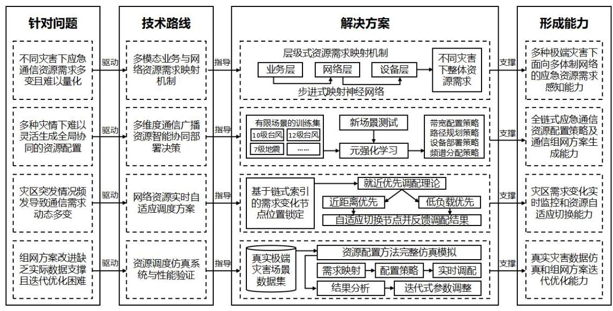

## 国家重点研发计划 课题任务书

应急通信网络多维资源动态配置方法

所属项目: 极端灾害多模态智能融合应急通信装备

所属专项: 重大自然灾害防控与公共安全

项目牵头承担单位: 北京邮电大学

课题承担单位: 北京邮电大学

课题负责人: 许长桥

执行期限:2025 年 01 月 至 2027 年 12 月

中华人民共和国科学技术部制

2025 年 01 月 08 日

## 填 写 说 明

一、任务书甲方即项目牵头承担单位，乙方即课题承担单位。

二、任务书通过 “国家科技计划管理信息系统公共服务平台”，按照系统提示在线填写。

三、任务书中的单位名称，请按规范全称填写，并与单位公章一致。

四、任务书要求提供乙方与所有参加单位的合作协议，需对原件进行扫描后在线提交。

五、任务书中文字须用宋体小四号字填写。

六、凡不填写内容的栏目，请用“无”表示。

七、乙方完成任务书的在线填写，提交甲方审核确认后，用 A4 纸在线打印、装订、签章。一式八份报项目牵头承担单位签章，其中课题承担单位一份，课题负责人一份，作为项目任务书附件六份。

八、如项目下仅设一个课题，课题任务书只需填报课题预算部分。

九、涉密课题请在 “国家科技计划管理信息系统公共服务平台” 下载任务书的电子版模板, 按保密要求离线填写、报送。

十、《项目申报书》和《项目任务书》是本任务书填报的重要依据，任务书填报不得降低考核指标，不得自行对主要研究内容作大的调整。《项目申报书》、《项目任务书》和本任务书将共同作为课题过程管理、综合绩效评价(验收)和监督评估的重要依据。

课题基本信息表

<table><tr><td colspan="2">课题名称</td><td colspan="7">应急通信网络多维资源动态配置方法</td></tr><tr><td colspan="2">课题编号</td><td colspan="7">2024YFC3015301</td></tr><tr><td colspan="2">所属项目</td><td colspan="7">极端灾害多模态智能融合应急通信装备</td></tr><tr><td colspan="2">所属专项</td><td colspan="7">重大自然灾害防控与公共安全</td></tr><tr><td colspan="2">密级</td><td colspan="3">■公开 □秘密 □机密</td><td></td><td>单位总数</td><td></td><td>4</td></tr><tr><td colspan="2">课题类型</td><td colspan="7">口基础前沿口重大共性关键技术■应用示范研究□其他</td></tr><tr><td colspan="2">课题活动类型</td><td colspan="7">口基础前沿■应用研究□试验发展</td></tr><tr><td colspan="2">课题研究所属学科</td><td colspan="7">电子与通信技术   通信技术</td></tr><tr><td colspan="2">课题成果应用的主要国民经济行业</td><td colspan="7">制造业   计算机、通信和其他电子设备制造业   通信设备制造   通信系统设备制造</td></tr><tr><td colspan="2">课题的社会经济目标</td><td colspan="7">基础设施以及城市和农村规划   通信</td></tr><tr><td colspan="2">经费预算</td><td colspan="7">总需求 380.00 万元，其中中央财政专项资金需求 180.00 万元</td></tr><tr><td colspan="2" rowspan="2">课题周期节点</td><td colspan="2">起始时间</td><td colspan="2">2025 年 01 月</td><td colspan="2">结束时间</td><td>2027 年 12 月</td></tr><tr><td colspan="2">实施周期</td><td colspan="2">共 36 个月</td><td colspan="2">预计中期时间点</td><td>2026 年 06 月</td></tr><tr><td rowspan="7">课题承担单位</td><td colspan="2">单位名称</td><td colspan="3">北京邮电大学</td><td colspan="2">单位法定代表人姓名</td><td>徐坤</td></tr><tr><td colspan="2">单位性质</td><td colspan="3">大专院校</td><td colspan="2">组织机构代码</td><td>12100000400009952C</td></tr><tr><td colspan="2">单位主管部门</td><td colspan="3">教育部</td><td colspan="2">隶属关系</td><td>中央</td></tr><tr><td colspan="2">单位所属地区</td><td colspan="3">北京市</td><td>地市(市、自   治州、盟)</td><td></td><td>北京市海淀区</td></tr><tr><td colspan="2">通信地址</td><td colspan="3">北京市海淀区西土城路 10 号</td><td>邮政编码</td><td></td><td>100876</td></tr><tr><td colspan="2">单位开户名称</td><td colspan="6">北京邮电大学</td></tr><tr><td colspan="2">开户银行 (全称)</td><td colspan="3">中国工商银行股份有限公司北京新街口支行</td><td colspan="2">汇入地点</td><td>北京市 北京市</td></tr></table>

<table><tr><td></td><td>银行账号</td><td colspan="5">0200002909005405044</td><td colspan="4">银行机构代码</td><td>102100000290</td></tr><tr><td rowspan="6">课题负责人</td><td>姓名</td><td>许长桥</td><td></td><td>性 别</td><td></td><td colspan="2">■男 □女</td><td colspan="3">出生日期</td><td>1977-01-09</td></tr><tr><td>证件类型</td><td>身份证</td><td></td><td>证件号码</td><td></td><td></td><td>360102197701096351</td><td></td><td></td><td></td><td></td></tr><tr><td>所在单位</td><td colspan="10">北京邮电大学</td></tr><tr><td>最高学位</td><td colspan="10">■博士□硕士□学士□其他</td></tr><tr><td>职 称</td><td colspan="7">■正高级□副高级□中级□初级□其他</td><td></td><td>职 务</td><td>执行院长</td></tr><tr><td>电子邮箱</td><td></td><td>cqxu@bupt.edu.cn</td><td></td><td></td><td></td><td colspan="2">移动电话</td><td colspan="3">18611182655</td></tr><tr><td rowspan="3">课题联系人</td><td>姓名</td><td colspan="3">刘晓娜</td><td colspan="2">电子邮箱</td><td colspan="5">liuxiaona@bupt.edu.cn</td></tr><tr><td>固定电话</td><td colspan="3">01062282612</td><td colspan="2">移动电话</td><td colspan="5">18500193619</td></tr><tr><td>证件类型</td><td colspan="3">身份证</td><td colspan="2">证件号码</td><td colspan="5">23232119850126512X</td></tr><tr><td rowspan="3">课题财务负责人</td><td>姓名</td><td colspan="3">张亚凡</td><td colspan="2">电子邮箱</td><td colspan="5">zhangyafan@bupt.edu.cn</td></tr><tr><td>固定电话</td><td colspan="3">010-62283269</td><td colspan="2">移动电话</td><td colspan="5">15652960946</td></tr><tr><td>证件类型</td><td colspan="3">身份证</td><td colspan="2">证件号码</td><td colspan="5">110102198510082713</td></tr><tr><td rowspan="4">其他参与单位</td><td colspan="5">序号单位名称</td><td colspan="4">单位性质</td><td colspan="2">组织机构代码</td></tr><tr><td colspan="5">1 应急管理部大数据中心</td><td colspan="4">其他事业单位</td><td colspan="2">12100000400003809U</td></tr><tr><td colspan="5">2 太极计算机股份有限公司</td><td colspan="4">其他企业</td><td colspan="2">91110000101137049C</td></tr><tr><td colspan="5">3 中国信息通信研究院</td><td colspan="4">事业型研究单位</td><td colspan="2">12100000400009442Y</td></tr><tr><td rowspan="2">课题参加人数</td><td colspan="2" rowspan="2">32 人。其中:</td><td colspan="9">高级职称 9 人，中级职称 6 人，初级职称 0 人，其他 17 人;</td></tr><tr><td colspan="9">博士学位 5 人，硕士学位 8 人，学士学位 19 人，其他 0</td></tr><tr><td>课题简介 (限 500 字以内)</td><td colspan="11">针对极端灾害造成受灾地区广播和通信中断的实际难题，面向应急救援的“多模态应急业务资源需求感知”和“多维资源动态自适应配置”等需求，实现多体制网络下的应急通信资源需求感知；完成多种灾害下的应急通信资源配置；通过资源配置模式自适应切换持续保障系统稳定运行；设计仿真系统完成资源配置方法和组网方案的性能验证，从根源上解决现有应急通信网络资源配置效率低下这一难题。通过上述研究为课题二和三形成资源配置策略支撑，为项目设计整体广播通信组网方案。围绕研究目标，课题一设置四个子任务。首先，拟建立多模态业务与网络资源需求映射机制，实现复杂受灾场景下针对多体制网络的资源感知与</td></tr></table>

<table><tr><td></td><td>应急业务需求分析；进一步研究多维度通信广播资源智能协同部署决策，在现场实施前高效决策多维资源在各节点的配置并形成广播通信组网方案；提出资源实时自适应切换方案，依据灾情变化动态调整局部资源配置以持续保障整体需求； 最后, 实现资源调度仿真系统并完成方案的性能验证。</td></tr></table>

## 一、目标及考核指标、考核方式/方法

请填写下表。

## 课题目标、预期成果与考核指标表

<table><tr><td rowspan="2">课题目标 ${}^{1}$</td><td colspan="4">预期成果</td><td colspan="4">考核指标 2</td><td rowspan="2">考核方式(方法)及评价手段 4</td></tr><tr><td colspan="3">预期成果名称</td><td>预期成果类型</td><td>指标名称</td><td>立项时已有指标值/状态</td><td>中期指标值/状态 3</td><td>完成时指标值/状态</td></tr><tr><td>针对极端灾害造成受灾地区广播和通信中断的实际难题, 面向应急救援的“多模态应急业务资源需求感知”和 “多维资源动态自适应配置”等需求，实现多体制网络下的应急通信资源需求感知； 完成多种灾害下的应急通信资源配置；通过资源配置模式自适应切换持</td><td>主要成果</td><td>1</td><td>资   源   需   求   映</td><td>□新理论 □新原理 □新产品 □ 新技术 𝑉新方法 ☐关键部件 ☐数据库 口软件 口应用解决方案 ☑ 实验装置/系统 ☐临床指南/规范 ☐工程工艺 ☐标准 ☑论文 ☐发明专利 口其他</td><td>指标 1.1: 智能应急广播与通信资源配置与组网方案</td><td>已完成 5G 通信资源动态配置方法和 5G 700MHz 组网方案，尚未设计通信与广播一体化资源调度与组网方案</td><td>1.建立极端灾害通信资源变化数据集, 通信制式种类≥4(5G 600-700M Hz、卫星、 WiFi、短波等);   2. 设计 强化学习应急通信资源配置算法, 完成至少 1 种极端灾害场景下训练，模型参数规模≥100 万; 3. 完 成 应急广播网组网架构</td><td>1. 形成《应急通信网络多维资源动态配置方法》专题报告;   2. 建立应急广播与通信智能配置算法, 支持通信制式≥4，完成至少 3 种(暴雨、台风、地震等)极端灾害场景下训练，模型参数 ≥500 万；通过技术进展报告描述算法原理和代码逻辑; 3. 形成智能</td><td>专家评审， 形成评审报告</td></tr></table>

隆聚民民民民民民民民民民民民居民第5页/共83页

<table><tr><td rowspan="2">续保障系统稳定运行; 设计仿真系统完成资源配置方法和组网方案的性能验证，从根源上解决现有应急通信网络资源配置效率低下这一难题。通过上述研究为课题二和三形成资源配置策略支撑, 为项目设计整体广播通信组网方案。</td><td rowspan="2"></td><td rowspan="2"></td><td></td><td rowspan="2"></td><td></td><td></td><td>设计方案, 支持 2 种极端灾害场景, 具备支持残余网络/无残余网络组网能力。</td><td>应急广播与通信组网方案, 支持极端灾害场景≥5, 广播与通信方式≥4，单用户理论最大带宽支持 ≥40Mbps，理论带宽资源利 用 率 ≥95%。提交专家评审报告。</td><td></td></tr><tr><td></td><td>指标 1.2:广播通信融合网络模拟与资源优化调度仿真系统(原型系统)</td><td>已拥有通信资源优化调度仿真系统, 实现 5G基站模块、 通信网关模块、中继模块, 可支持 1000 个用户同时接入</td><td>1. 初步实现资源优化调度仿真系统; 2. 至 少 完成 1 种(暴雨、台风、 地震)极端灾害条件下的数据仿真;   3. 仿真系统中至少实现专用设备接入功能;   4. 支持不少于 1200 个用户节</td><td>实现资源优化调度仿真系统 1 套 (原型系统), TRL 技术就绪度不低于 6 级，具备功能:   1. 支持 $\geq  4$ 种 (暴雨、台风、地震、洪水)极端灾害条件下的数据仿真;   2. 支持模拟蜂窝、WiFi、 卫星、短波通信方式; 3. 支持模拟</td><td>1. 专家评审, 形成评审报告 2. 提供第三方机构检测报告</td></tr></table>

## 隆庠庠庠庠庠庠庠庠庠庠庠庠''

第6页/共83页

<table><tr><td rowspan="4"></td><td></td><td rowspan="3"></td><td rowspan="3"></td><td rowspan="3"></td><td></td><td></td><td>点接入; 5. 形成 1 份仿真系统测试大纲。</td><td colspan="2">用户直连、中继转发通信方式, 支持单 /组/广播播发模式;   4. 支持强化学习、随机优化控制、策略调度3 种资源配置逻辑;   5. 支持不少于 1500 个用户节点接入。</td><td></td></tr><tr><td></td><td>指标 1.3: 发明专利</td><td>无</td><td>累计完成不少于 2 项专利受理</td><td colspan="2">累计完成不少于2项专利授权</td><td>专利授权通知书</td></tr><tr><td></td><td>指标 1.4: 高质量论文</td><td>无</td><td>发表学术论文不少于 5 篇 ( SCI/EI/ 中文核心)</td><td colspan="2">发表学术论文不少于 10 篇 ( SCI/EI/ 中文核心)</td><td>录用/检索证明</td></tr><tr><td>其他成果</td><td>1</td><td>人才培养</td><td>口新理论 口新原理 口新产品 口新技术 口新方法 口关键部件 口数据库 口软件 口应用解决方案 ☐ 实验装置/系统 ☐临床指南/规范口工程工艺 口标准 口论文 口发明专利 口其他 人才培养</td><td>指标 1.1: 人才培养</td><td>无</td><td>无</td><td colspan="2">培养博士、硕士共 10 人</td><td>提供毕业证书/论文关键页</td></tr><tr><td rowspan="2">科技报告考核指标</td><td colspan="3">序号</td><td>报告类型 ${}^{5}$</td><td>数量</td><td colspan="3">提交时间</td><td colspan="2">公开类别及时限 6</td></tr><tr><td colspan="3">1</td><td>专题报告(应急通信网络多维资源动态配置方法)</td><td>1</td><td colspan="3">2027.12</td><td colspan="2">延期公开 3 年(需申请专利、出版专著)</td></tr><tr><td colspan="11">其他目标与考核指标</td></tr></table>

## 隆隆隆隆隆隆隆隆隆隆隆隆隆隆

第7页/共83页

备注:

1. “课题目标”，应从以下方面明确描述:(1)研发主要针对什么问题和需求；(2)将要解决哪些科学问题、突破哪些核心/共性/关键技术; (3) 预期成果; (4) 成果将以何种方式应用在哪些领域/行业/重大工程等, 并拟在科技、经济、社会、环境或国防安全等方面发挥何种的作用和影响。(5) 所列主要成果原则上不超过 5 项，如有其他重要成果放在 “其他” 成果中表述。

2. “考核指标”，指相应成果的数量指标、技术指标、质量指标、应用指标和产业化指标等，其中, 数量指标可以为专利、产品等的数量, 论文代表作应注重质量, 不以数量作为评价标准; 技术指标可以为关键技术、产品的性能参数等; 质量指标可以为产品的耐震动、高低温、无故障运行时间等；应用指标可以为成果应用的对象、范围和效果等；产业化指标可以为成果产业化的数量、经济效益等。同时, 对各项考核指标需填写立项时已有的指标值/状态以及课题完成时要到达的指标值/状态。同时, 考核指标也应包括支撑和服务其他重大科研、经济、社会发展、生态环境、科学普及需求等方面的直接和间接效益。如对国家重大工程、社会民生发展等提供了关键技术支撑, 成果转让并带动了环境改善、实现了销售收入等。若某项成果属于开创性的成果，立项时已有指标值/状态可填写 “无”，若某项成果在立项时已有指标值/状态难以界定，则可填写 “ / ”。

3. “中期指标”，各专项根据管理特点，确定是否填写，鼓励阶段目标明确的项目课题填写中期指标。

4. “考核方式方法”，应提出符合相关研究成果与指标的具体考核技术方法、测算方法等。

5. “科技报告类型”，包括项目综合绩效评价(验收)前撰写的全面描述研究过程和技术内容的最终科技报告、项目年度或中期检查时撰写的描述本年度研究过程和进展的年度技术进展报告以及在项目实施过程中撰写的包含科研活动细节及基础数据的专题科技报告(如实验报告、试验报告、调研报告、技术考察报告、设计报告、测试报告等)。其中，每个项目在综合绩效评价 (验收) 前应撰写一份最终科技报告; 研究期限超过 2 年 (含 2 年) 的项目, 应根据管理要求, 每年撰写一份年度技术进展报告; 每个项目可根据研究内容、期限和经费强度, 撰写数量不等的专题科技报告。科技报告应按国家标准规定的格式撰写。

6. “公开类别及时限”，公开项目科技报告分为公开或延期公开，内容需要发表论文、申请专利、 出版专著或涉及技术诀窍的，可标注为“延期公开”。需要发表论文的，延期公开时限原则上在 2 年(含 2 年)以内；需要申请专利、出版专著的，延期公开时限原则上在 3 年(含 3 年) 以内；涉及技术诀窍的，延期公开时限原则上在 5 年(含 5 年)以内。涉密项目科技报告按照有关规定管理。

## 二、课题研究内容、研究方法及技术路线

## (一)课题的主要研究内容

拟解决的关键科学问题、关键技术问题，针对这些问题拟开展的主要研究内容， 限 1000 字以内。

多种极端灾害下通信资源的灵活配置是关键, 然而现有的基于优化理论的配置方法依赖预先的网络和信道建模, 并且需要预设过多的条件。但灾区的突发情况导致可用资源状态动态多变, 发生突发情况后实际情况与预设条件差距较大, 优化理论生成结果与实际最优解有偏离, 导致最终形成的组网方案无法灵活应对不同的灾害场景并做出适当调整，由此引出课题一的科学问题:多种极端灾害下通信、广播资源的灵活配置问题。

围绕上面的科学问题, 本课题拟研究以下关键技术问题:

1. 面向多体制网络的层级式资源需求感知技术

2. 全链式协同资源配置策略及组网方案生成技术

3. 在线实时监测与自适应切换的资源调度技术

针对上述问题，课题一开展以下主要研究内容:

(1)多模态业务与网络资源需求映射机制:研究层级式资源需求映射机制， 设计步进式的层间映射模型, 从业务层、网络层和设备层三个递进层面逐步映射, 应对不同极端灾害下的多种灾情，在多体制网络下实现灵活的资源需求感知能力。

(2)多维度通信广播资源智能协同部署决策:研究全链式协同资源配置策略，通过元强化学习从不同灾害场景训练集获取经验，全局考虑各网各设备，结合实际应急通信需求设计资源配置策略，进而生成高灵活高效率的广播与通信组网方案。

(3)网络资源实时自适应调度方案:研究应急通信资源实时监测和局部在线动态调整技术，基于临近节点优先调度理论，根据临近节点位置和负载，灵活自适应切换资源配置模式，及时响应资源需求的变化，持续保证应急通信系统的稳定运行。

(4)资源调度仿真系统与性能验证:设计并实现资源调度仿真平台，通过真实的极端灾害场景数据模拟运行资源配置方法并生成对应的组网方案，收集并

∥隆隆隆隆隆隆隆隆隆隆隆隆隆隆分析方法的核心性能指标，通过迭代式的参数更新不断优化通信组网方案生成的效果。

## (二) 课题采取的研究方法

针对课题研究拟解决的问题，拟采用的方法、原理、机理、算法、模型等限 1000 字以内。

研究方法如图 1 所示，包括:(1)针对不同灾害中资源需求多变问题，设计层级式映射机制, 通过步进式映射神经网络从业务需求映射至网络和设备需求; (2) 针对不同灾情下多维资源难以协同配置问题，研究多维资源智能协同部署决策技术, 使用元强化学习进行整体的资源配置决策, 并形成完整的组网方案; (3) 针对灾区情况瞬息万变，通信需求动态多变的问题，研究应急通信资源实时自适应切换方案，研究就近优先调配理论和反馈式增补结果回传技术，持续维护应急通信系统的整体稳定运行；(4)为了验证所生成的资源配置策略和组网方案的具体性能表现，开发资源调度仿真系统，分析带宽利用率、灾区覆盖率、通信恢复时间等关键指标, 并通过迭代优化模型参数。

图 1 课题一研究方法图

## 三、主要创新点

围绕基础前沿、共性关键技术或应用示范等层面, 简述课题的主要创新点。具体内容应包括该项创新的基本形态及其前沿性、时效性等，并说明是否具备方法、理论和知识产权特征。每项创新点的描述限 500 字以内。

## 创新点: 实现多种极端灾害下应急通信网络资源的灵活动态配置

本研究创新地提出多维资源动态配置方法，首次引入多模态业务与多体制网络资源需求的映射模型, 率先提出就近优先调配的思路实现资源自适应切换, 将资源动态配置问题从 “需求映射、配置策略、动态调整” 三个维度进行解决。当前的资源配置方法主要基于优化理论实现，导致其在不同的极端灾害场景下灵活性不足。 例如思科的应急通讯系统中, 主要依靠对应急场景中网络和信道的预先建模, 并通过提出最优化模型产生最终的资源配置策略, 由于其优化模型预设过多条件, 导致在不同场景下难以做到快速适配。本研究通过通信需求与资源需求的层级式映射模型, 摆脱传统优化理论预设过多的局限性, 创新性地通过映射机制代替优化理论建模, 实现在不同极端灾害场景下的需求映射能力。研究提出的方法可以在需求映射模型、实时资源自适应切换等技术点上形成专利，具备方法、理论和知识产权特征。

## 四、预期经济社会效益

课题的科学、技术、产业预期指标及科学价值、社会、经济、生态效益。限 500 字以内。

本课题旨在通过创新的通信资源配置方法, 提高极端灾害下通信网络的响应速度和稳定性, 从而增强应急响应能力, 减少灾害带来的损失。科学层面, 课题将探索多体制网络的资源需求感知技术，实现业务、网络和设备层面的高效映射，以及全链式协同资源配置策略, 以提升资源利用率和组网方案的生成效率。技术层面, 将开发实时监测与自适应切换的资源调度方案，以快速响应资源需求的变化。产业层面, 这些技术的发展将推动应急通信产业的技术升级, 促进通信设备制造商开发更灵活的设备，以适应动态资源配置需求。

科学价值:本课题将为灾害下的通信资源配置提供理论支持和技术创新，增强网络的鲁棒性和灵活性。

社会效益:提高灾害应急响应速度，减少人员伤亡和财产损失，增强公众对通信系统在灾害中作用的信心。

经济效益:降低灾害恢复成本，提升通信产业经济效益，创造新的市场机会。 生态效益上, 优化资源配置, 减少能源消耗, 降低对环境的影响, 支持可持续发展, 为环境保护提供通信保障。

## 五、课题年度计划

按每 6 个月制定形成项目的计划进度, 应将项目的考核指标分解落实到年度计划中。

## 1、年度:2025 年 1 月—2025 年 6 月

任务:召开课题启动会，设计初步的广播通信融合网络模拟与资源优化调度仿真系统; 设计针对极端灾害场景的强化学习训练框架; 制定应急通信领域博士、硕士培养计划; 撰写并投稿 2 篇高质量论文。

考核指标: 强化学习设计技术文档 1 份。

成果形式:技术文档。

## 2、年度:2025 年 7 月—2025 年 12 月

任务:设计强化学习应急通信资源配置方法；开展特殊环境下应急通信应用调研， 收集特殊环境下的场景数据; 完成强化学习训练过程的实现并完成至少 1 种极端灾害场景下的数据训练，测试性能指标及模型参数；申请专利 1 项，撰写并投稿 2 篇高质量论文。

考核指标: 获取 1 项专利的受理通知书, 获得 2 篇相关高质量论文的录用/检索证明。

成果形式:专利及论文。

## 3、年度:2026 年 1 月—2026 年 6 月

任务:初步完成广播通信融合网络模拟与资源优化调度仿真系统的实现；应急管理部大数据中心提供极端灾害环境真实数据，完成至少 1 种极端灾害场景下的仿真实验; 申请专利 1 项，撰写并投稿 2 篇高质量论文; 阶段末期开展项目中期检查会议。 形成 1 份系统测试大纲, 进行专家评审, 形成评审报告。

考核指标:初步仿真系统 1 套、获取 1 项专利的受理通知书，获得 3 篇相关高质量论文的录用/检索证明, 测试大纲评审报告 1 份。

成果形式:初步仿真系统、专利及论文、评审报告。

## 4、年度:2026 年 7 月—2026 年 12 月

任务:完成层级式资源需求映射模型实现、完成网络资源实时自适应调度算法的实现, 完成至少 3 种极端灾害场景数据下的强化学习训练, 形成最终性能测试报告; 撰写并投稿 2 篇高质量论文。

考核指标: 最终性能报告 1 份、获得 2 篇相关高质量论文的录用/检索证明。

成果形式:性能报告、论文。

## 5、年度:2027 年 1 月—2027 年 6 月

任务:在仿真平台中继续完成至少 3 种极端灾害场景下的仿真实验，全面评估方案性能并迭代优化模型参数，记录实验数据；对仿真系统进行第三方检测，获得第三方机构检测报告；协助完成 3 个地区的应用示范；初步完成《应急通信网络多维资源动态配置方法》专题报告；开展课题及子课题验收前产出成果功能测试验收会； 撰写并投稿 2 篇高质量论文。

考核指标:第三方机构检测报告 1 份、获得 2 篇相关高质量论文的录用/检索证明。 成果形式:第三方检测报告、论文。

## 6、年度:2027 年 7 月—2027 年 12 月

任务:总结最终研究成果，准备结项相关工作。开展课题绩效评价会；完善《应急通信网络多维资源动态配置方法》专题报告并提交；核对指标完成情况，进行专家评审，形成评审报告；获得 2 项专利的授权通知书。

考核指标:《应急通信网络多维资源动态配置方法》专题报告 1 份、《应急通信网络多维资源动态配置方法》评审报告 1 份、获得 2 篇相关高质量论文的录用/检索证明、 获得 2 项专利的授权通知书。

成果形式:专题报告、评审报告、论文、专利。

## 六、课题组织实施机制及保障措施

1、课题的内部组织管理方式、协调机制等，限 500 字以内。

本项目将严格按照《国家重点研发计划管理暂行办法》的要求，建立组织管理体系，规范计划、决策、实施、管理、评估、监理等项目过程管理。课题组负责协调课题内部的人员、技术、资源和计划进度等问题，采用周例会的方式，定期组织课题技术人员定期开展电话会议和线下会议，协调和解决课题内部的计划和技术问题。课题需按月提交月报告，并按月将与其他课题的技术问题上报项目总体办公室， 传达和分解安排总体办公室按月规定的课题工作。召集课题的研究人员，编写系统总体技术方案、接口控制文件、计划与技术流程和标准化文件。请专家咨询委员会对上述总体报告和文件进行评审。成立行政管理组和技术研发组。行政管理组负责课题人员安排、物资调配和财务管理，配置专门的计划员负责课题的进度管理以及节点控制；技术研发组负责关键技术攻关和设备研发，配置质量师承担可靠性设计和过程质量管理，组织运行故障报告、分析和纠正、问题汇总和清理。在项目课题集成测试，成立由技术人员和行政人员组成的项目课题集成测试组，负责整个项目课题的集成测试和计划管理。

2、课题实施的相关政策，已有的组织、技术基础，支撑保障条件，限 500 字以内。

## (1)政策保障

“重大自然灾害防控与公共安全”产业是我国战略性新兴产业和科技主导产业， 一直受到党中央、国务院的高度重视，《“十四五”国家应急体系规划》明确要求“加强应急通信网络建设，提高极端条件下应急通信保障能力”。依据国家和科技部项目管理和经费管理的各项政策规定，积极加强各项管理制度建设工作。

## (2)组织保障

行政管理团队以各单位领导牵头，科研和质检部门参与，为系统研发提供管理上的保障条件。成立跨专业技术人才梯队并建立对应制度，保障研发质量、标准化服务。制定任务分工和问题反馈表，保障科研任务按计划完成。对各个子课题进行任务分解, 并执行计划跟踪、问题反馈制度。

## (3)资源保障

课题团队将依托国家与省部级重点实验室、专家团队和学术委员会，形成强有力的人才资源保障。团队在本领域实现了多个技术的全国/全球 “首次” 突破，北京邮电大学在广播、通信、语义通信等研究领跑全球，应急管理部大数据中心负责全国应急领域北斗、指挥信息网、370M 等通信资源的运营管理，太极计算机股份有限公司作为设备提供商，提供先进实验设备支撑。项目团队相关基础坚实，为项目的研究提供了有利的技术指导和丰富的研发经验，技术风险整体可控。

3、对实现项目总目标的支撑作用，及与项目内其他课题的协同机制，限 500 字以内。

本课题旨在应对多种极端灾害场景，面向音视频、文本等多模态业务，构建在多制式、多频段、多网络复杂场景下的高效应急通信网络体系，研究突破应急通信多维资源动态配置，面向超强台风、特大暴雨、强破坏地震等极端灾害造成受灾地区广播和通信中断的挑战，按照 “突发公共事件应急处置能力显著增强，自然灾害防御水平明显提升，发展安全保障更加有力”目标要求，并在应急救援与综合保障等方面开展基础研究、技术攻关，实现重大自然灾害与公共安全事件精准监测、精确预警、精细防控、高效救援，支撑平安中国战略实施。

与监测预警项目的协同，保障信息传递的稳定性:在极端灾害条件下，传统通信手段往往失效，而本课题研发的多模态智能融合应急通信装备能够确保关键信息的稳定传递, 为灾害监测预警、风险防控提供通信保障。

与救援技术装备项目的协同，实现指挥调度的实时性:通过集成先进的通信技术, 本课题能够实现对灾害现场的实时监控和指挥调度, 提高应急响应速度和救援效率。

本课题不仅在技术层面为专项目标的实现提供了有力支撑, 而且在项目间的协同合作中发挥了关键作用，将显著提升我国在极端灾害条件下的应急通信能力，为保护人民生命财产安全和社会稳定做出重要贡献。

## 七、知识产权对策、成果管理及合作权益分配

限 500 字以内。

在不影响项目的专利申请或其他知识产权保护的前提下，依托本项目课题研究而完成的专著、论文、软件、工艺等研究成果，在对外公开发表、参加学术会议和成果展出时, 必须注明所属国家科技计划专项经费资助字样和项目编号, 第一标注的成果作为验收或评估的确认依据。

项目课题实施过程中，将按照国家、部门的法律法规和相关政策规定，严格执行《科技成果登记办法》，实行国家科技计划重大成果报告制度，项目课题实施过程中取得重大成果时, 及时向科技部计划管理机构报告。并根据科技成果特点, 按照法律法规的规定选择申请专利、进行著作登记等方式予以保护。在不影响知识产权保护、国家秘密和技术秘密保护的前提下，积极推动项目课题产生的知识产权和科研成果的转移和运用, 加快知识产权的商品化、科研成果的产业化。

按照国家科技成果相关规定，对项目课题的成果进行权益分配。在项目课题内部签订研究成果的知识产权及相关权益分配的协议，根据项目课题任务分工，在各方的工作范围内独立完成的科技成果及其形成的知识产权归各方独自所有。一方转让其专利申请权时，其它各方有以同等条件优先受让的权利。由各方共同完成的科技成果及其形成的知识产权归各方共有。

## 八、需要约定的其他内容

限 500 字以内。

## 九、课题参加人员基本情况表

<table><tr><td colspan="15">填表说明:1. 专业技术职称: A、正高级 B、副高级 C、中级 D、初级 E、其他；   2. 投入本课题的全时工作时间(人月)是指在课题实施期间该人总共为课题工作的满月度工作量；累计是指课题组所有人员投入人月之和；   3. 课题固定研究人员需填写人员明细;   4. 是否有工资性收入:Y、是 N、否；   5. 人员分类代码:B、课题负责人 C、项目/课题骨干 D、其他研究人员；   6. 工作单位:填写单位全称，其中高校要具体填写到所在院系。</td></tr><tr><td>序号</td><td>姓名</td><td>性别</td><td>出生日期</td><td>证件类型</td><td>证件号码</td><td>专业技术职称</td><td>职务</td><td>最高学位</td><td>专业</td><td>投入本课题的全时工作时间 (人月)</td><td>人员分类代码</td><td>在课题中分担的任务</td><td>是否有工资性收入</td><td>工作单位</td></tr><tr><td>1</td><td>许长桥</td><td>男</td><td>1977-01-09</td><td>身份证</td><td>360102197701096351</td><td>正高级</td><td>执行院长</td><td>博士</td><td>计算机科学与技术</td><td>18</td><td>课题负责人</td><td>作为项目负责人承担项目整体设计工作，作为课题一项目负责人</td><td>是</td><td>北京邮电大学计算机学院 (国家示范性软件学院)</td></tr><tr><td>2</td><td>李振</td><td>男</td><td>1970-08-30</td><td>身份证</td><td>320102197008302834</td><td>副高级</td><td>总裁特别专务</td><td>博士</td><td>信息与通信工程</td><td>10</td><td>课题骨干</td><td>子任务设计</td><td>是</td><td>太极计算机股份有限公司</td></tr><tr><td>3</td><td>丁荣泽</td><td>男</td><td>1978-11-05</td><td>身份证</td><td>130302197811053537</td><td>副高级</td><td>部门副总</td><td>硕士</td><td>信息与通信工程</td><td>24</td><td>课题骨干</td><td>子任务设计</td><td>是</td><td>中国信息通信研究院</td></tr><tr><td>4</td><td>王目</td><td>男</td><td>1990-04-13</td><td>身份证</td><td>450305199004132012</td><td>副高级</td><td>无</td><td>博士</td><td>计算机科学与技术</td><td>18</td><td>课题骨干</td><td>子任务设计</td><td>是</td><td>北京邮电大学计算机学院 (国家示范性软件学院)</td></tr><tr><td>5</td><td>肖寒</td><td>男</td><td>1996-02-04</td><td>身份证</td><td>372901199602049218</td><td>中级</td><td>无</td><td>博士</td><td>计算机科学与技术</td><td>8</td><td>课题骨干</td><td>子任务设计</td><td>是</td><td>北京邮电大学计算机学院 (国家示范性软件学院)</td></tr><tr><td>6</td><td>周赞</td><td>男</td><td>1994-08-25</td><td>身份证</td><td>41010319940825017X</td><td>其他</td><td>无</td><td>博士</td><td>计算机科学与技术</td><td>8</td><td>课题骨干</td><td>子任务设计</td><td>是</td><td>北京邮电大学计算机学院 (国家示范性软件学院)</td></tr></table>

## 隆度低座星星星星星星星星星星周

第19页/共83页

<table><tr><td>7</td><td>冀小平</td><td>男</td><td>1975-06-13</td><td>身份证</td><td>610113197506137411</td><td>副高级</td><td>部门经理</td><td>硕士</td><td>软件工程</td><td>8</td><td>课题骨干</td><td>子任务设计</td><td>是</td><td>太极计算机股份有限公司</td></tr><tr><td>8</td><td>山瑞盟</td><td>女</td><td>1992-06-06</td><td>身份证</td><td>610125199206065246</td><td>中级</td><td>部门经理</td><td>学士</td><td>软件工程</td><td>8</td><td>课题骨干</td><td>子任务设计</td><td>是</td><td>太极计算机股份有限公司</td></tr><tr><td>9</td><td>张腾飞</td><td>男</td><td>1981-09-27</td><td>身份证</td><td>130102198109272135</td><td>副高级</td><td>无</td><td>学士</td><td>电气工程</td><td>10</td><td>课题骨干</td><td>子任务设计</td><td>是</td><td>太极计算机股份有限公司</td></tr><tr><td>10</td><td>耿团团</td><td>男</td><td>1990-07-17</td><td>身份证</td><td>130121199007172612</td><td>中级</td><td>无</td><td>硕士</td><td>信息与通信工程</td><td>18</td><td>课题骨干</td><td>子任务设计</td><td>是</td><td>应急管理部大数据中心</td></tr><tr><td>11</td><td>刘嵘</td><td>男</td><td>1995-06-01</td><td>身份证</td><td>360731199506013892</td><td>其他</td><td>无</td><td>硕士</td><td>安全科学与工程</td><td>18</td><td>课题骨干</td><td>子任务设计</td><td>是</td><td>应急管理部大数据中心</td></tr><tr><td>12</td><td>韩海阔</td><td>男</td><td>1989-03-27</td><td>身份证</td><td>110101198903270014</td><td>其他</td><td>无</td><td>硕士</td><td>计算机科学与技术</td><td>24</td><td>课题骨干</td><td>子任务设计</td><td>是</td><td>应急管理部大数据中心</td></tr><tr><td>13</td><td>杨觐睿</td><td>男</td><td>1999-03-06</td><td>身份证</td><td>410727199903062911</td><td>其他</td><td>无</td><td>学士</td><td>计算机科学与技术</td><td>15</td><td>其他研究人员</td><td>理论研究. 开发</td><td>否</td><td>北京邮电大学计算机学院 (国家示范性软件学院)</td></tr><tr><td>14</td><td>李康睿</td><td>男</td><td>2001-08-24</td><td>身份证</td><td>370911200108245236</td><td>其他</td><td>无</td><td>学士</td><td>计算机科学与技术</td><td>15</td><td>其他研究人员</td><td>理论研究， 开发</td><td>否</td><td>北京邮电大学计算机学院 (国家示范性软件学院)</td></tr><tr><td>15</td><td>王波</td><td>男</td><td>2001-01-15</td><td>身份证</td><td>500382200101155016</td><td>其他</td><td>无</td><td>学士</td><td>计算机科学与技术</td><td>15</td><td>其他研究人员</td><td>理论研究， 开发</td><td>否</td><td>北京邮电大学计算机学院 (国家示范性软件学院)</td></tr><tr><td>16</td><td>严林</td><td>男</td><td>2001-07-12</td><td>身份证</td><td>350302200107120033</td><td>其他</td><td>无</td><td>学士</td><td>计算机科学与技术</td><td>15</td><td>其他研究人员</td><td>理论研究. 开发</td><td>否</td><td>北京邮电大学计算机学院 (国家示范性软件学院)</td></tr><tr><td>17</td><td>许克灿</td><td>男</td><td>2002-09-28</td><td>身份证</td><td>429004200209283119</td><td>其他</td><td>无</td><td>学士</td><td>计算机科学与技术</td><td>20</td><td>其他研究人员</td><td>理论研究. 开发</td><td>否</td><td>北京邮电大学计算机学院 (国家示范性软件学院)</td></tr><tr><td>18</td><td>许天宇</td><td>男</td><td>2001-03-07</td><td>身份证</td><td>410781200103070837</td><td>其他</td><td>无</td><td>学士</td><td>计算机科学与技术</td><td>20</td><td>其他研究人员</td><td>理论研究， 开发</td><td>否</td><td>北京邮电大学计算机学院 (国家示范性软件学院)</td></tr><tr><td>19</td><td>马丁</td><td>男</td><td>2000-01-23</td><td>身份证</td><td>430321200001230014</td><td>其他</td><td>无</td><td>学士</td><td>计算机科学与技术</td><td>20</td><td>其他研究人员</td><td>理论研究， 开发</td><td>否</td><td>北京邮电大学计算机学院 (国家示范性软件学院)</td></tr><tr><td>20</td><td>郭鹏</td><td>男</td><td>2000-01-20</td><td>身份证</td><td>350681200004201019</td><td>其他</td><td>无</td><td>学士</td><td>计算机科学与技术</td><td>20</td><td>其他研究人员</td><td>理论研究， 开发</td><td>否</td><td>北京邮电大学计算机学院 (国家示范性软件学院)</td></tr><tr><td>21</td><td>程阳</td><td>男</td><td>2000-11-30</td><td>身份证</td><td>130705200011301235</td><td>其他</td><td>无</td><td>学士</td><td>计算机科</td><td>20</td><td>其他研究</td><td>理论研究.</td><td>否</td><td>北京邮电大学计算机学院</td></tr></table>

## 隆庠庠庠庠庠庠庠庠庠庠庠庠''

第20页/共83页

<table><tr><td></td><td></td><td></td><td></td><td></td><td></td><td></td><td></td><td></td><td>学与技术</td><td></td><td>人员</td><td>开发</td><td></td><td>(国家示范性软件学院)</td></tr><tr><td>22</td><td>杜宇鹏</td><td>男</td><td>2000-12-09</td><td>身份证</td><td>11022820001209151X</td><td>其他</td><td>无</td><td>学士</td><td>计算机科学与技术</td><td>20</td><td>其他研究人员</td><td>理论研究， 开发</td><td>否</td><td>北京邮电大学计算机学院 (国家示范性软件学院)</td></tr><tr><td>23</td><td>姜洪烨</td><td>男</td><td>2001-01-29</td><td>身份证</td><td>320283200101292675</td><td>其他</td><td>无</td><td>学士</td><td>计算机科学与技术</td><td>20</td><td>其他研究人员</td><td>理论研究， 开发</td><td>否</td><td>北京邮电大学计算机学院 (国家示范性软件学院)</td></tr><tr><td>24</td><td>赵继尧</td><td>男</td><td>2000-04-19</td><td>身份证</td><td>411623200004190819</td><td>其他</td><td>无</td><td>学士</td><td>计算机科学与技术</td><td>20</td><td>其他研究人员</td><td>理论研究， 开发</td><td>否</td><td>北京邮电大学计算机学院 (国家示范性软件学院)</td></tr><tr><td>25</td><td>郭毅帆</td><td>男</td><td>2000-10-20</td><td>身份证</td><td>411324200010202812</td><td>其他</td><td>无</td><td>学士</td><td>计算机科学与技术</td><td>20</td><td>其他研究人员</td><td>理论研究， 开发</td><td>否</td><td>北京邮电大学计算机学院 (国家示范性软件学院)</td></tr><tr><td>26</td><td>李腾飞</td><td>男</td><td>2002-04-07</td><td>身份证</td><td>411123200204070099</td><td>其他</td><td>无</td><td>学士</td><td>计算机科学与技术</td><td>20</td><td>其他研究人员</td><td>理论研究， 开发</td><td>否</td><td>北京邮电大学计算机学院 (国家示范性软件学院)</td></tr><tr><td>27</td><td>李锐</td><td>男</td><td>1977-03-06</td><td>身份证</td><td>610112197703060015</td><td>副高级</td><td>无</td><td>学士</td><td>信息与通信工程</td><td>15</td><td>其他研究人员</td><td>理论研究， 开发</td><td>是</td><td>中国信息通信研究院</td></tr><tr><td>28</td><td>张晓峰</td><td>男</td><td>1988-03-06</td><td>身份证</td><td>110228198803061579</td><td>中级</td><td>无</td><td>学士</td><td>信息与通信工程</td><td>15</td><td>其他研究人员</td><td>子任务设计</td><td>是</td><td>中国信息通信研究院</td></tr><tr><td>29</td><td>赵宇</td><td>男</td><td>1988-02-04</td><td>身份证</td><td>131002198802042819</td><td>副高级</td><td>无</td><td>硕士</td><td>电子信息</td><td>15</td><td>其他研究人员</td><td>理论研究， 开发</td><td>是</td><td>中国信息通信研究院</td></tr><tr><td>30</td><td>单莉莉</td><td>女</td><td>1987-03-26</td><td>身份证</td><td>412721198703264227</td><td>中级</td><td>无</td><td>硕士</td><td>电子信息</td><td>15</td><td>其他研究人员</td><td>理论研究， 开发</td><td>是</td><td>中国信息通信研究院</td></tr><tr><td>31</td><td>潘青亮</td><td>男</td><td>1986-10-11</td><td>身份证</td><td>610527198610112753</td><td>副高级</td><td>无</td><td>硕士</td><td>信息与通信工程</td><td>10</td><td>其他研究人员</td><td>理论研究， 开发</td><td>是</td><td>中国信息通信研究院</td></tr><tr><td>32</td><td>谷志慧</td><td>女</td><td>1977-08-18</td><td>身份证</td><td>622301197708181727</td><td>中级</td><td>无</td><td>学士</td><td>信息与通信工程</td><td>18</td><td>其他研究人员</td><td>理论研究， 开发</td><td>是</td><td>中国信息通信研究院</td></tr><tr><td colspan="10">固定研究人员合计</td><td>520</td><td>/</td><td>/</td><td>/</td><td>/</td></tr><tr><td colspan="10">流动人员或临时聘用人员合计</td><td>0</td><td>/</td><td>/</td><td>/</td><td>/</td></tr></table>

第21页/共83页

<table><tr><td>累计</td><td>520</td><td>/</td><td>/</td><td>/</td><td>片</td></tr></table>

## 课题预算表

表B1 课题编号:2024YFC3015301 课题名称: 应急通信网络多维资源动态配置方法金额单位:万元

<table><tr><td rowspan="2">序号</td><td>预算科目名称</td><td>金额</td></tr><tr><td>(1)</td><td>(2)</td></tr><tr><td>1</td><td>一、中央财政专项资金</td><td>180.00</td></tr><tr><td>2</td><td>(一) 直接费用</td><td>148.02</td></tr><tr><td>3</td><td>1. 设备费</td><td>11.25</td></tr><tr><td>4</td><td>其中:购置设备费</td><td></td></tr><tr><td>5</td><td>2. 业务费</td><td>30.65</td></tr><tr><td>6</td><td>3. 劳务费</td><td>106.12</td></tr><tr><td>7</td><td>(二)间接费用</td><td>31.98</td></tr><tr><td>8</td><td>二、其他来源资金</td><td>200.00</td></tr><tr><td>9</td><td>三、合计</td><td>380.00</td></tr></table>

注:1. 间接费用无需编制预算说明；2. 绩效支出在间接费用中无比例限制。承担单位在统筹安排间接费用时，要处理好合理分摊间接成本和对科研人员激励的关系，绩效支出安排与科研人员在课题工作中的实际贡献挂钩。

## 设备费——购置/试制设备预算明细表

<table><tr><td colspan="3">2024YFC3015301</td><td></td><td></td><td colspan="5">课题名称:应急通信网络多维资源动态配置方法</td><td></td><td colspan="2">金额单位:万元</td></tr><tr><td colspan="13">填表说明: 1.设备分类:购置、试制；   2.购置设备类型:通用、专用；   3.试制设备不需填列本表 (9) 列、 (10) 列、 (11) 列、 (12) 列;   4.设备单价的单位为万元/台套，设备数量的单位为台套；   5. 单价50万元以下的设备不用填写；   6. 本表只填写中央财政资金购置(试制)的设备。</td></tr><tr><td rowspan="2">序号</td><td>设备名称</td><td>设备分类</td><td>功能和技术指标</td><td>单价</td><td>数量</td><td>金额</td><td>购置或试制单位</td><td>安置单位</td><td>购置设备类型</td><td>主要生产厂家及国别</td><td>规格型号</td><td>拟开放共享范围</td></tr><tr><td>(1)</td><td>(2)</td><td>(3)</td><td>(4)</td><td>(5)</td><td>(6)</td><td>(7)</td><td>(8)</td><td>(9)</td><td>(10)</td><td>(11)</td><td>(12)</td></tr><tr><td colspan="13">无记录</td></tr><tr><td colspan="5">单价50万元以上购置设备合计</td><td></td><td></td><td>/</td><td>/</td><td>/</td><td>/</td><td>/</td><td>/</td></tr><tr><td colspan="5">单价50万元以上试制设备合计</td><td></td><td></td><td>/</td><td>/</td><td>/</td><td>/</td><td>/</td><td>/</td></tr><tr><td colspan="5">累计</td><td></td><td></td><td>/</td><td>/</td><td>/</td><td>/</td><td>/</td><td>/</td></tr></table>

## 课题单位经费预算明细表

表B3 课题编号: 2024YFC3015301 课题名称:应急通信网络多维资源动态配置方法金额单位:万元

<table><tr><td colspan="11">填表说明: 1.单位类型分课题承担单位、课题参与单位;   2.组织机构代码指企事业单位国家标准代码，单位若已三证合一请填写单位统一社会信用代码，无组织机构代码的单位填写“000000000”。</td></tr><tr><td rowspan="3">序号</td><td rowspan="2">单位名称</td><td colspan="2" rowspan="2">组织机构代码-统一社会信用代码</td><td rowspan="2">单位类型</td><td rowspan="2">任务分工</td><td rowspan="2">研究任务负责人</td><td rowspan="2">合计</td><td colspan="2">中央财政专项资金</td><td rowspan="2">其他来源资金</td></tr><tr><td>小计</td><td>其中: 间接费用</td></tr><tr><td>(1)</td><td>(2)</td><td>(3)</td><td>(4)</td><td>(5)</td><td>(6)</td><td>(7)</td><td>(8)</td><td>(9)</td><td>(10)</td></tr><tr><td>1</td><td>北京邮电大学</td><td>统一社会信用代码</td><td>1210000040000 9952C</td><td>课题承担单位</td><td>(1)承担子任务 1) 研究应急广播与通信业务与网络资源需求映射机制: (2)参与子任务 2) 负责研究资源部署全局决策，智能分配计算、带宽资源，以满足不同需求:   (3)参与子任务 3，负责研究受灾现场动态变化时资源配置的地点锁定与需求感知工作。</td><td>王目</td><td>100.00</td><td>100.00</td><td>15.76</td><td></td></tr><tr><td>2</td><td>应急管理部大数据中心</td><td>统一社会信用代码</td><td>1210000040000 3809U</td><td>课题参与单位</td><td>(1)承担子任务 4，资源调度仿真系统与性能验证； (2)参与子任务 2，多维度通信广播资源智能协同部署决策。</td><td>耿团团</td><td>30.00</td><td>30.00</td><td>5.82</td><td></td></tr><tr><td>3</td><td>太极计算机股份有限公司</td><td>统一社会信用代码</td><td>9111000010113 7049C</td><td>课题参与单位</td><td>(1)承担子任务 3，研究网络资源实时自适应调度方案   (2)参与子任务 4) 研究资源调度仿真系统与性能验证</td><td>李振</td><td>220.00</td><td>20.00</td><td>4.58</td><td>200.00</td></tr></table>

## 隆蜜蜜蜜蜜蜜蜜蜜蜜蜜蜜蜜蜜醇陶山

第25页/共83页

## 课题单位经费预算明细表

表B3 课题编号:2024YFC3015301 课题名称:应急通信网络多维资源动态配置方法金额单位:万元

<table><tr><td colspan="2">填表说明:</td><td colspan="10">1.单位类型分课题承担单位、课题参与单位;   2.组织机构代码指企事业单位国家标准代码，单位若已三证合一请填写单位统一社会信用代码，无组织机构代码的单位填写“000000000”。</td></tr><tr><td rowspan="3">序号</td><td colspan="2" rowspan="2">单位名称</td><td colspan="2" rowspan="2">组织机构代码一统一社会信用代码</td><td rowspan="2">单位类型</td><td rowspan="2">任务分工</td><td rowspan="2">研究任务负责人</td><td rowspan="2">合计</td><td colspan="2">中央财政专项资金</td><td rowspan="2">其他来源资金</td></tr><tr><td>小计</td><td>其中: 间接费用</td></tr><tr><td colspan="2">(1)</td><td>(2)</td><td>(3)</td><td>(4)</td><td>(5)</td><td>(6)</td><td>(7)</td><td>(8)</td><td>(9)</td><td>(10)</td></tr><tr><td>4</td><td colspan="2">中国信息通信研究院</td><td>统一社会信用代码</td><td>1210000040000 9442Y</td><td>课题参与单位</td><td>(1)承担子任务 2) 研究多维度通信广播资源智能协同部署决策；   (2)参与子任务 1，研究多模态业务与网络。</td><td>丁荣泽</td><td>30.00</td><td>30.00</td><td>5.82</td><td></td></tr><tr><td colspan="8">累计</td><td>380.00</td><td>180.00</td><td>31.98</td><td>200.00</td></tr></table>

## 预算说明

## 一、中央财政资金

预算的编制要坚持任务相关性、政策相符性和经济合理性, 实事求是编制提出课题预算。填报时, 直接费用应按设备费、业务费、劳务费三个类别填报, 每个类别结合科研任务按支出用途进行说明。除 50 万元以上的设备外，其他费用只提供基本测算说明，不需要提供明细。

1.设备费(是指项目实施过程中购置或试制专用仪器设备，对现有仪器设备进行升级改造, 以及租赁外单位仪器设备而发生的费用等。计算类仪器设备和软件工具可在设备费科目编列。填报时, 50 万元以上的设备详细说明, 50 万元以下的设备费用分类说明)(共计 11.25 万元)

1. 设备费

(1)购置设备费

无

(2)试制设备费

无

(3)设备改造费

无

(4)设备租赁费(共计 11.25 万元，其中专项经费 11.25 万元)

课题一“应急通信网络多维资源动态配置方法”中，子课题 1 的任务是研究多模态业务与网络资源需求映射机制, 子课题 2 的任务是研究多维度通信广播资源智能协同部署决策，子课题 3 的任务是研究网络资源实时自适应调度方案，子课题 4 的任务是研究资源调度仿真系统与性能验证。根据上述任务要求, 本课题需要实现应急通信网络多维资源动态配置方法。为了保证上述任务的顺利开展与完成, 需租赁设备明细如下:

(4.1) 北京邮电大学 (11.25 万元)

北京邮电大学设备租赁费 11.25 万元。具体说明如下:

设备租赁费预算(专项)明细表

单位:万元

<table><tr><td>序号</td><td>设备名称</td><td>品牌/型号</td><td>单价</td><td>数量</td><td>年数</td><td>金额</td><td>主要用途</td></tr><tr><td>1</td><td>阿里云服务器</td><td>计算型 ecs.c7.6xlarge</td><td>1.87/年</td><td>2</td><td>3</td><td>11.25</td><td>运行复杂资源调度算法及训练机器学习模型</td></tr><tr><td colspan="6">合计</td><td colspan="2">11.25</td></tr></table>

拟租赁设备预算说明如下:

①设备名称:阿里云服务器

设备介绍:该设备型号为计算型 ecs.c5.16xlarge，主要技术性能指标为 64 核, 内存 128G, CPU 内存比 1: 2, 最大网络带宽能力 20Gbit/s, 最大网络收发包能力 400 万 PPS。

与课题 (任务) 相关性说明: 根据课题任务, 需要搭建具备空天地信号互补和云边端联动能力的通导指一体化高可靠网络模拟平台并验证所提创新性技术。为了运行需要复杂资源调度算法、训练机器学习模型, 需要租赁商业服务器作为云服务器。

测算方法: 根据课题执行时间, 需要租赁 2 台云服务器 3 年, 产生的租赁费用为 ${1.87557} \times  2 \times  3 = {11.25342}$ 万元，按 11.25 万元测算。

测算依据:阿里云官网报价

(4.2) 中国信息通信研究院 (0 万元)

中国信息通信研究院设备租赁费 0 万元。

(4.3) 太极计算机股份有限公司 (0 万元)

太极计算机股份有限公司设备租赁费 0 万元。

(4.4) 应急管理部大数据中心 (0 万元)

应急管理部大数据中心设备租赁费 0 万元。

2. 业务费(是指在项目实施过程中消耗的各种材料、低值易耗品等、发生的测试化验加工、燃料动力、出版文献、信息传播、知识产权事务、会议、差旅、 国际合作与交流以及其他与项目实施直接相关的各项费用。编报时，对单笔大额支出、对外委托支出重点说明)(共计 61.47 万元)

(1)材料费(共计 4.30 万元，其中专项经费 4.30 万元)

课题一“应急通信网络多维资源动态配置方法”中，子课题 1 的任务是研究多模态业务与网络资源需求映射机制, 子课题 2 的任务是研究多维度通信广播资源智能协同部署决策，子课题 3 的任务是研究网络资源实时自适应调度方案，子课题 4 的任务是研究资源调度仿真系统与性能验证。

根据上述任务要求, 本课题搭建广播通信融合网络模拟与资源优化调度仿真系统并验证所提创新性技术。平台模拟救援范围为 3km×3km、救援人员约 20 人的小规模应急救援场景。为验证架构对通信的增强效果，需要部署 5G 基站。考虑每个基站的最大覆盖范围约为 2.5 平方千米，为完全覆盖救援范围，至少需部署 3 个基站。考虑到存在通信盲区，需要部署 2 个地面基站实现补盲。相应地，救援人员所使用的终端也按 10:2:1 的比例配置为 5G、窄带通信 和卫星通信三种方式，以验证网络架构对不同的组网模式的支撑以及动态的带宽资源分配效果。为验证架构对定位增强的效果，构建广播通信融合网络模拟与资源优化调度仿真系统，在实际应用前验证资源配置方法的性能，搭载上述基站模块和终端模块外载入各性能增强模块和局域网络部署模块，具体模块单元及说明见下表。考虑本单位在前期研究工作中积累了部分设备资源，为保证上述任务的顺利开展与完成，需购置设备明细如下:

(1.1) 北京邮电大学(4.30 万元)

北京邮电大学材料费 4.30 万元。具体说明如下:

材料费预算(专项)明细表

单位:万元

<table><tr><td>序号</td><td>材料名称</td><td>单位</td><td>单价</td><td>数量</td><td>金额</td><td>主要用途</td></tr><tr><td>1</td><td>5G 终端模块</td><td>个</td><td>0.10</td><td>20</td><td>2.00</td><td>实现 5G 终端的功能，可接入5G 基站</td></tr><tr><td>2</td><td>卫星通信模块</td><td>个</td><td>0.20</td><td>4</td><td>0.80</td><td>实现卫星通信</td></tr><tr><td>3</td><td>交换模块</td><td>个</td><td>0.20</td><td>4</td><td>0.80</td><td>连接监控、视频解码、计算等模块组建局域网</td></tr><tr><td>4</td><td>路由模块</td><td>个</td><td>0.70</td><td>1</td><td>0.70</td><td>连接监控、视频解码、计算等模块组建局域网</td></tr><tr><td colspan="5">合计</td><td colspan="2">4.30</td></tr></table>

拟采购材料预算说明如下:

① 材料名称:5G 终端模块

材料介绍:参考型号:T99W175 高通 X555G 模块 FRU, 重量: 260g, 工作频段: Sub-6GHz 频段 (n78 频段:3.3-3.8GHz) 和毫米波 (mmWave) 频段(24GHz 以上)。功率:20W 至 200W 电池:4000mAh，防护等级:IP67。

与课题相关性说明:根据课题任务，需要验证架构通过 5G 方式对应急现场通信的增强效果，在已经架设好的 5G 测试网络中，需要终端用户配合测试。 因此，需要购置 5G 模拟终端模块。

测算方法:在所架设的小规模应急救援场景的验证系统中，救援人员约 20 人，假设所有终端可通过 5G 方式实现通信增强，需要购置 5G 模拟终端模块 20 块,所需经费 ${0.1} \times  {20} = 2$ 万元。

测算依据:阿里巴巴官网报价 960.33-1099.51 元，单价按 1000 元测算

② 材料名称:窄带通信模块

材料介绍:参考型号:中兴 NB-IoT-2000，支持 NB-IoT 窄带物联网协议， ${23}\mathrm{{dBm}} \pm  2\mathrm{\;{dB}}$ ，支持 eDRX、PSM 模式 上行速率支持最大 66 kbps

与课题相关性说明: 根据课题任务, 需要提出一套协同化考虑整体资源配置,按需求动态调整配置,结果一体化的高可靠应急网络架构,基于 5G、窄带 和卫星多种通信方式、空天地信号互补和云边端资源联动, 实现应急通信网络的保障通信恢复需求满足的同时避免资源浪费。为验证架构通过窄带物联方式对通信的增强效果，需要购置窄带通信模块，实现窄带接入。

测算方法: 在所架设的小规模应急救援场景的验证系统中, 每台非边缘基站模拟端应部署窄带通信模块，另外需要一块备用。因此，需要购置窄带通信模块 2 块,所需经费 ${0.8} \times  2 = {1.6}$ 万元。

测算依据:中关村在线网络报价

③ 材料名称:卫星通信模块

材料介绍:参考型号:北斗二号三号短报文模组，支持天通卫星移动通信系统、支持北斗 GPS+BD 双模定位。

---

						与课题相关性说明:根据课题任务，需要提出一套协同化考虑整体资源配

置,按需求动态调整配置,结果一体化的高可靠应急网络架构,基于 5G、窄带 和

卫星多种通信方式、空天地信号互补和云边端资源联动, 实现应急通信网络的保

障通信恢复需求满足的同时避免资源浪费。为验证架构通过卫星方式对通信的增

强效果，需要购置卫星终端模块，实现卫星接入。

						测算方法:在所架设的小规模应急救援场景的验证系统中，救援人员约 20

人，需要购置卫星终端模块 4 块，所需经费 0.2×4=0.8 万元。

					测算依据:京东官网报价 2000 元

						④ 材料名称:交换模块

					材料介绍:中兴烽火 100G 10KM QSFP28，主要参数为:全双工，24 个

10/100/1000 Mbps 自适应以太网端口，支持 IGMPv1/v2/v3 组播协议，支持 IPv6

组播监听 (MLD)

					与课题相关性说明: 为验证一体化架构及资源适配方案对指挥效能的提

升, 要求监控、视频解码、计算等模块能够通过局域网实现互联, 因此需要配置

交换模块。

						测算方法:每台非补充基站模块均需要部署，所需经费 0.2×4=0.8 万元。

					测算依据:京东官网报价 2033 元，按 2000 元测算

						⑤ 材料名称:路由模块

					材料介绍:参考型号:四信 F-NR100，传输速率:1000 Mbps；发射功率:

<23dBm，接收灵敏度:<97dBm。

						与课题相关性说明: 为验证一体化架构及资源适配方案对指挥效能的提

升, 要求监控、视频解码、计算等模块能够通过局域网实现互联, 因此需要配置

路由模块。

					测算方法:由于所需接入的模块较少，只需要部署 1 台路由模块，所需

经费 ${0.7} \times  1 = {0.7}$ 万元。

					测算依据:京东官方报价 6963 元，按 0.7 万元测算

						(1.2) 中国信息通信研究院 (0 万元)

					中国信息通信研究院材料费 0 万元。

						(1.3) 太极计算机股份有限公司 (0 万元)

					太极计算机股份有限公司材料费 0 万元。

						(1.4)应急管理部大数据中心(0 万元)

					应急管理部大数据中心材料费 0 万元。

							(2)测试化验加工费

						无

							(3)燃料动力费

						无

							(4)出版/文献/信息传播/知识产权事务费(共计10.60万元，其中专项

---

经费 10.60 万元)

课题一“应急通信网络多维资源动态配置方法”中，子课题 1 的任务是研究多模态业务与网络资源需求映射机制, 子课题 2 的任务是研究多维度通信广播资源智能协同部署决策，子课题 3 的任务是研究网络资源实时自适应调度方案，子课题 4 的任务是研究资源调度仿真系统与性能验证。为保证上述任务的顺利开展与完成, 需要通过书籍、文献等渠道及时跟进最新技术以及补充相关知识, 基于研究成果申请专利及发表论文，打印课题研究报告、测试报告等以便进一步改进。

(4.1) 北京邮电大学(8.30 万元)

北京邮电大学出版/文献/信息传播/知识产权事务费 8.30 万元。具体测算依据如下:

出版/文献/信息传播/知识产权事务费预算(专项)明细表

单位:万元

<table><tr><td>序号</td><td>出版/文献/信息传播/知识产权事务费内容</td><td>单位</td><td>单价</td><td>数量</td><td>金额</td><td>国内/国际</td></tr><tr><td>1</td><td>专利申请费</td><td>个</td><td>0.60</td><td>4</td><td>2.40</td><td>国内</td></tr><tr><td>2</td><td>版面费</td><td>篇</td><td>0.30</td><td>1</td><td>0.30</td><td>国内</td></tr><tr><td>3</td><td>版面费</td><td>篇</td><td>0.80</td><td>7</td><td>5.60</td><td>国外</td></tr><tr><td colspan="5">合计</td><td colspan="2">8.30</td></tr></table>

(4.2) 太极计算机股份有限公司 (1.20 万元)

太极计算机股份有限公司出版/文献/信息传播/知识产权事务费 1.20 万元。 具体测算依据如下:

出版/文献/信息传播/知识产权事务费预算(专项)明细表

单位:万元

<table><tr><td>序号</td><td>出版/文献/信息传播/知识产权事务费内容</td><td>单位</td><td>单价</td><td>数量</td><td>金额</td><td>国内/国际</td></tr><tr><td>1</td><td>专利申请费</td><td>个</td><td>0.60</td><td>2</td><td>1.20</td><td>国内</td></tr><tr><td colspan="5">合计</td><td colspan="2">1.20</td></tr></table>

(4.3) 中国信息通信研究院 (1.10 万元)

中国信息通信研究院出版/文献/信息传播/知识产权事务费 1.10 万元。具体测算依据如下:

出版/文献/信息传播/知识产权事务费预算(专项)明细表

降厔厔厔懌瑗厔佯佯佯佯佯佯佯

单位:万元

<table><tr><td>序号</td><td>出版/文献/信息传播/知识产权事务费内容</td><td>单位</td><td>单价</td><td>数量</td><td>金额</td><td>国内/国际</td></tr><tr><td>1</td><td>版面费</td><td>篇</td><td>0.30</td><td>1</td><td>0.30</td><td>国内</td></tr><tr><td>2</td><td>版面费</td><td>篇</td><td>0.80</td><td>1</td><td>0.80</td><td>国外</td></tr><tr><td colspan="5">合计</td><td colspan="2">1.10</td></tr></table>

(4.4) 应急管理部大数据中心 (0 万元)

应急管理部大数据中心出版/文献/信息传播/知识产权事务费 0 万元。

①专利申请费

专利申请费介绍:该出版费为取得课题研究成果后，基于课题研究成果申请专利所需。

与课题 (任务) 相关性说明: 本课题的考核指标之一是申请 6 个专利, 所以需要专利申请费以完成此指标。

测算方法:每个专利按 0.6 万元计算，申请 6 个专利需要专利申请费 ${0.6} \times  6 = {3.6}$ 万元。

测算依据:专利申请费用于支付专利申请过程中产生的费用，包括专利代理费 6000 元，共 0.6 万元。

②国内出版费

国内出版费介绍:该出版费为取得课题研究成果后，在通信、应急、网络等方向的期刊上发表论文所需。

与课题 (任务) 相关性说明: 本课题的考核指标之一是发表论文, 其中部分论文拟发表于国内期刊，所以需要国内出版费用以完成此指标。

测算方法: 本课题的考核指标之一是发表论文, 因此本课题拟在国内期刊发表 2 篇论文,每篇论文参考版面费为0.3万元,所需版面费 ${0.3} \times  2 = {0.6}$ 万元。

测算依据:中文期刊主要参考以《通信学报》等期刊的出版费公开报价作为参考, 通信学报版面费为 300 元/页, 论文长度约 10 页, 每篇论文参考版面费为 0.3 万元。

②国际出版费

国际出版费介绍:该出版费为发表课题的研究成果所需，文章投稿于 IEEE Transactions on Vehicular Technology 、IEEE Internet of Things Journal 等国际期刊。

与课题 (任务) 相关性说明: 本课题的考核指标之一是发表论文, 其中部分论文拟发表于国际期刊，所以需要国际出版费用以完成此指标。

测算方法: 本课题的考核指标之一是发表论文, 因此本课题拟在国外期刊发表 8 篇论文，每篇论文参考版面费为 0.8 万元，所需版面费 0.8×8=6.4 万元。

测算依据:国际期刊超页费 162 美元，美元汇率按照 7.10(2024/9/12 日央行牌价)计算，每篇论文平均超 7 页，所需国际论文版面费为: ${162} \times  {7.1} \times  7 = {8051.4}$ 元，按 0.8 万元计算。

(5)会议/差旅/国际合作交流费 (共计 43.87 万元，其中专项经费 43.87 万元)

(5.1) 会议费(共计 9.35 万元，其中专项经费 9.35 万元)

课题一“应急通信网络多维资源动态配置方法”中，子课题 1 的任务是研究多模态业务与网络资源需求映射机制, 子课题 2 的任务是研究多维度通信广播资源智能协同部署决策，子课题 3 的任务是研究网络资源实时自适应调度方案，子课题 4 的任务是研究资源调度仿真系统与性能验证。为保证项目及课题与子课题的顺利开展与进行, 需要举办项目以及课题与子课题的启动会, 研讨交流会, 评审会等，具体会议费明细如下:

(5.1.1) 北京邮电大学(9.35 万元)

北京邮电大学会议费 9.35 万元。具体测算依据如下:

会议费预算(专项)明细表

单位:万元

<table><tr><td>序号</td><td>会议名称</td><td>次数</td><td>人数</td><td>天数</td><td>标准</td><td>金额</td><td>参会人员组成与 邀请专家人数</td></tr><tr><td>1</td><td>项目启动会</td><td>1</td><td>30</td><td>1</td><td>0.055</td><td>1.65</td><td>各个课题组、项目组骨干成员，项目、课题承担单位管理部门、上级主管部门负责人 26 人。拟邀请专家 4 名</td></tr><tr><td>2</td><td>项目中期检查会</td><td>1</td><td>30</td><td>1</td><td>0.055</td><td>1.65</td><td>各个课题组、项目组骨干成员, 项目、课题承</td></tr></table>

<table><tr><td></td><td></td><td></td><td></td><td></td><td></td><td></td><td>担单位管理部门、上级主管部门负责人 26 人。拟邀请专家 4 名</td></tr><tr><td>3</td><td>项目验收评审会</td><td>1</td><td>30</td><td>1</td><td>0.055</td><td>1.65</td><td>各个课题组、项目组骨干成员，项目、课题承担单位管理部门、上级主管部门负责人 26 人。拟邀请专家 4 名</td></tr><tr><td>4</td><td>课题及子课题启动会</td><td>1</td><td>20</td><td>1</td><td>0.055</td><td>1.10</td><td>课题组、项目组骨干成员，项目、课题承担单位管理部门、上级主管部门负责人 16 人。拟邀请专家 4 名</td></tr><tr><td>5</td><td>课题及子课题中期检查费</td><td>1</td><td>20</td><td>1</td><td>0.055</td><td>1.10</td><td>课题组、项目组骨干成员，项目、课题承担单位管理部门、上级主管部门负责人 16 人。拟邀请专家 4 名</td></tr><tr><td>6</td><td>课题及子课题验收前产出成果功能测试验收</td><td>1</td><td>20</td><td>1</td><td>0.055</td><td>1.10</td><td>课题组、项目组骨干成员，项目、课题承担单位管理部门、上级主管部门负责人 16 人。拟邀请专家 4 名</td></tr><tr><td>7</td><td>课题验收评审会</td><td>1</td><td>20</td><td>1</td><td>0.055</td><td>1.10</td><td>课题组、项目组骨干成员，项目、课题承担单位管理部门、上级主管部门负责人 16 人。拟邀请专家 4 名</td></tr><tr><td colspan="6">合计</td><td colspan="2">9.35</td></tr><tr><td colspan="8">会议费测算依据:按照《中央和国家机关会议费管理办法》(财行(2016) 214 号)要求，按四类会议标准 550 元/人天计算，包含房租费(含会议室租金)、 伙食费和其他费用。   (5.1.2) 中国信息通信研究院 (0 万元)   中国信息通信研究院会议费 0 万元。   (5.1.3)太极计算机股份有限公司(0 万元)   太极计算机股份有限公司会议费 0 万元。   (5.1.4) 应急管理部大数据中心 (0 万元)   应急管理部大数据中心会议费 0 万元。</td></tr></table>

(5.2) 差旅 (共计 37.18 万元，其中专项经费 37.18 万元)

课题一“应急通信网络多维资源动态配置方法”中，子课题 1 的任务是研究多模态业务与网络资源需求映射机制, 子课题 2 的任务是研究多维度通信广播资源智能协同部署决策，子课题 3 的任务是研究网络资源实时自适应调度方案，子课题 4 的任务是研究资源调度仿真系统与性能验证。同时, 课题组拟参与国内举办的应急通信等研究方向的重要会议，与专家同行等进行学习交流。

(5.2.1) 北京邮电大学 (13.88 万元)

北京邮电大学差旅费 13.88 万元。具体说明如下:

差旅费预算(专项)明细表

单位:万元

<table><tr><td rowspan="2">出差地点</td><td rowspan="2">出差目的</td><td rowspan="2">往返交通费</td><td rowspan="2">住宿费 (人天)</td><td rowspan="2">补助 (人天)</td><td colspan="3">数量</td><td rowspan="2">金额</td></tr><tr><td>人数 1次</td><td>天数/次</td><td>次数</td></tr><tr><td>长春</td><td>开展应用示范</td><td>0.26</td><td>0.038</td><td>0.018</td><td>3</td><td>6</td><td>2</td><td>3.56</td></tr><tr><td>郑州</td><td>开展应用示范</td><td>0.08</td><td>0.04</td><td>0.018</td><td>3</td><td>6</td><td>2</td><td>2.52</td></tr><tr><td>厦门</td><td>开展应用示范</td><td>0.30</td><td>0.044</td><td>0.018</td><td>3</td><td>6</td><td>2</td><td>3.93</td></tr><tr><td>呼和浩特</td><td>特殊环境下应急通信应用调研</td><td>0.2</td><td>0.035</td><td>0.018</td><td>3</td><td>6</td><td>1</td><td>1.54</td></tr><tr><td>合肥</td><td>参加 WCSP 学术会议</td><td>0.1</td><td>0.038</td><td>0.018</td><td>3</td><td>6</td><td>1</td><td>1.30</td></tr><tr><td>成</td><td>参加 ICCC 学</td><td>0.2</td><td>0.04</td><td>0.018</td><td>3</td><td>6</td><td>1</td><td>1.03</td></tr></table>

<table><tr><td>都</td><td>术会议</td><td></td><td></td><td></td><td></td><td></td><td></td><td></td></tr><tr><td colspan="7">合计</td><td colspan="2">13.88</td></tr></table>

(5.2.2) 中国信息通信研究院 (8.10 万元)

中国信息通信研究院差旅费 8.10 万元。具体说明如下:

差旅费预算(专项)明细表

<table><tr><td rowspan="2">出差地点</td><td rowspan="2">出差目的</td><td rowspan="2">往返交通费</td><td rowspan="2">住宿费 (人天)</td><td rowspan="2">补助 (人天)</td><td colspan="3">数量</td><td rowspan="2">金额</td></tr><tr><td>人数次</td><td>天数/次</td><td>次数</td></tr><tr><td>长春</td><td>开展应用示范</td><td>0.26</td><td>0.038</td><td>0.018</td><td>2</td><td>6</td><td>2</td><td>2.38</td></tr><tr><td>郑州</td><td>开展应用示范</td><td>0.08</td><td>0.04</td><td>0.018</td><td>2</td><td>6</td><td>2</td><td>1.70</td></tr><tr><td>厦门</td><td>开展应用示范</td><td>0.30</td><td>0.044</td><td>0.018</td><td>2</td><td>6</td><td>2</td><td>2.68</td></tr><tr><td>呼和浩特</td><td>特殊环境下应急通信应用调研</td><td>0.2</td><td>0.035</td><td>0.018</td><td>3</td><td>6</td><td>1</td><td>1.34</td></tr><tr><td colspan="7">合计</td><td colspan="2">8.10</td></tr></table>

(5.2.3) 太极计算机股份有限公司 (7.60 万元)

太极计算机股份有限公司差旅费 7.60 万元。具体说明如下:

差旅费预算(专项)明细表

单位: 万元

<table><tr><td rowspan="2">出差</td><td rowspan="2">出差目的</td><td rowspan="2">往返交通</td><td rowspan="2">住宿费 (人天)</td><td rowspan="2">补助 (人</td><td colspan="3">数量</td><td rowspan="2">金额</td></tr><tr><td>人数</td><td>天数/次</td><td>次</td></tr></table>

隆屋堡窪崖崖崖崖崖崖崖崖崖崖崖

<table><tr><td>地点</td><td></td><td>费</td><td></td><td>天)</td><td>次</td><td></td><td>数</td><td></td></tr><tr><td>长春</td><td>开展应用示范</td><td>0.26</td><td>0.038</td><td>0.018</td><td>2</td><td>6</td><td>2</td><td>2.38</td></tr><tr><td>郑州</td><td>开展应用示范</td><td>0.08</td><td>0.04</td><td>0.018</td><td>2</td><td>6</td><td>2</td><td>1.70</td></tr><tr><td>厦门</td><td>开展应用示范</td><td>0.30</td><td>0.044</td><td>0.018</td><td>2</td><td>6</td><td>2</td><td>2.68</td></tr><tr><td>呼和浩特</td><td>特殊环境下应急通信应用调研</td><td>0.2</td><td>0.035</td><td>0.018</td><td>2</td><td>6</td><td>1</td><td>0.84</td></tr><tr><td colspan="7">合计</td><td colspan="2">7.60</td></tr></table>

(5.2.4) 应急管理部大数据中心(7.60 万元)

应急管理部大数据中心差旅费 7.60 万元。具体说明如下:

差旅费预算(专项)明细表

单位:万元

<table><tr><td rowspan="2">出差地点</td><td rowspan="2">出差目的</td><td rowspan="2">往返交通费</td><td rowspan="2">住宿费 (人天)</td><td rowspan="2">补助 (人天)</td><td colspan="3">数量</td><td rowspan="2">金额</td></tr><tr><td>人数 /次</td><td>天数/次</td><td>次数</td></tr><tr><td>长春</td><td>开展应用示范</td><td>0.26</td><td>0.038</td><td>0.018</td><td>2</td><td>6</td><td>2</td><td>2.38</td></tr><tr><td>郑州</td><td>开展应用示范</td><td>0.08</td><td>0.04</td><td>0.018</td><td>2</td><td>6</td><td>2</td><td>1.70</td></tr><tr><td>厦门</td><td>开展应用示范</td><td>0.30</td><td>0.044</td><td>0.018</td><td>2</td><td>6</td><td>2</td><td>2.68</td></tr><tr><td>呼</td><td>特殊环境下应</td><td>0.2</td><td>0.035</td><td>0.018</td><td>2</td><td>6</td><td>1</td><td>0.84</td></tr></table>

<table><tr><td>和浩特</td><td>急通信应用调研</td><td></td><td></td><td></td><td></td><td></td><td></td><td></td><td></td></tr><tr><td colspan="7">合计</td><td colspan="2">7.60</td><td></td></tr></table>

差旅费测算依据:按照财政部关于印发《中央和国家机关差旅费管理办法》 (财行(2013)531 号)的规定，差旅期间伙食补助标准是 100 元/人天，交通补助按照 80 元/人天，上述补助共计 100 +80=180 元。住宿标准按照财行(2015) 497 号文各地区的最低标准测算, 具体按照相关人员的职称与淡旺季标准执行。

(5.3) 国际合作交流费

无

3.劳务费(是指在项目实施过程中支付给参与项目的研究生、博士后、访问学者以及项目聘用的研究人员、科研辅助人员、科研(财务)助理等的劳务性费用；支付给临时聘请的咨询专家的费用等。项目聘用人员由单位缴纳的社会保险补助、住房公积金等可纳入劳务费列支。)(共计107.32 万元)

(1)劳务/专家咨询费(共计107.32 万元，其中专项经费 107.32 万元)

(1.1) 劳务费(共计 100.60 万元，其中专项经费 100.60 万元)

课题一“应急通信网络多维资源动态配置方法”中，子课题 1 的任务是研究多模态业务与网络资源需求映射机制, 子课题 2 的任务是研究多维度通信广播资源智能协同部署决策，子课题 3 的任务是研究网络资源实时自适应调度方案，子课题 4 的任务是研究资源调度仿真系统与性能验证。为保证上述任务的顺利开展与完成, 拟聘请 2 名博士生、 8 名硕士生进行课题的调研及相关研究, 3 名临时外聘人员参加数据调研和资料整理，以及进行方法预研和测试实验等工作，因此需要给出一定劳务费。

(1.1.1) 北京邮电大学(46.20 万元)

北京邮电大学劳务费 46.20 万元。具体说明如下

劳务费预算(专项)明细表

单位:万元

<table><tr><td>序号</td><td>人员类型</td><td>标准</td><td>人数</td><td>总月数/人</td><td>金额</td><td>工作内容</td></tr><tr><td>1</td><td>博士生</td><td>0.25</td><td>2</td><td>30</td><td>15.00</td><td>方案设计, 理论推导</td></tr><tr><td>2</td><td>硕士生</td><td>0.15</td><td>8</td><td>26</td><td>31.20</td><td>数据搜集整理、建模、实验等; 应急指挥通信现状、应用场景调研和资料收集；业务需求、 系统架构调研、标准编制; 方法预研和相关实验</td></tr><tr><td colspan="5">合计</td><td colspan="2">46.20</td></tr></table>

(1.1.2) 中国信息通信研究院 (20.80 万元)

中国信息通信研究院劳务费 20.80 万元。具体说明如下

劳务费预算(专项)明细表

单位:万元

<table><tr><td>序号</td><td>人员类型</td><td>标准</td><td>人数</td><td>总月数/人</td><td>金额</td><td>工作内容</td></tr><tr><td>1</td><td>临时外聘人员</td><td>1.60</td><td>1</td><td>13</td><td>20.80</td><td>研究多维度通信广播资源智能协同部署决策，研究多模态业务与网络资源需求映射机制</td></tr><tr><td colspan="5">合计</td><td colspan="2">20.80</td></tr></table>

(1.1.3) 太极计算机股份有限公司 (11.20 万元)

太极计算机股份有限公司劳务费 11.20 万元。具体说明如下

劳务费预算 (专项) 明细表

单位:万元

<table><tr><td>序号</td><td>人员类型</td><td>标准</td><td>人数</td><td>总月数/人</td><td>金额</td><td>工作内容</td></tr><tr><td>1</td><td>临时外</td><td>1.60</td><td>1</td><td>7</td><td>11.20</td><td>研究网络资源实时自适应调度</td></tr></table>

<table><tr><td></td><td></td><td>聘人员</td><td></td><td></td><td></td><td></td><td>方案，研究资源调度仿真系统与性能验证</td></tr><tr><td></td><td colspan="5">合计</td><td colspan="2">11.20</td></tr></table>

(1.1.4) 应急管理部大数据中心 (22.40 万元)

应急管理部大数据中心劳务费 22.40 万元。具体说明如下

劳务费预算(专项)明细表

单位:万元

<table><tr><td>序号</td><td>人员类型</td><td>标准</td><td>人数</td><td>总月数/人</td><td>金额</td><td>工作内容</td></tr><tr><td>1</td><td>临时外聘人员</td><td>1.60</td><td>1</td><td>14</td><td>22.40</td><td>研究资源调度仿真系统与性能验证, 研究多维度通信广播资源智能协同部署决策</td></tr><tr><td colspan="5">合计</td><td colspan="2">22.40</td></tr></table>

(1.2) 专家咨询费(共计 6.72 万元，其中专项经费 6.72 万元)

课题一“应急通信网络多维资源动态配置方法”中，子课题 1 的任务是研究多模态业务与网络资源需求映射机制, 子课题 2 的任务是研究多维度通信广播资源智能协同部署决策，子课题 3 的任务是研究网络资源实时自适应调度方案，子课题 4 的任务是研究资源调度仿真系统与性能验证。为保证上述任务的顺利开展与完成, 拟邀请应急及通信领域的高级专业技术人员参与会议进行指导交流, 专家咨询费明细如下:

(1.2.1) 北京邮电大学 (6.72 万元)

北京邮电大学专家咨询费 6.72 万元。具体明细如下:

专家咨询费(专项)明细表

单位:万元

<table><tr><td>序号</td><td>会议名称</td><td>次数</td><td>专家人数</td><td>天数</td><td>标准</td><td>金额</td></tr><tr><td>1</td><td>项目启动会</td><td>1</td><td>4</td><td>1</td><td>0.24</td><td>0.96</td></tr></table>

隆奎隆奎星星星星星星星星星星星月

<table><tr><td>2</td><td>项目中期检查会</td><td>1</td><td>4</td><td>1</td><td>0.24</td><td>0.96</td></tr><tr><td>3</td><td>项目验收评审会</td><td>1</td><td>4</td><td>1</td><td>0.24</td><td>0.96</td></tr><tr><td>4</td><td>课题及子课题启动会</td><td>1</td><td>4</td><td>1</td><td>0.24</td><td>0.96</td></tr><tr><td>5</td><td>课题及子课题中期检查费</td><td>1</td><td>4</td><td>1</td><td>0.24</td><td>0.96</td></tr><tr><td>6</td><td>课题及子课题验收前产出成果功能测试验收</td><td>1</td><td>4</td><td>1</td><td>0.24</td><td>0.96</td></tr><tr><td>7</td><td>课题验收评审会</td><td>1</td><td>4</td><td>1</td><td>0.24</td><td>0.96</td></tr><tr><td colspan="6">合计</td><td>6.72</td></tr></table>

测算依据:根据关于印发《中央财政科研项目专家咨询费管理办法》的通知 [2017] 128 号规定。以会议形式组织的咨询，专家咨询费开支参照规定中第六条:高级专业技术职称人员的专家咨询费标准为 1500-2400 元/人天(税后)； 其他专业人员的专家咨询费标准为 900-1500 元/人天(税后)。通讯咨询按 20%-50%发放标准。

(1.2.2) 中国信息通信研究院 (0 万元)

中国信息通信研究院专家咨询费 0 万元。

(1.2.3) 太极计算机股份有限公司 (0 万元)

太极计算机股份有限公司专家咨询费 0 万元。

(1.2.4) 应急管理部大数据中心 (0 万元)

应急管理部大数据中心专家咨询费 0 万元。

(2)其他支出

无

## 二、其他来源资金

对其他来源资金主要用途、支出预算做简要说明。

## 其他来源资金承诺书

太极计算机股份有限公司 (单位全称)，为___应急通信网络多维资源动态配置方法 课题，提供___200___万元的资金，资金来源为___单位自筹资金___(1. 地方财政资金 2. 单位自筹资金 3. 其他渠道获得资金)。

资金主要用于:支撑《应急通信网络多维资源动态配置方法》课题研究___。 特此证明!

出资单位(公章)

2024 年 12 月 30

10000002049

# 国家重点研发计划 2024 年度 “重大自然灾害防控与公共安全” 重点专项 课题合作协议书

项目名称:极端灾害多模态智能融合应急通信装备

项目编号: 2024YFC3015300

课题名称: 应急通信网络多维资源动态配置方法

课题编号:2024YFC3015301

课题承担单位 (甲方): 北京邮电大学

课题参与单位 (乙方): 北京邮电大学

经平等协商，双方就共同承担科技部“重大自然灾害防控与公共安全”重点专项 2024 年度 “极端灾害多模态智能融合应急通信装备”项目课题 1 “应急通信网络多维资源动态配置方法” 事宜达成以下协议:

## 一、子任务研究内容及考核指标

甲方为课题承担单位，乙方为课题参与单位，乙方承担的课题子任务及考核指标如下。

### 1.1 子任务研究内容

1、协助甲方完成课题相关研究与验收工作，及时撰写、提供项目验收和课题验收的相关资料及附件证明等材料, 配合中期检查、课题验收和项目验收的各项答辩工作。

2、作为课题 “应急通信网络多维资源动态配置方法” 的参与单位，负责 (1) 承担子任务 1，研究应急广播与通信业务与网络资源需求映射机制；(2)参与子任务 2，负责研究资源部署全局决策，智能分配计算、带宽资源，以满足不同需求；(3)参与子任务 3，负责研究受灾现场动态变化时资源配置的地点锁定与需求感知工作。

### 1.2 子任务考核指标

1. 提交《应急通信网络多维资源动态配置方法》专题报告；

2. 实现广播通信融合网络模拟与资源优化调度仿真系统，提供第三方机构检测报告；

3. 获得不少于 8 篇高质量论文的录用/检索证明;

4. 完成不少于 1 项专利授权;

5. 培养相关领域博士、硕士共 10 人。

## 二、双方责任与义务

### 2.1 甲方

1、根据《国家重点研发计划项目课题任务书》组织课题实施工作，通过全程跟进、里程碑会议、专题调研等方式全面掌控课题进展，了解各子任务组织实施情况，协调课题实施中的各项事宜。

2、根据《国家重点研发计划管理暂行办法》和《国家重点研发计划资金管理办法》，结合项目承担单位工作安排, 报送课题年度执行情况报告, 组织课题中期检查、课题验收等工作。及时将项目承担单位对项目实施的各项工作要求转达至乙方。

2.2 乙方

1、积极配合甲方开展的协调、调度、中期及验收准备工作，按要求参加集中交流、专题研讨、信息共享等沟通衔接工作，及时报告研究进展和重大事项，支持甲方加强研究成果的集成。

2、根据《国家重点研发计划管理暂行办法》和《国家重点研发计划资金管理办法》规定， 项目管理实行项目年度报告制度。乙方应按照科技报告制度要求，于每年 11 月 1 日前，将本年度子任务实施进展及考核指标完成情况提交给甲方。

3、乙方按照本合同 1.1 的内容开展子任务研究，并在课题验收时完成 1.2 规定的考核指标，并配合甲方完成课题验收。

## 三、经费安排

乙方国拨专项经费 100 万元，自筹经费 0 万元。具体经费预算见表 1。国拨专项经费的拨付将根据国家统一工作安排和项目实际进度进行。

表 1 经费预算表

<table><tr><td rowspan="2">序号</td><td>预算科目名称</td><td>合计</td><td>专项经费</td><td>自筹经费</td><td>备注</td></tr><tr><td>(1)</td><td>(2)</td><td>(3)</td><td>(4)</td><td>/</td></tr><tr><td>1</td><td>一、经费支出</td><td>100.00</td><td>100.00</td><td></td><td></td></tr><tr><td>2</td><td>(一) 直接费用</td><td>84.24</td><td>84.24</td><td></td><td></td></tr><tr><td>3</td><td>1. 设备费</td><td>8.73</td><td>8.73</td><td></td><td>-</td></tr><tr><td>4</td><td>(1)购置设备费</td><td></td><td></td><td></td><td></td></tr><tr><td>5</td><td>(2)试制设备费</td><td></td><td></td><td></td><td></td></tr><tr><td>6</td><td>(3)设备改造与租赁费</td><td>8.73</td><td>8.73</td><td></td><td></td></tr><tr><td>7</td><td>2.材料费</td><td>4.30</td><td>4.30</td><td></td><td rowspan="3"></td></tr><tr><td>8</td><td>3.测试化验加工费</td><td></td><td></td><td></td></tr><tr><td>9</td><td>4.燃料动力费</td><td></td><td></td><td></td></tr><tr><td>10</td><td>5.差旅/会议/国际合作与交流费</td><td>10.11</td><td>10.11</td><td></td><td></td></tr><tr><td>11</td><td>6.出版/文献/信息传播/知识产权事务费</td><td>8.30</td><td>8.30</td><td></td><td></td></tr><tr><td>12</td><td>7.劳务费</td><td>45.00</td><td>45.00</td><td></td><td></td></tr><tr><td>13</td><td>8.专家咨询费</td><td>6.72</td><td>6.72</td><td></td><td></td></tr><tr><td>14</td><td>9.其他支出</td><td>1.08</td><td>1.08</td><td></td><td></td></tr><tr><td>15</td><td>(二)、间接费用</td><td>15.76</td><td>15.76</td><td></td><td></td></tr></table>

<table><tr><td>16</td><td>二、经费来源</td><td></td><td></td><td></td><td></td></tr><tr><td>.17</td><td>(一) 申请从专项经费获得的资助</td><td></td><td>100.00</td><td></td><td></td></tr><tr><td>18</td><td>(二)自筹经费来源</td><td></td><td></td><td></td><td></td></tr><tr><td>19</td><td>1.地方财政拨款</td><td></td><td></td><td></td><td></td></tr><tr><td>20</td><td>2.单位自有货币资金</td><td></td><td></td><td></td><td></td></tr><tr><td>21</td><td>3.其他资金</td><td></td><td></td><td></td><td></td></tr></table>

1、乙方使用经费应严格遵照《国务院办公厅关于改革完善中央财政科研经费管理的若干意见》(国办发 (2021) 32 号)及《国家重点研发计划资金管理办法》(财教 (2021) 178 号) 中的相关规定使用经费。

2、乙方应按照课题任务书预算说明和约定的支出范围执行，保证专款专用，不得弄虚作假、挪用、挤占项目(课题)经费或违反相关法律法规。

3、乙方在项目实施期内的每年 11 月底日前向甲方提交本年度收支情况,由甲方汇总成年度财务决算报告，提交项目承担单位，决算报告应当真实、完整，账表一致。

4、乙方积极配合甲方在课题中期检查和课题验收中开展的财务审计工作。

## 四、知识产权的约定

1、本课题实施前已有的、用于本项目的技术成果、知识产权及相关权益仍然归原权利方， 不因共同实施课题发生变更。

2、课题实施过程中涉及的各方知识产权(发明专利、实用新型、软件著作权、著作、论文等)信息，提供的相关技术信息资料，包括研究设想、内容、方法、技术路线、算法、研究计划和设计图等)及财务数据双方均负有保密的责任，保证仅用于此项目实施，不得擅自使用或向第三方泄露，否则将承担法律责任。此条款长期有效。

3、因课题实施需要，各自提出的技术信息(不论是否已授权知识产权)，不构成向对方专利、软件著作权、商标的许可行为。

4、执行本课题独立完成的知识产权归完成方所有; 合作完成的知识产权双方另行协商归属和共享事宜。权利方应及时实施知识产权申报等保护措施。

5、课题形成的研究成果，包括论文、专著、样机、样品等，应标注“国家重点研发计划资助"字样及项目编号，英文标注:"National Key R&D Program of China"。

## 五、其他约定

1、依据《国家重点研发计划管理暂行办法》规定，乙方发生变更单位信息(单位名称、 实际承担单位变更、上市等)、子任务研究内容和考核指标等重要调整事项，必须变更事项发生前 30 日向甲方提出书面申请说明。经专业机构审核批复后，调整执行。

2、乙方承诺项目实施期间，配合甲方的统筹协调，以积极的态度相互协作配合，服从统一管理，以达成课题整体科研目标为目的，严格落实项目组织实施的要求，按照签订的本课题合作协议书所确定的各项任务，组织研究队伍，落实有关保障条件，确保项目的顺利实施， 完成任务分工的各项考核指标。项目实施期间，如发生争议，友好协商解决。协商不成的， 任何一方有权将争议提交甲方所在地人民法院诉讼解决。

3、廉政承诺:甲乙双方及其工作人员应遵守《中华人民共和国反不正当竞争法》的法规要求以及双方的有关廉政规定，任何一方及其工作人员不得以公司或私人名义向对方工作人员直接或间接赠送礼金、贵重物品、有价证券等，或采取其他变相手段提供不当利益。任何一方及其工作人员不得向对方和相关单位索要或接受回扣、礼金、有价证券、贵重物品和好处费等, 不得在对方和相关单位报销任何应由己方或个人支付的费用。

本协议书一式拾份，双方各执贰份，陆份用于课题任务书提交，具有同等法律效力。自双方签订之日起生效，有效期至项目验收合格之日。本协议未尽事宜，应本着互惠互利、友好协商的原则另行签署补充协议，补充协议与本协议具有同等法律效力。

(以下无正文)

课题承担单位(公章) 课题参与单位 (2 章) 令 $l$

法定代表人(签章): 法定代表人(签章):

课题负责人(签章):

参与单位负责人(签章):

签订日期:2025年 / 月 2 日

# 国家重点研发计划 2024 年度 “重大自然灾害防控与公共安全” 重点专项 课题合作协议书

项目名称: 极端灾害多模态智能融合应急通信装备

项目编号: 2024YFC3015300

课题名称:应急通信网络多维资源动态配置方法

课题编号:2024YFC3015301

课题承担单位 (甲方): 北京邮电大学

课题参与单位 (乙方): 应急管理部大数据中心

经平等协商, 双方就共同承担科技部“重大自然灾害防控与公共安全”重点专项 2024 年度 “极端灾害多模态智能融合应急通信装备”项目课题 1“应急通信网络多维资源动态配置方法” 事宜达成以下协议:

## 一、子任务研究内容及考核指标

甲方为课题承担单位，乙方为课题参与单位，乙方承担的课题子任务及考核指标如下。

### 1.1 子任务研究内容

1、协助甲方完成课题相关研究与验收工作；及时撰写、提供项目验收和课题验收的相关资料及附件证明等材料, 配合中期检查、课题验收和项目验收的各项答辩工作。

2、作为课题 “应急通信网络多维资源动态配置方法” 的参与单位，负责承担子任务 4， 资源调度仿真系统与性能验证; 参与子任务 2, 多维度通信广播资源智能协同部署决策。

### 1.2 子任务考核指标

无

## 二、双方责任与义务

2.1 甲方

1、根据《国家重点研发计划项目课题任务书》组织课题实施工作，通过全程跟进、里程碑会议、专题调研等方式全面掌控课题进展，了解各子任务组织实施情况，协调课题实施中的各项事宜。

2、根据《国家重点研发计划管理暂行办法》和《国家重点研发计划资金管理办法》，结合项目承担单位工作安排，报送课题年度执行情况报告，组织课题中期检查、课题验收等工作。及时将项目承担单位对项目实施的各项工作要求转达至乙方。

### 2.2 乙方

1、积极配合甲方开展的协调、调度、中期及验收准备工作，按要求参加集中交流、专题研讨、信息共享等沟通衔接工作，及时报告研究进展和重大事项，支持甲方加强研究成果的集成。

2、根据《国家重点研发计划管理暂行办法》和《国家重点研发计划资金管理办法》规定， 项目管理实行项目年度报告制度。乙方应按照科技报告制度要求，于每年 11 月 1 日前，将本年度子任务实施进展及考核指标完成情况提交给甲方。

3、乙方按照本合同 1.1 的内容开展子任务研究, 并在课题验收时完成 1.2 规定的考核指标，并配合甲方完成课题验收。

## 三、经费安排

乙方国拨专项经费 30 万元，自筹经费 0 万元。具体经费预算见表 1 。国拨专项经费的拨付将根据国家统一工作安排和项目实际进度进行。

表 1 经费预算表

<table><tr><td rowspan="2">序号</td><td>预算科目名称</td><td>合计</td><td>专项经费</td><td>自筹经费</td><td>备注</td></tr><tr><td>(1)</td><td>(2)</td><td>(3)</td><td>(4)</td><td>/</td></tr><tr><td>1</td><td>一、经费支出</td><td>30.00</td><td>30.00</td><td></td><td></td></tr><tr><td>2</td><td>(一) 直接费用</td><td>24.18</td><td>24.18</td><td></td><td></td></tr><tr><td>3</td><td>1.设备费</td><td>0.44</td><td>0.44</td><td></td><td></td></tr><tr><td>4</td><td>(1)购置设备费</td><td></td><td></td><td></td><td></td></tr><tr><td>5</td><td>(2)试制设备费</td><td></td><td></td><td></td><td></td></tr><tr><td>6</td><td>(3)设备改造与租赁费</td><td>0.44</td><td>0.44</td><td></td><td></td></tr><tr><td>7</td><td>2.材料费</td><td></td><td></td><td></td><td rowspan="3"></td></tr><tr><td>8</td><td>3.测试化验加工费</td><td></td><td></td><td></td></tr><tr><td>9</td><td>4.燃料动力费</td><td></td><td></td><td></td></tr><tr><td>10</td><td>5.差旅/会议/国际合作与交流费</td><td>2.74</td><td>2.74</td><td></td><td></td></tr><tr><td>11</td><td>6.出版/文献/信息传播/知识产权事务费</td><td></td><td></td><td></td><td></td></tr><tr><td>12</td><td>7.劳务费</td><td>21.00</td><td>21.00</td><td></td><td></td></tr><tr><td>13</td><td>8.专家咨询费</td><td></td><td></td><td></td><td></td></tr><tr><td>14</td><td>9.其他支出</td><td></td><td></td><td></td><td></td></tr><tr><td>15</td><td>(二)间接费用</td><td>5.82</td><td>5.82</td><td></td><td></td></tr><tr><td>16</td><td>二、经费来源</td><td></td><td></td><td></td><td></td></tr><tr><td>17</td><td>(一) 申请从专项经费获得的资助</td><td></td><td>30.00</td><td></td><td></td></tr><tr><td>18</td><td>(二)自筹经费来源</td><td></td><td></td><td></td><td></td></tr><tr><td>19</td><td>1.地方财政拨款</td><td></td><td></td><td></td><td></td></tr><tr><td>20</td><td>2.单位自有货币资金</td><td></td><td></td><td></td><td></td></tr></table>

<table><tr><td>21</td><td>3.其他资金</td><td></td><td></td><td></td><td></td></tr></table>

1、乙方使用经费应严格遵照《国务院办公厅关于改革完善中央财政科研经费管理的若干意见》(国办发(2021)32 号)及《国家重点研发计划资金管理办法》(财教(2021)178 号) 中的相关规定使用经费。

2、乙方应按照课题任务书预算说明和约定的支出范围执行，保证专款专用，不得弄虚作假、挪用、挤占项目 (课题) 经费或违反相关法律法规。

3、乙方在项目实施期内的每年 11 月底日前向甲方提交本年度收支情况,由甲方汇总成年度财务决算报告，提交项目承担单位，决算报告应当真实、完整，账表一致。

4、乙方积极配合甲方在课题中期检查和课题验收中开展的财务审计工作。

四、知识产权的约定

1、本课题实施前已有的、用于本项目的技术成果、知识产权及相关权益仍然归原权利方, 不因共同实施课题发生变更。

2、课题实施过程中涉及的各方知识产权(发明专利、实用新型、软件著作权、著作、论文等)信息，提供的相关技术信息资料，包括研究设想、内容、方法、技术路线、算法、研究计划和设计图等)及财务数据双方均负有保密的责任，保证仅用于此项目实施，不得擅自使用或向第三方泄露，否则将承担法律责任。此条款长期有效。

3、因课题实施需要，各自提出的技术信息(不论是否已授权知识产权)，不构成向对方专利、软件著作权、商标的许可行为。

4、执行本课题独立完成的知识产权归完成方所有; 合作完成的知识产权双方另行协商归属和共享事宜。权利方应及时实施知识产权申报等保护措施。

5、课题形成的研究成果，包括论文、专著、样机、样品等，应标注“国家重点研发计划资助"字样及项目编号，英文标注:"National Key R&D Program of China"。

## 五、其他约定

1、依据《国家重点研发计划管理暂行办法》规定，乙方发生变更单位信息(单位名称、 实际承担单位变更、上市等)、子任务研究内容和考核指标等重要调整事项，必须变更事项发生前 30 日向甲方提出书面申请说明。经专业机构审核批复后，调整执行。

2、乙方承诺项目实施期间，配合甲方的统筹协调，以积极的态度相互协作配合，服从统一管理，以达成课题整体科研目标为目的，严格落实项目组织实施的要求，按照签订的本课题合作协议书所确定的各项任务，组织研究队伍，落实有关保障条件，确保项目的顺利实施， 完成任务分工的各项考核指标。项目实施期间，如发生争议，友好协商解决。协商不成的， 任何一方有权将争议提交北京仲裁委员会仲裁。

3、廉政承诺:甲乙双方及其工作人员应遵守《中华人民共和国反不正当竞争法》的法规要求以及双方的有关廉政规定，任何一方及其工作人员不得以公司或私人名义向对方工作人员直接或间接赠送礼金、贵重物品、有价证券等，或采取其他变相手段提供不当利益。任何一方及其工作人员不得向对方和相关单位索要或接受回扣、礼金、有价证券、贵重物品和好处费等，不得在对方和相关单位报销任何应由己方或个人支付的费用。

本协议书一式壹拾壹份，甲方执贰份，乙方执叁份，陆份用于课题任务书提交，具有同等法律效力。自双方签订之日起生效，有效期至项目验收合格之日。本协议未公事宜，应本着互惠互利、友好协商的原则另行签署补充协议，补充协议与本协议具有同等法律效力。

(以下无正文)

课题承担单位(公章) 课题参与单位 (公章)

法定代表人(签章)一、 法定代表人(签章)

课题负责人(签章):甲欠第2

参与单位负责人(签章):聊凤同

签订日期:2025年1月2日签订日期:2020年1 2月 30 日

# 国家重点研发计划 2024 年度 “重大自然灾害防控与公共安全” 重点专项 课题合作协议书

项目名称: 极端灾害多模态智能融合应急通信装备

项目编号: 2024YFC3015300

课题名称: 应急通信网络多维资源动态配置方法

课题编号:2024YFC3015301

课题承担单位 (甲方): 北京邮电大学

课题参与单位 (乙方): 中国信息通信研究院

经平等协商，双方就共同承担科技部“重大自然灾害防控与公共安全”重点专项 2024 年度 “极端灾害多模态智能融合应急通信装备”项目课题 1“应急通信网络多维资源动态配置方法” 事宜达成以下协议:

## 一、子任务研究内容及考核指标

甲方为课题承担单位，乙方为课题参与单位，乙方承担的课题子任务及考核指标如下。

### 1.1 子任务研究内容

1、协助甲方完成课题相关研究与验收工作，及时撰写、提供项目验收和课题验收的相关资料及附件证明等材料，配合中期检查、课题验收和项目验收的各项答辩工作。

2、作为课题 “应急通信网络多维资源动态配置方法” 的参与单位，负责承担子任务 2， 研究多维度通信广播资源智能协同部署决策；参与子任务 1，研究多模态业务与网络资源需求映射机制。

### 1.2 子任务考核指标

1. 获得不少于 2 篇高质量论文的录用/检索证明;

2. 协助撰写《应急通信网络多维资源动态配置方法》报告中“多维度通信广播资源智能协同部署决策”部分内容。

## 二、双方责任与义务

### 2.1 甲方

1、根据《国家重点研发计划项目课题任务书》组织课题实施工作，通过全程跟进、里程碑会议、专题调研等方式全面掌控课题进展，了解各子任务组织实施情况，协调课题实施中的各项事宜。

2、根据《国家重点研发计划管理暂行办法》和《国家重点研发计划资金管理办法》，结合项目承担单位工作安排，报送课题年度执行情况报告，组织课题中期检查、课题验收等工作。及时将项目承担单位对项目实施的各项工作要求转达至乙方。

2.2 乙方

1、积极配合甲方开展的协调、调度、中期及验收准备工作，按要求参加集中交流、专题研讨、信息共享等沟通衔接工作，及时报告研究进展和重大事项，支持甲方加强研究成果的集成。

2、根据《国家重点研发计划管理暂行办法》和《国家重点研发计划资金管理办法》规定， 项目管理实行项目年度报告制度。乙方应按照科技报告制度要求，于每年 11 月 1 日前，将本年度子任务实施进展及考核指标完成情况提交给甲方。

3、乙方按照本合同 1.1 的内容开展子任务研究，并在课题验收时完成 1.2 规定的考核指标，并配合甲方完成课题验收。

## 三、经费安排

乙方国拨专项经费 30 万元，自筹经费 0 万元。具体经费预算见表 1。国拨专项经费的拨付将根据国家统一工作安排和项目实际进度进行。

表 1 经费预算表

<table><tr><td rowspan="2">序号</td><td>预算科目名称</td><td>合计</td><td>专项经费</td><td>自筹经费</td><td>备注</td></tr><tr><td>(1)</td><td>(2)</td><td>(3)</td><td>(4)</td><td>/</td></tr><tr><td>1</td><td>一、经费支出</td><td>30.00</td><td>30.00</td><td></td><td></td></tr><tr><td>2</td><td>(一) 直接费用</td><td>24.18</td><td>24.18</td><td></td><td></td></tr><tr><td>3</td><td>1.设备费</td><td>2.08</td><td>2.08</td><td></td><td></td></tr><tr><td>4</td><td>(1)购置设备费</td><td></td><td></td><td></td><td></td></tr><tr><td>5</td><td>(2)试制设备费</td><td></td><td></td><td></td><td></td></tr><tr><td>6</td><td>(3)设备改造与租赁费</td><td>2.08</td><td>2.08</td><td></td><td></td></tr><tr><td>7</td><td>2.材料费</td><td></td><td></td><td></td><td rowspan="3"></td></tr><tr><td>8</td><td>3.测试化验加工费</td><td></td><td></td><td></td></tr><tr><td>9</td><td>4.燃料动力费</td><td></td><td></td><td></td></tr><tr><td>10</td><td>5.差旅/会议/国际合作与交流费</td><td></td><td></td><td></td><td></td></tr><tr><td>11</td><td>6. 出版/文献/信息传播/知识产权事务费</td><td>1.10</td><td>1.10</td><td></td><td></td></tr><tr><td>12</td><td>7.劳务费</td><td>21.00</td><td>21.00</td><td></td><td></td></tr><tr><td>13</td><td>8.专家咨询费</td><td></td><td></td><td></td><td></td></tr><tr><td>14</td><td>9.其他支出</td><td></td><td></td><td></td><td></td></tr><tr><td>15</td><td>(二)间接费用</td><td>5.82</td><td>5.82</td><td></td><td></td></tr><tr><td>16</td><td>二、经费来源</td><td></td><td></td><td></td><td></td></tr><tr><td>17</td><td>(一) 申请从专项经费获得的资助</td><td></td><td>30.00</td><td></td><td></td></tr></table>

<table><tr><td>18</td><td>(二)自筹经费来源</td><td></td><td></td><td></td><td></td></tr><tr><td>19</td><td>1.地方财政拨款</td><td></td><td></td><td></td><td></td></tr><tr><td>20</td><td>2.单位自有货币资金</td><td></td><td></td><td></td><td></td></tr><tr><td>21</td><td>3.其他资金</td><td></td><td></td><td></td><td></td></tr></table>

1、乙方使用经费应严格遵照《国务院办公厅关于改革完善中央财政科研经费管理的若干意见》(国办发 (2021) 32 号)及《国家重点研发计划资金管理办法》 (财教 (2021) 178 号) 中的相关规定使用经费。

2、乙方应按照课题任务书预算说明和约定的支出范围执行，保证专款专用，不得弄虚作假、挪用、挤占项目 (课题) 经费或违反相关法律法规。

3、乙方在项目实施期内的每年 11 月底日前向甲方提交本年度收支情况, 由甲方汇总成年度财务决算报告，提交项目承担单位，决算报告应当真实、完整，账表一致。

4、乙方积极配合甲方在课题中期检查和课题验收中开展的财务审计工作。

四、知识产权的约定

1、本课题实施前已有的、用于本项目的技术成果、知识产权及相关权益仍然归原权利方， 不因共同实施课题发生变更。

2、课题实施过程中涉及的各方知识产权(发明专利、实用新型、软件著作权、著作、论文等)信息，提供的相关技术信息资料，包括研究设想、内容、方法、技术路线、算法、研究计划和设计图等)及财务数据双方均负有保密的责任，保证仅用于此项目实施，不得擅自使用或向第三方泄露，否则将承担法律责任。此条款长期有效。

3、因课题实施需要，各自提出的技术信息(不论是否已授权知识产权)，不构成向对方专利、软件著作权、商标的许可行为。

4、执行本课题独立完成的知识产权归完成方所有; 合作完成的知识产权双方另行协商归属和共享事宜。权利方应及时实施知识产权申报等保护措施。

5、课题形成的研究成果，包括论文、专著、样机、样品等，应标注“国家重点研发计划资助"字样及项目编号，英文标注:"National Key R&D Program of China"。

## 五、其他约定

1、依据《国家重点研发计划管理暂行办法》规定，乙方发生变更单位信息(单位名称、 实际承担单位变更、上市等)、子任务研究内容和考核指标等重要调整事项，必须变更事项发生前 30 日向甲方提出书面申请说明。经专业机构审核批复后，调整执行。

2、乙方承诺项目实施期间，配合甲方的统筹协调，以积极的态度相互协作配合，服从统一管理, 以达成课题整体科研目标为目的, 严格落实项目组织实施的要求, 按照签订的本课题合作协议书所确定的各项任务，组织研究队伍，落实有关保障条件，确保项目的顺利实施， 完成任务分工的各项考核指标。项目实施期间，如发生争议，友好协商解决。协商不成的， 任何一方有权将争议提交甲方所在地人民法院诉讼解决。

3、廉政承诺:甲乙双方及其工作人员应遵守《中华人民共和国反不正当竞争法》的法规要求以及双方的有关廉政规定，任何一方及其工作人员不得以公司或私人名义向对方工作人员直接或间接赠送礼金、贵重物品、有价证券等，或采取其他变相手段提供不当利益。任何一方及其工作人员不得向对方和相关单位索要或接受回扣、礼金、有价证券、贵重物品和好处费等, 不得在对方和相关单位报销任何应由己方或个人支付的费用。

本协议书一式拾份，双方各执贰份，陆份用于课题任务书提交，具有同等法律效力。自双方签订之日起生效，有效期至项目验收合格之日。本协议未尽事宜，应本着互惠互利、友好协商的原则另行签署补充协议，补充协议与本协议具有同等法律效力。

(以下无正交)

课题承担单位 (公事)

法定代表人员签章):

1101021

课题负责人(签章):24%执行

正课题参与单位(公章):

小臣

法定代表人(签章):

参与单位负责人(签章):丁某承

签订日期:2024年 12月28 签订日期:2024年 12 月

# 国家重点研发计划 2024 年度 “重大自然灾害防控与公共安全” 重点专项 课题合作协议书

项目名称: 极端灾害多模态智能融合应急通信装备

项目编号: 2024YFC3015300

课题名称: 应急通信网络多维资源动态配置方法

课题编号: 2024YFC3015301

课题承担单位 (甲方): 北京邮电大学

课题参与单位 (乙方): 太极计算机股份有限公司

经平等协商，双方就共同承担科技部“重大自然灾害防控与公共安全”重点专项 2024 年度 “极端灾害多模态智能融合应急通信装备”项目课题 1 “应急通信网络多维资源动态配置方法” 事宜达成以下协议:

## 一、子任务研究内容及考核指标

甲方为课题承担单位，乙方为课题参与单位，乙方承担的课题子任务及考核指标如下。

### 1.1 子任务研究内容

1、协助甲方完成课题相关研究与验收工作，及时撰写、提供项目验收和课题验收的相关资料及附件证明等材料，配合中期检查、课题验收和项目验收的各项答辩工作。

2、作为课题 “应急通信网络多维资源动态配置方法” 的参与单位，负责承担子任务 3， 研究网络资源实时自适应调度方案; 参与子任务 4, 研究资源调度仿真系统与性能验证。

### 1.2 子任务考核指标

1. 完成不少于 1 项专利授权;

2. 负责撰写《应急通信网络多维资源动态配置方法》报告中“网络资源实时自适应调度方案”部分内容。

## 二、双方责任与义务

### 2.1 甲方

1、根据《国家重点研发计划项目课题任务书》组织课题实施工作，通过全程跟进、里程碑会议、专题调研等方式全面掌控课题进展，了解各子任务组织实施情况，协调课题实施中的各项事宜。

2、根据《国家重点研发计划管理暂行办法》和《国家重点研发计划资金管理办法》，结合项目承担单位工作安排，报送课题年度执行情况报告，组织课题中期检查、课题验收等工作。及时将项目承担单位对项目实施的各项工作要求转达至乙方。

2.2 乙方

1、积极配合甲方开展的协调、调度、中期及验收准备工作，按要求参加集中交流、专题研讨、信息共享等沟通衔接工作，及时报告研究进展和重大事项，支持甲方加强研究成果的集成。

2、根据《国家重点研发计划管理暂行办法》和《国家重点研发计划资金管理办法》规定， 项目管理实行项目年度报告制度。乙方应按照科技报告制度要求，于每年 11 月 1 日前，将本年度子任务实施进展及考核指标完成情况提交给甲方。

3、乙方按照本合同 1.1 的内容开展子任务研究，并在课题验收时完成 1.2 规定的考核指标，并配合甲方完成课题验收。

## 三、经费安排

乙方国拨专项经费 20 万元，自筹经费 200 万元。具体经费预算见表 1。国拨专项经费的拨付将根据国家统一工作安排和项目实际进度进行。

表 1 经费预算表单位:万元

<table><tr><td rowspan="2">序号</td><td>预算科目名称</td><td>合计</td><td>专项经费</td><td>自筹经费</td><td>备注</td></tr><tr><td>(1)</td><td>(2)</td><td>(3)</td><td>(4)</td><td>/</td></tr><tr><td>1</td><td>一、经费支出</td><td>220.00</td><td>20.00</td><td>200.00</td><td></td></tr><tr><td>2</td><td>(一) 直接费用</td><td>215.42</td><td>15.42</td><td>200.00</td><td></td></tr><tr><td>3</td><td>1. 设备费</td><td></td><td></td><td></td><td></td></tr><tr><td>4</td><td>(1)购置设备费</td><td></td><td></td><td></td><td></td></tr><tr><td>5</td><td>(2)试制设备费</td><td></td><td></td><td></td><td></td></tr><tr><td>6</td><td>(3)设备改造与租赁费</td><td></td><td></td><td></td><td></td></tr><tr><td>7</td><td>2.材料费</td><td></td><td></td><td></td><td rowspan="3"></td></tr><tr><td>8</td><td>3.测试化验加工费</td><td></td><td></td><td></td></tr><tr><td>9</td><td>4.燃料动力费</td><td></td><td></td><td></td></tr><tr><td>10</td><td>5.差旅/会议/国际合作与交流费</td><td>66.82</td><td>1.82</td><td>65.00</td><td></td></tr><tr><td>11</td><td>6. 出版/文献/信息传播/知识产权事务费</td><td>1.20</td><td>1.20</td><td></td><td></td></tr><tr><td>12</td><td>7.劳务费</td><td>147.40</td><td>12.40</td><td>135.00</td><td></td></tr><tr><td>13</td><td>8.专家咨询费</td><td></td><td></td><td></td><td></td></tr><tr><td>14</td><td>9.其他支出</td><td></td><td></td><td></td><td></td></tr><tr><td>15</td><td>(二)间接费用</td><td>4.58</td><td>4.58</td><td></td><td></td></tr><tr><td>16</td><td>二、经费来源</td><td></td><td></td><td></td><td></td></tr><tr><td>17</td><td>(一)申请从专项经费获得的资助</td><td></td><td>20.00</td><td></td><td></td></tr><tr><td>18</td><td>(二)自筹经费来源</td><td></td><td></td><td>200.00</td><td></td></tr></table>

<table><tr><td>19</td><td>1.地方财政拨款</td><td></td><td></td><td></td><td></td></tr><tr><td>20</td><td>2.单位自有货币资金</td><td></td><td></td><td>200.00</td><td></td></tr><tr><td>21</td><td>3.其他资金</td><td></td><td></td><td></td><td></td></tr></table>

1、乙方使用经费应严格遵照《国务院办公厅关于改革完善中央财政科研经费管理的若干意见》(国办发 (2021) 32 号)及《国家重点研发计划资金管理办法》(财教 (2021) 178 号) 中的相关规定使用经费。

2、乙方应按照课题任务书预算说明和约定的支出范围执行，保证专款专用，不得弄虚作假、挪用、挤占项目(课题)经费或违反相关法律法规。

3、乙方在项目实施期内的每年 11 月底日前向甲方提交本年度收支情况,由甲方汇总成年度财务决算报告，提交项目承担单位，决算报告应当真实、完整，账表一致。

4、乙方积极配合甲方在课题中期检查和课题验收中开展的财务审计工作。

## 四、知识产权的约定

1、本课题实施前已有的、用于本项目的技术成果、知识产权及相关权益仍然归原权利方， 不因共同实施课题发生变更。

2、课题实施过程中涉及的各方知识产权(发明专利、实用新型、软件著作权、著作、论文等)信息，提供的相关技术信息资料，包括研究设想、内容、方法、技术路线、算法、研究计划和设计图等)及财务数据双方均负有保密的责任，保证仅用于此项目实施，不得擅自使用或向第三方泄露，否则将承担法律责任。此条款长期有效。

3、因课题实施需要，各自提出的技术信息(不论是否已授权知识产权)，不构成向对方专利、软件著作权、商标的许可行为。

4、执行本课题独立完成的知识产权归完成方所有; 合作完成的知识产权双方另行协商归属和共享事宜。权利方应及时实施知识产权申报等保护措施。

5、课题形成的研究成果，包括论文、专著、样机、样品等，应标注“国家重点研发计划资助"字样及项目编号，英文标注:"National Key R&D Program of China"。

## 丘、其他约定

1、依据《国家重点研发计划管理暂行办法》规定，乙方发生变更单位信息(单位名称、 实际承担单位变更、上市等)、子任务研究内容和考核指标等重要调整事项，必须变更事项发生前 30 日向甲方提出书面申请说明。经专业机构审核批复后，调整执行。

2、乙方承诺项目实施期间，配合甲方的统筹协调，以积极的态度相互协作配合，服从统一管理，以达成课题整体科研目标为目的，严格落实项目组织实施的要求，按照签订的本课题合作协议书所确定的各项任务，组织研究队伍，落实有关保障条件，确保项目的顺利实施， 完成任务分工的各项考核指标。项目实施期间，如发生争议，友好协商解决。协商不成的， 任何一方有权将争议提交甲方所在地人民法院诉讼解决。

3、廉政承诺:甲乙双方及其工作人员应遵守《中华人民共和国反不正当竞争法》的法规要求以及双方的有关廉政规定，任何一方及其工作人员不得以公司或私人名义向对方工作人员直接或间接赠送礼金、贵重物品、有价证券等，或采取其他变相手段提供不当利益。任何一方及其工作人员不得向对方和相关单位索要或接受回扣、礼金、有价证券、贵重物品和好处费等，不得在对方和相关单位报销任何应由己方或个人支付的费用。

本协议书一式拾份，双方各执贰份，陆份用于课题任务书提交，具有同等法律效力。自双方签订之日起生效，有效期至项目验收合格之日。本协议未尽事宜，应本着互惠互利、友好协商的原则另行签署补充协议。补充协议与本协议具有同等法律效力。

(以下无正文)

课题承担单位(公章)

课题参与单位 (公章)

法定代表人(签章)

00002024

参与单位负责人(签章):

签订日期:2024 年 12 月 30 日

法定代表人(签章):

课题负责人(签章):

签订日期:2024 年 12 月 30 日

## 其他来源资金承诺书

太极计算机股份有限公司 (单位全称)，为 应急通信网络多维资源动态配置方法 课题，提供___200 万元的资金，资金来源为 单位自筹资金(1. 地方财政资金 2. 单位自筹资金 3. 其他渠道获得资金)。

资金主要用于:支撑《应急通信网络多维资源动态配置方法》课题研究。 特此证明!

2024 年 12 月 30

国家科技计划项目申报诚信承诺书

(申报单位部分)

本单位依据国家科技计划项目指南的任务需求，严格履行法人负责制，自愿提交申报书，在此郑重承诺:本单位已就所申报材料内容的真实性和完整性进行审核，不存在违背《关于进一步加强科研诚信建设的若干意见》、《关于进一步弘扬科学家精神 加强作风和学风建设的意见》、《科学技术活动违规行为处理暂行规定》、《科技部 自然科学基金委关于进一步压实国家科技计划(专项、基金等) 任务承担单位科研作风学风和科研诚信主体责任的通知》、《科学技术活动评审工作中请托行为处理规定(试行)》等有关规定和其它科研诚信要求的行为，已按要求落实了科研作风学风和科研诚信主体责任；不以任何形式实施请托行为，申报材料符合《中华人民共和国保守国家秘密法》和《科学技术保密规定》等相关法律法规，在参与项目申报和评审活动全过程中，遵守有关评审规则和工作纪律，杜绝以下行为:

(一)采取贿赂或变相贿赂、造假、剽窃、故意重复申报等不正当手段获取科技计划项目承担资格；

(二)以任何形式探听未公开的评审专家名单及其他评审过程中的保密信息;

(三)组织或协助项目团队向评审工作人员、评审专家等提供任何形式的礼品、礼金、有价证券、支付凭证、商业预付卡、 电子红包等; 宴请评审组织者、评审专家，或向评审组织者、评审专家提供旅游、娱乐健身等可能影响评审公正性的活动;

(四)包庇、纵容项目团队虚假申报项目，甚至骗取国家科技计划项目；

(五)包庇、纵容项目团队，甚至帮助项目团队采取“打招呼” 等方式，影响评审公正；

(六)在正式申报书中以高指标通过评审，在任务书签订时故意篡改降低任务书中相应指标；

(七)其它违反财经纪律和相关管理规定的行为。

如有违反, 本单位愿接受项目管理机构和相关部门做出的各项处理决定，包括但不限于停拨或核减经费，追回项目(课题) 经费，取消一定期限国家科技计划项目申报资格，记入科研诚信严重失信行为数据库以及主要负责人接受相应党纪政纪处理等。

申报单位签章:

日期:2020.9.29

# 国家科技计划项目申报诚信承诺书

(申请人部分)

本人根据国家重点研发计划项目申报指南的要求自愿提交项目 (课题)申报书，在此郑重承诺:严格遵守《关于进一步加强科研诚信建设的若干意见》、《关于进一步弘扬科学家精神 加强作风和学风建设的意见》、《科技部 自然科学基金委关于进一步压实国家科技计划(专项、基金等)任务承担单位科研作风学风和科研诚信主体责任的通知》、《科学技术活动评审工作中请托行为处理规定(试行)》等有关规定，杜绝《科学技术活动违规行为处理暂行规定》所列违规行为，所申报材料和相关内容真实有效，不存在违背科研诚信要求的行为；已按要求落实了科研作风学风和科研诚信主体责任；不以任何形式实施请托行为，申报材料符合 《中华人民共和国保守国家秘密法》和《科学技术保密规定》等相关法律法规；在参与国家科技计划项目申报、评审和实施全过程中，恪守职业规范和科学道德，遵守评审规则和工作纪律，杜绝以下行为:

(一)抄袭、剽窃他人科研成果或者伪造、篡改研究数据、 研究结论;

(二)购买、代写、代投论文，虚构同行评议专家及评议意见；

(三)违反论文署名规范，擅自标注或虚假标注获得科技计划等资助;

(四)违反科研伦理规范;

(五)弄虚作假，骗取科技计划项目、科研经费以及奖励、 荣誉等;

(六)在正式申报书中以高指标通过评审，在任务书签订时故意篡改降低任务书中相应指标；

(七)以任何形式探听尚未公布的评审专家名单及其他评审过程中的保密信息;

(八)本人或委托他人通过各种方式及各种途径联系有关专家进行请托、游说，违规到评审会议驻地游说评审专家和工作人员、询问评审或尚未正式向社会公布的信息等干扰评审或可能影响评审公正性的活动;

(九)向评审工作人员、评审专家等提供任何形式的礼品、 礼金、有价证券、支付凭证、商业预付卡、电子红包，或提供宴请、旅游、娱乐健身等任何可能影响评审公正性的活动;

(十)其它违反财经纪律和相关管理规定的行为。

如有违反，本人愿接受项目管理机构和相关部门做出的各项处理决定，包括但不限于取消项目(课题)承担资格，追回项目 (课题)经费，向社会通报违规情况，取消一定期限国家科技计划项目申报资格，记入科研诚信严重失信行为数据库以及接受相应的党纪政纪处理等。

日期:

国家科技计划项目申报诚信承诺书

(申报单位部分)

本单位依据国家科技计划项目指南的任务需求，严格履行法人负责制, 自愿提交申报书, 在此郑重承诺: 本单位已就所申报材料内容的真实性和完整性进行审核，不存在违背《关于进一步加强科研诚信建设的若干意见》、《关于进一步弘扬科学家精神 加强作风和学风建设的意见》、《科学技术活动违规行为处理暂行规定》、《科技部 自然科学基金委关于进一步压实国家科技计划(专项、基金等)任务承担单位科研作风学风和科研诚信主体责任的通知》、《科学技术活动评审工作中请托行为处理规定(试行)》等有关规定和其它科研诚信要求的行为，已按要求落实了科研作风学风和科研诚信主体责任；不以任何形式实施请托行为，申报材料符合《中华人民共和国保守国家秘密法》和《科学技术保密规定》等相关法律法规，在参与项目申报和评审活动全过程中，遵守有关评审规则和工作纪律，杜绝以下行为:

(一)采取贿赂或变相贿赂、造假、剽窃、故意重复申报等不正当手段获取科技计划项目承担资格;

(二)以任何形式探听未公开的评审专家名单及其他评审过程中的保密信息;

(三)组织或协助项目团队向评审工作人员、评审专家等提供任何形式的礼品、礼金、有价证券、支付凭证、商业预付卡、 电子红包等；宴请评审组织者、评审专家，或向评审组织者、评审专家提供旅游、娱乐健身等可能影响评审公正性的活动;

(四)包庇、纵容项目团队虚假申报项目，甚至骗取国家科技计划项目；

(五)包庇、纵容项目团队，甚至帮助项目团队采取“打招呼” 等方式，影响评审公正；

(六)在正式申报书中以高指标通过评审，在任务书签订时故意篡改降低任务书中相应指标；

(七)其它违反财经纪律和相关管理规定的行为。

如有违反，本单位愿接受项目管理机构和相关部门做出的各项处理决定，包括但不限于停拨或核减经费，追回项目(课题) 经费，取消一定期限国家科技计划项目申报资格，记入科研诚信严重失信行为数据库以及主要负责人接受相应党纪政纪处理等。

申报单位签章:

日期:2020 9.19

# 国家科技计划项目申报诚信承诺书

(申请人部分)

本人根据国家重点研发计划项目申报指南的要求自愿提交项目 (课题)申报书，在此郑重承诺:严格遵守《关于进一步加强科研诚信建设的若干意见》、《关于进一步弘扬科学家精神 加强作风和学风建设的意见》、《科技部 自然科学基金委关于进一步压实国家科技计划 (专项、基金等) 任务承担单位科研作风学风和科研诚信主体责任的通知》、《科学技术活动评审工作中请托行为处理规定(试行)》等有关规定，杜绝《科学技术活动违规行为处理暂行规定》所列违规行为，所申报材料和相关内容真实有效，不存在违背科研诚信要求的行为；已按要求落实了科研作风学风和科研诚信主体责任；不以任何形式实施请托行为，申报材料符合 《中华人民共和国保守国家秘密法》和《科学技术保密规定》等相关法律法规；在参与国家科技计划项目申报、评审和实施全过程中，恪守职业规范和科学道德，遵守评审规则和工作纪律，杜绝以下行为:

(一)抄袭、剽窃他人科研成果或者伪造、篡改研究数据、 研究结论;

(二)购买、代写、代投论文，虚构同行评议专家及评议意见；

(三)违反论文署名规范，擅自标注或虚假标注获得科技计划等资助；

(四)违反科研伦理规范;

(五)弄虚作假，骗取科技计划项目、科研经费以及奖励、 荣誉等；

(六)在正式申报书中以高指标通过评审，在任务书签订时故意篡改降低任务书中相应指标；

(七)以任何形式探听尚未公布的评审专家名单及其他评审过程中的保密信息;

(八)本人或委托他人通过各种方式及各种途径联系有关专家进行请托、游说，违规到评审会议驻地游说评审专家和工作人员、询问评审或尚未正式向社会公布的信息等干扰评审或可能影响评审公正性的活动;

(九)向评审工作人员、评审专家等提供任何形式的礼品、 礼金、有价证券、支付凭证、商业预付卡、电子红包，或提供宴请、旅游、娱乐健身等任何可能影响评审公正性的活动;

(十)其它违反财经纪律和相关管理规定的行为。

如有违反，本人愿接受项目管理机构和相关部门做出的各项处理决定，包括但不限于取消项目(课题)承担资格，追回项目 (课题)经费，向社会通报违规情况，取消一定期限国家科技计划项目申报资格，记入科研诚信严重失信行为数据库以及接受相应的党纪政纪处理等。

签字:丁荣星

日期: 2019 | 8 |

国家科技计划项目申报诚信承诺书

(申报单位部分)

本单位依据国家科技计划项目指南的任务需求，严格履行法人负责制，自愿提交申报书，在此郑重承诺:本单位已就所申报材料内容的真实性和完整性进行审核，不存在违背《关于进一步加强科研诚信建设的若干意见》、《关于进一步弘扬科学家精神 加强作风和学风建设的意见》、《科学技术活动违规行为处理暂行规定》、 《科技部 自然科学基金委关于进一步压实国家科技计划 (专项、 基金等)任务承担单位科研作风学风和科研诚信主体责任的通知》、 《科学技术活动评审工作中请托行为处理规定(试行)》等有关规定和其它科研诚信要求的行为，已按要求落实了科研作风学风和科研诚信主体责任；不以任何形式实施请托行为，申报材料符合 《中华人民共和国保守国家秘密法》和《科学技术保密规定》等相关法律法规，在参与项目申报和评审活动全过程中，遵守有关评审规则和工作纪律，杜绝以下行为:

(一)采取贿赂或变相贿赂、造假、剽窃、故意重复申报等不正当手段获取科技计划项目承担资格;

(二)以任何形式探听未公开的评审专家名单及其他评审过程中的保密信息;

(三)组织或协助项目团队向评审工作人员、评审专家等提供任何形式的礼品、礼金、有价证券、支付凭证、商业预付卡、电子红包等；宴请评审组织者、评审专家，或向评审组织者、评审专家提供旅游、娱乐健身等可能影响评审公正性的活动;

(四)包庇、纵容项目团队虚假申报项目，甚至骗取国家科技计划项目；

(五)包庇、纵容项目团队，甚至帮助项目团队采取“打招呼” 等方式，影响评审公正；

(六)在正式申报书中以高指标通过评审，在任务书签订时故意篡改降低任务书中相应指标；

(七)其它违反财经纪律和相关管理规定的行为。

如有违反，本单位愿接受项目管理机构和相关部门做出的各项处理决定，包括但不限于停拨或核减经费，追回项目(课题)经费，取消一定期限国家科技计划项目申报资格，记入科研诚信严重失信行为数据库以及主要负责人接受相应党纪政纪处理等。

申报单位签章:

时期:20209.Q:

000000202416

国家科技计划项目申报诚信承诺书

(申请人部分)

本人根据国家重点研发计划项目申报指南的要求自愿提交项目(课题)申报书，在此郑重承诺:严格遵守《关于进一步加强科研诚信建设的若干意见》、《关于进一步弘扬科学家精神 加强作风和学风建设的意见》、《科技部 自然科学基金委关于进一步压实国家科技计划 (专项、基金等) 任务承担单位科研作风学风和科研诚信主体责任的通知》、《科学技术活动评审工作中请托行为处理规定(试行)》等有关规定，杜绝《科学技术活动违规行为处理暂行规定》所列违规行为，所申报材料和相关内容真实有效，不存在违背科研诚信要求的行为；已按要求落实了科研作风学风和科研诚信主体责任；不以任何形式实施请托行为，申报材料符合《中华人民共和国保守国家秘密法》和《科学技术保密规定》等相关法律法规；在参与国家科技计划项目申报、评审和实施全过程中，恪守职业规范和科学道德，遵守评审规则和工作纪律，杜绝以下行为:

(一)抄袭、剽窃他人科研成果或者伪造、篡改研究数据、研究结论;

(二)购买、代写、代投论文,虚构同行评议专家及评议意见;

(三)违反论文署名规范，擅自标注或虚假标注获得科技计划等资助；

(四)违反科研伦理规范;

(五)弄虚作假，骗取科技计划项目、科研经费以及奖励、荣誉等;

(六)在正式申报书中以高指标通过评审，在任务书签订时故意篡改降低任务书中相应指标；

(七)以任何形式探听尚未公布的评审专家名单及其他评审过程中的保密信息;

(八)本人或委托他人通过各种方式及各种途径联系有关专家进行请托、游说，违规到评审会议驻地游说评审专家和工作人员、询问评审或尚未正式向社会公布的信息等干扰评审或可能影响评审公正性的活动;

(九)向评审工作人员、评审专家等提供任何形式的礼品、礼金、有价证券、支付凭证、商业预付卡、电子红包，或提供宴请、 旅游、娱乐健身等任何可能影响评审公正性的活动;

(十)其它违反财经纪律和相关管理规定的行为。

如有违反，本人愿接受项目管理机构和相关部门做出的各项处理决定, 包括但不限于取消项目 (课题) 承担资格, 追回项目 (课题) 经费, 向社会通报违规情况, 取消一定期限国家科技计划项目申报资格，记入科研诚信严重失信行为数据库以及接受相应的党纪政纪处理等。

签字:

日期:

2024.9.13

国家科技计划项目申报诚信承诺书

(申报单位部分)

本单位依据国家科技计划项目指南的任务需求，严格履行法人负责制，自愿提交申报书，在此郑重承诺:本单位已就所申报材料内容的真实性和完整性进行审核，不存在违背《关于进一步加强科研诚信建设的若干意见》、《关于进一步弘扬科学家精神 加强作风和学风建设的意见》、《科学技术活动违规行为处理暂行规定》、 《科技部 自然科学基金委关于进一步压实国家科技计划 (专项、 基金等)任务承担单位科研作风学风和科研诚信主体责任的通知》、 《科学技术活动评审工作中请托行为处理规定(试行)》等有关规定和其它科研诚信要求的行为，已按要求落实了科研作风学风和科研诚信主体责任；不以任何形式实施请托行为，申报材料符合 《中华人民共和国保守国家秘密法》和《科学技术保密规定》等相关法律法规，在参与项目申报和评审活动全过程中，遵守有关评审规则和工作纪律, 杜绝以下行为:

(一)采取贿赂或变相贿赂、造假、剽窃、故意重复申报等不正当手段获取科技计划项目承担资格;

(二)以任何形式探听未公开的评审专家名单及其他评审过程中的保密信息;

(三)组织或协助项目团队向评审工作人员、评审专家等提供任何形式的礼品、礼金、有价证券、支付凭证、商业预付卡、电子红包等；宴请评审组织者、评审专家，或向评审组织者、评审专家提供旅游、娱乐健身等可能影响评审公正性的活动;

(四)包庇、纵容项目团队虚假申报项目，甚至骗取国家科技计划项目；

(五)包庇、纵容项目团队，甚至帮助项目团队采取“打招呼” 等方式，影响评审公正；

(六)在正式申报书中以高指标通过评审，在任务书签订时故意篡改降低任务书中相应指标；

(七)其它违反财经纪律和相关管理规定的行为。

如有违反，本单位愿接受项目管理机构和相关部门做出的各项处理决定，包括但不限于停拨或核减经费，追回项目(课题)经费，取消一定期限国家科技计划项目申报资格，记入科研诚信严重失信行为数据库以及主要负责人接受相应党纪政纪处理等。

申报单位签章:

日期:2024-9

010110029

# 国家科技计划项目申报诚信承诺书

(申请人部分)

本人根据国家重点研发计划项目申报指南的要求自愿提交项目 (课题) 申报书, 在此郑重承诺: 严格遵守《关于进一步加强科研诚信建设的若干意见》、《关于进一步弘扬科学家精神 加强作风和学风建设的意见》、《科技部 自然科学基金委关于进一步压实国家科技计划 (专项、基金等) 任务承担单位科研作风学风和科研诚信主体责任的通知》、《科学技术活动评审工作中请托行为处理规定(试行)》等有关规定，杜绝《科学技术活动违规行为处理暂行规定》所列违规行为，所申报材料和相关内容真实有效，不存在违背科研诚信要求的行为；已按要求落实了科研作风学风和科研诚信主体责任；不以任何形式实施请托行为，申报材料符合《中华人民共和国保守国家秘密法》和《科学技术保密规定》等相关法律法规；在参与国家科技计划项目申报、评审和实施全过程中，恪守职业规范和科学道德，遵守评审规则和工作纪律，杜绝以下行为:

(一) 抄袭、剽窃他人科研成果或者伪造、篡改研究数据、研究结论;

(二)购买、代写、代投论文,虚构同行评议专家及评议意见;

(三)违反论文署名规范，擅自标注或虚假标注获得科技计划等资助；

(四)违反科研伦理规范;

(五)弄虚作假，骗取科技计划项目、科研经费以及奖励、荣誉等;

(六)在正式申报书中以高指标通过评审，在任务书签订时故意篡改降低任务书中相应指标；

(七)以任何形式探听尚未公布的评审专家名单及其他评审过程中的保密信息;

(八)本人或委托他人通过各种方式及各种途径联系有关专家进行请托、游说，违规到评审会议驻地游说评审专家和工作人员、询问评审或尚未正式向社会公布的信息等干扰评审或可能影响评审公正性的活动;

(九)向评审工作人员、评审专家等提供任何形式的礼品、礼金、有价证券、支付凭证、商业预付卡、电子红包，或提供宴请、 旅游、娱乐健身等任何可能影响评审公正性的活动;

(十)其它违反财经纪律和相关管理规定的行为。

如有违反，本人愿接受项目管理机构和相关部门做出的各项处理决定, 包括但不限于取消项目 (课题) 承担资格, 追回项目 (课题) 经费, 向社会通报违规情况, 取消一定期限国家科技计划项目申报资格，记入科研诚信严重失信行为数据库以及接受相应的党纪政纪处理等。

签字:董x8y9.24

日期:2024.9.24

## 任务书签署

甲乙双方根据《国务院印发关于深化中央财政科技计划(专项、基金) 管理改革方案的通知》(国发(2014)64号)、《国务院关于优化科研管理提升科研绩效若干措施的通知》(国发(2018)25 号)、《国务院办公厅关于改革完善中央财政科研经费管理的若干意见》(国办发(2021)32 号)、《科技部 财政部关于印发〈国家重点研发计划管理暂行办法〉的通知》(国科发资 (2017)152 号)、《财政部 科技部关于印发<国家重点研发计划资金管理办法〉的通知》(财教(2021)178 号)、《科技部财政部关于印发〈中央财政科技计划(专项、基金等)监督工作暂行规定〉的通知》(国科发政(2015) 471 号)等有关文件规定，以及有关法律、政策和管理要求，依据项目立项通知，签署本任务书。

同时，本单位和课题负责人郑重承诺:对本课题所有成果产出(包括但不限于新产品、新技术、标准、论文、专利等)的真实性、与项目(课题)的关联性等负责，将按要求落实科研作风学风和科研诚信主体责任； 项目经费全部用于与本项目研究工作相关的支出，不截留、挪用、侵占， 不用于与科学研究无关的支出；严格按照政府采购和保密法律法规规定开展政府采购活动，规范信息公开工作；接受并积极配合相关部门的监督检查。如有违反，本单位和课题负责人以及相关成果产出者愿接受项目管理专业机构和相关部门做出的各项处理决定，包括但不限于终止课题执行、 追回课题经费，取消一定期限国家科技计划项目(课题)申报资格，记入科研诚信严重失信行为数据库以及主要负责人接受相应党纪政纪处理等。

<table><tr><td>项目牵头承担单位 (甲方):   法定代表人签字(签章):   (公章)   年 月 日   项目负责人签字(签章):   年 月 日</td></tr><tr><td>课题承担单位 (乙方):   法定代表人签字(签章):   (公章)   年 月 日   课题负责人签字(签章):   年 月 日</td></tr></table>

∥隆隆隆隆隆隆隆隆隆隆隆隆隆隆

## 任务书签署

甲乙双方根据《国务院印发关于深化中央财政科技计划(专项、基金) 管理改革方案的通知》(国发(2014)64号)、《国务院关于优化科研管理提升科研绩效若干措施的通知》(国发(2018)25 号)、《国务院办公厅关于改革完善中央财政科研经费管理的若干意见》(国办发(2021)32 号)、《科技部 财政部关于印发<国家重点研发计划管理暂行办法>的通知》(国科发资 (2017)152 号)、《财政部 科技部关于印发<国家重点研发计划资金管理办法>的通知》(财教〔2021〕178 号)、《科学技术活动违规行为处理暂行规定》 (科学技术部令第 19 号)、《科技部财政部关于印发<中央财政科技计划(专项、基金等)监督工作暂行规定>的通知》(国科发政(2015)471 号)、《科技部 自然科学基金委关于进一步压实国家科技计划(专项、基金等)任务承担单位科研作风学风和科研诚信主体责任的通知》(国科发监(2020)203 号)等有关文件规定，以及有关法律、政策和管理要求，依据项目立项通知， 签署本任务书。

同时，本单位和项目负责人郑重承诺:对本项目所有成果产出(包括但不限于新产品、新技术、标准、论文、专利等)的真实性、与项目的关联性等负责，将按要求落实科研作风学风和科研诚信主体责任；项目经费全部用于与本项目研究工作相关的支出，不截留、挪用、侵占，不用于与科学研究无关的支出；严格按照政府采购和保密法律法规规定开展政府采购活动，规范信息公开工作；接受并积极配合相关部门的监督检查。如有违反，本单位和项目负责人以及相关成果产出者愿接受项目管理专业机构和相关部门做出的各项处理决定，包括但不限于终止项目执行、追回项目 (课题)经费，取消一定期限国家科技计划项目申报资格，记入科研诚信严重失信行为数据库以及主要负责人接受相应党纪政纪处理等。

<table><tr><td>项目牵头承担单位 (甲方):   法定代表人签字:(签章):   2025 年 | 月 10 日</td></tr><tr><td>课题承担单位 (乙方):   法定代表人签字(签章):</td></tr></table>

▇鍷蜸蜸嗦館窜窜蚤蚤窜箘閨單驂"||